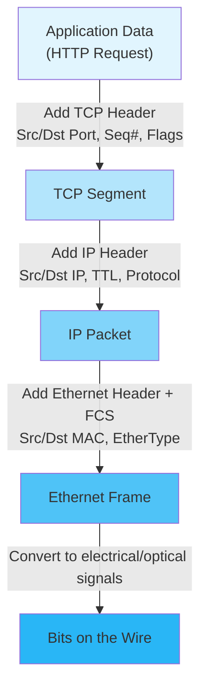

# Encapsulation, Decapsulation, and Where Layering Breaks in Reality

> Theory says layers are clean and independent. Reality says otherwise. Let's understand both.

---

## Table of Contents

1. [Encapsulation — The Full Picture](#encapsulation--the-full-picture)
2. [Decapsulation — Unwrapping at the Receiver](#decapsulation--unwrapping-at-the-receiver)
3. [A Complete Example: HTTP GET](#a-complete-example-http-get)
4. [Protocol Data Units (PDUs) — What Each Layer Calls Its Data](#protocol-data-units-pdus--what-each-layer-calls-its-data)
5. [Where Layering Breaks in Real Life](#where-layering-breaks-in-real-life)
6. [Cross-Layer Optimization](#cross-layer-optimization)
7. [Practical: Seeing Encapsulation with tcpdump](#practical-seeing-encapsulation-with-tcpdump)

---

## Encapsulation — The Full Picture

### What encapsulation means

When an application wants to send data over the network, that data passes **downward** through the protocol stack. At each layer, the layer adds its own **header** (and sometimes a trailer) to the data received from the layer above.

This process is called **encapsulation** — each layer wraps the data in a new "envelope" with its own addressing and control information.

Let's trace this step by step.

### Step 1: Application creates data

Your web browser wants to request a page. It creates an HTTP request:

```
GET / HTTP/1.1
Host: example.com
Accept: text/html
```

This is pure application data. It has no idea about TCP, IP, or Ethernet. It's just a string of bytes with meaning defined by the HTTP protocol.

Size: ~80 bytes (in this example)

### Step 2: Transport layer adds its header

The operating system's TCP implementation takes the HTTP data and prepends a TCP header:

```
┌──────────────────────────────────────────────────────────────┐
│ TCP Header (20–60 bytes)                                      │
│ ┌──────────┬──────────┬─────────┬───────┬────────┬─────────┐ │
│ │ Src Port │ Dst Port │ Seq Num │ Flags │ Window │ Chksum  │ │
│ │  54321   │   80     │ 12345   │  ACK  │ 65535  │ 0xABCD  │ │
│ └──────────┴──────────┴─────────┴───────┴────────┴─────────┘ │
│ ┌──────────────────────────────────────────────────────────┐  │
│ │ Payload: GET / HTTP/1.1\r\nHost: example.com\r\n...      │  │
│ └──────────────────────────────────────────────────────────┘  │
└──────────────────────────────────────────────────────────────┘
```

The TCP header contains:
- **Source port** (54321): Identifies the sending application  
- **Destination port** (80): Identifies the receiving application (HTTP)
- **Sequence number**: For ordering and reliability
- **Flags**: Control bits (SYN, ACK, FIN, etc.)
- **Window size**: For flow control
- **Checksum**: For error detection

The combination of (TCP header + payload) is called a **segment**.

### Step 3: Network layer adds its header

The IP layer takes the entire TCP segment and prepends an IP header:

```
┌────────────────────────────────────────────────────────────────────┐
│ IP Header (20 bytes minimum)                                       │
│ ┌─────────┬─────┬────────┬──────────┬──────────┬───────┬────────┐ │
│ │ Version │ TTL │ Proto  │ Src IP   │ Dst IP   │ Flags │ Chksum │ │
│ │    4    │  64 │ TCP(6) │192.168.  │ 93.184.  │  DF   │ 0x1234 │ │
│ │         │     │        │ 1.100    │ 216.34   │       │        │ │
│ └─────────┴─────┴────────┴──────────┴──────────┴───────┴────────┘ │
│ ┌──────────────────────────────────────────────────────────────┐   │
│ │ Payload: [TCP Header][HTTP Data]                              │   │
│ └──────────────────────────────────────────────────────────────┘   │
└────────────────────────────────────────────────────────────────────┘
```

The IP header contains:
- **Version** (4 for IPv4): Which IP version
- **TTL** (Time to Live): How many more hops before the packet is discarded
- **Protocol** (6 = TCP, 17 = UDP): Tells the receiver which transport protocol to use for decapsulation
- **Source IP**: Sender's address
- **Destination IP**: Receiver's address
- **Flags**: Control bits (DF = Don't Fragment)
- **Header checksum**: Error detection for the IP header itself

The combination of (IP header + payload) is called a **packet** (or **datagram**).

### Step 4: Data Link layer adds its header AND trailer

The Ethernet layer takes the entire IP packet and wraps it in an Ethernet frame:

```
┌───────────────────────────────────────────────────────────────────────┐
│ Ethernet Frame                                                         │
│ ┌──────────┬──────────┬───────┬──────────────────────────┬──────────┐ │
│ │ Dst MAC  │ Src MAC  │ Type  │ Payload                  │   FCS    │ │
│ │ AA:BB:   │ 00:1A:   │ 0x0800│ [IP Header][TCP Hdr]     │ CRC-32  │ │
│ │ CC:DD:   │ 2B:3C:   │ (IPv4)│ [HTTP Data]              │ checksum │ │
│ │ EE:FF    │ 4D:5E    │       │                          │          │ │
│ └──────────┴──────────┴───────┴──────────────────────────┴──────────┘ │
└───────────────────────────────────────────────────────────────────────┘
```

The Ethernet frame adds:
- **Destination MAC** (6 bytes): The MAC address of the next device (NOT the final destination — the next hop, usually your router)
- **Source MAC** (6 bytes): Your network card's MAC address
- **EtherType** (2 bytes): Tells the receiver which network protocol is inside (0x0800 = IPv4, 0x86DD = IPv6)
- **FCS** (Frame Check Sequence, 4 bytes): CRC-32 checksum, added as a TRAILER (not header) for error detection

The complete unit is called a **frame**.

### Step 5: Physical layer converts to signals

The frame is converted to electrical signals (Ethernet), light pulses (fiber), or radio waves (Wi-Fi) and transmitted.

### The complete picture

```
Application:  [HTTP Data]
              ← 80 bytes →

Transport:    [TCP Hdr | HTTP Data]
              ← 20 →← 80 bytes →

Network:      [IP Hdr | TCP Hdr | HTTP Data]
              ← 20 →← 20 →← 80 bytes →

Data Link:    [Eth Hdr | IP Hdr | TCP Hdr | HTTP Data | FCS]
              ← 14 →← 20 →← 20 →← 80 bytes →← 4 →

Total: 14 + 20 + 20 + 80 + 4 = 138 bytes on the wire
Protocol overhead: 58 bytes (42% of the packet!)
```

---

## Decapsulation — Unwrapping at the Receiver

Decapsulation is the reverse process. When the destination machine receives a frame:

### Step 1: Physical layer receives signals

Electrical signals / light / radio waves are converted back to bits.

### Step 2: Data Link layer reads its header

```
1. Read Destination MAC — is it addressed to me? (or broadcast?)
   - If yes, continue
   - If no, discard (unless in promiscuous mode)
2. Check FCS (CRC checksum) — is the frame corrupted?
   - If corrupted, discard silently (no error message to sender!)
3. Read EtherType field → 0x0800 → this is IPv4
4. Remove Ethernet header and FCS
5. Pass the remaining data UP to the IP layer
```

### Step 3: Network layer reads its header

```
1. Read Destination IP — is this addressed to me?
   - If yes, continue
   - If no, should I forward it? (only if I'm a router)
2. Check IP header checksum
3. Read Protocol field → 6 → this is TCP
4. Remove IP header
5. Pass the remaining data UP to TCP
```

### Step 4: Transport layer reads its header

```
1. Read Destination Port → 80
2. Look up which application is listening on port 80
3. Check TCP checksum (covers header + payload + pseudo-header)
4. Process TCP semantics (sequence numbers, acknowledgments)
5. Remove TCP header
6. Deliver the HTTP data to the application listening on port 80
```

### Step 5: Application receives pure data

The web server receives:
```
GET / HTTP/1.1
Host: example.com
Accept: text/html
```

No TCP headers, no IP addresses, no MAC addresses. Just the HTTP request. The application is completely unaware of lower layers (unless it explicitly queries the socket for that information).

### The "protocol multiplexing" chain

At each layer, a specific field tells the receiver which protocol to use for the NEXT layer up:

```
Ethernet EtherType → 0x0800 → Use IPv4 to parse the payload
IP Protocol field  → 6      → Use TCP to parse the payload  
TCP Destination Port → 80   → Deliver to the HTTP server process
```

This chain of identifiers is what allows multiplexing — many protocols coexisting at each layer.

---

## A Complete Example: HTTP GET

Let's trace a single HTTP GET request through the full stack, showing exact byte counts.

### Scenario

- Your machine: `192.168.1.100`, MAC `AA:AA:AA:AA:AA:AA`
- Your router: `192.168.1.1`, MAC `BB:BB:BB:BB:BB:BB`
- Web server: `93.184.216.34` (example.com)
- Request: `GET / HTTP/1.1\r\nHost: example.com\r\n\r\n`

### On your machine (encapsulation)

```
Layer 7 (HTTP):
  "GET / HTTP/1.1\r\nHost: example.com\r\n\r\n"
  Size: ~40 bytes

Layer 4 (TCP):
  Src Port: 54321 (ephemeral, assigned by kernel)
  Dst Port: 80
  Seq: 1 (relative, assuming handshake already done)
  ACK: 1
  Flags: [P, ACK] (Push + Acknowledge)
  Window: 65535
  TCP Header: 32 bytes (20 base + 12 options including timestamps)

Layer 3 (IP):
  Version: 4
  Header Length: 20 bytes
  TTL: 64
  Protocol: TCP (6)
  Src IP: 192.168.1.100
  Dst IP: 93.184.216.34

Layer 2 (Ethernet):
  Dst MAC: BB:BB:BB:BB:BB:BB (your router — NOT the web server!)
  Src MAC: AA:AA:AA:AA:AA:AA (your NIC)
  EtherType: 0x0800 (IPv4)
  FCS: 4 bytes (CRC-32)
```

**Critical point**: The Ethernet destination MAC is your **router**, not the web server. Your machine doesn't know the web server's MAC address (and doesn't need to — the web server is on a different network).

Your machine knows to send this to the router because:
1. The destination IP (`93.184.216.34`) doesn't match your local subnet (`192.168.1.0/24`)
2. The routing table says "for anything not on my local network, send to the default gateway at `192.168.1.1`"
3. ARP resolves `192.168.1.1` to MAC `BB:BB:BB:BB:BB:BB`

### On your router (decapsulate partially, then re-encapsulate)

The router:
1. Receives the Ethernet frame
2. Strips the Ethernet header (Layer 2 → done with local addressing)
3. Reads the IP header: destination is `93.184.216.34`
4. Looks up its routing table: "send to next-hop router at ISP"
5. Decrements TTL (64 → 63)
6. Creates a NEW Ethernet frame with:
   - New Dst MAC: the ISP router's MAC
   - New Src MAC: the router's outgoing interface MAC
   - Same IP packet (with decremented TTL)
7. Sends the frame out its WAN interface

```
Before router:
  [Eth: AA→BB | IP: 192.168.1.100→93.184.216.34 | TCP | HTTP]

After router:
  [Eth: CC→DD | IP: 192.168.1.100→93.184.216.34 | TCP | HTTP]
              ↑ NEW MACs                ↑ SAME IPs
```

This happens at **every router** along the path. The Ethernet frame is rebuilt at each hop. The IP packet remains (mostly) unchanged.

### At the web server (decapsulation)

The web server:
1. Receives the Ethernet frame → strips Layer 2
2. Reads IP header → destination is its own IP ✓ → strips Layer 3
3. Reads TCP header → destination port 80 → delivers to HTTP server → strips Layer 4
4. HTTP server reads: `GET / HTTP/1.1\r\nHost: example.com\r\n\r\n`
5. Processes the request and sends a response back (same process in reverse)

---

## Protocol Data Units (PDUs) — What Each Layer Calls Its Data

Each layer has its own name for its data unit. This isn't just terminology — using the right word tells other engineers which layer you're talking about:

| Layer | PDU Name | Contains | Example |
|-------|----------|----------|---------|
| Application | **Message** or **Data** | Application-specific content | HTTP request body |
| Transport | **Segment** (TCP) or **Datagram** (UDP) | Transport header + application data | TCP segment with HTTP payload |
| Network | **Packet** (or Datagram) | IP header + transport segment | IP packet containing TCP segment |
| Data Link | **Frame** | Ethernet header + IP packet + FCS | Ethernet frame |
| Physical | **Bits** (or symbols) | Raw binary data | Electrical signals |

When someone says "the packet was dropped," they're talking about Layer 3 (IP level).
When someone says "the frame was corrupted," they're talking about Layer 2 (Ethernet level).
When someone says "the segment was retransmitted," they're talking about Layer 4 (TCP level).

Getting the terminology right prevents confusion in debugging conversations.

---

## Where Layering Breaks in Real Life

The layered model is elegantly simple. Reality is messy. Here are the most important places where layering breaks down.

### 1. NAT violates layer boundaries

**What NAT does**: A NAT (Network Address Translation) device sits at Layer 3 (IP) but **modifies Layer 4 headers** (TCP/UDP port numbers).

Why is this a violation? Layer 3 should only read and modify Layer 3 headers. It shouldn't need to know what's inside its payload (which is the Layer 4 segment).

**Why it happens anyway**: IPv4 address space is too small. NAT is a necessary hack that lets many devices share one public IP address. To distinguish between devices, NAT rewrites both IP addresses AND port numbers.

**Consequence**: Any protocol that embeds IP addresses or port numbers in its APPLICATION data (Layer 7) breaks through NAT. FTP and SIP are examples — they include IP:port information in their control messages. NAT devices need special "Application Layer Gateways" (ALGs) to parse and rewrite these application-level addresses. This means the Layer 3 device is inspecting Layer 7 data — a complete layering violation.

### 2. Firewalls inspect across layers

A "Layer 7 firewall" (also called a Web Application Firewall or Deep Packet Inspection firewall) reads at EVERY layer:

```
Layer 2: Check MAC addresses (allow/deny specific devices)
Layer 3: Check IP addresses (allow/deny specific sources/destinations)
Layer 4: Check port numbers (allow/deny specific services)
Layer 7: Inspect HTTP content (block SQL injection, malware, etc.)
```

This is the opposite of "each layer only reads its own header." The firewall reads ALL headers and even the application payload.

**Why it happens**: Security requirements demand full visibility. A pure Layer 3 firewall can block an IP but can't detect malicious HTTP payloads. To protect applications, you need to see the application data.

### 3. TCP and IP are not truly independent

TCP's congestion control depends on interpreting signals from the IP layer:
- Packet loss (detected via missing ACKs) is interpreted as congestion
- ECN (Explicit Congestion Notification) is an IP header field that TCP reads
- PMTUD (Path MTU Discovery) requires TCP to understand IP fragmentation behavior

TCP also uses a "pseudo-header" checksum that includes IP addresses. This means TCP headers can't be verified without knowing the IP addresses — a clear layer boundary crossing.

### 4. TLS sits awkwardly between layers

Where does TLS belong?
- It runs on top of TCP → above Layer 4
- It encrypts application data → below Layer 7
- It's sometimes called Layer 5 or 6
- In the TCP/IP model, it's part of the application layer

In the real system call chain:
```
Application: write("GET / HTTP/1.1...")
  → TLS library: encrypt → add TLS record header
    → TCP: add TCP header
      → IP: add IP header
        → Ethernet: add Ethernet header
```

TLS is implemented as a **library** (not a kernel protocol like TCP), so it lives in user space. But it processes data *before* TCP, which conceptually puts it between transport and application.

This is one of many cases where the clean layer model doesn't map to implementation reality.

### 5. Quality of Service (QoS) requires cross-layer information

QoS systems prioritize certain traffic (e.g., VoIP over file downloads). To do this, a router might:
- Read the IP ToS/DSCP field (Layer 3) to determine priority
- Inspect the TCP/UDP port number (Layer 4) to classify traffic
- Even inspect HTTP headers (Layer 7) to distinguish video streaming from web browsing

A "dumb" Layer 3 router that only looks at IP addresses can't do quality-of-service. Real routers peeking into Layer 4 and beyond is a practical necessity.

### 6. Performance optimizations cross layers

**TCP Segmentation Offload (TSO)**: The application sends a large chunk of data to the kernel. Instead of TCP segmenting it into MSS-sized pieces, the kernel passes the entire chunk to the NIC (network card). The NIC hardware does the TCP segmentation AND adds IP and Ethernet headers. This means the NIC (Physical/Data Link layer) is doing Transport and Network layer work.

**Large Receive Offload (LRO/GRO)**: The NIC combines multiple received packets into one before handing them to the kernel. Again, the NIC (hardware, Layer 1-2) is doing TCP-level reassembly (Layer 4 work).

These optimizations are essential for high-throughput networking. They completely break the idea that each layer operates independently.

### 7. ARP doesn't fit cleanly in any layer

ARP (Address Resolution Protocol) translates IP addresses (Layer 3) to MAC addresses (Layer 2). It operates on raw Ethernet frames (Layer 2) but carries IP address information (Layer 3).

Is it Layer 2? It uses Ethernet frames directly.
Is it Layer 3? It resolves IP addresses.
Is it between layers? Kind of.

ARP is a protocol that exists **because** the layering model has a gap. Layer 3 needs Layer 2 addresses to function, but the two layers are supposed to be independent. ARP bridges that gap.

---

## Cross-Layer Optimization

Despite breaking the clean model, cross-layer interactions improve performance significantly:

```
Optimization          Layers Crossed    Benefit
─────────────────────────────────────────────────
TSO/GSO               L4→L2 (NIC)      CPU savings on segmentation
LRO/GRO               L2→L4 (NIC)      Fewer interrupts per received byte
Checksum offload       L3-L4→L1 (NIC)   Hardware computes checksums
ECN                    L3→L4             Congestion signal without loss
TCP fast open          L4+L7             Eliminate 1 RTT for repeat connections
HTTP/2 multiplexing    L7→L4             Avoid TCP head-of-line blocking
QUIC                   L7→L4→L3         Bypass TCP entirely with UDP
```

The lesson: **layering is a useful mental model, not an inviolable law**. Real systems break layer boundaries when there's a clear performance or functionality benefit.

---

## Practical: Seeing Encapsulation with tcpdump

Let's see all the layers in one tcpdump capture:

```bash
# Capture with full verbosity and hex/ASCII dump
sudo tcpdump -i any -nn -vv -XX -c 5 port 80
```

Flags explained:
- `-nn`: Don't resolve hostnames or port names (faster, clearer)
- `-vv`: Very verbose (show all header fields)
- `-XX`: Show packet contents in hex AND ASCII
- `-c 5`: Capture only 5 packets

Now in another terminal:
```bash
curl http://example.com
```

In the tcpdump output, you'll see something like:

```
14:30:15.123456 IP (tos 0x0, ttl 64, id 54321, offset 0, flags [DF], 
    proto TCP (6), length 60)
    192.168.1.100.54321 > 93.184.216.34.80: Flags [S], cksum 0xabcd 
    (correct), seq 123456789, win 64240, options [mss 1460,sackOK,TS 
    val 1234567 ecr 0,nop,wscale 7], length 0
        0x0000:  bbbb bbbb bbbb aaaa aaaa aaaa 0800 4500  ..............E.
        0x0010:  003c d431 4000 4006 xxxx c0a8 0164 5db8  .<.1@.@......d].
        0x0020:  d822 d431 0050 0753 9515 0000 0000 a002  .".1.P.S........
        0x0030:  faf0 xxxx 0000 0204 05b4 0402 080a 0012  ................
        0x0040:  d687 0000 0000 0103 0307                 ..........
```

Let's decode this byte by byte:

```
ETHERNET HEADER (first 14 bytes):
  0x0000: bbbb bbbb bbbb    → Destination MAC (router)
          aaaa aaaa aaaa    → Source MAC (your NIC)
          0800              → EtherType: IPv4

IP HEADER (next 20 bytes):
  0x0010: 45                → Version 4, Header Length 5 (×4 = 20 bytes)
          00                → Type of Service (DSCP/ECN)
          003c              → Total Length: 60 bytes
          d431              → Identification
          4000              → Flags: Don't Fragment, Fragment Offset: 0
          40                → TTL: 64
          06                → Protocol: TCP
          xxxx              → Header Checksum
          c0a8 0164         → Source IP: 192.168.1.100
  0x0020: 5db8 d822         → Destination IP: 93.184.216.34

TCP HEADER (next 20+ bytes):
  0x0020:           d431    → Source Port: 54321
                    0050    → Destination Port: 80
  0x0020-30:                → Sequence Number, Ack Number, Flags, Window
  ... (TCP options follow)
```

This exercise of reading raw packet bytes is how you verify that each layer's header is exactly where the model says it should be.

---

## Mermaid Diagram: Encapsulation Flow



**Reading the diagram**:
- Start at the top: the application creates raw data (an HTTP request)
- Each layer going downward wraps the data in a new header
- At the bottom, the complete frame is converted to physical signals
- At the receiver, the process reverses: signals → frame → packet → segment → data

---

## Key Takeaways

1. **Encapsulation is nesting**: Each layer wraps the data from above in its own header, like envelopes within envelopes
2. **Decapsulation is unwrapping**: Each layer reads its header, uses the information, strips the header, and passes the payload up
3. **Protocol multiplexing fields** chain the layers together: EtherType → IP Protocol → Port number
4. **MAC addresses change at each hop; IP addresses don't** — this is the fundamental difference between Layer 2 and Layer 3 addressing
5. **Layering breaks in practice**: NAT, firewalls, TLS, hardware offloads, and QoS all cross layer boundaries
6. **The breaks are not bugs**: They're pragmatic optimizations and security necessities
7. **Understand the ideal model AND the real violations** — both are needed for debugging real systems

---

## Next Module

→ [../02-metrics/01-latency-deep-dive.md](../02-metrics/01-latency-deep-dive.md) — Understanding latency, bandwidth, throughput, and why "fast internet" is meaningless
