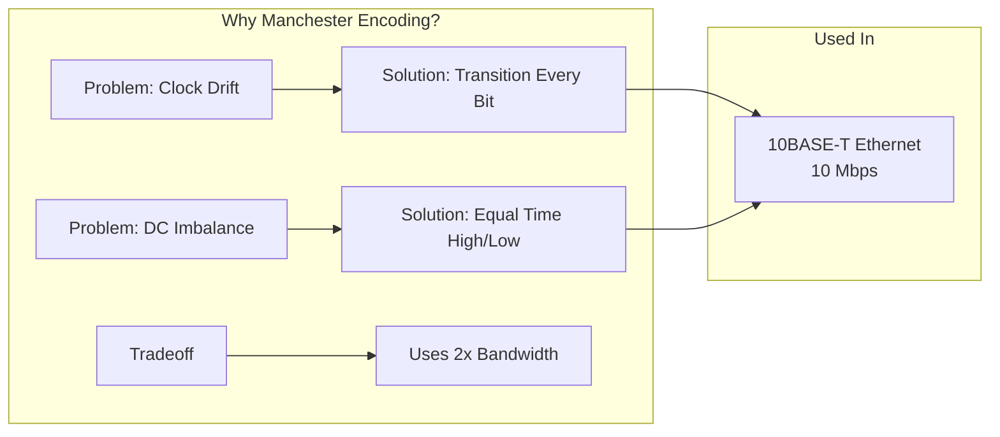
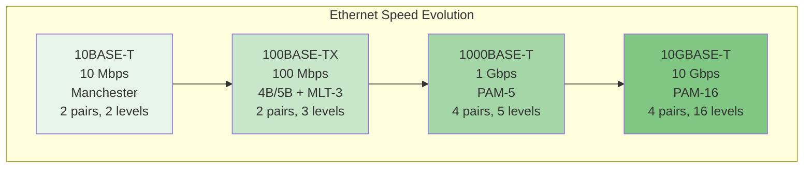
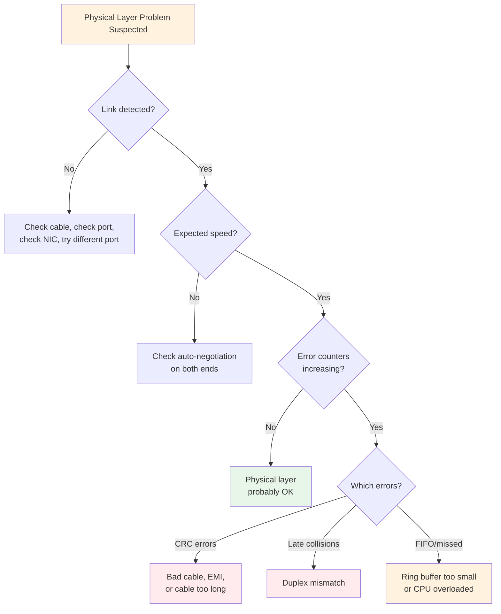

# Signals and Encoding: How Bits Become Electrical Reality

## Table of Contents

- [Signals and Encoding: How Bits Become Electrical Reality](#signals-and-encoding-how-bits-become-electrical-reality)
  - [Table of Contents](#table-of-contents)
  - [Why This Matters](#why-this-matters)
  - [The Fundamental Problem: Bits Are Abstract, Wires Are Physical](#the-fundamental-problem-bits-are-abstract-wires-are-physical)
  - [What Is a Signal?](#what-is-a-signal)
  - [Why Digital Communication Needs Encoding](#why-digital-communication-needs-encoding)
    - [Problem 1: Clock Synchronization](#problem-1-clock-synchronization)
    - [Problem 2: DC Balance](#problem-2-dc-balance)
    - [Problem 3: Signal Transitions for Reliability](#problem-3-signal-transitions-for-reliability)
  - [Line Encoding Schemes](#line-encoding-schemes)
    - [NRZ (Non-Return-to-Zero)](#nrz-non-return-to-zero)
    - [Manchester Encoding](#manchester-encoding)
    - [4B/5B Encoding](#4b5b-encoding)
    - [Comparison Table](#comparison-table)
  - [Bit Rate vs Baud Rate](#bit-rate-vs-baud-rate)
  - [How Ethernet Actually Sends Bits](#how-ethernet-actually-sends-bits)
    - [10BASE-T: The Original Twisted Pair Ethernet](#10base-t-the-original-twisted-pair-ethernet)
    - [100BASE-TX: Fast Ethernet](#100base-tx-fast-ethernet)
    - [1000BASE-T: Gigabit Ethernet](#1000base-t-gigabit-ethernet)
    - [10GBASE-T and Beyond](#10gbase-t-and-beyond)
  - [Noise, Attenuation, and Signal-to-Noise Ratio](#noise-attenuation-and-signal-to-noise-ratio)
    - [Attenuation: Signals Weaken Over Distance](#attenuation-signals-weaken-over-distance)
    - [Noise: Unwanted Energy on the Wire](#noise-unwanted-energy-on-the-wire)
    - [Signal-to-Noise Ratio (SNR)](#signal-to-noise-ratio-snr)
    - [Shannon's Theorem: The Theoretical Limit](#shannons-theorem-the-theoretical-limit)
  - [Error Detection at the Physical Layer](#error-detection-at-the-physical-layer)
  - [Why You Don't Need to Be an Electrical Engineer](#why-you-dont-need-to-be-an-electrical-engineer)
  - [Linux Lab: Inspecting Physical Layer with ethtool](#linux-lab-inspecting-physical-layer-with-ethtool)
    - [Checking Link Speed and Duplex](#checking-link-speed-and-duplex)
    - [Viewing Supported Modes](#viewing-supported-modes)
    - [Checking Physical Layer Errors](#checking-physical-layer-errors)
    - [Forcing Link Parameters](#forcing-link-parameters)
    - [Checking Driver and Firmware Information](#checking-driver-and-firmware-information)
    - [Diagnosing Cable Issues](#diagnosing-cable-issues)
    - [Ring Buffer Tuning](#ring-buffer-tuning)
  - [Common Physical Layer Failures and Their Symptoms](#common-physical-layer-failures-and-their-symptoms)
    - [1. Bad Cable](#1-bad-cable)
    - [2. Duplex Mismatch](#2-duplex-mismatch)
    - [3. Speed Mismatch / Auto-Negotiation Failure](#3-speed-mismatch--auto-negotiation-failure)
    - [4. EMI (Electromagnetic Interference)](#4-emi-electromagnetic-interference)
    - [5. Cable Too Long](#5-cable-too-long)
  - [Mental Models to Carry Forward](#mental-models-to-carry-forward)
  - [Key Takeaways](#key-takeaways)
  - [Next Steps](#next-steps)

---

## Why This Matters

Before you can understand Ethernet frames, IP packets, TCP segments, or anything that happens on a network, you must appreciate one fundamental truth: **computers think in bits, but the physical world doesn't have a concept of "0" and "1."**

The physical layer (Layer 1 in the OSI model) is where the abstract world of software meets the concrete world of copper wires, fiber optic cables, and radio waves. Everything you will study in networking — every packet, every connection, every web request — ultimately is carried by signals on a physical medium.

You don't need to become an electrical engineer to be an excellent network engineer or systems programmer. But you need to understand **why** the physical layer works the way it does, because when things break at this level, the symptoms propagate up through every layer above it, and they're often deeply confusing if you don't understand what's happening underneath.

This module is about building intuition, not memorizing circuit diagrams.

---

## The Fundamental Problem: Bits Are Abstract, Wires Are Physical

A computer's internal representation of data is binary: sequences of 0s and 1s. Inside a CPU, these are represented as voltage levels on transistors — typically something like 0V for "0" and a positive voltage (0.8V, 1.2V, 3.3V, depending on the technology) for "1." The distances are microscopic, the speeds are incredibly fast, and the environment is tightly controlled.

But when you want to send data between two computers separated by meters, kilometers, or thousands of kilometers, everything changes:

1. **The wire is long.** Signals weaken over distance (attenuation).
2. **The environment is noisy.** Electromagnetic interference from power lines, other cables, motors, and even cosmic rays can corrupt signals.
3. **There's no shared clock.** The sender and receiver have independent oscillators that drift relative to each other.
4. **The medium has bandwidth limits.** A copper wire can only carry signals within a certain frequency range.

These physical realities mean you can't just put 5V on a wire and call it "1" and 0V and call it "0." You need a more sophisticated approach. That's what encoding is about.

---

## What Is a Signal?

Before we discuss encoding, let's be precise about what a "signal" is in this context.

A **signal** is a time-varying quantity that carries information. In networking:

- On **copper wire** (Ethernet cables): the signal is a varying voltage or current.
- On **fiber optic**: the signal is the presence or absence (or intensity variations) of light.
- On **wireless**: the signal is an electromagnetic wave with varying amplitude, frequency, or phase.

The sender creates a signal pattern that encodes the data. The receiver observes this pattern and decodes it back into bits.

The key insight is: **the signal is not the same as the data.** The signal is the physical representation of the data, shaped by the constraints of the physical medium.

Think of it like spoken language. The "data" is the meaning of what you say. The "signal" is the sound waves your vocal cords produce. You can say the same word loudly or quietly, in a high pitch or low pitch — the signal varies, but the data is the same. And if there's too much background noise, the listener can't decode the signal, even though you're producing it correctly.

---

## Why Digital Communication Needs Encoding

### Problem 1: Clock Synchronization

This is the most critical problem, and the one that most encoding schemes are primarily designed to solve.

**The scenario:** Computer A is sending bits to Computer B at 100 million bits per second. That means each bit occupies 10 nanoseconds. Computer B needs to "sample" the wire at exactly the right moments to read each bit.

**The question:** How does Computer B know when to sample?

One approach would be to send a separate clock signal on a second wire. The sender would toggle the clock wire, and the receiver would read the data wire each time the clock transitions. This works, but it has problems:
- It requires an extra wire (doubles the infrastructure).
- Over long distances, the clock and data signals might arrive at slightly different times (**clock skew**), causing misreads.

A better approach: **embed the clock information in the data signal itself.** This is what encoding schemes do.

The key insight is that the receiver can synchronize its clock to the incoming signal **only if the signal changes frequently enough.** If the sender sends a long sequence of identical bits (say, 100 consecutive "1"s), and the encoding just holds a constant voltage for "1," the receiver has nothing to synchronize to. Its clock drifts, it misjudges bit boundaries, and errors accumulate.

```
Problem: Long run of identical bits with simple voltage encoding

Sender thinks:   |1|1|1|1|1|1|1|1|1|1|1|1|1|1|1|
Wire looks like:  ________________________________  (constant high voltage)

Receiver thinks: "Is this 14 ones? 15 ones? 16 ones?"
                  No transitions → no clock reference → bit slip errors
```

### Problem 2: DC Balance

**DC balance** means that, over time, the average voltage on the wire should be zero (or at least close to it).

Why does this matter? For two reasons:

1. **Transformers and AC coupling.** Many Ethernet connections pass through transformers and capacitors that block DC (constant) voltage components. If your signal has a DC offset (e.g., more time at high voltage than low voltage), the transformer distorts it. This is a fundamental electrical engineering constraint that we can't wave away.

2. **Power considerations.** A signal that spends more time at one voltage level than another wastes power and can cause problems with certain receiver circuits.

If you encode "1" as high voltage and "0" as low voltage, then a file consisting mostly of ones would produce a signal that's mostly high voltage — a significant DC component. Not good.

### Problem 3: Signal Transitions for Reliability

Beyond clock recovery, transitions in the signal help the receiver distinguish between "the sender is transmitting data" and "the wire is idle" or "the sender has crashed."

If a long sequence of zeros looks the same as an idle line, the receiver can't tell the difference. Encoding schemes ensure that even sequences of all-zeros produce a distinctive signal pattern.

---

## Line Encoding Schemes

Now let's look at the actual solutions. Remember: each scheme exists to solve the problems above, just with different tradeoffs.

### NRZ (Non-Return-to-Zero)

**What it is:** The simplest possible encoding. A "1" bit is represented by one voltage level (say, +V), and a "0" bit is represented by another (say, -V or 0V). The voltage is held constant for the entire bit period.

**What it solves:** It's simple. Very easy to implement. Maximum data rate for a given bandwidth (one bit per signal change).

**What it fails at:**
- **No clock recovery** during long runs of identical bits. If you send 1000 consecutive ones, the receiver sees a flat line and has no idea when one bit ends and the next begins.
- **DC balance** is terrible. A sequence of mostly ones creates a strong DC component.

**Where it's used:** NRZ is actually used, but always with additional techniques on top. For example, USB uses NRZI (Non-Return-to-Zero Inverted) combined with bit stuffing: after 6 consecutive identical bits, a transition is forcibly inserted to provide clock synchronization. This solves the clock problem at the cost of slight overhead.

```
NRZ Encoding Example:

Data:    1  0  1  1  0  0  1  0
         ___     ______         ___
Signal: |   |   |      |       |   |
        |   |___|      |_______|   |___
        
        +V = 1, 0V = 0
        
Problem: What if data is 1 1 1 1 1 1 1 1?
         ________________________________
Signal: |                                |  ← No transitions!
        |                                |     Receiver clock drifts.
```

### Manchester Encoding

**What it is:** Each bit is encoded as a **transition** in the middle of the bit period.
- A "0" is encoded as a transition from low-to-high.
- A "1" is encoded as a transition from high-to-low.
(Or vice versa, depending on the convention. IEEE 802.3 uses the convention above.)

**What it solves:**
- **Perfect clock recovery.** Every single bit, without exception, produces a transition in the middle of the bit period. The receiver can lock onto these transitions and maintain perfect synchronization, even for sequences like 0000000000 or 1111111111.
- **DC balance.** Every bit spends exactly half its time at high voltage and half at low voltage. The DC component is inherently zero.
- **Always distinguishable from an idle line.** If you see transitions, data is being sent.

**What it fails at:**
- **Bandwidth efficiency.** Because you need at least one transition per bit (and sometimes two — at bit boundaries when consecutive bits differ), the signal requires twice the bandwidth of NRZ. In other words, to send data at 10 Mbps, you need a signal bandwidth that could theoretically carry 20 Mbps with NRZ.

**Where it's used:** Original 10BASE-T Ethernet (10 Mbps). At this speed, the bandwidth penalty was acceptable. At higher speeds (100 Mbps, 1 Gbps), the bandwidth penalty became too expensive, and more efficient schemes were adopted.

```
Manchester Encoding Example (IEEE 802.3 convention):

Data:    1     0     1     1     0     0
        ___         ___   ___
       |   |       |   | |   |
       |   |___|‾‾‾|   | |   |___|‾‾‾|___|‾‾‾
                   
       1 = high-to-low transition at mid-bit
       0 = low-to-high transition at mid-bit
       
       Every bit has a transition at its center → clock recovery guaranteed.
```



### 4B/5B Encoding

**The idea:** Instead of encoding each bit individually (like Manchester), encode **groups of 4 data bits as 5-bit patterns.** The 5-bit patterns are chosen from a table of 32 possible patterns, specifically selecting the 16 patterns that have enough transitions to maintain clock synchronization and DC balance.

**What it solves:**
- **Clock recovery.** The selected 5-bit patterns are guaranteed to have no more than 3 consecutive identical bits. This is enough for the receiver's clock recovery circuit to stay synchronized.
- **DC balance** (mostly). The selected patterns are reasonably balanced, though not perfectly. In practice, it's combined with further scrambling techniques.
- **Better bandwidth efficiency than Manchester.** The overhead is 25% (5 bits for every 4 data bits), compared to Manchester's 100%.

**What it fails at:**
- More complex to implement than NRZ or Manchester (need a lookup table).
- The extra bits add overhead (but less than Manchester).
- Remaining DC issues need additional techniques.

**Where it's used:** 100BASE-TX (Fast Ethernet) uses 4B/5B encoding on top of MLT-3 signaling.

**How the table works:**

There are 32 possible 5-bit patterns (2^5 = 32). Of these, 16 are chosen to represent the 16 possible 4-bit data values (0000 through 1111). The remaining 16 patterns are either unused or reserved for control signals (like idle, start-of-frame, end-of-frame, error).

The selection criteria:
- No pattern with more than one leading zero and one trailing zero (prevents long runs of zeros when patterns are concatenated).
- No pattern with more than three consecutive identical bits.

| 4-bit Data | 5-bit Code | Notes |
|-----------|-----------|-------|
| 0000 | 11110 | Note: not 00000 (that would violate the run-length constraint) |
| 0001 | 01001 | |
| 0010 | 10100 | |
| 0011 | 10101 | |
| 0100 | 01010 | |
| 0101 | 01011 | |
| 0110 | 01110 | |
| 0111 | 01111 | |
| 1000 | 10010 | |
| 1001 | 10011 | |
| 1010 | 10110 | |
| 1011 | 10111 | |
| 1100 | 11010 | |
| 1101 | 11011 | |
| 1110 | 11100 | |
| 1111 | 11101 | |

Some special codes:
| Code | 5-bit Pattern | Purpose |
|------|-------------|---------|
| IDLE | 11111 | Line idle |
| J | 11000 | Start of Stream Delimiter (first part) |
| K | 10001 | Start of Stream Delimiter (second part) |
| T | 01101 | End of Stream Delimiter (first part) |
| R | 00111 | End of Stream Delimiter (second part) |
| H | 00100 | Halt (error) |

### Comparison Table

| Property | NRZ | Manchester | 4B/5B |
|----------|-----|-----------|-------|
| Clock recovery | Poor (needs long runs) | Excellent (every bit) | Good (max 3 identical) |
| DC balance | Poor | Perfect | Good (needs help) |
| Bandwidth efficiency | Best (1 baud = 1 bit) | Worst (2x bandwidth) | Good (25% overhead) |
| Complexity | Simplest | Simple | Moderate |
| Used in | (With modifications) USB, serial | 10BASE-T Ethernet | 100BASE-TX Ethernet |
| Idle detection | Difficult | Easy | Easy (IDLE code) |

---

## Bit Rate vs Baud Rate

These two terms are frequently confused. Let's be precise.

**Bit rate:** The number of data bits transmitted per second. Measured in bits per second (bps). This is what users care about — it determines how fast your file downloads.

**Baud rate (symbol rate):** The number of signal changes (symbols) per second. Measured in baud. This is what the physical medium cares about — it determines how much bandwidth the signal needs.

**The relationship:** If each symbol encodes exactly one bit (as in NRZ), then bit rate = baud rate. But if each symbol encodes multiple bits, the bit rate is higher than the baud rate.

**Example with 2 bits per symbol:**
Suppose you use 4 voltage levels: -3V, -1V, +1V, +3V. You can encode 2 bits per symbol (00, 01, 10, 11). If your baud rate is 1000 symbols/second, your bit rate is 2000 bits/second.

**Why this matters for the real world:**

Gigabit Ethernet (1000BASE-T) runs on the same Category 5 cable as Fast Ethernet (100BASE-TX). But it achieves 10x the data rate. How? It doesn't signal 10x faster (the cable can't handle that). Instead, it uses several tricks:
- 5-level signaling (PAM-5), encoding more bits per symbol
- Using all 4 wire pairs simultaneously (instead of the 2 pairs used by 100BASE-TX)
- Full-duplex communication on each pair

This is why understanding bit rate vs baud rate matters: it explains how technology advances without requiring entirely new physical infrastructure.

```
The relationship:

    Bit Rate = Baud Rate × (Bits per Symbol)

Example:

    1000BASE-T uses PAM-5 on 4 pairs:
    - Baud rate: 125 Mbaud per pair
    - Bits per symbol: 2 (approximately, with PAM-5 encoding)
    - Pairs: 4
    - Bit rate: 125 × 2 × 4 = 1000 Mbps = 1 Gbps

This is how 1 Gbps runs on the same copper cable as 100 Mbps
— it's more efficient encoding, not faster signaling.
```

---

## How Ethernet Actually Sends Bits

Now let's connect the theory to what's actually in the cable behind your desk. Each generation of Ethernet uses different signaling techniques, and the progression tells a story about the tradeoffs we've discussed.

### 10BASE-T: The Original Twisted Pair Ethernet

- **Speed:** 10 Mbps
- **Cable:** Category 3 or better, 2 pairs used
- **Encoding:** Manchester encoding
- **Signal:** Two voltage levels

Manchester was chosen because at 10 Mbps, the bandwidth penalty (requiring 20 MHz of signal bandwidth) was easily handled by twisted pair cable. The simplicity and perfect clock recovery were more important than efficiency.

### 100BASE-TX: Fast Ethernet

- **Speed:** 100 Mbps
- **Cable:** Category 5, 2 pairs used
- **Encoding:** 4B/5B + NRZI + MLT-3
- **Signal:** Three voltage levels (-1V, 0V, +1V)

Going from 10 Mbps to 100 Mbps with Manchester encoding would require 200 MHz of signal bandwidth — too much for Category 5 cable (rated for 100 MHz). So a more efficient encoding was needed.

The solution is layered:
1. **4B/5B** ensures enough transitions for clock recovery (125 Mbaud for 100 Mbps data).
2. **NRZI** maps bits to transitions (transition = 1, no transition = 0), which converts the 4B/5B output into a signal.
3. **MLT-3** reduces the signal bandwidth by cycling through three voltage levels (-1, 0, +1, 0, -1, ...) instead of toggling between two levels. This clever trick reduces the required bandwidth to about 31.25 MHz — well within Category 5's capabilities.

```
100BASE-TX Encoding Pipeline:

Data bits → [4B/5B Encoder] → 5-bit symbols → [NRZI] → bit stream → [MLT-3] → wire signal

100 Mbps →    125 Mbaud     →               →         →  ~31.25 MHz bandwidth
```

### 1000BASE-T: Gigabit Ethernet

- **Speed:** 1000 Mbps (1 Gbps)
- **Cable:** Category 5e or better, ALL 4 pairs used simultaneously
- **Encoding:** PAM-5 (Pulse Amplitude Modulation with 5 levels)
- **Signal:** Five voltage levels (-2, -1, 0, +1, +2)

This is where the cleverness really shows:
- Each wire pair carries 250 Mbps.
- With 4 pairs, that's 1000 Mbps total.
- **Each pair uses full-duplex communication** — both directions simultaneously on the same pair, using echo cancellation (DSP techniques to separate the outgoing and incoming signals, similar to how speakerphones work).
- PAM-5 uses 5 voltage levels, allowing approximately 2 bits per symbol at 125 Mbaud.

The baud rate on each pair (125 Mbaud) is the same as 100BASE-TX, so the signal bandwidth requirements are similar. The speed increase comes entirely from using more bits per symbol and more wire pairs.

### 10GBASE-T and Beyond

- **Speed:** 10 Gbps
- **Cable:** Category 6a or better, 4 pairs
- **Encoding:** PAM-16 (16 voltage levels!) with DSP
- **Signal:** 16 voltage levels, requiring sophisticated digital signal processing

At 10 Gbps, the engineering becomes extremely sophisticated. The receiver uses complex DSP algorithms to:
- Cancel echo from its own transmissions (full-duplex on each pair)
- Cancel crosstalk between adjacent wire pairs in the cable
- Equalize the signal to compensate for frequency-dependent attenuation

The fact that 10 Gbps can run over copper cable at all is a testament to modern DSP capabilities.



**The pattern:** As speed increases, the signaling becomes more complex (more levels, more pairs, more DSP), while the fundamental baud rate on each pair doesn't increase proportionally. The speed gains come from encoding efficiency, not from signaling faster.

---

## Noise, Attenuation, and Signal-to-Noise Ratio

### Attenuation: Signals Weaken Over Distance

**Attenuation** is the gradual loss of signal strength as it travels through a medium. Every medium attenuates signals — copper more than fiber, but fiber does too.

Think of it like shouting across a field. The farther the listener, the fainter your voice. At some point, they can't hear you at all.

**Why it happens:**
- In copper: resistance of the wire converts electrical energy to heat.
- In fiber: tiny impurities in the glass scatter light, and the fiber's molecular structure absorbs certain wavelengths.
- In wireless: signals spread out over area (inverse square law), and objects absorb/reflect energy.

**Why it matters:** There's a maximum cable length for each Ethernet standard:
- 10/100/1000BASE-T: 100 meters
- This isn't arbitrary. At 100 meters, the signal has weakened enough that reliable detection becomes difficult.

Attenuation is frequency-dependent: higher frequencies attenuate faster. This is why higher-speed Ethernet (which uses higher frequencies) requires better cable categories with lower attenuation.

### Noise: Unwanted Energy on the Wire

**Noise** is any signal on the wire that isn't the intended signal. Sources include:

- **Crosstalk:** Signals from adjacent wire pairs within the same cable. This is actually the dominant noise source in twisted pair Ethernet.
- **Electromagnetic interference (EMI):** Energy from external sources — power lines, electric motors, fluorescent lights, radio transmitters.
- **Thermal noise:** Random electron motion in the conductor. Always present, can't be eliminated (it's physics).
- **Impulse noise:** Random spikes from lightning, power switching, etc.

**Why twisted pair cable is twisted:** The twist is why it's called "twisted pair." When a wire pair is twisted, external electromagnetic interference affects both wires approximately equally. Because the receiver looks at the *difference* between the two wires (differential signaling), the common noise cancels out. More twists per unit length = better noise rejection = higher cable category.

```
Why Twisting Works (Differential Signaling):

External noise →  affects both wires equally
                   
Wire A: ─── Signal + Noise ───→  }
                                  } Receiver reads (A - B)
Wire B: ─── -Signal + Noise ──→  }   = Signal + Noise - (-Signal + Noise)
                                      = 2 × Signal    ← Noise cancels!

This is why cutting open a CAT5 cable shows twisted pairs,
and why untwisting too much cable at a connector degrades performance.
```

### Signal-to-Noise Ratio (SNR)

**SNR** is the ratio of signal power to noise power, almost always expressed in decibels (dB).

$$\text{SNR (dB)} = 10 \log_{10}\left(\frac{P_{\text{signal}}}{P_{\text{noise}}}\right)$$

- **30 dB** means the signal is 1000× stronger than the noise: excellent.
- **20 dB** means the signal is 100× stronger: good.
- **10 dB** means the signal is 10× stronger: marginal.
- **0 dB** means signal equals noise: useless.

**Why you care:** SNR determines the maximum reliable data rate. A higher SNR means you can use more voltage levels (more bits per symbol), which means higher speed.

### Shannon's Theorem: The Theoretical Limit

Claude Shannon proved in 1948 that the maximum data rate of a channel with bandwidth B (Hz) and signal-to-noise ratio SNR is:

$$C = B \log_2(1 + \text{SNR})$$

Where:
- C = channel capacity in bits per second
- B = bandwidth of the channel in Hz
- SNR = signal-to-noise ratio (linear, not in dB)

**What this tells us:**
- You can't exceed this rate, no matter how clever your encoding.
- Increasing bandwidth increases capacity linearly.
- Increasing SNR increases capacity logarithmically (diminishing returns).
- This is why cable categories matter: better cable = less noise = higher SNR = higher achievable capacity.

**Example:** Category 5e cable has a bandwidth of about 100 MHz and an SNR of approximately 25 dB (about 316 in linear scale) for 1000BASE-T at short distances.

$$C = 100 \times 10^6 \times \log_2(1 + 316) \approx 100 \times 10^6 \times 8.3 \approx 830 \text{ Mbps per pair}$$

With 4 pairs, the theoretical maximum is about 3.3 Gbps — well above the 1 Gbps that 1000BASE-T achieves, which makes sense because practical systems operate well below the Shannon limit to maintain low error rates.

---

## Error Detection at the Physical Layer

Even with all these clever encoding techniques, errors do happen. The physical layer has some ability to detect errors:

**At the encoding level:**
- **Code violations:** With 4B/5B encoding, certain 5-bit patterns are invalid. If the receiver sees one, it knows an error occurred.
- **MLT-3 violations:** MLT-3 signals must cycle in a specific pattern (-1, 0, +1, 0, ...). A deviation indicates an error.

**At the frame level (crossing into Layer 2):**
- **FCS (Frame Check Sequence):** Every Ethernet frame includes a CRC-32 checksum. If errors occur during transmission (regardless of cause), the checksum will almost certainly not match, and the frame is silently discarded. (More on this in the framing module.)

**At the physical negotiation level:**
- **Auto-negotiation:** When devices connect, they negotiate speed and duplex. If a link is marginal, auto-negotiation might settle on a lower speed.
- **Link pulse:** Even when idle, Ethernet sends pulses to maintain link status. If the receiver stops seeing these pulses, it declares the link down.

Errors at the physical layer typically manifest as:
- CRC errors (counted by the NIC)
- Frame errors
- Symbol errors
- Link flaps (link going up and down repeatedly)

---

## Why You Don't Need to Be an Electrical Engineer

At this point you might think: "This is a lot of detail about things I'll never directly manipulate." And you're partially right. Here's what you actually need to take away:

**You need to understand that encoding exists** so that when you see concepts like "100BASE-TX" you know it's describing a specific physical signaling scheme, not just "100 Mbps Ethernet."

**You need to understand the tradeoffs** so that you can reason about why certain cable types are required for certain speeds, why cable length matters, and why some performance issues are physical layer problems.

**You need to be able to diagnose physical layer problems** using tools like `ethtool`, because these problems create symptoms at every layer above.

**You don't need to:**
- Design encoding schemes
- Calculate signal spectra
- Understand the detailed electronics of transceivers
- Remember the MLT-3 signal diagram

The physical layer is the **foundation.** You need to trust it, understand its limits, and recognize when it's failing.

---

## Linux Lab: Inspecting Physical Layer with ethtool

`ethtool` is the primary Linux command for inspecting and configuring Ethernet devices at the physical layer. It speaks directly to the network interface card's (NIC's) driver to get information that higher-level tools like `ip` or `ifconfig` don't expose.

### Checking Link Speed and Duplex

```bash
# Basic link information
sudo ethtool eth0

# Typical output:
# Settings for eth0:
#     Supported ports: [ TP ]
#     Supported link modes:   10baseT/Half 10baseT/Full
#                             100baseT/Half 100baseT/Full
#                             1000baseT/Full
#     Supported pause frame use: Symmetric
#     Supports auto-negotiation: Yes
#     Supported FEC modes: Not reported
#     Advertised link modes:  10baseT/Half 10baseT/Full
#                             100baseT/Half 100baseT/Full
#                             1000baseT/Full
#     Advertised pause frame use: Symmetric
#     Advertised auto-negotiation: Yes
#     Advertised FEC modes: Not reported
#     Speed: 1000Mb/s          ← Current negotiated speed
#     Duplex: Full             ← Full duplex (both directions simultaneously)
#     Auto-negotiation: on     ← Auto-negotiation is active
#     Port: Twisted Pair       ← Physical medium type
#     PHYAD: 1
#     Transceiver: internal
#     MDI-X: on (auto)         ← Auto MDI/MDI-X (no crossover cable needed)
#     Link detected: yes       ← Physical link is up

# On a virtual machine, you might see:
# Settings for ens33:
#     Speed: Unknown!          ← VMs often don't report speed
#     Duplex: Unknown!
#     Link detected: yes
```

**What to look for:**
- **Speed and Duplex:** These should match what you expect. A duplex mismatch (one side full-duplex, other side half-duplex) is a classic source of poor performance and intermittent errors.
- **Auto-negotiation:** Should normally be "on". Forcing speed/duplex is rarely a good idea with modern equipment.
- **Link detected:** "no" means physical layer failure — bad cable, unplugged, dead port.

### Viewing Supported Modes

```bash
# See what speeds and modes the NIC supports
sudo ethtool eth0 | grep -i "supported\|advertised"

# Understanding the output:
# 10baseT/Half   = 10 Mbps, half duplex
# 10baseT/Full   = 10 Mbps, full duplex
# 100baseT/Half  = 100 Mbps, half duplex
# 100baseT/Full  = 100 Mbps, full duplex
# 1000baseT/Full = 1000 Mbps, full duplex (gigabit is full-duplex only)
```

### Checking Physical Layer Errors

```bash
# This is the most commonly used ethtool command for diagnostics
sudo ethtool -S eth0

# This produces a LOT of output. Key counters to watch:

# TX (transmit) statistics:
#     tx_packets: 1234567      ← Total packets sent
#     tx_bytes: 123456789      ← Total bytes sent
#     tx_errors: 0             ← Should be 0. Non-zero indicates problems.
#     tx_dropped: 0            ← Packets dropped before transmission
#     tx_fifo_errors: 0        ← NIC's transmit buffer overflow
#     tx_carrier_errors: 0     ← Lost carrier during transmission (cable issue?)
#     tx_window_errors: 0      ← Late collisions (duplex mismatch?)

# RX (receive) statistics:
#     rx_packets: 7654321      ← Total packets received
#     rx_bytes: 987654321      ← Total bytes received  
#     rx_errors: 0             ← Should be 0. THE key error counter.
#     rx_dropped: 0            ← Packets dropped after reception
#     rx_crc_errors: 0         ← CRC failures — BAD CABLE or interference!
#     rx_frame_errors: 0       ← Frames with incorrect length
#     rx_fifo_errors: 0        ← NIC's receive buffer overflow (CPU too slow)
#     rx_missed_errors: 0      ← Missed because buffer was full
#     rx_length_errors: 0      ← Wrong frame length
#     rx_over_errors: 0        ← Ring buffer overflow

# You can also get a specific subset:
sudo ethtool -S eth0 | grep -i "error\|drop\|crc\|miss"
```

**Interpreting the counters:**

| Counter | Meaning | Likely Cause |
|---------|---------|-------------|
| rx_crc_errors increasing | Received frames with bad checksum | Bad cable, loose connector, EMI, bad port |
| tx_carrier_errors | Carrier signal lost during transmission | Cable disconnection, bad NIC |
| rx_frame_errors | Invalid frame structure | Speed/duplex mismatch, bad cable |
| rx_fifo_errors | NIC buffer overflow | CPU can't process packets fast enough; interrupt issues |
| tx_window_errors | Late collision detected | Duplex mismatch (half vs full) |
| rx_missed_errors | Hardware ran out of buffers | High traffic + insufficient ring buffer size |

```bash
# Watch counters change over time (run twice, compare)
sudo ethtool -S eth0 | grep -i error > /tmp/errors_before.txt
sleep 60
sudo ethtool -S eth0 | grep -i error > /tmp/errors_after.txt
diff /tmp/errors_before.txt /tmp/errors_after.txt

# Or use a one-liner to watch for changes:
watch -d -n 5 'sudo ethtool -S eth0 | grep -i "error\|crc\|drop"'
```

### Forcing Link Parameters

```bash
# WARNING: Only do this if you have a specific reason.
# Auto-negotiation is almost always the right choice.

# Force 100 Mbps, full duplex, no auto-negotiation:
sudo ethtool -s eth0 speed 100 duplex full autoneg off

# Restore auto-negotiation:
sudo ethtool -s eth0 autoneg on

# IMPORTANT: If you force settings on one side, you MUST check both sides.
# A common mistake: forcing one end to 100/Full while the other auto-negotiates.
# The auto-negotiating side, when it doesn't receive auto-negotiation signals,
# falls back to HALF duplex (per the standard). This creates a duplex mismatch,
# which causes terrible performance with intermittent errors.
#
# The rule: either both sides auto-negotiate, or both sides are forced
# to the same settings. NEVER force just one side.
```

### Checking Driver and Firmware Information

```bash
# See which driver the NIC is using and its version
sudo ethtool -i eth0

# Typical output:
# driver: e1000e               ← Linux kernel driver name
# version: 3.2.6-k             ← Driver version
# firmware-version: 0.13-4     ← NIC firmware version
# bus-info: 0000:00:19.0       ← PCI bus address
# supports-statistics: yes
# supports-test: yes
# supports-eeprom-access: yes
# supports-register-dump: yes
# supports-priv-flags: no

# Run NIC self-test (if supported):
sudo ethtool -t eth0
```

### Diagnosing Cable Issues

```bash
# Some NICs support cable diagnostics (Time Domain Reflectometry - TDR)
# This sends a signal and measures the reflection to detect breaks or shorts
sudo ethtool --test eth0

# Check the physical link status
sudo ethtool eth0 | grep "Link detected"

# If Link detected: no, the problem is physical:
# 1. Cable unplugged
# 2. Cable damaged
# 3. Switch port dead
# 4. NIC dead

# Check system logs for link changes:
dmesg | grep -i "link\|eth0\|nic\|carrier"
# Or with journalctl:
journalctl -k | grep -i "link\|carrier"

# Typical messages:
# "eth0: Link is Down"
# "eth0: Link is Up - 1000Mbps/Full"
# Link flapping (rapidly going up/down) indicates a bad cable or port.

# Check interface status with ip:
ip link show eth0
# Look for: state UP or state DOWN
# Also look for: <NO-CARRIER> flag which means no physical link

# Check for network namespace issues (common in containers):
ip link show
# Look at your interface list — does the interface exist?
```

### Ring Buffer Tuning

```bash
# The ring buffer is the NIC's internal packet queue.
# If it's too small, packets are dropped under high load.

# Check current ring buffer sizes:
sudo ethtool -g eth0
# Output shows current and maximum pre-set values:
# Ring parameters for eth0:
# Pre-set maximums:
# RX:     4096
# TX:     4096
# Current hardware settings:
# RX:     256
# TX:     256

# Increase ring buffer to reduce drops under load:
sudo ethtool -G eth0 rx 4096 tx 4096

# When to do this: when you see rx_missed_errors or rx_fifo_errors
# increasing under high traffic load.
```

---

## Common Physical Layer Failures and Their Symptoms

Understanding these patterns will save you hours of debugging at higher layers:

### 1. Bad Cable

**Symptoms:**
- Increasing CRC errors (`rx_crc_errors` in `ethtool -S`)
- Intermittent packet loss (some packets arrive corrupted and are discarded)
- Performance below expected speed
- Link negotiates at lower speed than expected (e.g., 100 Mbps instead of 1 Gbps)

**How to confirm:**
- Replace the cable and see if errors stop
- Check `ethtool -S` for error counters
- Cable tester if available

### 2. Duplex Mismatch

**Symptoms:**
- Terrible performance (often 10-30% of expected throughput)
- Late collision errors (`tx_window_errors`)
- Works fine for small transfers, terrible for large transfers
- One direction may work better than the other

**How to confirm:**
- Check both ends with `ethtool` — one says "Full", the other says "Half"
- Fix: enable auto-negotiation on both ends

### 3. Speed Mismatch / Auto-Negotiation Failure

**Symptoms:**
- Link comes up at lower speed than expected
- Possibly no link at all

**How to confirm:**
- `ethtool eth0 | grep Speed`
- Common cause: ancient switch firmware, or one side has auto-neg disabled

### 4. EMI (Electromagnetic Interference)

**Symptoms:**
- CRC errors that come and go
- Errors correlate with external events (elevator running, AC compressor starting, someone welding in the next room)
- Performance degrades at certain times of day

**How to confirm:**
- Monitor `ethtool -S` error counters over time
- Try a different cable route (away from power cables, fluorescent lights)
- Use shielded cable (STP instead of UTP)

### 5. Cable Too Long

**Symptoms:**
- CRC errors increase with cable length
- Link may not come up at all
- Link negotiates at lower speed

**How to confirm:**
- Measure or trace the cable run — Ethernet maximum is 100 meters
- Solution: add a switch in the middle (each segment can be 100m), use fiber for longer runs



---

## Mental Models to Carry Forward

1. **Encoding is about embedding clock information in the data signal.** The receiver needs to know when each bit starts and ends, and the only reliable way is to use a signal that changes frequently enough for the receiver to synchronize to.

2. **Every generation of Ethernet increases speed primarily through cleverer encoding, not faster signaling.** From 10 Mbps to 10 Gbps, the baud rate per wire pair increased far less than the data rate. The gains came from more levels per symbol, more wire pairs, and sophisticated DSP.

3. **The physical layer determines the upper bound on everything above it.** If the cable can only reliably carry 100 Mbps, no amount of protocol tuning will make your application run faster than 100 Mbps.

4. **Physical layer errors propagate upward in confusing ways.** A bad cable doesn't show up as "bad cable" at the application layer. It shows up as TCP retransmissions, high latency, intermittent connection failures, and slow performance. Learning to check the physical layer first (with `ethtool -S`) saves enormous debugging time.

5. **SNR determines what's possible.** The Shannon limit is physics, not engineering. Better cables have higher SNR, enabling more bits per symbol, enabling higher speeds.

---

## Key Takeaways

- Digital data must be **encoded** into analog signals for transmission; this encoding is not trivial because the receiver needs clock synchronization, DC balance, and reliable signal detection.
- **Manchester encoding** guarantees a transition every bit (perfect clock recovery) but uses 2× bandwidth, suitable for 10 Mbps Ethernet.
- **4B/5B** encodes 4 data bits into 5 signal bits with guaranteed transitions, with only 25% overhead, suitable for 100 Mbps.
- **Bit rate** (data throughput) and **baud rate** (symbols per second) are different; modern Ethernet achieves high bit rates by encoding multiple bits per symbol.
- **Attenuation** limits cable length. **Noise** limits data rate. **SNR** quantifies the ratio and determines the theoretical maximum capacity (Shannon).
- `ethtool` is the essential Linux tool for inspecting physical layer health: speed, duplex, and error counters.
- **Always check the physical layer first** when debugging network issues. CRC errors, duplex mismatch, and speed issues create confusing symptoms at higher layers.

---

## Next Steps

Now that you understand how bits become signals on a wire, the next question is: **how do we organize those bits into meaningful units?** Raw bits streaming on a wire aren't useful until we define boundaries, addresses, and error checks.

That's what framing is about.

**Next:** [Ethernet Framing →](02-ethernet-framing.md)

---

[← Back to Module 03 Index](../README.md) | [Next: Ethernet Framing →](02-ethernet-framing.md)
