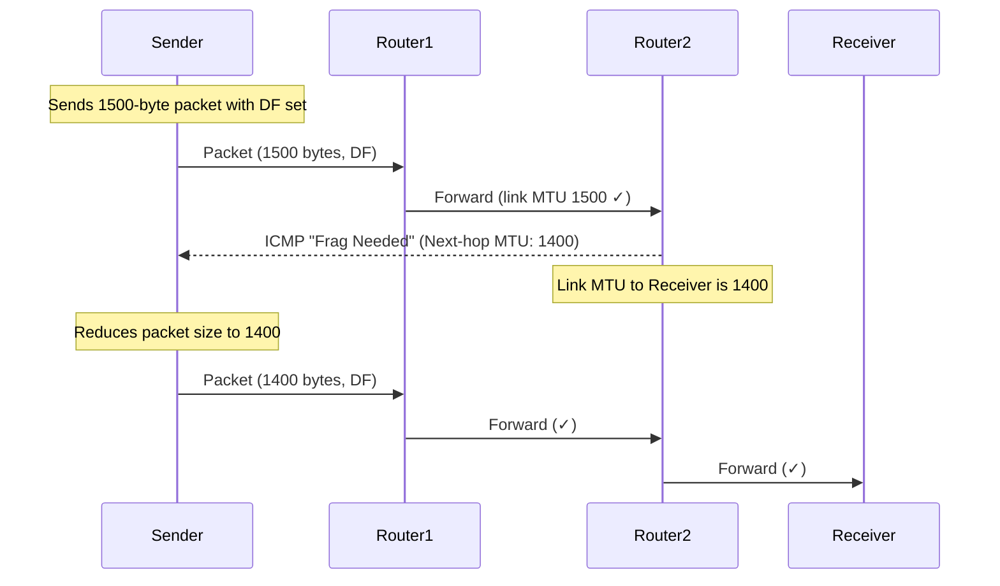

# Ethernet Framing — The Structure of Data on a Wire

> An Ethernet frame is the fundamental unit of data on a local network. Every packet you've ever sent went inside one. Let's understand every byte.

---

## Table of Contents

1. [History: From Aloha to Modern Ethernet](#history-from-aloha-to-modern-ethernet)
2. [Why Frames Exist](#why-frames-exist)
3. [Ethernet Frame Format — Every Field Explained](#ethernet-frame-format--every-field-explained)
4. [Frame Size Constraints: Minimum and Maximum](#frame-size-constraints-minimum-and-maximum)
5. [MTU: Maximum Transmission Unit](#mtu-maximum-transmission-unit)
6. [Jumbo Frames](#jumbo-frames)
7. [VLAN Tagging (802.1Q)](#vlan-tagging-8021q)
8. [Frame vs Packet vs Segment](#frame-vs-packet-vs-segment)
9. [Linux: Working with Frames and MTU](#linux-working-with-frames-and-mtu)

---

## History: From Aloha to Modern Ethernet

### The Aloha Network (1970)

The University of Hawaii built ALOHAnet — a radio network connecting campus sites across the islands. The protocol was brilliant in its simplicity:

1. When you have data to send, send it.
2. If your transmission collides with someone else's (both sending at once), both are garbled.
3. Wait a random time and try again.

This "send and pray" approach was inefficient (~18% maximum utilization) but it introduced a revolutionary concept: **random access**. Any station could transmit at any time without central coordination.

### CSMA/CD: Ethernet's original access method

Bob Metcalfe, working at Xerox PARC in 1973, improved on Aloha with **CSMA/CD** (Carrier Sense Multiple Access with Collision Detection):

1. **Carrier Sense**: Before sending, listen to the wire. If someone else is transmitting, wait.
2. **Multiple Access**: Multiple stations share the same wire.
3. **Collision Detection**: While sending, keep listening. If you detect a collision (your signal is garbled by another sender), stop immediately, send a jam signal, and wait a random time before retrying.

The random wait time uses **exponential backoff**: after the first collision, wait 0 or 1 slot times (random). After the second collision, wait 0-3 slot times. After the third, 0-7 slot times. And so on, up to 10 retries.

### Why CSMA/CD is irrelevant today

CSMA/CD only matters when multiple devices share the same wire (a "bus" or "hub" topology). Modern networks use **switches**, which give each device its own dedicated connection. There are no collisions because each link has exactly two endpoints.

Modern Ethernet is **full-duplex** — sending and receiving happen simultaneously on separate wire pairs. Collisions are physically impossible.

But the **frame format** designed for CSMA/CD Ethernet is still used today. The frame structure is the legacy that persists.

---

## Why Frames Exist

The physical layer sends raw bits — a continuous stream of voltage changes, light pulses, or radio symbols. Without some structure, the receiver would see one endless string of bits with no way to know:

- Where one message starts and another ends
- Who sent the message
- Who should receive it
- Whether the message was corrupted during transmission

**Framing** solves all of these. A frame is a structured container that:
1. **Delimits** data — clear start and end markers
2. **Addresses** data — says who sent it and who should receive it
3. **Classifies** data — says what type of payload is inside
4. **Protects** data — includes a checksum for error detection

---

## Ethernet Frame Format — Every Field Explained

Here's the complete structure of an Ethernet II frame (the dominant type on the internet):

```
┌──────────┬─────┬────────┬────────┬───────────┬─────────────────────┬─────┐
│ Preamble │ SFD │ Dst    │ Src    │ EtherType │ Payload             │ FCS │
│ 7 bytes  │ 1B  │ MAC    │ MAC    │ 2 bytes   │ 46-1500 bytes       │ 4B  │
│          │     │ 6 bytes│ 6 bytes│           │                     │     │
└──────────┴─────┴────────┴────────┴───────────┴─────────────────────┴─────┘
│←── Not counted in frame size ──→│←── "Frame size" (64-1518 bytes) ──────→│
```

Let's go field by field.

### Preamble (7 bytes) + Start Frame Delimiter (1 byte)

**What**: 7 bytes of alternating 1s and 0s (`10101010` × 7), followed by 1 byte of `10101011`.

**Why**: The preamble serves as a "wake up call" to the receiver's hardware. It allows the receiver to:
1. Detect that a frame is coming (as opposed to silence on the wire)
2. Synchronize its clock with the sender (the alternating bits provide a clean clock signal)
3. Lock onto the correct bit boundaries

The SFD (Start Frame Delimiter) is like the preamble but with the last two bits changed from `10` to `11`. This two-bit change says "the preamble is over, the real frame starts NOW."

**Important**: The preamble and SFD are not considered part of the frame by networking software. `tcpdump` and Wireshark don't show them. Frame size calculations exclude them. They're purely a physical-layer mechanism.

### Destination MAC Address (6 bytes)

**What**: The 48-bit MAC address of the intended recipient.

**Why**: This is how the switch (and the receiving NIC) knows whether a frame is "for them."

**Special addresses**:
- `FF:FF:FF:FF:FF:FF` — **broadcast**, received by ALL devices on the local network
- Addresses where the least significant bit of the first byte is 1 — **multicast**, received by a group of devices
- All other addresses — **unicast**, for one specific device

**How it's used**: When a switch receives a frame, it reads the destination MAC and looks it up in its MAC address table:
- If found → forward to the specific port
- If not found → flood to all ports (except the one it arrived on)
- If broadcast → flood to all ports

### Source MAC Address (6 bytes)

**What**: The 48-bit MAC address of the sender.

**Why**: Two purposes:
1. The switch uses it to **learn** which port the sender is connected to (builds the MAC address table)
2. The receiver knows who sent the frame (can send replies back)

**Note**: The source address is NEVER broadcast or multicast. It's always a unicast address identifying a specific NIC.

### EtherType (2 bytes)

**What**: A 2-byte value identifying the type of payload inside the frame.

**Why**: When the receiver strips the Ethernet header, what's left is the payload. But what protocol should parse it? IPv4? IPv6? ARP? The EtherType field tells the receiver.

**Common values**:
| Hex Value | Protocol |
|-----------|----------|
| 0x0800 | IPv4 |
| 0x86DD | IPv6 |
| 0x0806 | ARP |
| 0x8100 | 802.1Q VLAN tag |
| 0x8847 | MPLS (unicast) |

**Historical note**: Early Ethernet used this field as a "Length" field instead (IEEE 802.3 format). If the value is ≤ 1500, it's interpreted as a length. If > 1536, it's interpreted as an EtherType. Values 1501-1535 are invalid/reserved. In practice, virtually all modern Ethernet uses EtherType (Ethernet II format).

### Payload (46–1500 bytes)

**What**: The actual data being carried — typically an IP packet.

**Why 46 minimum?**: The minimum frame size is 64 bytes (excluding preamble/SFD). With 14 bytes of header (6+6+2) and 4 bytes of FCS, that leaves 64 - 14 - 4 = 46 bytes for payload. If the actual data is less than 46 bytes, **padding** (zero bytes) is added to reach the minimum.

**Why 1500 maximum?**: This is the default **MTU** (Maximum Transmission Unit). We'll cover why shortly.

### Frame Check Sequence / FCS (4 bytes)

**What**: A CRC-32 checksum computed over the entire frame (destination MAC through payload).

**Why**: To detect transmission errors. Electromagnetic interference, attenuation, and crosstalk can corrupt bits during transmission. The CRC catches most corruption.

**How it works**:
1. Sender computes CRC-32 of the frame, appends it as FCS
2. Receiver computes CRC-32 of the received frame (excluding FCS)
3. Compares computed CRC with received FCS
4. If they match: frame is accepted
5. If they don't match: frame is **silently discarded**

**Key point**: There is NO error correction at the Ethernet layer. No retransmission request. No error message. Corrupted frames are simply thrown away. TCP (at a higher layer) will eventually notice the missing data and retransmit.

**CRC-32 detection capability**: CRC-32 detects:
- All single-bit errors
- All double-bit errors
- Any odd number of errors
- All burst errors up to 32 bits
- Most (99.99999998%) longer burst errors

It's extremely good. But it's not perfect — in theory, a specific pattern of corruption could produce a valid CRC. This is astronomically unlikely but not impossible, which is why TCP has its own checksum too.

---

## Frame Size Constraints: Minimum and Maximum

### Minimum frame size: 64 bytes

**Why 64 bytes?** This is not arbitrary. It comes from CSMA/CD collision detection.

For collision detection to work, a sender must still be transmitting when a collision signal arrives back:
- A frame must take at least as long to transmit as the worst-case round-trip time on the network
- For 10 Mbps Ethernet with a maximum network diameter of 2500 meters:
  - Round-trip propagation: ~25 microseconds (electrical signal in copper)
  - At 10 Mbps: 25μs × 10 Mbps = 250 bits = ~32 bytes
  - With safety margin, this became 512 bits = **64 bytes**

If a frame is shorter than 64 bytes, the sender might finish transmitting before detecting a collision. The collision would go unnoticed, and both corrupted frames would be delivered.

**In modern switched networks**: CSMA/CD is not used (no collisions possible). But the 64-byte minimum persists as part of the Ethernet standard. Frames shorter than 64 bytes are called "runts" and are discarded by switches.

### Maximum frame size: 1518 bytes (default)

**Why 1518?** The maximum was chosen as a trade-off:

**Larger frames are more efficient**: Less overhead per byte of data (the header is amortized over more payload bytes). A 1500-byte payload with 18 bytes of overhead = 98.8% efficient. A 46-byte payload = only 71.9% efficient.

**Larger frames increase latency**: A device can't start forwarding until it has received the entire frame (store-and-forward). Larger frames take longer to transmit, increasing serialization delay.

**Larger frames increase error risk**: The probability of a bit error increases with frame length. A frame with 10,000 bytes on a noisy link is much more likely to be corrupted than a 1,500-byte frame.

**Larger frames delay other traffic**: While transmitting a large frame, no other frame can use the link. This increases latency for time-sensitive traffic.

1500 bytes was a compromise between efficiency and latency/fairness, set in the 1980s and never changed for compatibility.

---

## MTU: Maximum Transmission Unit

### What MTU is

The MTU is the maximum size of the **payload** that can be carried in a single frame on a particular link. For standard Ethernet, the default MTU is **1500 bytes**.

MTU is a link-layer concept. It doesn't include the Ethernet header or FCS — just the payload.

```
Frame on wire: [Ethernet header: 14B] [Payload: ≤1500B] [FCS: 4B]
                                       ↑
                                    This is MTU (1500)
```

### Why MTU matters at higher layers

When the IP layer wants to send a packet larger than the link's MTU, it has two options:
1. **Fragment the packet**: Break it into multiple smaller packets, each fitting within the MTU. Each fragment is reassembled at the destination. (IPv4 supports this; IPv6 doesn't at routers.)
2. **Refuse to send**: If the "Don't Fragment" (DF) bit is set (which is the norm), the IP layer sends back an ICMP "Fragmentation Needed" message instead of fragmenting.

Modern networking strongly prefers option 2 + **Path MTU Discovery** (PMTUD): the sender discovers the smallest MTU along the entire path and sizes its packets accordingly.

### Path MTU Discovery (PMTUD)



**The MTU black hole problem**: If ICMP is blocked by a firewall (which is common), the sender never receives the "Fragmentation Needed" message. It keeps sending packets that are too large, and they keep getting silently dropped. The connection appears to "hang" after establishment (the TCP handshake uses small packets that fit within any MTU, but the data packets don't).

This is a real and common failure mode. We cover it in detail in Module 18 (failure scenarios).

```bash
# Check your interface MTU
ip link show eth0 | grep mtu

# Discover path MTU to a destination
ping -M do -s 1472 destination
# -M do: Don't Fragment
# -s 1472: 1472 + 8 (ICMP header) + 20 (IP header) = 1500 total
# If it works: path MTU ≥ 1500
# If "message too long": path MTU < 1500 — try smaller sizes

# Try decreasing sizes to find the path MTU
for size in 1472 1400 1300 1200; do
  echo -n "Size $size: "
  ping -M do -s $size -c 1 -W 2 destination 2>&1 | grep -o "bytes\|too long\|100%"
done
```

---

## Jumbo Frames

### What they are

Jumbo frames are Ethernet frames with a payload larger than 1500 bytes, typically up to **9000 bytes** (9216 or 9022 bytes depending on vendor).

### Why they exist

In data centers with high-speed links (10G+), the overhead of processing many small frames becomes significant:
- Each frame requires an interrupt (or interrupt coalescing cycle)
- Each frame requires header processing
- CRC computation per frame
- More frames per second = more CPU cycles for packet processing

With 9000-byte jumbo frames instead of 1500-byte standard frames, you need ~6× fewer frames to transfer the same amount of data. This reduces:
- CPU overhead (fewer interrupts, fewer headers to process)
- Overhead percentage (18 bytes of overhead per 9000 bytes payload = 99.8% efficiency)

### When NOT to use jumbo frames

- **Over the internet**: The internet's MTU is effectively 1500 bytes. Only within a single administrative domain (your data center, your cloud VPC) can you use jumbo frames.
- **Mixed environments**: ALL devices on the path must support jumbo frames. If even ONE switch or NIC doesn't support 9000-byte MTU, packets get dropped.
- **Wide-area links**: VPN tunnels, MPLS, and other encapsulation add overhead, reducing effective MTU below 9000.

### Configuring on Linux

```bash
# Change MTU (temporary — lost on reboot)
sudo ip link set dev eth0 mtu 9000

# Verify
ip link show eth0 | grep mtu

# Test connectivity with new MTU
ping -M do -s 8972 <peer-ip>
# 8972 + 20 (IP) + 8 (ICMP) = 9000

# Make permanent: depends on your network configuration system
# For systemd-networkd: add MTUBytes=9000 to the .network file
# For netplan: add mtu: 9000 under the interface
# For /etc/network/interfaces: add mtu 9000 under the interface
```

---

## VLAN Tagging (802.1Q)

### The problem VLANs solve

In a large office network, you might want:
- The engineering team on one network segment
- The finance team on another
- Guest Wi-Fi on a third

Without VLANs, you'd need separate physical switches for each segment. VLANs let you create **logical** network segments on the **same physical switch** infrastructure.

### How 802.1Q VLAN tagging works

VLAN tagging inserts 4 extra bytes into the Ethernet frame, between the source MAC and the EtherType:

```
Standard frame:
[Dst MAC | Src MAC | EtherType | Payload | FCS]

802.1Q tagged frame:
[Dst MAC | Src MAC | 0x8100 | VLAN Tag | EtherType | Payload | FCS]
                     ↑                   
               Tag Protocol ID (TPID)
               Says "this frame has a VLAN tag"
```

The VLAN tag (2 bytes) contains:
- **PCP** (3 bits): Priority Code Point — for QoS (0-7, higher = more priority)
- **DEI** (1 bit): Drop Eligible Indicator
- **VID** (12 bits): VLAN Identifier — 0-4095, but 0 and 4095 are reserved, so you get VLANs 1-4094

### Maximum frame size with VLAN tag

Standard max frame: 1518 bytes
With 802.1Q tag: 1522 bytes (4 extra bytes)

This is important because some older equipment may not understand frames larger than 1518 bytes and might discard tagged frames.

### Tagged vs untagged ports

- **Access port** (untagged): Connected to end devices (PCs, servers). The switch adds/removes VLAN tags automatically. The device doesn't know about VLANs.
- **Trunk port** (tagged): Connected between switches. Carries traffic for multiple VLANs, with each frame tagged to identify its VLAN.

### Linux VLAN configuration

```bash
# Create a VLAN interface (VLAN 100 on eth0)
sudo ip link add link eth0 name eth0.100 type vlan id 100
sudo ip addr add 10.100.0.1/24 dev eth0.100
sudo ip link set dev eth0.100 up

# Verify
ip -d link show eth0.100
# Shows: vlan protocol 802.1Q id 100

# See VLAN traffic with tcpdump
sudo tcpdump -i eth0 -e -nn vlan
# Shows the VLAN tags in frames

# Remove VLAN interface
sudo ip link delete eth0.100
```

---

## Frame vs Packet vs Segment

This terminology matters for clear communication:

| Term | Layer | Contains | Size limits |
|------|-------|----------|-------------|
| **Frame** | Layer 2 (Data Link) | Ethernet header + payload + FCS | 64-1518 bytes (standard) |
| **Packet** | Layer 3 (Network) | IP header + payload | Up to 65,535 bytes (but limited by MTU in practice) |
| **Segment** | Layer 4 (Transport) | TCP header + payload | Limited by MSS (typically 1460 bytes) |
| **Datagram** | Layer 4 (Transport) | UDP header + payload | Up to 65,507 bytes (theoretical) |

**How they nest**:
```
Frame contains:    [Ethernet Hdr | Packet                              | FCS]
Packet contains:   [IP Hdr       | Segment                            ]
Segment contains:  [TCP Hdr      | Application Data                   ]
```

**MSS (Maximum Segment Size)**: The maximum TCP payload per segment. Typically:
$$\text{MSS} = \text{MTU} - \text{IP header} - \text{TCP header} = 1500 - 20 - 20 = 1460 \text{ bytes}$$

TCP advertises its MSS during the handshake so both sides know the maximum segment size.

---

## Linux: Working with Frames and MTU

### Checking interface statistics (frame level)

```bash
# See total frames and errors
ip -s link show eth0
# RX: packets (= frames received)
#     errors (= frames with CRC failure or other errors)
#     dropped (= frames dropped by the kernel — buffer full, etc.)

# See detailed frame-level statistics
ethtool -S eth0
# rx_packets, tx_packets: total frames
# rx_crc_errors: frames with CRC failure
# rx_frame_errors: frames with incorrect length
# rx_length_errors: frames too short (runts) or too long (giants)
```

### Changing MTU and testing

```bash
# See current MTU
ip link show eth0 | grep mtu

# Change MTU
sudo ip link set dev eth0 mtu 1400

# Verify connectivity at new MTU
ping -M do -s 1372 gateway
# 1372 + 28 = 1400 → should work
ping -M do -s 1473 gateway
# 1473 + 28 = 1501 → should fail (exceeds 1500 MTU somewhere)

# Reset to default
sudo ip link set dev eth0 mtu 1500
```

### Watching frames with tcpdump

```bash
# Show Ethernet headers
sudo tcpdump -i eth0 -e -nn -c 10
# -e: show Ethernet (L2) headers
# Output: MAC addresses, EtherType, packet info

# Filter by EtherType
sudo tcpdump -i eth0 -e -nn ether proto 0x0806
# Only show ARP frames (EtherType 0x0806)

# Show frame as hex dump
sudo tcpdump -i eth0 -XX -c 1
# First 14 bytes are the Ethernet header
```

---

## Key Takeaways

1. **Frames provide structure to raw bits**: boundaries, addressing, classification, and error detection
2. **Every Ethernet frame field has a purpose**: preamble (clock sync), MACs (addressing), EtherType (demultiplexing), FCS (error detection)
3. **Minimum 64 bytes was for CSMA/CD collision detection** — legacy but still enforced
4. **Default MTU is 1500 bytes** — this determines maximum IP packet size on most links
5. **PMTUD discovers the smallest MTU on a path** — but breaks if ICMP is blocked
6. **Jumbo frames (9000B) reduce overhead** in data centers but can't be used over the internet
7. **VLAN tags add 4 bytes** to the frame, enabling logical network segmentation
8. **Corrupted frames are silently discarded** — no error notification, no retry at Layer 2

---

## Next

→ [03-mac-switching-flooding.md](03-mac-switching-flooding.md) — How switches learn, forward, and flood
