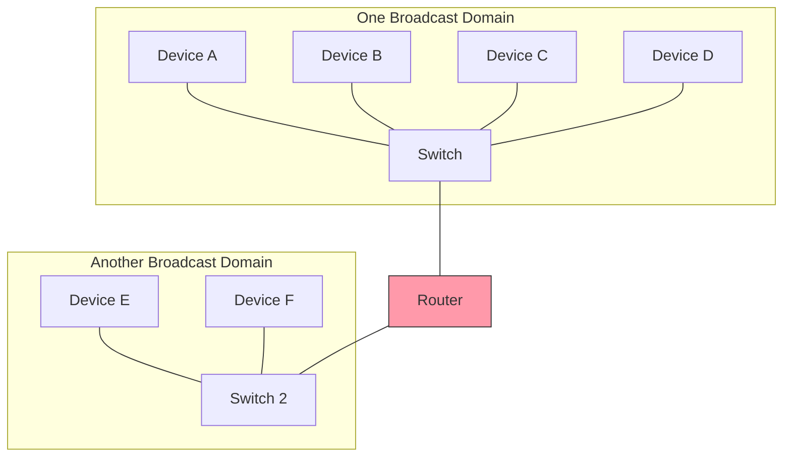
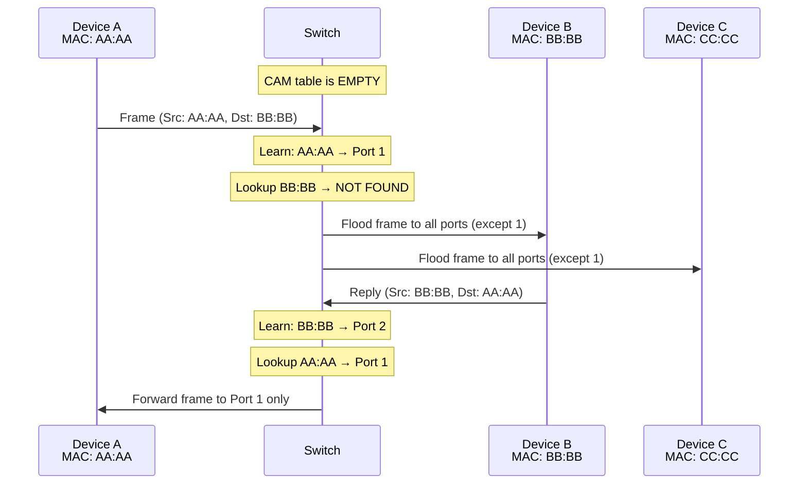
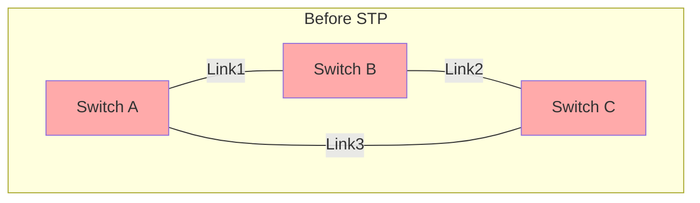
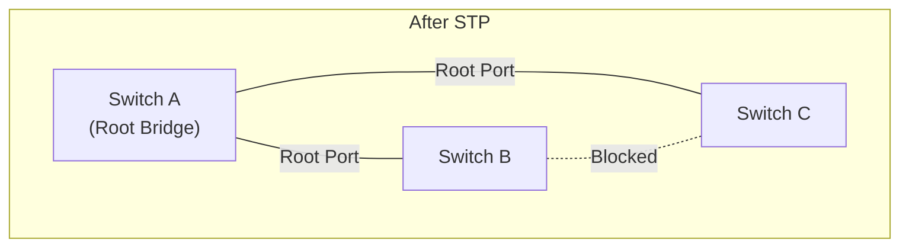

# MAC Addresses, Switching & Flooding — How Layer 2 Forwarding Actually Works

> A switch is the simplest device that makes networks practical. It seems trivial until you realize the entire internet depends on millions of them working correctly. This chapter covers exactly how, and what goes wrong when they don't.

---

## Table of Contents

1. [MAC Addresses Deep Dive](#mac-addresses-deep-dive)
2. [Hubs vs Switches: A Historical Necessity](#hubs-vs-switches-a-historical-necessity)
3. [Collision Domains and Broadcast Domains](#collision-domains-and-broadcast-domains)
4. [How a Switch Learns: The MAC Address Table (CAM Table)](#how-a-switch-learns-the-cam-table)
5. [Forwarding, Filtering, and Flooding](#forwarding-filtering-and-flooding)
6. [The Broadcast Storm Problem](#the-broadcast-storm-problem)
7. [Spanning Tree Protocol (STP)](#spanning-tree-protocol-stp)
8. [Linux as a Switch: Bridge](#linux-as-a-switch-bridge)
9. [Debugging Layer 2](#debugging-layer-2)

---

## MAC Addresses Deep Dive

### What is a MAC address?

A MAC (Media Access Control) address is a 48-bit identifier assigned to a network interface. It's the **layer 2 address** — used to deliver frames within a single network segment.

```
Format: XX:XX:XX:XX:XX:XX  (6 octets, colon-separated hex)
Example: 00:1A:2B:3C:4D:5E

Alternative notations (same address):
  00:1A:2B:3C:4D:5E   ← Linux/Unix
  00-1A-2B-3C-4D-5E   ← Windows
  001A.2B3C.4D5E      ← Cisco
```

48 bits = $2^{48}$ = 281,474,976,710,656 possible addresses ($\approx 281$ trillion).

### Structure of a MAC address

```
         OUI (vendor)      NIC-specific
    ┌────────────────┐  ┌────────────────┐
    │ XX : XX : XX   │  │ XX : XX : XX   │
    └────────────────┘  └────────────────┘
    First 3 bytes (24 bits)  Last 3 bytes (24 bits)

    Bit 0 of first byte:
      0 = unicast
      1 = multicast
    
    Bit 1 of first byte:
      0 = globally unique (OUI-based)
      1 = locally administered
```

**OUI (Organizationally Unique Identifier)**: The first 3 bytes are assigned by IEEE to manufacturers. This is how you can identify the vendor from a MAC address:

| OUI | Vendor |
|-----|--------|
| 00:50:56 | VMware |
| 08:00:27 | VirtualBox |
| DC:A6:32 | Raspberry Pi |
| 00:0C:29 | VMware |
| F8:75:A4 | LCFC (Lenovo) |

```bash
# Look up a MAC address vendor
# Online: https://maclookup.app/
# Or locally:
apt list --installed 2>/dev/null | grep ieee-data
# If installed, the OUI database is at /usr/share/ieee-data/oui.csv
```

### Special MAC addresses

| Address | Meaning |
|---------|---------|
| `FF:FF:FF:FF:FF:FF` | Broadcast — all devices on the segment receive this |
| `01:00:5E:xx:xx:xx` | IPv4 multicast |
| `33:33:xx:xx:xx:xx` | IPv6 multicast |
| `01:80:C2:00:00:00` | Spanning Tree Protocol (STP) |
| `00:00:00:00:00:00` | Invalid — but seen in some probe frames |

### Are MAC addresses truly unique?

**In theory**: Yes. Each NIC is manufactured with a unique, burned-in MAC address (BIA).

**In reality**: No.
- You can change (spoof) your MAC address trivially
- Virtual machines have software-generated MAC addresses
- Containers share the host's NIC or use virtual MACs
- Cheap manufacturers sometimes reuse OUI ranges
- Randomized MACs are standard on mobile devices (for privacy)

MAC uniqueness only needs to hold **within a single broadcast domain** (one network segment). Two devices on opposite sides of the world can have the same MAC address without any problem — they'll never be on the same layer 2 network.

```bash
# View your MAC address
ip link show eth0
# Look for "link/ether XX:XX:XX:XX:XX:XX"

# Change MAC address (temporary)
sudo ip link set dev eth0 down
sudo ip link set dev eth0 address 02:00:00:00:00:01
sudo ip link set dev eth0 up

# Verify
ip link show eth0
# Note: 02 in first byte means "locally administered" (bit 1 = 1)
```

---

## Hubs vs Switches: A Historical Necessity

### The Hub (Layer 1 device)

A hub is the simplest networking device imaginable. It has multiple ports. When a frame arrives on one port, the hub **repeats it out all other ports**. That's it. No intelligence.

**Consequence**: Every device connected to a hub sees ALL traffic. If Device A sends a frame to Device C, Devices B, D, and E also receive it. They inspect the destination MAC, see it's not for them, and discard it — but they still had to process the frame.

**Worse**: All devices share the same bandwidth. A 10 Mbps hub with 8 devices gives each device, on average, 10/8 = 1.25 Mbps (and worse in practice due to collisions).

### The Switch (Layer 2 device)

A switch is a hub that learned to read. It examines the **destination MAC address** of each incoming frame and forwards it only to the port where that MAC address is located.

**Consequence**: Each device only receives traffic meant for it (plus broadcasts). Each port gets the full link bandwidth since there are no collisions on separate ports.

### Why switches won

| Property | Hub | Switch |
|----------|-----|--------|
| Examines frames? | No (repeats blindly) | Yes (reads destination MAC) |
| Forwards to... | All ports | Specific port |
| Collision domain | All ports share one | Each port is its own |
| Bandwidth per port | Shared among all | Full speed per port |
| Full duplex support | No | Yes |
| Cost (2024) | Obsolete | $20-$100 for basic |

Hubs are extinct in modern networks. They're mentioned only because understanding what they did wrong illuminates why switches work the way they do.

---

## Collision Domains and Broadcast Domains

### Collision domain

A **collision domain** is a set of devices where, if two transmit simultaneously, a collision occurs.

- **Hub**: All ports are in the SAME collision domain
- **Switch**: Each port is its OWN collision domain (full duplex, no collisions)

### Broadcast domain

A **broadcast domain** is a set of devices that all receive a broadcast frame.

- **Hub**: All ports = one broadcast domain
- **Switch**: ALL ports = one broadcast domain (switches forward broadcasts to all ports!)
- **Router**: Each interface is a SEPARATE broadcast domain (routers don't forward broadcasts)

**Critical insight**: A switch reduces collision domains but does NOT reduce broadcast domains. This is why Layer 2 networks don't scale infinitely. If you have 1000 devices on one switch, every broadcast frame is delivered to all 1000 devices.



Broadcasts from A reach B, C, D — but NOT E or F (router blocks them).

---

## How a Switch Learns: The MAC Address Table (CAM Table)

### What is the CAM table?

CAM stands for Content Addressable Memory. On a switch, the CAM table (also called the MAC address table) maps MAC addresses to ports:

```
MAC Address         Port     Age (seconds)
─────────────────────────────────────────
00:1A:2B:3C:4D:01   Gi0/1    120
00:1A:2B:3C:4D:02   Gi0/2    45
00:1A:2B:3C:4D:03   Gi0/3    200
```

### How learning works

The switch learns by examining the **source MAC address** of incoming frames:



Step by step:
1. Frame arrives on Port 1 with Source MAC AA:AA
2. Switch records: **AA:AA is reachable via Port 1**
3. Switch looks up Destination MAC BB:BB in the table — **not found**
4. Switch **floods** the frame out all ports except Port 1
5. Device B receives the frame and sends a reply
6. Reply arrives on Port 2 with Source MAC BB:BB  
7. Switch records: **BB:BB is reachable via Port 2**
8. Switch looks up Destination MAC AA:AA — **found: Port 1**
9. Switch forwards the reply **only to Port 1**

After this exchange, both MAC addresses are in the table, and subsequent traffic between A and B goes directly — no flooding.

### CAM table aging

Entries in the CAM table have an **aging timer** (typically 300 seconds / 5 minutes). If no frame with a particular source MAC arrives within the timer, the entry is removed.

**Why**: Devices may be disconnected or moved to different ports. Stale entries would cause traffic to be sent to the wrong port (where the device used to be). Aging ensures the table stays current.

### CAM table overflow attack

The CAM table has a finite size — typically 8,000 to 128,000 entries depending on the switch.

An attacker can flood the switch with frames having random source MAC addresses, filling the CAM table completely. Once full, the switch can't learn new legitimate entries and reverts to **flooding all frames** — effectively becoming a hub. The attacker on any port now sees ALL traffic.

This is called a **MAC flooding attack** or **CAM table overflow**. Mitigation: **port security** — limit the number of MAC addresses allowed per port.

---

## Forwarding, Filtering, and Flooding

A switch does exactly one of three things with every frame:

### 1. Forward

Destination MAC is in the CAM table, and it's on a **different** port than the frame arrived on. The frame is sent out the specific port.

### 2. Filter

Destination MAC is in the CAM table, and it's on the **same** port the frame arrived on. This means the source and destination are on the same port (perhaps connected through another switch on that port). The frame is discarded — no need to forward it back.

### 3. Flood

Destination MAC is **NOT** in the CAM table, OR the destination is the **broadcast** address, OR the destination is a **multicast** address (without IGMP snooping). The frame is sent out all ports **except** the one it arrived on.

```
Frame arrives on Port 3, Destination MAC = XX:XX

Is XX:XX in CAM table?
├── Yes
│   ├── On Port 3 (same port)? → FILTER (discard)
│   └── On different port?     → FORWARD (to that port)
└── No                         → FLOOD (all ports except 3)
```

### When flooding happens in practice

Flooding is supposed to be temporary — just until the switch learns where a MAC address is. But in some cases, flooding is constant:

1. **Broadcast frames** (e.g., ARP requests): Always flooded by design
2. **Multicast frames** without IGMP snooping: Treated as broadcast
3. **Unknown unicast**: CAM entry expired or never existed (e.g., device that only receives, never sends)
4. **CAM overflow attack**: Table full, nothing can be learned

---

## The Broadcast Storm Problem

### What is a loop?

If two switches are connected by two links (for redundancy), a broadcast frame creates a **loop**:

```
Switch A ←───Link 1───→ Switch B
    ↑                        ↑
    └───────Link 2───────────┘
```

1. Device on Switch A sends a broadcast
2. Switch A floods it out all ports, including **both links** to Switch B
3. Switch B receives TWO copies of the broadcast
4. Switch B floods both copies out all ports, including **both links** back to Switch A
5. Switch A receives the flooded copies, treats them as new broadcasts, floods again
6. Repeat infinitely

This is a **broadcast storm**. Within seconds, the network is completely saturated with duplicate broadcast frames looping endlessly. All useful traffic is drowned out. The network is dead.

### Why loops are worse than they sound

Three things happen simultaneously:
1. **Bandwidth saturation**: Frames multiply exponentially, consuming all link capacity
2. **MAC address table instability**: The switch sees the same source MAC arriving on different ports (via the two paths) and keeps updating the CAM table back and forth ("MAC flapping")
3. **CPU overload**: The switch or host CPU is overwhelmed processing the flood of frames

**A single loop can take down an entire building's network in under 10 seconds.**

---

## Spanning Tree Protocol (STP)

### The solution to loops

STP (IEEE 802.1D) prevents loops by logically disabling redundant links. It was invented by Radia Perlman in 1985.

### How STP works (simplified)

1. **Elect a Root Bridge**: All switches in the network elect one switch as the "root" — typically the one with the lowest Bridge ID (priority + MAC address).

2. **Calculate shortest paths**: Each switch calculates the shortest path (lowest cost) to the root bridge.

3. **Assign port roles**:
   - **Root Port**: The port on each non-root switch that provides the shortest path to the root bridge. ONE per switch.
   - **Designated Port**: The port on each segment that provides the shortest path to the root bridge from that segment. ONE per segment.
   - **Blocked Port**: All other ports. These are logically disabled — they receive STP frames but do **not** forward user traffic.

4. **Result**: The network forms a loop-free **tree** rooted at the root bridge. Redundant links exist physically but are logically blocked.





### STP convergence time

**Classic STP (802.1D)**: 30-50 seconds to converge after a topology change. This means 30-50 seconds of potential network disruption when a link goes up or down.

**Rapid STP (802.1w)**: 1-3 seconds convergence. This is the modern standard.

**MSTP (802.1s)**: Allows different spanning trees per VLAN, so one blocked link for VLAN 10 can be active for VLAN 20.

### STP failures

STP failures are some of the most devastating network incidents:
- A misconfigured switch joins the network and becomes the root bridge → entire network topology recalculates
- STP BPDUs (control frames) are lost or blocked → the blocked port transitions to forwarding → instant loop
- Unidirectional link failure → one switch sees the other, but not vice versa → both forward → loop

---

## Linux as a Switch: Bridge

Linux can function as a Layer 2 switch using the **bridge** module. This is how Docker and VMs create virtual networks.

### Creating a bridge

```bash
# Create a bridge (virtual switch)
sudo ip link add name br0 type bridge

# Add physical interfaces to the bridge
sudo ip link set dev eth0 master br0
sudo ip link set dev eth1 master br0

# Bring everything up
sudo ip link set dev br0 up
sudo ip link set dev eth0 up
sudo ip link set dev eth1 up

# Now eth0 and eth1 are "switch ports" on br0
# Frames from eth0 can reach eth1 and vice versa
```

### Viewing the bridge's MAC table (equivalent of CAM table)

```bash
# Show learned MAC addresses
bridge fdb show br br0
# Output:
# 00:1a:2b:3c:4d:5e dev eth0 master br0
# 00:1a:2b:3c:4d:5f dev eth1 master br0

# Show with aging timers
bridge fdb show br br0 | head -20

# Show bridge STP state
bridge link show
```

### Bridge + VLAN filtering

```bash
# Enable VLAN filtering on the bridge
sudo ip link set dev br0 type bridge vlan_filtering 1

# Add VLAN 100 to port eth0
sudo bridge vlan add vid 100 dev eth0

# Add VLAN 100 to port eth1 (as trunk — tagged)
sudo bridge vlan add vid 100 dev eth1

# Show VLAN configuration
bridge vlan show
```

### Docker and bridges

Every Docker installation creates a bridge called `docker0`:

```bash
# See Docker's bridge
ip link show docker0
bridge fdb show br docker0

# See which containers are connected
bridge link show dev docker0

# When a container starts, Docker:
# 1. Creates a veth pair (virtual cable)
# 2. Puts one end in the container (as eth0)
# 3. Puts the other end on docker0 bridge
# It's exactly like plugging a cable into a switch
```

---

## Debugging Layer 2

### Is the link up?

```bash
# Check link state
ip link show eth0
# Look for: state UP or state DOWN

# Check physical link (speed, duplex, carrier)
ethtool eth0
# Speed: 1000Mb/s
# Duplex: Full
# Link detected: yes

# Watch for link state changes in real time
ip monitor link
```

### Is traffic flowing?

```bash
# Frame counters
ip -s link show eth0
# RX: bytes/packets/errors/dropped
# TX: bytes/packets/errors/dropped

# Watch counters change in real time
watch -n 1 'ip -s link show eth0'

# Detailed error breakdown
ethtool -S eth0 | grep -i 'error\|drop\|crc\|collision'
```

### Can I see specific frames?

```bash
# See all ARP traffic (common layer 2 debugging)
sudo tcpdump -i eth0 -e arp
# -e shows Ethernet headers (MAC addresses)

# See broadcasts
sudo tcpdump -i eth0 -e 'ether broadcast'

# See traffic to/from a specific MAC
sudo tcpdump -i eth0 -e 'ether host 00:1a:2b:3c:4d:5e'

# See VLAN-tagged traffic
sudo tcpdump -i eth0 -e vlan
```

### MAC flapping detection

MAC flapping means the same MAC address is appearing on multiple ports — a sign of a loop:

```bash
# On Linux bridge, check for MAC flapping
# Watch the FDB table for changes
watch -d 'bridge fdb show br br0'
# If the port for a MAC address keeps changing, you have a loop

# On managed switches, look in syslog for messages like:
# "MAC address XX:XX:XX:XX:XX:XX flapping between port Gi0/1 and Gi0/2"
```

### ARP table (Layer 2/3 bridge)

```bash
# Show ARP cache (maps IP → MAC)
ip neigh show
# States: REACHABLE, STALE, DELAY, PROBE, FAILED, INCOMPLETE

# Flush and re-learn
sudo ip neigh flush all
```

---

## Key Takeaways

1. **MAC addresses are 48-bit layer 2 identifiers** — unique per NIC in theory, spoofable in practice
2. **Switches learn by examining source MACs**, building a CAM table mapping MAC → port
3. **Unknown destinations are flooded** to all ports — this is how learning bootstraps
4. **Broadcasts are ALWAYS flooded** — switches cannot reduce broadcast domains
5. **Routers (not switches) create broadcast domain boundaries**
6. **Redundant links cause loops** → broadcast storms → network death in seconds
7. **STP blocks redundant links** to prevent loops while maintaining physical redundancy
8. **Linux bridges** implement switch functionality in software — used by Docker, VMs, and more
9. **CAM table overflow is an attack vector** — mitigated by port security

---

## Practical Exercise

1. **On your Linux machine**: Create a bridge with two veth pairs and observe MAC learning:
   ```bash
   # Create bridge
   sudo ip link add br-test type bridge
   sudo ip link set br-test up
   
   # Create two veth pairs
   sudo ip link add veth0 type veth peer name veth0-br
   sudo ip link add veth1 type veth peer name veth1-br
   
   # Attach one end of each to the bridge
   sudo ip link set veth0-br master br-test
   sudo ip link set veth1-br master br-test
   
   # Create network namespaces (simulate separate machines)
   sudo ip netns add ns0
   sudo ip netns add ns1
   
   # Move the other ends into namespaces
   sudo ip link set veth0 netns ns0
   sudo ip link set veth1 netns ns1
   
   # Configure IPs
   sudo ip netns exec ns0 ip addr add 10.0.0.1/24 dev veth0
   sudo ip netns exec ns1 ip addr add 10.0.0.2/24 dev veth1
   
   # Bring everything up
   sudo ip link set veth0-br up
   sudo ip link set veth1-br up
   sudo ip netns exec ns0 ip link set veth0 up
   sudo ip netns exec ns1 ip link set veth1 up
   
   # Watch the bridge learn
   bridge fdb show br br-test
   
   # Ping from ns0 to ns1
   sudo ip netns exec ns0 ping -c 3 10.0.0.2
   
   # Check what the bridge learned
   bridge fdb show br br-test
   
   # Cleanup
   sudo ip netns del ns0
   sudo ip netns del ns1
   sudo ip link del br-test
   ```

2. **Observe the broadcast**: While pinging in step 1, run `tcpdump` on the bridge to see ARP broadcasts:
   ```bash
   sudo tcpdump -i br-test -e arp
   ```

---

## Next

→ [04-arp-deep-dive.md](04-arp-deep-dive.md) — How IP addresses get resolved to MAC addresses
