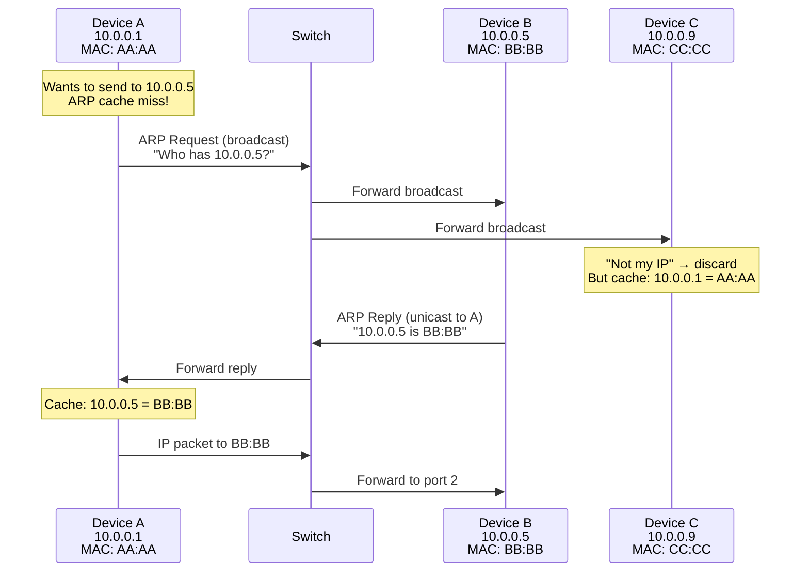
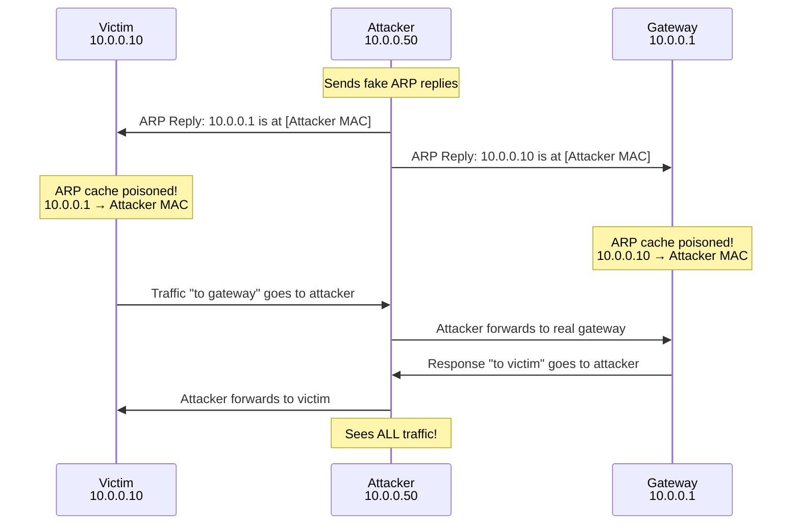

# ARP Deep Dive — Resolving IP to MAC

> ARP is one of the simplest protocols in networking. It's also one of the most attacked, most misunderstood, and most critical to debugged. If ARP is broken, nothing else works — not HTTP, not DNS, not SSH. Nothing.

---

## Table of Contents

1. [The Problem ARP Solves](#the-problem-arp-solves)
2. [ARP Packet Format](#arp-packet-format)
3. [ARP Operation Step by Step](#arp-operation-step-by-step)
4. [The ARP Cache](#the-arp-cache)
5. [ARP Cache States in Linux](#arp-cache-states-in-linux)
6. [Gratuitous ARP](#gratuitous-arp)
7. [Proxy ARP](#proxy-arp)
8. [ARP and Default Gateways](#arp-and-default-gateways)
9. [ARP Spoofing / Poisoning](#arp-spoofing--poisoning)
10. [ARP in Virtual Environments](#arp-in-virtual-environments)
11. [Debugging ARP Problems](#debugging-arp-problems)
12. [ARP vs NDP (IPv6)](#arp-vs-ndp-ipv6)

---

## The Problem ARP Solves

When your machine wants to send an IP packet to 10.0.0.5, it must put that packet inside an Ethernet frame. The Ethernet frame needs a **destination MAC address**. But all your machine knows is the IP address — 10.0.0.5.

**The gap**: IP addresses exist at Layer 3. MAC addresses exist at Layer 2. Something must translate between them. That something is ARP (Address Resolution Protocol).

```
Application: Send data to 10.0.0.5
         ↓
Transport: Create TCP segment
         ↓
Network:  Create IP packet, destination 10.0.0.5
         ↓
Data Link: Create Ethernet frame, destination MAC = ???
         ↓
         Need ARP to find the MAC address of 10.0.0.5
```

### Why not just use MAC addresses everywhere?

IP addresses are hierarchical and routable. 10.0.1.0/24 tells you it's a Class A private network, subnet 1. You can route to it. MAC addresses (e.g., 00:1A:2B:3C:4D:5E) have no geographic or topological meaning. You can't build routing tables for MAC addresses.

### Why not just use IP addresses everywhere?

Ethernet (and other Layer 2 technologies) were designed before IP existed. They have their own addressing scheme. IP runs **on top of** Ethernet, not instead of it. The Ethernet NIC hardware only understands MAC addresses — it doesn't parse IP headers.

So we need both. And we need a way to map between them.

---

## ARP Packet Format

ARP packets are very small — just 28 bytes (for IPv4 over Ethernet):

```
 0                   1                   2                   3
 0 1 2 3 4 5 6 7 8 9 0 1 2 3 4 5 6 7 8 9 0 1 2 3 4 5 6 7 8 9 0 1
├───────────────────────────────┼───────────────────────────────┤
│      Hardware Type (1)        │       Protocol Type (0x0800)  │
├───────────────┼───────────────┼───────────────────────────────┤
│  HW Addr Len  │ Proto Addr   │        Operation              │
│    (6)        │  Len (4)     │     (1=Request, 2=Reply)      │
├───────────────┴───────────────┴───────────────────────────────┤
│                    Sender Hardware Address (6 bytes)          │
├──────────────────────────────────────────────────────────────┤
│                    Sender Protocol Address (4 bytes)          │
├──────────────────────────────────────────────────────────────┤
│                    Target Hardware Address (6 bytes)          │
├──────────────────────────────────────────────────────────────┤
│                    Target Protocol Address (4 bytes)          │
└──────────────────────────────────────────────────────────────┘
```

**Fields explained**:

| Field | Value (IPv4/Ethernet) | Purpose |
|-------|----------------------|---------|
| Hardware Type | 1 (Ethernet) | What type of L2 addresses we're using |
| Protocol Type | 0x0800 (IPv4) | What type of L3 addresses we're resolving |
| HW Addr Length | 6 | MAC addresses are 6 bytes |
| Proto Addr Length | 4 | IPv4 addresses are 4 bytes |
| Operation | 1 (Request) or 2 (Reply) | Are we asking or answering? |
| Sender HW Addr | Sender's MAC | Who's asking (or answering) |
| Sender Proto Addr | Sender's IP | The IP of the sender |
| Target HW Addr | Target's MAC (00:00:00:00:00:00 in requests) | Who we want to find |
| Target Proto Addr | Target's IP | The IP we want to resolve |

**ARP is NOT an IP protocol**. It doesn't travel inside IP packets. It travels directly inside Ethernet frames with EtherType `0x0806`. This is important — ARP operates at Layer 2.5, bridging the gap between Layer 2 and Layer 3.

---

## ARP Operation Step by Step

### Step 1: Need to resolve an IP address

Device A (10.0.0.1, MAC AA:AA:AA:AA:AA:AA) wants to send data to Device B (10.0.0.5, MAC BB:BB:BB:BB:BB:BB). A doesn't know B's MAC address.

### Step 2: Check the ARP cache

A first checks its local ARP cache — a table mapping IP addresses to MAC addresses. If 10.0.0.5 is already in the cache with a valid entry, use that MAC address. Done.

If not found → proceed to send an ARP request.

### Step 3: Send ARP Request (broadcast)

A broadcasts an ARP request to **every device on the network**:

```
Ethernet Frame:
  Destination MAC: FF:FF:FF:FF:FF:FF  (broadcast)
  Source MAC:      AA:AA:AA:AA:AA:AA
  EtherType:       0x0806 (ARP)

ARP Payload:
  Operation:       1 (Request)
  Sender MAC:      AA:AA:AA:AA:AA:AA
  Sender IP:       10.0.0.1
  Target MAC:      00:00:00:00:00:00  (unknown — that's what we're asking!)
  Target IP:       10.0.0.5
```

**In human terms**: "Hey everyone! I'm 10.0.0.1 (MAC AA:AA:AA:AA:AA:AA). Who has IP 10.0.0.5? Please tell me your MAC address."

### Step 4: All devices receive the broadcast

Every device on the network receives this broadcast frame. Each device:
1. Reads the ARP request
2. Checks: "Is the Target IP my IP?"
3. If no → discard silently
4. If yes → send a reply

**However**: Even devices that DON'T match the Target IP will **update their own ARP cache** with the sender's information (Sender IP + Sender MAC). This is an optimization — now they know A's MAC without having to ask later.

### Step 5: Target sends ARP Reply (unicast)

Device B recognizes its own IP (10.0.0.5) and sends a **unicast** reply directly to A:

```
Ethernet Frame:
  Destination MAC: AA:AA:AA:AA:AA:AA  (unicast to A)
  Source MAC:      BB:BB:BB:BB:BB:BB
  EtherType:       0x0806 (ARP)

ARP Payload:
  Operation:       2 (Reply)
  Sender MAC:      BB:BB:BB:BB:BB:BB
  Sender IP:       10.0.0.5
  Target MAC:      AA:AA:AA:AA:AA:AA
  Target IP:       10.0.0.1
```

**In human terms**: "Hey 10.0.0.1! I'm 10.0.0.5, and my MAC is BB:BB:BB:BB:BB:BB."

### Step 6: Cache and send

A receives the reply, updates its ARP cache, and can now build the Ethernet frame:

```
Ethernet Frame:
  Destination MAC: BB:BB:BB:BB:BB:BB  ← learned from ARP
  Source MAC:      AA:AA:AA:AA:AA:AA
  EtherType:       0x0800 (IPv4)
  Payload:         [IP packet to 10.0.0.5]
```



---

## The ARP Cache

### Why cache?

Without caching, every IP packet would require a broadcast ARP request first. On a busy network, this would mean constant ARP broadcasts — a flooding nightmare.

The ARP cache stores recent IP→MAC mappings so ARP requests only happen when a mapping is unknown or expired.

### Linux ARP cache

```bash
# View the ARP cache
ip neigh show
# Output:
# 10.0.0.1 dev eth0 lladdr 00:1a:2b:3c:4d:5e REACHABLE
# 10.0.0.254 dev eth0 lladdr 00:50:56:12:34:56 STALE
# 10.0.0.99 dev eth0  FAILED
```

Alternative (older command):
```bash
arp -n
```

### Cache timeout

Linux ARP cache entries don't have a simple "expire after N seconds" timer. Instead, they go through states (see next section). The key sysctl parameters:

```bash
# How long a REACHABLE entry stays reachable (seconds)
sysctl net.ipv4.neigh.eth0.base_reachable_time_ms
# Default: 30000 (30 seconds), with random factor: 15-45 seconds

# How many seconds before sending a probe to a STALE entry
sysctl net.ipv4.neigh.eth0.delay_first_probe_time
# Default: 5 seconds

# How many unsolicited probes before declaring FAILED
sysctl net.ipv4.neigh.eth0.ucast_solicit
# Default: 3
```

---

## ARP Cache States in Linux

The Linux ARP cache implements a state machine, not a simple timer. Understanding the states is crucial for debugging.

```
                          ┌──────────┐
          New entry ──────│INCOMPLETE│
                          └────┬─────┘
                               │ ARP reply received
                               ▼
                          ┌──────────┐
                          │REACHABLE │←── Confirmed recently
                          └────┬─────┘
                               │ Timeout (30s ± random)
                               ▼
                          ┌──────────┐
              Not used ───│  STALE   │←── Might still be valid
                          └────┬─────┘
                               │ Traffic sent to this IP
                               ▼
                          ┌──────────┐
                          │  DELAY   │←── Waiting for upper-layer confirmation
                          └────┬─────┘
                               │ No confirmation after 5s
                               ▼
                          ┌──────────┐
                          │  PROBE   │←── Sending unicast ARP requests
                          └────┬─────┘
                          ┌────┴─────┐
                No reply  │          │ Reply received
                    ▼     │          ▼
              ┌──────────┐│    ┌──────────┐
              │  FAILED  ││    │REACHABLE │
              └──────────┘│    └──────────┘
                          │
```

**State descriptions**:

| State | Meaning |
|-------|---------|
| **INCOMPLETE** | ARP request sent, no reply yet. Entry exists but MAC is unknown. |
| **REACHABLE** | Valid and recently confirmed. Use freely. |
| **STALE** | Valid but not recently confirmed. Still usable, but verification will happen if traffic is sent. |
| **DELAY** | Traffic was sent using a STALE entry. Waiting ~5 seconds for upper-layer confirmation (e.g., TCP ACK proves the host is still there). |
| **PROBE** | No upper-layer confirmation received. Now sending unicast ARP requests to verify. |
| **FAILED** | ARP probes got no response. The host is unreachable at this IP/MAC. |

**Key insight**: Linux tries hard to avoid sending ARP requests. It uses TCP responses ("upper layer confirmation") to passively verify that a neighbor is still alive. Only when passive confirmation fails does it send active ARP probes.

```bash
# Watch ARP state transitions in real time
watch -n 0.5 'ip neigh show dev eth0'

# Force a specific state for debugging
sudo ip neigh change 10.0.0.1 dev eth0 lladdr 00:1a:2b:3c:4d:5e nud reachable
# nud = Neighbor Unreachability Detection
```

---

## Gratuitous ARP

### What is it?

A gratuitous ARP is an ARP request where the sender asks about **its own IP address**:

```
Sender IP:  10.0.0.1
Target IP:  10.0.0.1   ← same as sender!
Sender MAC: AA:AA:AA:AA:AA:AA
Target MAC: 00:00:00:00:00:00
```

"Hey everyone, who has 10.0.0.1? It's me! My MAC is AA:AA."

### Why would you ask about yourself?

Gratuitous ARP serves several purposes:

1. **IP conflict detection**: If someone ELSE replies to the gratuitous ARP, it means two devices have the same IP address. The sender can detect the conflict.

2. **ARP cache update**: All devices that hear the gratuitous ARP update their caches with the new IP→MAC mapping. This is used during:
   - **Failover**: When a backup server takes over, it sends a gratuitous ARP to redirect traffic to its own MAC
   - **NIC change**: When a device gets a new NIC (new MAC), it announces the change
   - **Virtual IP migration**: VRRP and keepalived use gratuitous ARP to move floating IPs between servers

3. **Announce presence**: After booting, a device sends a gratuitous ARP to announce itself.

```bash
# Send a gratuitous ARP manually
sudo arping -A -c 4 -I eth0 10.0.0.1
# -A: ARP reply mode (gratuitous ARP reply)
# -c 4: send 4 packets
# -I eth0: on this interface

# Or using gratuitous ARP request mode (some devices respond better to one vs the other)
sudo arping -U -c 4 -I eth0 10.0.0.1
# -U: unsolicited ARP request (gratuitous ARP request)
```

---

## Proxy ARP

### What is it?

Proxy ARP is when a device (usually a router) **answers ARP requests on behalf of another device** that's on a different network. 

### How it works

Suppose:
- Device A is on 10.0.0.0/24 (connected to Router port 1)
- Device B is on 10.0.1.0/24 (connected to Router port 2)
- Device A wants to reach 10.0.1.5 (Device B)

Without proxy ARP:
1. A broadcasts ARP for 10.0.1.5
2. B is on a different subnet — the broadcast doesn't reach it
3. ARP fails. A can't send the packet.

With proxy ARP on the router:
1. A broadcasts ARP for 10.0.1.5
2. The router knows that 10.0.1.0/24 is reachable via its port 2
3. The router replies with **its own MAC address**: "10.0.1.5 is at [router's MAC]"
4. A sends packets to the router's MAC
5. The router forwards them to B

### Why proxy ARP is mostly bad

Proxy ARP was a hack from early networking when subnetting wasn't well implemented. Problems:
- Increases broadcast traffic (every cross-subnet request hits the router)
- Breaks the "ARP only works within a broadcast domain" assumption
- Makes network debugging harder (ARP replies come from unexpected sources)
- Security risk (makes ARP spoofing easier)

**Modern alternative**: Proper routing with a default gateway. Your machine should know to send non-local traffic to the gateway, not ARP for everything.

```bash
# Check if proxy ARP is enabled (Linux)
sysctl net.ipv4.conf.eth0.proxy_arp
# 0 = disabled (default and correct)
# 1 = enabled

# Disable it
sudo sysctl -w net.ipv4.conf.eth0.proxy_arp=0
```

---

## ARP and Default Gateways

### How your traffic actually reaches the internet

When you access google.com (142.250.x.x), your machine needs to send an IP packet to that address. But 142.250.x.x is NOT on your local network. You can't ARP for it.

**What actually happens**:

1. Your machine checks: "Is 142.250.x.x in my subnet?" → No
2. Your machine looks at the routing table: "Non-local traffic goes to default gateway 10.0.0.1"
3. Your machine ARPs for **the gateway's MAC** (10.0.0.1), NOT for Google's MAC
4. Your machine builds an Ethernet frame:
   ```
   Destination MAC: [Gateway's MAC]    ← Layer 2: deliver to the router
   Source MAC:      [Your MAC]
   IP Destination:  142.250.x.x       ← Layer 3: final destination is Google
   IP Source:       10.0.0.1           ← Layer 3: your IP
   ```
5. The router receives the frame, strips the Ethernet header, reads the IP destination, looks up its routing table, and forwards the packet toward Google — putting it in a NEW Ethernet frame with NEW MAC addresses for the next hop.

**Key insight**: Layer 2 addresses change at every hop. Layer 3 addresses (usually) stay the same end-to-end.

```
Your PC → Router 1 → Router 2 → Google

Hop 1: MAC: [Your MAC → Router1 MAC]  IP: [Your IP → Google IP]
Hop 2: MAC: [R1 MAC   → R2 MAC]       IP: [Your IP → Google IP]
Hop 3: MAC: [R2 MAC   → Google MAC]   IP: [Your IP → Google IP]
                                            ↑ IP doesn't change!
```

```bash
# See your default gateway
ip route show default
# default via 10.0.0.1 dev eth0

# See the gateway's MAC in your ARP cache
ip neigh show 10.0.0.1
# 10.0.0.1 dev eth0 lladdr 00:50:56:12:34:56 REACHABLE

# If the gateway's MAC is missing/FAILED, you can't reach anything
# This is the most common ARP-related failure
```

---

## ARP Spoofing / Poisoning

### The attack

ARP has **no authentication**. Any device can send an ARP reply claiming to be any IP address. The receiving device will blindly update its cache.

An attacker can send fake ARP replies to:
1. Tell the victim: "The gateway's MAC is [attacker's MAC]"
2. Tell the gateway: "The victim's MAC is [attacker's MAC]"

Now all traffic between the victim and the gateway flows through the attacker — a classic **Man-in-the-Middle (MitM)** attack.



### Detection

```bash
# Check for duplicate IPs (ARP conflict)
sudo arping -D -c 3 -I eth0 10.0.0.1
# If someone replies, there's a duplicate

# Watch for ARP anomalies
sudo tcpdump -i eth0 -e arp
# Look for:
# - Multiple ARP replies from different MACs for the same IP
# - Unsolicited ARP replies (gratuitous ARP from unexpected sources)
# - Very frequent ARP replies (flooding)

# Check for multiple MACs claiming the same IP
ip neigh show | sort -k1 | uniq -D -f0
```

### Mitigation

1. **Static ARP entries** (for critical hosts like the gateway):
   ```bash
   sudo ip neigh replace 10.0.0.1 dev eth0 lladdr 00:50:56:12:34:56 nud permanent
   # This entry won't be overwritten by ARP replies
   ```

2. **Dynamic ARP Inspection (DAI)**: Switch-level feature that validates ARP packets against a DHCP snooping database.

3. **ARP watch tools**:
   ```bash
   sudo apt install arpwatch
   sudo systemctl start arpwatch
   # Logs and alerts on ARP table changes
   ```

4. **Use encrypted protocols**: Even if an attacker intercepts traffic, TLS/SSH prevent them from reading it. This doesn't prevent the MitM but limits its impact.

---

## ARP in Virtual Environments

### Docker

Each Docker container has a virtual network interface (veth) connected to the `docker0` bridge. ARP works normally within Docker's bridge network:

```bash
# From inside a container:
ip neigh show
# Shows ARP entries for other containers on the same bridge

# From the host:
bridge fdb show br docker0
# Shows MAC addresses of container interfaces
```

### Kubernetes

Kubernetes networking depends heavily on ARP:
- Pods communicate within a node via bridges (ARP works as normal)
- Across nodes, different CNI plugins handle ARP differently:
  - **Flannel**: Uses VXLAN — ARP is encapsulated inside UDP
  - **Calico**: Uses BGP — may use proxy ARP or L3 routing
  - **Cilium**: eBPF-based — can bypass ARP entirely

### VMs

Hypervisors (KVM, VMware, Hyper-V) create virtual switches. ARP works between VMs on the same virtual switch just like physical networks. VM migration (e.g., vMotion) sends gratuitous ARP to update the network about the VM's new physical location.

---

## Debugging ARP Problems

### Symptom: "Destination host unreachable" (ICMP) or "no route to host"

This often means ARP resolution failed for the next hop.

```bash
# Step 1: Is the IP on your subnet?
ip addr show eth0
# If your IP is 10.0.0.10/24, then 10.0.0.X addresses are local

# Step 2: Check ARP cache
ip neigh show 10.0.0.5
# If FAILED: ARP couldn't reach the device
# If INCOMPLETE: ARP request sent, no reply yet

# Step 3: Watch ARP traffic
sudo tcpdump -i eth0 -e arp
# Do you see ARP requests going out? Do you see replies?

# Step 4: Try manual ARP
arping -c 3 -I eth0 10.0.0.5
# If no reply: device is down, wrong IP, or blocked by firewall
```

### Symptom: Intermittent connectivity

Could be ARP cache flapping or stale entries:

```bash
# Monitor ARP changes
watch -n 1 'ip neigh show dev eth0'
# Look for entries changing between REACHABLE/STALE/FAILED

# Clear ARP cache and let it re-learn
sudo ip neigh flush dev eth0
```

### Symptom: Can ping gateway but not internet

The gateway's ARP entry might be wrong (spoofed?):

```bash
# Verify gateway MAC
ip neigh show 10.0.0.1
# Compare with the router's actual MAC (check the router's interface, or ask the admin)

# If wrong, set it manually
sudo ip neigh replace 10.0.0.1 dev eth0 lladdr [correct MAC] nud permanent
```

---

## ARP vs NDP (IPv6)

IPv6 does NOT use ARP. It uses **NDP (Neighbor Discovery Protocol)**, which is built on **ICMPv6**:

| Feature | ARP (IPv4) | NDP (IPv6) |
|---------|-----------|------------|
| Protocol | ARP (EtherType 0x0806) | ICMPv6 (inside IPv6 packets) |
| Resolution | Broadcast ARP request | Multicast Neighbor Solicitation |
| Target | Broadcast FF:FF:FF:FF:FF:FF | Solicited-node multicast (much more targeted) |
| Security | None | Can use SEND (Secure NDP) |
| Router discovery | Separate (DHCP/static) | Built-in (Router Advertisement) |
| Duplicate detection | Gratuitous ARP (optional) | DAD (mandatory) |

**Why NDP is better**:
1. Uses multicast instead of broadcast — doesn't disturb devices that don't need the information
2. Built into the protocol suite — not a separate protocol
3. Includes router discovery, prefix discovery, and address autoconfiguration
4. Can be secured with cryptographic keys (SEND)

```bash
# IPv6 neighbor cache (equivalent of ARP cache)
ip -6 neigh show

# Send a Neighbor Solicitation (equivalent of ARP request)
ping6 -c 1 fe80::1%eth0
ip -6 neigh show
```

---

## Key Takeaways

1. **ARP maps IP addresses to MAC addresses** — essential for Layer 2 frame construction
2. **ARP uses broadcast requests and unicast replies** — request goes to everyone, reply goes only to the requester
3. **Linux ARP cache uses a state machine** (INCOMPLETE → REACHABLE → STALE → DELAY → PROBE → REACHABLE/FAILED)
4. **You ARP for the gateway, not the destination** when sending to non-local IPs
5. **ARP has NO authentication** — any device can claim any IP, enabling MitM attacks
6. **Gratuitous ARP** is used for failover, conflict detection, and announcing changes
7. **ARP problems = no connectivity** — it's the first thing to check when "the network is down" on the local segment
8. **IPv6 replaces ARP with NDP** — multicast-based, integrated into ICMPv6, more secure

---

## Next

→ [Module 04: IP Addressing & Subnetting](../04-ip-addressing/01-ipv4-addressing.md) — How Layer 3 addressing and routing work
