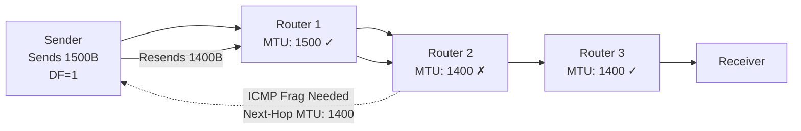

# IP Header & Fragmentation — The Envelope of the Internet

> Every IP packet carries a header that controls routing, fragmentation, and time-to-live. Understanding the header byte-by-byte transforms you from "user of the network" to "debugger of the network."

---

## Table of Contents

1. [The IPv4 Header — Every Field](#the-ipv4-header--every-field)
2. [Key Fields in Detail](#key-fields-in-detail)
3. [IP Fragmentation](#ip-fragmentation)
4. [Don't Fragment (DF) and Path MTU Discovery](#dont-fragment-df-and-path-mtu-discovery)
5. [Why Fragmentation Is Bad](#why-fragmentation-is-bad)
6. [IP Options (Rarely Used)](#ip-options)
7. [Linux: Examining IP Headers](#linux-examining-ip-headers)

---

## The IPv4 Header — Every Field

The IPv4 header is 20 bytes minimum (without options), up to 60 bytes maximum.

```
 0                   1                   2                   3
 0 1 2 3 4 5 6 7 8 9 0 1 2 3 4 5 6 7 8 9 0 1 2 3 4 5 6 7 8 9 0 1
├─┼─┼─┼─┼─┼─┼─┼─┼─┼─┼─┼─┼─┼─┼─┼─┼─┼─┼─┼─┼─┼─┼─┼─┼─┼─┼─┼─┼─┼─┼─┼─┤
│Version│  IHL  │    DSCP     │ECN│         Total Length          │
├─┼─┼─┼─┼─┼─┼─┼─┼─┼─┼─┼─┼─┼─┼─┼─┼─┼─┼─┼─┼─┼─┼─┼─┼─┼─┼─┼─┼─┼─┼─┼─┤
│         Identification        │Flags│    Fragment Offset        │
├─┼─┼─┼─┼─┼─┼─┼─┼─┼─┼─┼─┼─┼─┼─┼─┼─┼─┼─┼─┼─┼─┼─┼─┼─┼─┼─┼─┼─┼─┼─┼─┤
│    TTL        │   Protocol    │       Header Checksum           │
├─┼─┼─┼─┼─┼─┼─┼─┼─┼─┼─┼─┼─┼─┼─┼─┼─┼─┼─┼─┼─┼─┼─┼─┼─┼─┼─┼─┼─┼─┼─┼─┤
│                     Source IP Address                            │
├─┼─┼─┼─┼─┼─┼─┼─┼─┼─┼─┼─┼─┼─┼─┼─┼─┼─┼─┼─┼─┼─┼─┼─┼─┼─┼─┼─┼─┼─┼─┼─┤
│                   Destination IP Address                         │
├─┼─┼─┼─┼─┼─┼─┼─┼─┼─┼─┼─┼─┼─┼─┼─┼─┼─┼─┼─┼─┼─┼─┼─┼─┼─┼─┼─┼─┼─┼─┼─┤
│                    Options (if IHL > 5)                          │
└─┴─┴─┴─┴─┴─┴─┴─┴─┴─┴─┴─┴─┴─┴─┴─┴─┴─┴─┴─┴─┴─┴─┴─┴─┴─┴─┴─┴─┴─┴─┴─┘
```

---

## Key Fields in Detail

### Version (4 bits)

Always **4** for IPv4. The router reads this first to know how to parse the rest.

### IHL — Internet Header Length (4 bits)

Length of the header in 32-bit words. Minimum value: 5 (= 20 bytes). Maximum: 15 (= 60 bytes). If IHL > 5, there are options present.

### DSCP — Differentiated Services Code Point (6 bits)

Used for **Quality of Service (QoS)**. Marks packets for priority treatment:
- Voice traffic might get DSCP 46 (Expedited Forwarding)
- Best-effort traffic gets DSCP 0 (default)

Routers with QoS queues read this field to prioritize traffic.

### ECN — Explicit Congestion Notification (2 bits)

Allows routers to signal congestion WITHOUT dropping packets. Covered in Module 07 (Congestion Control).

### Total Length (16 bits)

Total size of the IP packet (header + data) in bytes. Maximum: $2^{16} - 1 = 65,535$ bytes. In practice, limited by link MTU (typically 1500 bytes).

### Identification (16 bits)

A unique ID assigned by the sender. Used to reassemble fragments — all fragments of the same original packet share the same Identification value.

### Flags (3 bits)

```
Bit 0: Reserved (always 0)
Bit 1: DF (Don't Fragment)
  0 = may fragment
  1 = don't fragment — send ICMP error instead
Bit 2: MF (More Fragments)
  0 = this is the last (or only) fragment
  1 = more fragments follow
```

### Fragment Offset (13 bits)

Where in the original packet this fragment belongs, measured in 8-byte units. The first fragment has offset 0. This allows the receiver to reassemble fragments in order.

### TTL — Time to Live (8 bits)

Decremented by 1 at each router. When it reaches 0, the packet is **discarded** and an **ICMP Time Exceeded** message is sent back to the sender.

**Purpose**: Prevents packets from looping forever if there's a routing loop. Without TTL, a misrouted packet would circle endlessly, consuming bandwidth.

**Typical values**:
| OS | Default TTL |
|----|------------|
| Linux | 64 |
| Windows | 128 |
| macOS | 64 |
| Cisco routers | 255 |

You can fingerprint the OS of a remote host by examining the TTL in received packets.

```bash
# Observe TTL
ping -c 1 google.com | grep ttl
# "ttl=118" → likely started at 128 (Windows/Azure) with 10 hops
# "ttl=55" → likely started at 64 (Linux) with 9 hops

# Set a custom TTL
ping -t 5 -c 1 8.8.8.8
# Packet will be dropped after 5 hops
# This is how traceroute works!
```

### Protocol (8 bits)

Identifies which upper-layer protocol the payload belongs to:

| Value | Protocol |
|-------|----------|
| 1 | ICMP |
| 6 | TCP |
| 17 | UDP |
| 47 | GRE |
| 50 | ESP (IPsec) |
| 89 | OSPF |

The receiver uses this field to decide which module should process the payload (demultiplexing).

### Header Checksum (16 bits)

One's complement checksum of the IP header ONLY (not the payload). Verified and recomputed at every router (because TTL changes at each hop).

**Note**: IPv6 removed the header checksum entirely. It was considered redundant because:
1. Link-layer CRC already catches most corruption
2. TCP/UDP have their own checksums
3. Recomputing at every hop was expensive

### Source and Destination IP Addresses (32 bits each)

Self-explanatory. These usually remain unchanged from source to destination — except when **NAT** rewrites them.

---

## IP Fragmentation

### When does fragmentation happen?

When a router receives a packet larger than the outgoing link's MTU, it must either:
1. Fragment the packet into smaller pieces (if DF = 0)
2. Drop the packet and send an ICMP "Fragmentation Needed" error (if DF = 1)

### How fragmentation works

**Original packet**: 4000 bytes of data, MTU of next link = 1500

The router must fragment this into chunks that fit within 1500 bytes (including 20-byte IP header → max 1480 bytes of data per fragment).

Fragments must also be aligned to 8-byte boundaries (because Fragment Offset is in 8-byte units):
- Max fragment payload = 1480 bytes (nearest multiple of 8 ≤ 1480 = 1480 ✓)

```
Original packet:
[IP Header (20B)] [Data: 4000 bytes]

Fragment 1:
[IP Header (20B)] [Data: 1480 bytes]
  MF=1, Offset=0, Total Length=1500, ID=12345

Fragment 2:
[IP Header (20B)] [Data: 1480 bytes]
  MF=1, Offset=185 (= 1480/8), Total Length=1500, ID=12345

Fragment 3:
[IP Header (20B)] [Data: 1040 bytes]
  MF=0, Offset=370 (= 2960/8), Total Length=1060, ID=12345
```

**All three fragments have the same Identification** (12345) so the destination can match them up.

### Reassembly

**Only the final destination** reassembles fragments — never a router in the middle. The destination:
1. Collects all fragments with the same (Source IP, Destination IP, Protocol, Identification)
2. Orders them by Fragment Offset
3. Combines them into the original packet
4. Delivers the complete packet to the upper layer

If any fragment is lost, the entire packet is lost (all fragments are discarded after a timeout, typically 30-60 seconds).

---

## Don't Fragment (DF) and Path MTU Discovery

### The DF bit

Modern systems set the **Don't Fragment (DF)** bit on virtually all packets. This tells routers: "If this packet is too big, DON'T fragment it. Instead, send me an ICMP error telling me the maximum size you can handle."

### Path MTU Discovery (PMTUD) — revisited with more detail



1. Sender sends a 1500-byte packet with DF=1
2. Router 2 can't forward (outgoing MTU is 1400)
3. Router 2 sends ICMP Type 3, Code 4 (Fragmentation Needed) with "Next-Hop MTU: 1400"
4. Sender caches this path MTU and resends at 1400 bytes
5. All subsequent packets to this destination use 1400 bytes

### PMTUD failure: the MTU black hole

If a firewall blocks ICMP (common but wrong), the sender never receives the "Fragmentation Needed" message. The connection appears to work (TCP handshake uses small packets) but hangs when transferring data (data packets exceed the path MTU and are silently dropped).

**Symptoms**:
- SSH connects but hangs when you type commands that produce long output  
- HTTP connection established but page never loads
- SCP/rsync stalls immediately

**Diagnosis**:
```bash
# Find path MTU manually
for size in 1472 1400 1300 1200 1100 1000; do
  result=$(ping -M do -s $size -c 1 -W 2 $TARGET 2>&1)
  if echo "$result" | grep -q "bytes from"; then
    echo "MTU >= $((size + 28))"
    break
  else
    echo "MTU < $((size + 28))"
  fi
done

# Check if PMTUD is working
sudo tcpdump -i eth0 'icmp[icmptype] == 3 and icmp[icmpcode] == 4'
# Should see "Fragmentation Needed" messages if PMTUD is active
```

**Fix**: Either unblock ICMP or reduce MTU manually:
```bash
# Reduce MSS for TCP (avoids the problem for TCP traffic)
sudo iptables -A FORWARD -p tcp --tcp-flags SYN,RST SYN -j TCPMSS --clamp-mss-to-pmtu

# Or set a specific MSS
sudo iptables -A FORWARD -p tcp --tcp-flags SYN,RST SYN -j TCPMSS --set-mss 1360
```

---

## Why Fragmentation Is Bad

1. **Any fragment lost = entire packet lost**: If 1 of 3 fragments is dropped, the other 2 are useless. The effective loss rate is amplified:
   $$P_{\text{packet loss}} = 1 - (1 - p)^n$$
   where $p$ is per-fragment loss rate and $n$ is number of fragments. For $p = 1\%$ and $n = 3$: $P = 1 - 0.99^3 = 2.97\%$

2. **Reassembly is expensive**: The destination must buffer fragments, manage timers, and handle reordering. This consumes memory and CPU.

3. **Fragment attacks**: Overlapping fragments, tiny fragments, and fragment floods are classic denial-of-service attacks. They exploit the complexity of reassembly.

4. **Fragments bypass firewalls**: Some firewalls only inspect the first fragment (which has the TCP/UDP header). Subsequent fragments have no port information, making them harder to filter.

5. **Performance overhead**: Each fragment has its own IP header (20 bytes), increasing overhead.

**Best practice**: Always use PMTUD. Never rely on fragmentation. If you're seeing IP fragmentation in production, something is misconfigured.

---

## IP Options

IP options are rarely used today but worth knowing:

| Option | Purpose |
|--------|---------|
| Record Route | Each router adds its IP to the option field |
| Timestamp | Each router adds its timestamp |
| Strict Source Route | Sender specifies exact path (every hop) |
| Loose Source Route | Sender specifies routers that must be visited |

Options add to the header length (IHL > 5) and slow down processing because they require special handling. Most routers are optimized for the common case (IHL = 5, no options).

**Security**: Source routing was used for attacks (spoofing, bypassing firewalls) and is disabled on almost all modern routers.

```bash
# Check if source routing is disabled (it should be)
sysctl net.ipv4.conf.all.accept_source_route
# Should be 0

# Record route (if not blocked)
ping -R -c 1 google.com
# Shows route recording (most routers ignore this)

# Traceroute with record route
traceroute -r google.com
```

---

## Linux: Examining IP Headers

### With tcpdump

```bash
# Show IP headers in detail (verbose mode)
sudo tcpdump -i eth0 -v -c 5
# Shows: TTL, tos (DSCP/ECN), id, flags (DF), offset, proto, length

# Even more verbose
sudo tcpdump -i eth0 -vv -c 5

# Show hex dump of packets
sudo tcpdump -i eth0 -XX -c 1
# First bytes: 45 00 — Version (4) and IHL (5 = 20 bytes)

# Filter by TTL
sudo tcpdump -i eth0 'ip[8] < 10'
# ip[8] is the TTL field — shows packets with TTL < 10

# Filter by protocol
sudo tcpdump -i eth0 'ip[9] = 6'
# ip[9] is the Protocol field — 6 = TCP

# Show only fragmented packets
sudo tcpdump -i eth0 '((ip[6:2] > 0) and (not ip[6] = 64))'
# Fragment offset > 0 OR MF flag set, excluding DF-only
```

### Watching fragmentation

```bash
# Create fragmentation artificially by lowering MTU
sudo ip link set dev eth0 mtu 576

# Send a large ping
ping -s 1000 -c 1 192.168.1.1
# This 1000-byte ping will be fragmented at 576-byte MTU

# Watch the fragments
sudo tcpdump -i eth0 -v icmp
# You'll see multiple fragments with same ID, MF flag, and offset values

# Reset MTU
sudo ip link set dev eth0 mtu 1500
```

### Checking fragmentation statistics

```bash
# IP fragmentation statistics
cat /proc/net/snmp | grep -A 1 Ip:
# ReasmReqds: fragments received for reassembly
# ReasmOKs: successfully reassembled
# ReasmFails: reassembly failures
# FragOKs: successfully fragmented
# FragFails: fragmentation failures (DF bit set)
# FragCreates: fragments created

# Netstat gives similar info
netstat -s | grep -i frag
```

---

## Key Takeaways

1. **The IPv4 header is 20 bytes minimum**, containing source/destination IP, TTL, protocol, and fragmentation fields
2. **TTL prevents infinite loops** — decremented at each hop, packet dropped at 0
3. **Protocol field demultiplexes** — tells the receiver whether the payload is TCP (6), UDP (17), ICMP (1), etc.
4. **Fragmentation splits large packets** into smaller pieces that fit the link MTU
5. **Only the destination reassembles** — routers fragment but never reassemble
6. **DF + PMTUD is the modern approach** — fragmentation is avoided wherever possible
7. **PMTUD breaks when ICMP is blocked** — causes mysterious connection hangs
8. **Fragmentation amplifies packet loss** and consumes resources — treat it as a configuration error if you see it in production

---

## Next

→ [04-ttl-and-unreliability.md](04-ttl-and-unreliability.md) — Why IP is unreliable by design, and why that's the right choice
