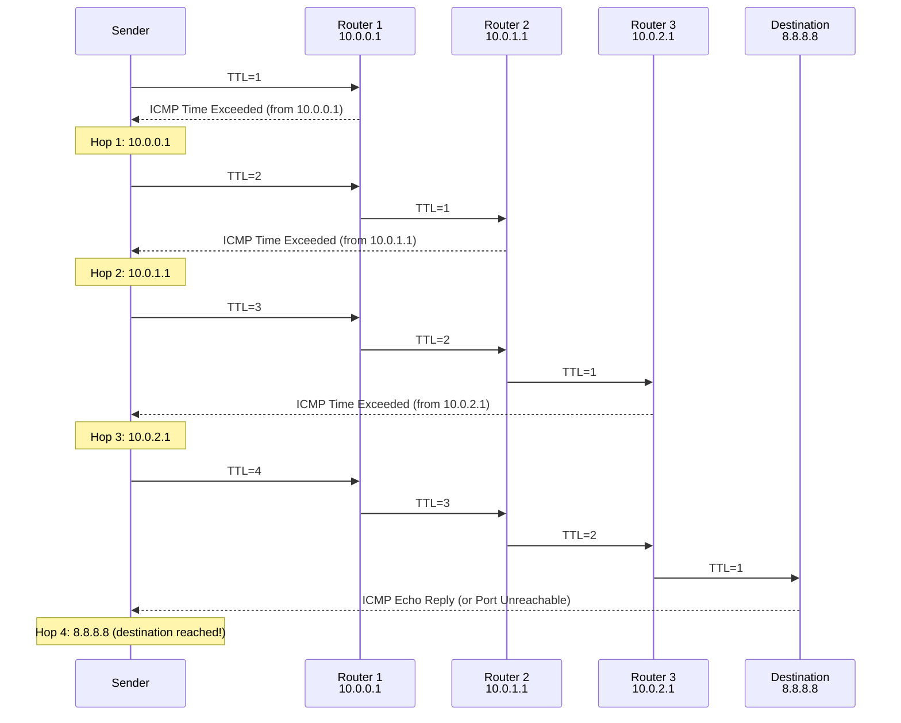

# TTL and the Unreliability of IP — Design That Wins

> IP is unreliable. Packets can be dropped, duplicated, delayed, reordered, or corrupted. This isn't a flaw — it's the most important design decision in the internet's history.

---

## Table of Contents

1. [IP Is Unreliable: What This Actually Means](#ip-is-unreliable)
2. [Why Unreliability Is the Right Design](#why-unreliability-is-the-right-design)
3. [TTL Deep Dive](#ttl-deep-dive)
4. [How Traceroute Works (Using TTL)](#how-traceroute-works)
5. [ICMP: The Error Reporting Protocol](#icmp-the-error-reporting-protocol)
6. [What Can Go Wrong With Packets](#what-can-go-wrong-with-packets)
7. [Linux: Observing Unreliability](#linux-observing-unreliability)

---

## IP Is Unreliable

IP provides a **best-effort delivery** service. It will TRY to deliver your packet, but it makes absolutely no guarantees about:

| Property | IP Guarantee |
|----------|-------------|
| Delivery | None — packets may be dropped |
| Order | None — packets may arrive out of order |
| Uniqueness | None — packets may be duplicated |
| Integrity | Weak — header checksum only, no payload check |
| Timing | None — packets may be delayed indefinitely |

### What "best-effort" means

"Best-effort" means IP will make a reasonable attempt to deliver the packet. It won't intentionally drop packets. But if a router is overloaded, a link fails, or a buffer overflows — OH WELL. The packet is gone. No error message to the sender (in most cases). No retry. Nothing.

Compare this to a telephone network: when you make a call, the network **guarantees** a circuit with specific bandwidth for the duration. IP makes no such guarantees.

---

## Why Unreliability Is the Right Design

### The end-to-end argument

One of the most influential ideas in computer science (Saltzer, Reed, Clark, 1984):

> "Functions placed at low levels of a system may be redundant or of little value when compared with the cost of providing them at that low level."

**Translation**: Reliability mechanisms in the network core are wasteful because:

1. **Not all applications need reliability**: Video streaming can tolerate lost packets. DNS queries can simply retry. Real-time gaming prefers low latency over perfect delivery.

2. **End-to-end checks are needed anyway**: Even if the network guarantees delivery between two routers, data can be corrupted in memory, by a buggy driver, or in the receiving application. The endpoints must verify correctness regardless.

3. **Different apps need different reliability**: TCP provides ordered, reliable delivery. UDP provides fast, unreliable delivery. Making IP reliable would force ALL applications to pay the cost, even those that don't need it.

4. **Simplicity in the core enables scale**: Routers that don't track connection state, don't buffer for retransmission, and don't guarantee ordering are FAST and SIMPLE. This is why the internet scales to billions of devices.

### The hourglass architecture

```
        ┌──────────────────────────────┐
        │  Applications (HTTP, SSH,    │
        │  DNS, video, gaming, ...)    │
        ├──────────────────────────────┤
        │  Transport (TCP / UDP / QUIC)│
        ├──────────────────────────────┤
        │         *** IP ***           │  ← Narrow waist: simple, unreliable
        ├──────────────────────────────┤
        │  Link (Ethernet, Wi-Fi,     │
        │  fiber, cellular, ...)       │
        └──────────────────────────────┘
```

IP is the "narrow waist." Everything above it can innovate (new transports, new apps). Everything below it can innovate (new link technologies). IP in the middle stays simple and stable.

If IP were reliable, it would be complex, slow, and resistant to change. The internet might never have scaled.

---

## TTL Deep Dive

### Why TTL exists

Without TTL, a routing loop would cause a packet to circulate forever:

```
Router A: "Packets for 10.0.0.0/24 → send to Router B"
Router B: "Packets for 10.0.0.0/24 → send to Router A"
```

The packet bounces between A and B infinitely, consuming bandwidth. With many looping packets, the link between A and B saturates and useful traffic can't get through.

TTL solves this by limiting a packet's lifetime: start at 64 (or 128), decrement at each router, discard at 0.

### TTL behavior at each hop

```
Sender:   TTL = 64
Router 1: TTL = 63 (decrement, forward)
Router 2: TTL = 62 (decrement, forward)
...
Router 64: TTL = 0 → DROP! Send ICMP Time Exceeded
```

When a router decrements TTL to 0:
1. The packet is **discarded** (not forwarded)
2. The router sends an **ICMP Time Exceeded** (Type 11, Code 0) message back to the source
3. The ICMP message includes the first 28 bytes of the dropped packet (so the sender can identify which flow was affected)

### Setting TTL on Linux

```bash
# Set default system TTL for outgoing packets
sudo sysctl -w net.ipv4.ip_default_ttl=64

# Send ping with custom TTL
ping -t 10 -c 1 google.com
# If google.com is >10 hops away, you'll get "Time to live exceeded"

# Set TTL with iptables (for forwarded traffic)
sudo iptables -t mangle -A PREROUTING -j TTL --ttl-set 128
```

---

## How Traceroute Works

Traceroute is one of the most elegant tools in networking, and it works entirely because of TTL.

### Algorithm

1. Send a packet to the destination with **TTL = 1**
2. The first router decrements TTL to 0, drops the packet, sends ICMP Time Exceeded
3. Record that router's IP address and round-trip time
4. Send another packet with **TTL = 2**
5. First router decrements to 1. Second router decrements to 0, drops, sends ICMP Time Exceeded
6. Record second router's IP
7. Continue incrementing TTL until the destination is reached



### Three types of traceroute

```bash
# UDP traceroute (default on Linux)
traceroute google.com
# Sends UDP packets to high ports (33434+)
# Destination responds with ICMP Port Unreachable

# ICMP traceroute (like ping)
traceroute -I google.com
# Sends ICMP Echo Request
# Destination responds with ICMP Echo Reply

# TCP traceroute (best for firewall traversal)
sudo traceroute -T -p 443 google.com
# Sends TCP SYN to port 443
# Works even when ICMP/UDP is blocked
```

### Reading traceroute output

```
$ traceroute -n google.com
 1  192.168.1.1    1.234 ms   0.987 ms   1.123 ms
 2  10.0.0.1       5.678 ms   5.432 ms   5.789 ms
 3  72.14.215.85   15.234 ms  14.987 ms  15.123 ms
 4  * * *
 5  142.250.x.x    20.123 ms  19.987 ms  20.456 ms
```

- Each line is a hop
- Three RTT measurements (traceroute sends 3 probes per hop by default)
- `* * *` means no ICMP response — firewall dropping ICMP, or rate limiting

### mtr: better than traceroute

`mtr` combines traceroute and ping — continuously monitors the path:

```bash
mtr google.com
# Shows all hops with live loss%, avg latency, jitter
# Much better for diagnosing intermittent issues

mtr -n --report -c 100 google.com
# -n: no DNS resolution
# --report: run 100 cycles and print summary
# -c 100: 100 packets
```

---

## ICMP: The Error Reporting Protocol

ICMP (Internet Control Message Protocol) is how the network communicates errors back to senders. It rides inside IP packets (Protocol number 1).

### Common ICMP types

| Type | Code | Name | Meaning |
|------|------|------|---------|
| 0 | 0 | Echo Reply | Response to ping |
| 3 | 0 | Dest Unreachable: Network | Can't route to network |
| 3 | 1 | Dest Unreachable: Host | Network reached, host not responding |
| 3 | 3 | Dest Unreachable: Port | Host reached, port not listening |
| 3 | 4 | Dest Unreachable: Frag Needed | Packet too big, DF set |
| 3 | 13 | Dest Unreachable: Admin Prohibited | Firewall blocked it |
| 8 | 0 | Echo Request | Ping |
| 11 | 0 | Time Exceeded: TTL | Packet's TTL reached 0 |
| 11 | 1 | Time Exceeded: Fragment Reassembly | Reassembly timer expired |

### Why you should NEVER blindly block ICMP

Many administrators block ALL ICMP "for security." This is wrong and harmful:

1. **PMTUD breaks**: Without ICMP Type 3 Code 4, path MTU discovery fails → connections hang
2. **Debugging breaks**: No ping, no traceroute → can't diagnose issues
3. **Performance degrades**: TCP can't detect path MTU → falls back to 576-byte MSS (very inefficient)

**What to block**: ICMP redirect (Type 5) can be dangerous. Everything else should be allowed.

```bash
# Allow essential ICMP
sudo iptables -A INPUT -p icmp --icmp-type echo-request -j ACCEPT
sudo iptables -A INPUT -p icmp --icmp-type echo-reply -j ACCEPT
sudo iptables -A INPUT -p icmp --icmp-type destination-unreachable -j ACCEPT
sudo iptables -A INPUT -p icmp --icmp-type time-exceeded -j ACCEPT

# Block ICMP redirect (security risk)
sudo iptables -A INPUT -p icmp --icmp-type redirect -j DROP
```

---

## What Can Go Wrong With Packets

### 1. Dropped (lost)

**Causes**:
- Router buffer full (congestion)
- Link failure
- TTL expired
- Firewall/ACL rule
- CRC error on incoming frame

**Effect**: Packet disappears. Upper layer (TCP) must detect and retransmit.

### 2. Reordered

**Causes**:
- Packets take different paths (ECMP load balancing)
- Different processing times at routers
- Link aggregation sending packets down different physical paths

**Effect**: TCP can handle this (sequence numbers). UDP applications must handle it themselves.

### 3. Duplicated

**Causes**:
- Retransmission at lower layers (e.g., link-layer retry + original both arrive)
- Network equipment bugs
- Looping (with TTL preventing infinite looping, but multiple copies can exist)

**Effect**: TCP handles this (duplicate detection via sequence numbers). UDP applications must be idempotent or handle duplicates.

### 4. Delayed

**Causes**:
- Queuing at congested routers
- Bufferbloat (over-large buffers absorb and delay packets)
- Taking a longer path

**Effect**: Increases latency. Can cause TCP retransmissions if the delay exceeds RTO (Retransmission Timeout).

### 5. Corrupted (bit errors)

**Causes**:
- Electromagnetic interference
- Faulty hardware (NIC, cable, switch)
- Cosmic rays (yes, really — "bit flips")

**Effect**: Usually caught by CRC at Layer 2 (frame discarded) or TCP/UDP checksum. If corruption evades both (astronomically rare), application must handle it.

---

## Linux: Observing Unreliability

### Simulating packet loss with tc netem

```bash
# Add 5% random packet loss
sudo tc qdisc add dev eth0 root netem loss 5%

# Add 100ms delay with 20ms jitter
sudo tc qdisc add dev eth0 root netem delay 100ms 20ms

# Add reordering
sudo tc qdisc add dev eth0 root netem delay 10ms reorder 25% 50%

# Add duplication
sudo tc qdisc add dev eth0 root netem duplicate 1%

# Add corruption (bit errors)
sudo tc qdisc add dev eth0 root netem corrupt 0.1%

# Combine: 100ms delay, 10ms jitter, 2% loss
sudo tc qdisc add dev eth0 root netem delay 100ms 10ms loss 2%

# Remove all netem rules
sudo tc qdisc del dev eth0 root
```

### Observing the effects

```bash
# Watch retransmissions (shows unreliability effects on TCP)
watch -n 1 'ss -ti | grep -E "retrans|rto"'

# Count retransmissions system-wide
netstat -s | grep -i retrans

# IP-level statistics
cat /proc/net/snmp | grep -A 1 'Ip:'
# InDiscards: packets dropped on input
# OutDiscards: packets dropped on output
# ForwDatagrams: forwarded packets

# See ICMP errors received
cat /proc/net/snmp | grep -A 1 'Icmp:'
# InDestUnreachs: destination unreachable received
# InTimeExcds: time exceeded received
```

### Real-world observation

```bash
# Send 1000 pings quickly and check for loss/reordering
ping -c 1000 -i 0.01 google.com | tail -3
# Shows packet loss percentage and timing stats

# mtr for continuous path monitoring
mtr -n --report -c 200 google.com
# Shows per-hop loss and latency statistics
```

---

## Key Takeaways

1. **IP is unreliable by design** — best-effort delivery with no guarantees
2. **This is the right design** — the end-to-end argument shows why reliability belongs at the edges
3. **TTL prevents infinite loops** — decremented at each hop, packet dropped at 0
4. **Traceroute exploits TTL** — sends packets with incrementing TTL to discover the path
5. **ICMP reports errors** — fragmentation needed, destination unreachable, time exceeded
6. **Never block all ICMP** — it breaks PMTUD and debugging
7. **Packets can be lost, reordered, duplicated, delayed, or corrupted** — higher layers must cope
8. **tc netem lets you simulate unreliability** — essential for testing application resilience

---

## Next

→ [Module 05: Routing & Forwarding](../05-routing-forwarding/01-routing-tables-forwarding.md) — How routers decide where to send packets
