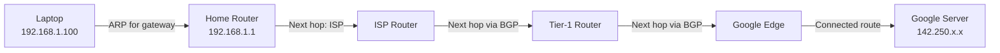

# Routing Tables & Forwarding — How Routers Make Decisions

> Every packet you send traverses multiple routers. At each router, a decision is made in microseconds: "Which port do I send this out of?" This chapter explains exactly how that decision works.

---

## Table of Contents

1. [Routing vs Forwarding](#routing-vs-forwarding)
2. [The Routing Table](#the-routing-table)
3. [Longest Prefix Match](#longest-prefix-match)
4. [Connected, Static, and Dynamic Routes](#connected-static-and-dynamic-routes)
5. [Default Route](#default-route)
6. [Equal-Cost Multi-Path (ECMP)](#equal-cost-multi-path)
7. [Linux: The Routing Table](#linux-the-routing-table)
8. [How a Packet Traverses the Network](#how-a-packet-traverses-the-network)

---

## Routing vs Forwarding

These terms are often used interchangeably, but they're different:

| | Routing | Forwarding |
|---|---------|-----------|
| **What** | Building the routing table (the map) | Using the table to send a packet (following the map) |
| **When** | Periodically, or when topology changes | For EVERY packet |
| **Speed** | Slow (seconds to minutes) | Fast (microseconds, hardware-accelerated) |
| **Plane** | Control plane | Data plane |
| **Done by** | Routing protocols (OSPF, BGP) or admin (static) | Forwarding engine (ASIC hardware) |

**Analogy**: Routing is like updating Google Maps with new roads and traffic data. Forwarding is like following the turn-by-turn directions for a specific trip.

---

## The Routing Table

Every router (and every host) maintains a routing table — a set of rules that say:

> "To reach network X, send the packet to next-hop Y via interface Z"

### Structure of a routing table entry

| Field | Meaning |
|-------|---------|
| **Destination prefix** | The network being matched (e.g., 10.0.0.0/24) |
| **Next hop** | IP address of the next router to send to |
| **Interface** | Which local interface to send the packet out |
| **Metric / Cost** | How "expensive" this route is (lower = preferred) |
| **Protocol** | How this route was learned (connected, static, OSPF, BGP) |

### Example routing table

```
Destination       Next Hop        Interface   Metric  Protocol
─────────────────────────────────────────────────────────────
10.0.1.0/24       -               eth0        0       connected
10.0.2.0/24       -               eth1        0       connected
172.16.0.0/16     10.0.1.1        eth0        10      OSPF
192.168.0.0/24    10.0.2.254      eth1        20      static
0.0.0.0/0         10.0.1.1        eth0        100     static (default)
```

When a packet arrives for 172.16.5.10:
1. Check 10.0.1.0/24 → 172.16.5.10 AND 255.255.255.0 = 172.16.5.0 ≠ 10.0.1.0 → No match
2. Check 10.0.2.0/24 → No match
3. Check 172.16.0.0/16 → 172.16.5.10 AND 255.255.0.0 = 172.16.0.0 → **Match!**
4. Send to next hop 10.0.1.1 via eth0

---

## Longest Prefix Match

When multiple routes match a destination, the router uses the **most specific** (longest prefix) match.

**Example**: Routing table contains:
```
10.0.0.0/8        → Next hop A
10.0.0.0/16       → Next hop B
10.0.0.0/24       → Next hop C
0.0.0.0/0         → Next hop D (default)
```

Packet to 10.0.0.50:
- 10.0.0.0/8 matches ✓ (8 bits match)
- 10.0.0.0/16 matches ✓ (16 bits match)
- 10.0.0.0/24 matches ✓ (24 bits match) ← **LONGEST PREFIX → Winner**
- 0.0.0.0/0 matches ✓ (0 bits match — matches everything)

**Result**: Send to Next hop C

Packet to 10.0.5.50:
- 10.0.0.0/8 matches ✓
- 10.0.0.0/16 matches ✓ ← **LONGEST PREFIX → Winner**
- 10.0.0.0/24 does NOT match (10.0.5 ≠ 10.0.0)
- 0.0.0.0/0 matches ✓

**Result**: Send to Next hop B

### Why longest prefix match matters

It enables **hierarchical routing with exceptions**. You can say:
- "Everything in 10.0.0.0/8 goes to router A" (general case)
- "Except 10.0.5.0/24, which goes to router B" (specific override)

This is exactly how the internet works. ISPs have routes for large blocks (/8s, /16s). More specific routes override them for particular networks.

### Performance: how routers do fast lookups

Routers don't scan the table linearly. They use specialized data structures:
- **Tries (prefix trees)**: O(W) lookup where W = address width (32 for IPv4)
- **TCAM (Ternary Content Addressable Memory)**: Hardware that matches all entries in parallel in one clock cycle. Expensive but used in high-end routers.

---

## Connected, Static, and Dynamic Routes

### Connected routes

When you assign an IP address to a router interface, a "connected" route is automatically created:

```bash
# Assign IP to interface
sudo ip addr add 10.0.1.1/24 dev eth0
# Now the routing table automatically has:
# 10.0.1.0/24 dev eth0 proto kernel scope link src 10.0.1.1
```

Connected routes tell the router: "I can reach this network directly — no next hop needed." The router ARPs for the destination directly.

### Static routes

Manually configured by the administrator. Simple but doesn't adapt to changes.

```bash
# Add a static route
sudo ip route add 172.16.0.0/16 via 10.0.1.254 dev eth0

# Add a static default route
sudo ip route add default via 10.0.1.1
```

**When to use**: Small networks, default routes, specific overrides.

**When NOT to use**: Large networks where links go up and down — you'd have to manually update every router every time a link changes.

### Dynamic routes

Learned from routing protocols (OSPF, BGP, etc.). Routers discover the network topology and compute optimal paths automatically.

**When to use**: Any network with redundant paths or frequent changes.

We cover OSPF and BGP in detail in the next files.

### Administrative distance (route preference)

When the same destination is learned from multiple sources, which one wins?

| Source | Admin Distance (Cisco) | Linux metric equivalent |
|--------|----------------------|----------------------|
| Connected | 0 | 0 |
| Static | 1 | 100 (default) |
| OSPF | 110 | varies |
| BGP (eBGP) | 20 | varies |
| BGP (iBGP) | 200 | varies |

Lower administrative distance = more trusted. A connected route always wins over a static route, which wins over OSPF.

---

## Default Route

The default route is the "route of last resort" — if no other route matches, use this one.

```
0.0.0.0/0 via 10.0.1.1
```

0.0.0.0/0 means "all destinations" (0 bits of prefix = matches everything). But because of longest prefix match, any more specific route takes precedence.

### Every host has a default route

On your laptop:
```bash
ip route show default
# default via 192.168.1.1 dev wlan0 proto dhcp
```

This says: "For any destination not on my local network, send to 192.168.1.1 (my router)."

Your home router has its own default route pointing to the ISP. The ISP has default routes (or knows the full routing table). The chain continues until the packet reaches a router that knows the specific route.

**Only the largest tier-1 ISPs have NO default route** — they have the complete global routing table (~1 million entries).

---

## Equal-Cost Multi-Path (ECMP)

When two routes to the same destination have the same cost, ECMP distributes traffic across both paths:

```
10.0.0.0/24 via 192.168.1.1 dev eth0  metric 100
10.0.0.0/24 via 192.168.2.1 dev eth1  metric 100
```

Both routes have metric 100, so traffic is split between them.

### How ECMP distributes traffic

**Not round-robin** (that would cause packet reordering within flows). Instead, a hash of the packet's flow identifier (typically source IP + destination IP + protocol + source port + destination port) determines which path to use. All packets in the same flow take the same path.

```bash
# Add ECMP routes on Linux
sudo ip route add 10.0.0.0/24 \
  nexthop via 192.168.1.1 weight 1 \
  nexthop via 192.168.2.1 weight 1

# See multipath routes
ip route show 10.0.0.0/24
```

---

## Linux: The Routing Table

### Viewing the routing table

```bash
# Modern way (recommended)
ip route show
# 10.0.1.0/24 dev eth0 proto kernel scope link src 10.0.1.1
# default via 10.0.1.254 dev eth0 proto static metric 100

# Older way
route -n
# or
netstat -rn

# More detailed
ip route show table all
# Shows all routing tables (main, local, default, custom)
```

### Understanding ip route output

```
10.0.1.0/24 dev eth0 proto kernel scope link src 10.0.1.1 metric 100
├─ 10.0.1.0/24     destination network
├─ dev eth0         output interface
├─ proto kernel     how the route was added (kernel = connected)
├─ scope link       route is link-local (directly connected)
├─ src 10.0.1.1     preferred source IP for packets using this route
└─ metric 100       cost (lower = preferred)
```

### Manipulating routes

```bash
# Add a route
sudo ip route add 172.16.0.0/12 via 10.0.1.254

# Delete a route
sudo ip route del 172.16.0.0/12

# Replace a route (add or update)
sudo ip route replace 172.16.0.0/12 via 10.0.1.253

# Change the default route
sudo ip route replace default via 10.0.1.1

# Add a blackhole route (silently drop matching packets)
sudo ip route add blackhole 192.168.99.0/24

# Add an unreachable route (drop and send ICMP unreachable)
sudo ip route add unreachable 192.168.99.0/24
```

### Route lookup: testing which route a packet would take

```bash
# Which route matches this destination?
ip route get 8.8.8.8
# 8.8.8.8 via 192.168.1.1 dev eth0 src 192.168.1.100 uid 1000

ip route get 10.0.1.50
# 10.0.1.50 dev eth0 src 10.0.1.1 uid 1000
# Note: no "via" — it's directly connected
```

### Enabling IP forwarding (make Linux a router)

By default, Linux discards packets not addressed to it. To make it forward packets (act as a router):

```bash
# Check current setting
sysctl net.ipv4.ip_forward
# 0 = disabled (host mode)
# 1 = enabled (router mode)

# Enable (temporary)
sudo sysctl -w net.ipv4.ip_forward=1

# Enable (persistent)
echo "net.ipv4.ip_forward = 1" | sudo tee -a /etc/sysctl.d/99-router.conf
sudo sysctl -p /etc/sysctl.d/99-router.conf
```

---

## How a Packet Traverses the Network

Let's trace a packet from your laptop to google.com:



**At each hop, two things happen**:
1. **IP header update**: TTL decremented, header checksum recomputed
2. **New Ethernet frame**: The old frame is stripped, a new one is built with MAC addresses for the next hop

```
Hop 1: Laptop → Home Router
  Ethernet: [Laptop MAC → Router MAC]
  IP: [192.168.1.100 → 142.250.x.x, TTL=64]

Hop 2: Home Router → ISP  
  Ethernet: [Router WAN MAC → ISP MAC]
  IP: [NAT'd public IP → 142.250.x.x, TTL=63]

Hop 3: ISP → Tier-1
  Ethernet: [ISP MAC → Tier-1 MAC]
  IP: [public IP → 142.250.x.x, TTL=62]

...and so on until destination.
```

**Layer 2 addresses change at every hop. Layer 3 addresses stay the same** (except at NAT boundaries).

---

## Key Takeaways

1. **Routing = building the map** (control plane). **Forwarding = following directions** (data plane).
2. **Longest prefix match** selects the most specific route — enables hierarchical routing
3. **Connected routes** are automatic. **Static routes** are manual. **Dynamic routes** adapt.
4. **The default route (0.0.0.0/0)** is the fallback when no specific route matches
5. **ECMP** distributes traffic across equal-cost paths based on flow hashing
6. **Linux `ip route`** is your primary tool for viewing and manipulating routes
7. **MAC addresses change at every hop; IP addresses stay the same** (the core insight of layered networking)

---

## Next

→ [02-static-dynamic-routing.md](02-static-dynamic-routing.md) — Static routes vs routing protocols
