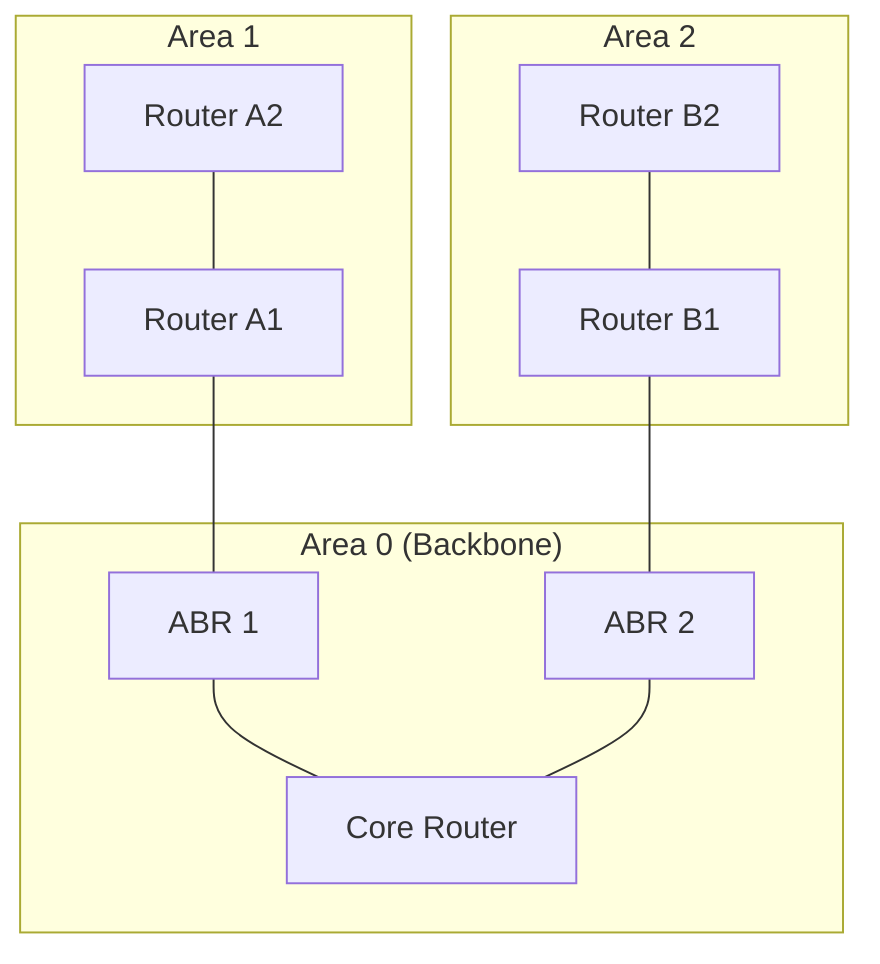

# OSPF — Interior Gateway Routing

> OSPF is the most widely deployed interior gateway protocol. If you work in an enterprise network, you'll encounter it. This chapter covers the concepts — you don't need to configure Cisco routers, but you need to understand what OSPF does and why.

---

## Table of Contents

1. [What Problem OSPF Solves](#what-problem-ospf-solves)
2. [OSPF Fundamentals](#ospf-fundamentals)
3. [How OSPF Works: Step by Step](#how-ospf-works-step-by-step)
4. [Areas and Hierarchy](#areas-and-hierarchy)
5. [OSPF Cost Calculation](#ospf-cost-calculation)
6. [DR and BDR Election](#dr-and-bdr-election)
7. [Convergence](#convergence)
8. [OSPF on Linux (FRRouting)](#ospf-on-linux)

---

## What Problem OSPF Solves

OSPF (Open Shortest Path First) is an **Interior Gateway Protocol (IGP)** — it routes traffic WITHIN a single organization (a single **Autonomous System**, or AS).

**Interior vs Exterior**:
- **IGP** (OSPF, IS-IS): Routing within your organization
- **EGP** (BGP): Routing between organizations (ISPs talk to each other)

OSPF answers the question: "Given all the routers and links inside my network, what's the shortest path from A to B?"

---

## OSPF Fundamentals

### Link-State Protocol

OSPF is a link-state protocol (covered in the previous file). Each router:
1. Discovers neighbors
2. Announces its links (Link State Advertisements / LSAs)
3. Floods LSAs to all routers
4. Builds a complete topology map (LSDB)
5. Runs Dijkstra's shortest path algorithm

### Key OSPF concepts

| Concept | Meaning |
|---------|---------|
| **Router ID** | Unique identifier for each router (usually an IP address) |
| **Area** | A logical grouping of routers (for scalability) |
| **LSA** | Link State Advertisement — a router's announcement of its links |
| **LSDB** | Link State Database — the complete topology map |
| **SPF** | Shortest Path First (Dijkstra's algorithm) |
| **Hello protocol** | How routers discover and maintain neighbor relationships |
| **DR/BDR** | Designated Router / Backup DR — reduces flooding on multi-access networks |

---

## How OSPF Works: Step by Step

### Step 1: Neighbor Discovery (Hello Protocol)

OSPF routers send Hello packets on all OSPF-enabled interfaces (multicast to 224.0.0.5).

Hello packets contain:
- Router ID
- Area ID
- Hello interval (default: 10 seconds)
- Dead interval (default: 40 seconds — 4× hello)
- Network mask
- Known neighbors

**Two routers become neighbors** when they see each other's Router ID in Hello packets AND:
- Same area ID
- Same subnet mask
- Same hello/dead intervals
- Same authentication

### Step 2: Database Exchange

Once neighbors are established, they exchange their LSDBs:
1. **ExStart**: Determine master/slave (higher Router ID is master)
2. **Exchange**: Trade Database Description (DBD) packets — summaries of what each router has
3. **Loading**: Request any LSAs the neighbor has that you're missing
4. **Full**: LSDBs are synchronized

### Step 3: LSA Flooding

When a router detects a topology change (link up, link down, cost change):
1. Creates a new LSA
2. Floods it to all OSPF routers in the area
3. Each receiving router updates its LSDB
4. Each router reruns Dijkstra

### Step 4: SPF Computation

Each router independently runs Dijkstra's algorithm:
- Input: The LSDB (complete topology)
- Output: A shortest-path tree with the router as root
- Result: Best next-hop and cost for every destination

The results are installed in the routing table as OSPF routes.

---

## Areas and Hierarchy

### Why areas?

If every router in a large network floods LSAs to every other router, the flooding and Dijkstra computation become expensive. Areas limit the scope:

- **Area 0 (backbone)**: The central area that all other areas must connect to
- **Non-zero areas**: Connected to Area 0 via ABRs (Area Border Routers)



### Benefits of areas

1. **LSA flooding is contained** within each area (except summary LSAs at boundaries)
2. **Smaller LSDB** per router (only your area's topology, plus summaries from others)
3. **Faster SPF computation** (fewer nodes in the topology)
4. **Topology changes in Area 1 don't trigger SPF recalculation in Area 2**

### ABR (Area Border Router)

An ABR connects two or more areas (always including Area 0). It:
- Has separate LSDBs for each area
- Summarizes routes between areas (inter-area routes)
- Translates detailed topology into prefix summaries

---

## OSPF Cost Calculation

OSPF's metric is **cost**, calculated as:

$$\text{Cost} = \frac{\text{Reference Bandwidth}}{\text{Link Bandwidth}}$$

Default reference bandwidth: 100 Mbps

| Link Speed | Cost |
|-----------|------|
| 10 Mbps | 10 |
| 100 Mbps | 1 |
| 1 Gbps | 1 (!) |
| 10 Gbps | 1 (!) |

**Problem**: With the default reference bandwidth, all links ≥ 100 Mbps have cost 1. A 1 Gbps link looks the same as a 100 Mbps link. Modern networks should set the reference bandwidth higher (e.g., 10 Gbps or 100 Gbps).

The total cost to a destination is the sum of all link costs along the path. Dijkstra finds the path with the lowest total cost.

---

## DR and BDR Election

On a multi-access network (like Ethernet), if there are 10 OSPF routers, each would form adjacency with all 9 others = 45 adjacencies. That's a lot of LSA exchanges.

### Solution: Designated Router

OSPF elects a **DR (Designated Router)** and a **BDR (Backup Designated Router)** on each multi-access segment:

- All routers form adjacency with the DR and BDR only (not with each other)
- LSAs are sent to the DR, which then floods to everyone
- This reduces adjacencies from $n(n-1)/2$ to $2(n-1)$

**Election criteria** (in order):
1. Highest OSPF priority (configurable, default 1)
2. Highest Router ID (tiebreaker)
3. Priority 0 = never become DR

The DR election is **non-preemptive** — a new router with higher priority doesn't take over as DR. The existing DR stays until it fails.

---

## Convergence

OSPF convergence = the time from a topology change to all routers having consistent, correct routing tables.

### Convergence timeline

1. **Failure detection**: Router detects a link down (milliseconds for physical link, up to Dead Interval for neighbor timeout)
2. **LSA generation**: New LSA created (~0 seconds)
3. **LSA flooding**: Flooded to all routers in the area (milliseconds on fast networks)
4. **SPF computation**: Each router recalculates (milliseconds to seconds depending on LSDB size)
5. **Route installation**: New routes installed in forwarding table (~0 seconds)

**Total**: Typically 1-5 seconds with BFD (Bidirectional Forwarding Detection), 40+ seconds without it (waiting for dead interval).

**BFD** is a lightweight protocol that detects neighbor failures in milliseconds. It's essential for fast OSPF convergence.

---

## OSPF on Linux

Linux can run OSPF using **FRRouting** (FRR), the successor to Quagga:

```bash
# Install FRRouting
sudo apt install frr

# Enable OSPF
sudo sed -i 's/ospfd=no/ospfd=yes/' /etc/frr/daemons
sudo systemctl restart frr

# Configure OSPF (via vtysh — Cisco-like shell)
sudo vtysh
configure terminal
router ospf
  network 10.0.1.0/24 area 0
  network 10.0.2.0/24 area 0
exit
exit
write memory

# Verify
sudo vtysh -c "show ip ospf neighbor"
sudo vtysh -c "show ip ospf database"
sudo vtysh -c "show ip route ospf"
```

Even if you never configure OSPF, knowing these concepts helps you:
- Understand enterprise network designs
- Debug routing issues ("why is traffic taking this path?")
- Design cloud VPC architectures (same concepts, different tools)

---

## Key Takeaways

1. **OSPF is a link-state IGP** — each router has the complete topology and runs Dijkstra
2. **Hello protocol discovers neighbors** — hello/dead intervals must match
3. **Areas provide scalability** — Area 0 is the backbone, all areas connect to it
4. **Cost is the metric** — based on bandwidth, lower is better
5. **DR/BDR reduce flooding** on multi-access networks
6. **Convergence is fast** with BFD (sub-second) or slow without it (40+ seconds)

---

## Next

→ [04-bgp-conceptual.md](04-bgp-conceptual.md) — How the internet routes between organizations
