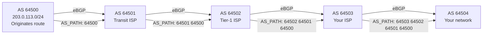

# BGP — The Routing Protocol of the Internet

> BGP is the protocol that makes the internet work. It connects the ~80,000 autonomous systems that make up the internet. Misconfigurations in BGP have caused global outages (Facebook 2021, YouTube 2008, Pakistan 2008). Understanding BGP is understanding the internet's control plane.

---

## Table of Contents

1. [What BGP Is and Why It Exists](#what-bgp-is)
2. [Autonomous Systems](#autonomous-systems)
3. [eBGP vs iBGP](#ebgp-vs-ibgp)
4. [How BGP Works](#how-bgp-works)
5. [BGP Path Selection](#bgp-path-selection)
6. [BGP and Internet Routing](#bgp-and-internet-routing)
7. [BGP Failures That Broke the Internet](#bgp-failures)
8. [BGP in Data Centers](#bgp-in-data-centers)

---

## What BGP Is

BGP (Border Gateway Protocol, version 4) is an **Exterior Gateway Protocol (EGP)** — it routes between different organizations (Autonomous Systems).

OSPF answers: "What's the best path within my network?"  
BGP answers: "What's the best path across the internet to reach another organization's network?"

### Why BGP is different from OSPF

| Property | OSPF | BGP |
|----------|------|-----|
| Scope | Within one organization | Between organizations |
| Goal | Shortest path | Policy-based routing |
| Trust | All routers are trusted (your network) | Neighbors may have conflicting interests |
| Scale | Hundreds of routers | Millions of routes |
| Metric | Bandwidth-based cost | AS path length + policies |
| Update method | Link-state flooding | Path-vector updates |

BGP is NOT about finding the shortest path. It's about **policy** — you choose routes based on business relationships, cost, performance, and legal requirements.

---

## Autonomous Systems

An **Autonomous System (AS)** is a collection of IP networks under a single administrative entity with a common routing policy. Each AS has a unique **ASN (Autonomous System Number)**.

Examples:
| ASN | Organization |
|-----|-------------|
| AS15169 | Google |
| AS32934 | Facebook/Meta |
| AS16509 | Amazon (AWS) |
| AS8075 | Microsoft |
| AS13335 | Cloudflare |
| AS7922 | Comcast |

```bash
# Look up what AS an IP belongs to
whois -h whois.radb.net 8.8.8.8
# Shows: origin: AS15169 (Google)

# Or use dig
dig +short 8.8.8.8.origin.asn.cymru.com TXT
# "15169 | 8.8.8.0/24 | US | arin | 2023-12-25"
```

### Relationships between ASes

| Relationship | Description | Traffic flow |
|-------------|-------------|-------------|
| **Customer-Provider** | Customer pays provider for internet access | Customer sends traffic through provider |
| **Peer-Peer** | Two networks exchange traffic for free (mutual benefit) | Each carries traffic only for their own customers |
| **Transit** | Provider carries traffic to/from the rest of the internet | Provider accepts and forwards all routes |

These relationships drive BGP route selection: traffic should flow according to business agreements.

---

## eBGP vs iBGP

| | eBGP | iBGP |
|---|------|------|
| **Between** | Different ASes | Same AS |
| **Purpose** | Exchange routes between organizations | Distribute routes within an organization |
| **TTL** | 1 (directly connected neighbors) | 255 (can be many hops apart) |
| **AS_PATH** | Prepends own ASN | Does NOT modify AS_PATH |
| **Next-hop** | Changes to neighbor's IP | Does NOT change (by default) |

### iBGP full mesh problem

All iBGP speakers within an AS must peer with every other iBGP speaker (full mesh). With $n$ routers, that's $n(n-1)/2$ sessions. For 100 routers = 4,950 sessions.

**Solutions**:
- **Route Reflectors**: A designated router that "reflects" routes to clients (reducing sessions)
- **Confederations**: Split the AS into sub-ASes internally

---

## How BGP Works

### TCP-based

Unlike OSPF (which uses its own protocol directly over IP), BGP runs over **TCP port 179**. This means BGP gets reliable, ordered delivery of messages for free from TCP.

### BGP messages

| Message | Purpose |
|---------|---------|
| **OPEN** | Establish session (exchange AS numbers, capabilities) |
| **KEEPALIVE** | Maintain session (sent every 60 seconds, dead after 180s) |
| **UPDATE** | Announce new routes or withdraw old ones |
| **NOTIFICATION** | Error reporting (session will be torn down) |

### BGP UPDATE message

An UPDATE announces reachable prefixes with attributes:

```
UPDATE:
  NLRI (Network Layer Reachability Information):
    203.0.113.0/24    ← "I can reach this prefix"
  
  Path Attributes:
    ORIGIN: IGP                     ← How the route was learned
    AS_PATH: 64500 64501 64502      ← ASes this route passed through
    NEXT_HOP: 10.0.0.1             ← Where to send packets
    LOCAL_PREF: 100                 ← Internal preference (iBGP)
    MED: 50                        ← Suggested preference to neighbors
```

### AS_PATH: the most important attribute

The AS_PATH records every AS the route has passed through:

```
Route for 203.0.113.0/24:
  AS_PATH: 64502 64501 64500

Meaning: This route originated in AS 64500,
  passed through AS 64501,
  then through AS 64502,
  and was advertised to me.
```

**Two purposes**:
1. **Loop prevention**: If a router sees its own ASN in the AS_PATH, it rejects the route
2. **Path selection**: Shorter AS_PATH is preferred (fewer organizations = generally shorter path)

---

## BGP Path Selection

When multiple routes exist for the same prefix, BGP uses a complex decision process:

### BGP best path selection (in order)

1. **Highest LOCAL_PREF** — internal policy preference (only in iBGP)
2. **Shortest AS_PATH** — fewer ASes = shorter path
3. **Lowest ORIGIN** — IGP > EGP > Incomplete
4. **Lowest MED** — "suggested" preference from the neighbor
5. **eBGP over iBGP** — prefer routes learned from external peers
6. **Lowest IGP cost to NEXT_HOP** — nearest exit (hot potato routing)
7. **Oldest route** — stability preference
8. **Lowest Router ID** — tiebreaker

**In practice**, steps 1-3 handle most decisions. Steps 4+ are tiebreakers.

### Hot potato vs cold potato routing

**Hot potato** (default): Hand off the traffic to the other AS as quickly as possible (lowest IGP cost to the exit point). Your AS carries traffic the minimum distance.

**Cold potato**: Carry the traffic through YOUR AS until you reach the exit point closest to the destination. More expensive for you, but better for the customer.

Most ISPs use hot potato routing because it minimizes their own costs.

---

## BGP and Internet Routing

### The global routing table

As of 2024:
- ~1,000,000 IPv4 prefixes
- ~200,000 IPv6 prefixes
- ~80,000 unique ASes

Every "default-free" router on the internet has the complete global routing table — about 1 million entries. These are the core routers of tier-1 ISPs.

### How a route propagates



### Prefix hijacking

Because BGP is based on trust (routers believe what their neighbors advertise), a malicious or misconfigured AS can advertise someone else's prefix:

1. Google owns 8.8.8.0/24
2. A rogue AS announces 8.8.8.0/24 as originating from itself
3. Nearby routers accept the announcement (BGP trusts its peers)
4. Traffic for 8.8.8.8 is now routed to the rogue AS instead of Google

**Or worse** — announce a more specific prefix:
1. Google announces 8.8.8.0/24
2. Attacker announces 8.8.8.0/25 (more specific)
3. Longest prefix match → attacker wins for half the addresses

**Mitigation (ongoing)**:
- **RPKI (Resource Public Key Infrastructure)**: Cryptographically validates that an AS is authorized to advertise a prefix
- **BGP route filtering**: ISPs filter customer announcements against registered prefixes
- **IRR (Internet Routing Registry)**: Database of valid routing policies

---

## BGP Failures

### Facebook outage (October 4, 2021)

1. A routine maintenance command accidentally withdrew all BGP routes for Facebook's prefixes
2. Facebook's DNS servers were inside the withdrawn prefixes
3. DNS lookups for facebook.com failed globally
4. Engineers couldn't fix it remotely because internal tools also required DNS
5. Physical access to data centers was needed to restore BGP
6. **Downtime: ~6 hours**

### YouTube/Pakistan (February 2008)

1. Pakistan Telecom was ordered to block YouTube (government censorship)
2. They announced a more specific route for YouTube's prefix (208.65.153.0/24 → 208.65.153.0/25)
3. This "more specific" BGP announcement leaked to the global internet
4. Longest prefix match → most of the world's YouTube traffic went to Pakistan Telecom → black hole
5. **YouTube down for ~2 hours globally**

### Lesson

BGP is the most critical and least secured protocol on the internet. A single misconfiguration can have global impact.

---

## BGP in Data Centers

Modern data centers use BGP (not OSPF) as the internal routing protocol:

**Why BGP inside a data center?**

1. **ECMP**: BGP supports equal-cost multipath natively, essential for leaf-spine topologies
2. **Scale**: BGP handles large numbers of routes efficiently  
3. **Policy**: Fine-grained control over traffic engineering
4. **Uniformity**: Same protocol internally and externally simplifies operations

**Leaf-spine topology**:
```
        ┌──────┐  ┌──────┐  ┌──────┐
        │Spine1│  │Spine2│  │Spine3│
        └──┬───┘  └──┬───┘  └──┬───┘
           │         │         │
     ┌─────┼─────────┼─────────┼─────┐
     │     │         │         │     │
  ┌──┴──┐  │     ┌──┴──┐      │  ┌──┴──┐
  │Leaf1│──┘     │Leaf2│      └──│Leaf3│
  └──┬──┘        └──┬──┘         └──┬──┘
     │              │                │
  Servers        Servers          Servers
```

Each leaf has eBGP sessions with every spine. Each link is an equal-cost path. Traffic from any server can reach any other server through any spine — perfect load distribution.

---

## Key Takeaways

1. **BGP routes between autonomous systems** — it's the internet's routing protocol
2. **BGP is policy-based**, not shortest-path — business relationships drive decisions
3. **AS_PATH provides loop prevention** and path length metric
4. **The global routing table has ~1 million prefixes** from ~80,000 ASes
5. **BGP trusts its peers** — this makes it vulnerable to hijacking and misconfiguration
6. **BGP failures have caused global outages** — Facebook, YouTube/Pakistan are famous examples
7. **Modern data centers use BGP internally** for leaf-spine ECMP routing

---

## Next

→ [Module 06: Transport Layer](../06-transport-layer/01-ports-multiplexing.md) — TCP and UDP — the protocols that applications actually use
