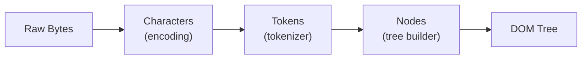
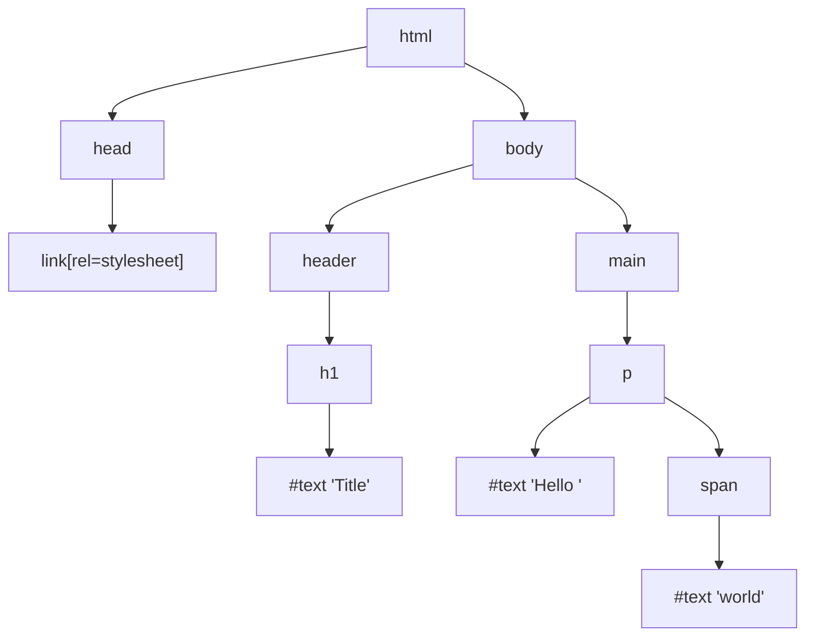

# Lesson 01 — HTML Parsing & DOM Construction

## Concept

When a browser receives HTML bytes from the network, it transforms them through several stages to build the **Document Object Model (DOM)** — a tree of nodes that represents the document structure.



### The Stages

1. **Bytes → Characters**: The browser reads raw bytes and converts them to characters using the specified encoding (UTF-8, etc.)
2. **Characters → Tokens**: The HTML tokenizer breaks characters into tokens: start tags, end tags, attribute names/values, text content
3. **Tokens → Nodes**: Tokens are converted into Node objects with properties
4. **Nodes → DOM Tree**: Nodes are linked into a tree based on nesting relationships

### Why This Matters for CSS

The DOM tree is **one half** of what the browser needs to render your page. CSS declarations are matched against DOM nodes. Understanding the DOM structure helps you understand:
- How selectors are matched
- Why descendant selectors can be expensive
- How the render tree differs from the DOM

## Diagram: DOM Tree from HTML

Given this HTML:

```html
<html>
  <head>
    <link rel="stylesheet" href="styles.css">
  </head>
  <body>
    <header>
      <h1>Title</h1>
    </header>
    <main>
      <p>Hello <span>world</span></p>
    </main>
  </body>
</html>
```

The DOM tree looks like:



**Key insight**: Text content is its own node. The DOM tree contains **element nodes**, **text nodes**, **comment nodes**, and more. CSS selectors only match element nodes, but text nodes participate in layout.

## Experiment 01: Observing DOM Construction

Create this file and open it in Chrome:

```html
<!-- 01-dom-observation.html -->
<!DOCTYPE html>
<html lang="en">
<head>
  <meta charset="UTF-8">
  <title>DOM Observation</title>
</head>
<body>
  <div id="container">
    <p class="intro">This is a paragraph with <strong>bold</strong> text.</p>
    <p class="intro">Another paragraph with <em>emphasis</em>.</p>
    <!-- This comment node is NOT rendered -->
    <ul>
      <li>Item 1</li>
      <li>Item 2</li>
    </ul>
  </div>

  <script>
    // Count the nodes
    const container = document.getElementById('container');
    console.log('Child nodes (includes text):', container.childNodes.length);
    console.log('Child elements (elements only):', container.children.length);
    
    // Walk the tree
    function walkDOM(node, depth = 0) {
      const indent = '  '.repeat(depth);
      const type = node.nodeType === 1 ? 'ELEMENT' : 
                   node.nodeType === 3 ? 'TEXT' : 
                   node.nodeType === 8 ? 'COMMENT' : 'OTHER';
      const name = node.nodeName;
      const value = node.nodeType === 3 ? ` "${node.textContent.trim()}"` : '';
      if (node.nodeType !== 3 || node.textContent.trim()) {
        console.log(`${indent}${type}: ${name}${value}`);
      }
      node.childNodes.forEach(child => walkDOM(child, depth + 1));
    }
    walkDOM(container);
  </script>
</body>
</html>
```

### What to Observe

1. Open Chrome DevTools → Console
2. Note how `childNodes.length` is larger than `children.length` — this is because whitespace between elements creates text nodes
3. The comment node exists in the DOM but will not participate in rendering
4. Every piece of text is its own node

### DevTools Exercise

1. Open the **Elements** panel
2. Expand the `#container` node
3. Notice how DevTools shows text nodes inline but hides whitespace-only text nodes
4. Right-click a node → "Break on" → "subtree modifications" to watch the DOM change

## Experiment 02: Incremental Parsing

HTML parsing is **incremental** — the browser doesn't wait for the entire HTML file before it starts building the DOM. It parses and builds as bytes arrive.

```html
<!-- 02-incremental-parsing.html -->
<!DOCTYPE html>
<html lang="en">
<head>
  <meta charset="UTF-8">
  <title>Incremental Parsing</title>
</head>
<body>
  <h1>I appear first</h1>
  
  <!-- This script blocks parsing while it runs -->
  <script>
    console.log('Script 1: h1 exists?', !!document.querySelector('h1')); // true
    console.log('Script 1: h2 exists?', !!document.querySelector('h2')); // false — not parsed yet!
  </script>
  
  <h2>I appear second</h2>
  
  <script>
    console.log('Script 2: h2 exists?', !!document.querySelector('h2')); // true — now it's parsed
  </script>
</body>
</html>
```

### Key Insight

When the parser encounters a `<script>` tag, it **pauses** HTML parsing to execute the script. This is why:
- Scripts can only see DOM nodes that have been parsed **before** them
- Parser-blocking scripts delay DOM construction
- `defer` and `async` attributes change this behavior

This directly impacts CSS because:
- CSS must be parsed before scripts execute (to ensure `getComputedStyle()` works)
- This creates the "render-blocking" behavior we'll explore in Lesson 07

## Edge Case: Error Recovery

HTML parsers are incredibly forgiving. The following is technically invalid HTML, but the browser builds a reasonable DOM anyway:

```html
<!-- 03-error-recovery.html -->
<!DOCTYPE html>
<html lang="en">
<head><title>Error Recovery</title></head>
<body>
  <!-- Missing closing tags -->
  <p>Paragraph one
  <p>Paragraph two
  
  <!-- Misnested tags -->
  <b><i>Bold and italic</b> just italic?</i>
  
  <!-- Table content outside table -->
  <tr><td>In a table row without a table</td></tr>
  
  <script>
    // See what the browser actually built
    console.log(document.body.innerHTML);
  </script>
</body>
</html>
```

### What to Observe

Open DevTools Elements panel and see how the browser "fixed" the HTML:
- Each `<p>` was auto-closed before the next `<p>`
- The misnested `<b>` and `<i>` were resolved by the adoption agency algorithm
- The `<tr>` was wrapped in an implicit `<table>` and `<tbody>`

**Why this matters for CSS**: Your selectors target the **actual DOM**, not your source HTML. If the browser's error recovery changes the structure, your CSS selectors may not match what you expect.

## Production Scenario

In a real application, you might have:
- Server-side rendered HTML that arrives in chunks
- Third-party scripts injecting nodes
- Framework hydration modifying the DOM

Understanding that the DOM is built incrementally — and that CSS/scripts can block this process — helps you diagnose why content might flash, shift, or appear unstyled.

## Summary

| Concept | Key Point |
|---|---|
| DOM Construction | HTML bytes → characters → tokens → nodes → tree |
| Text Nodes | Text content creates its own nodes in the DOM |
| Incremental Parsing | Browser builds DOM as HTML arrives, doesn't wait for completion |
| Script Blocking | `<script>` pauses HTML parsing |
| Error Recovery | Browsers fix invalid HTML — the DOM may differ from your source |

## Next

→ [Lesson 02: CSS Parsing & CSSOM](02-css-parsing.md) — How CSS is tokenized, parsed, and turned into a CSSOM tree
