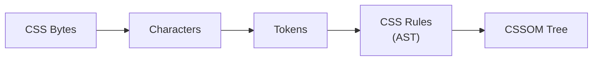
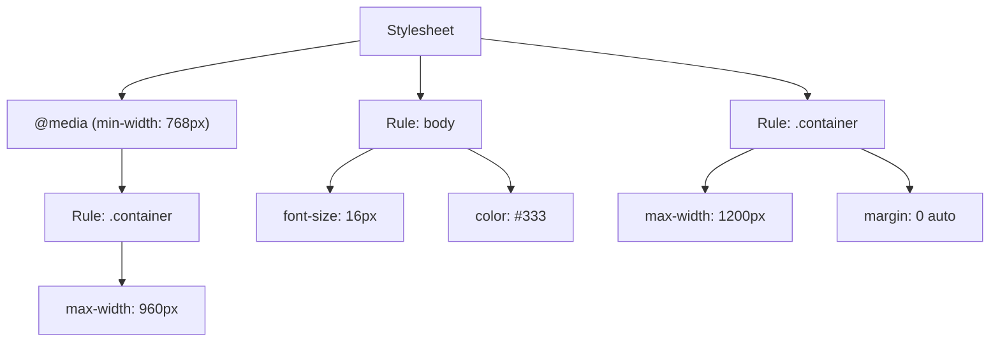
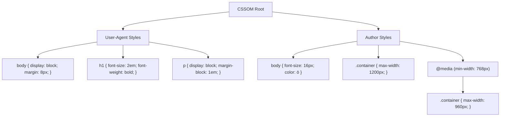

# Lesson 02 — CSS Parsing & CSSOM Construction

## Concept

Just as HTML is parsed into a DOM tree, CSS is parsed into a **CSS Object Model (CSSOM)** tree. The CSSOM represents all the CSS rules that apply to the document, organized hierarchically.



### CSS Tokenization

The CSS tokenizer breaks the character stream into tokens:

| Token Type | Examples |
|---|---|
| Ident | `color`, `div`, `flex` |
| Hash | `#header`, `#ff0000` |
| String | `"Helvetica"`, `'sans-serif'` |
| Number | `16`, `1.5`, `-3` |
| Dimension | `16px`, `2em`, `100%` |
| Function | `rgb(`, `calc(`, `var(` |
| Delim | `.`, `>`, `+`, `~` |
| Colon | `:` |
| Semicolon | `;` |
| Curly brackets | `{`, `}` |
| At-keyword | `@media`, `@import`, `@layer` |

### From Tokens to Rules

Tokens are assembled into a tree of rules:



### CSSOM Tree Structure

The CSSOM is a tree because CSS rules inherit and cascade. The browser resolves the CSSOM into a tree where each node represents a style rule with its computed values:



## Experiment 01: Inspecting Parsed CSS

```html
<!-- 01-cssom-inspection.html -->
<!DOCTYPE html>
<html lang="en">
<head>
  <meta charset="UTF-8">
  <title>CSSOM Inspection</title>
  <style id="main-styles">
    body {
      font-family: system-ui, sans-serif;
      font-size: 16px;
      color: #333;
      line-height: 1.6;
    }
    
    .box {
      width: 200px;
      height: 200px;
      background: cornflowerblue;
      padding: 20px;
      margin: 10px;
    }
    
    .box.special {
      background: coral;
      border: 2px solid darkred;
    }
    
    @media (min-width: 600px) {
      .box { width: 300px; }
    }
  </style>
</head>
<body>
  <div class="box">Regular box</div>
  <div class="box special">Special box</div>

  <script>
    // Access the CSSOM programmatically
    const sheet = document.getElementById('main-styles').sheet;
    
    console.log('=== CSSOM Rules ===');
    for (const rule of sheet.cssRules) {
      if (rule instanceof CSSStyleRule) {
        console.log(`Selector: "${rule.selectorText}"`);
        console.log(`  Declarations: ${rule.style.cssText}`);
      } else if (rule instanceof CSSMediaRule) {
        console.log(`@media ${rule.conditionText}`);
        for (const innerRule of rule.cssRules) {
          console.log(`  Selector: "${innerRule.selectorText}"`);
          console.log(`    Declarations: ${innerRule.style.cssText}`);
        }
      }
    }
    
    // Compare declared vs computed
    const box = document.querySelector('.box');
    const computed = getComputedStyle(box);
    console.log('\n=== Declared vs Computed ===');
    console.log('Declared width: 200px (or 300px in @media)');
    console.log('Computed width:', computed.width);
    console.log('Declared color: #333');
    console.log('Computed color:', computed.color); // rgb() form!
    console.log('Declared font-size: 16px (on body)');
    console.log('Computed font-size:', computed.fontSize); // inherited!
  </script>
</body>
</html>
```

### What to Observe

1. The CSSOM API (`sheet.cssRules`) gives you structured access to parsed CSS
2. **Computed values differ from declared values**: `#333` becomes `rgb(51, 51, 51)`, relative units become pixels
3. Inherited properties (`font-size`, `color`) show up on the `.box` element even though they were declared on `body`
4. Media queries are nested structures in the CSSOM

## Experiment 02: CSS Error Handling

Unlike HTML, CSS parsing is **strict about syntax but forgiving about unknown properties**. The browser ignores what it doesn't understand, rather than failing.

```html
<!-- 02-css-error-handling.html -->
<!DOCTYPE html>
<html lang="en">
<head>
  <meta charset="UTF-8">
  <title>CSS Error Handling</title>
  <style>
    .box {
      width: 200px;
      height: 200px;
      margin: 20px;
      
      /* Valid */
      background: cornflowerblue;
      
      /* Invalid property — silently ignored */
      made-up-property: 42px;
      
      /* Invalid value — silently ignored */
      color: notacolor;
      
      /* Valid fallback pattern */
      color: red;
      color: oklch(0.7 0.15 200); /* Newer syntax, used if supported */
      
      /* Malformed declaration — ignored, but parsing continues */
      border; /* Missing colon and value */
      
      /* This is still applied despite the error above */
      border-radius: 8px;
    }
    
    /* Invalid selector — entire rule block is dropped */
    .box:unsupported-pseudo {
      background: red;
      font-size: 24px; /* This is also lost! */
    }
    
    /* Valid rule after invalid one — still works */
    .status {
      padding: 10px;
      background: lightgreen;
      font-family: monospace;
    }
  </style>
</head>
<body>
  <div class="box">I should be blue with rounded corners</div>
  <div class="status">
    If you can see this green box, CSS parsing recovered from the errors above.
  </div>

  <script>
    const box = document.querySelector('.box');
    const cs = getComputedStyle(box);
    console.log('background:', cs.backgroundColor); // cornflowerblue
    console.log('color:', cs.color);                  // red or oklch value
    console.log('border-radius:', cs.borderRadius);   // 8px — survived the error
    console.log('made-up-property:', cs.getPropertyValue('made-up-property')); // empty
  </script>
</body>
</html>
```

### Key Insight: Forward Compatibility Through Error Handling

CSS's error handling strategy is **by design**. It enables progressive enhancement:

1. **Unknown properties are ignored** → You can use new properties, old browsers skip them
2. **Unknown values are ignored** → You can provide fallbacks by declaring the same property twice
3. **Invalid selectors drop the entire rule** → Be careful with new selectors in non-grouped rules
4. **Parsing always continues** → One error doesn't break the rest of the stylesheet

This is fundamentally different from JavaScript, where a syntax error stops execution.

## Experiment 03: Multiple Stylesheet Sources

Browsers combine CSS from multiple sources into a single CSSOM:

```html
<!-- 03-multiple-sources.html -->
<!DOCTYPE html>
<html lang="en">
<head>
  <meta charset="UTF-8">
  <title>CSS Sources</title>
  
  <!-- Source 1: External stylesheet (simulated inline for experiment) -->
  <style id="framework">
    /* Simulating a CSS framework */
    .btn {
      display: inline-block;
      padding: 8px 16px;
      border: 1px solid #ccc;
      border-radius: 4px;
      background: #f0f0f0;
      color: #333;
      font-size: 14px;
      cursor: pointer;
    }
  </style>
  
  <!-- Source 2: Application styles -->
  <style id="app">
    .btn {
      background: cornflowerblue;
      color: white;
      border-color: royalblue;
    }
  </style>
</head>
<body>
  <!-- Source 3: Inline styles -->
  <button class="btn" style="font-size: 18px;">Click Me</button>
  
  <script>
    const btn = document.querySelector('.btn');
    const cs = getComputedStyle(btn);
    
    console.log('=== Final Computed Values (all sources merged) ===');
    console.log('display:', cs.display);       // inline-block (from framework)
    console.log('padding:', cs.padding);       // 8px 16px (from framework)
    console.log('background:', cs.backgroundColor); // cornflowerblue (app overrides framework)
    console.log('color:', cs.color);           // white (app overrides framework)
    console.log('font-size:', cs.fontSize);    // 18px (inline overrides both)
    console.log('border-radius:', cs.borderRadius); // 4px (from framework, not overridden)
  </script>
</body>
</html>
```

### DevTools Exercise

1. Open DevTools → Elements → select the button
2. Look at the **Styles** panel (right side)
3. Notice the **cascade order**: inline styles at top, then app styles, then framework styles
4. Crossed-out declarations are overridden
5. The **Computed** tab shows the final resolved values with a trace back to which rule won

## CSS Parsing: What the Spec Says

The CSS specification defines parsing in terms of a **tokenizer** and **parser** working together:

1. **Tokenizer** (CSS Syntax Module Level 3): Converts characters to tokens
2. **Parser**: Consumes tokens to produce:
   - **Stylesheet** (top level)
   - **Rule lists** (qualified rules + at-rules)
   - **Declaration lists** (property: value pairs)

The parser uses a **greedy** algorithm and specific error recovery rules defined in the spec. This is why CSS never "crashes" even with malformed input.

## Summary

| Concept | Key Point |
|---|---|
| CSSOM | CSS is parsed into a tree structure (CSSOM), not a flat list |
| Tokenization | CSS characters → tokens → rules → CSSOM tree |
| Error Recovery | Unknown properties/values are silently ignored; parsing continues |
| Progressive Enhancement | CSS error handling enables safe use of new features |
| Multiple Sources | User-agent, author, and user styles are all combined into one CSSOM |
| Computed Values | Declared values are transformed (relative → absolute, colors → rgb) |

## Next

→ [Lesson 03: The Render Tree](03-render-tree.md) — How DOM + CSSOM merge into the render tree
