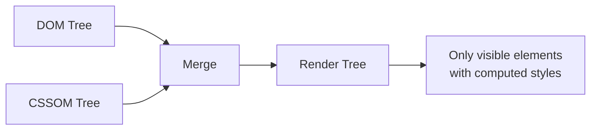
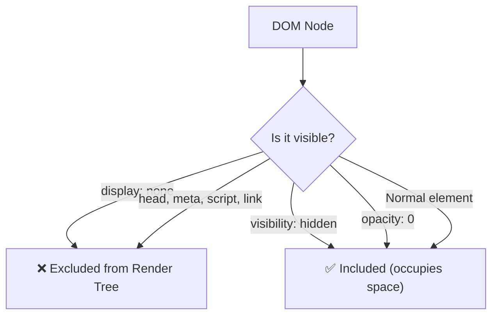

# Lesson 03 — The Render Tree

## Concept

The browser has two trees: the **DOM** (document structure) and the **CSSOM** (style information). To actually render the page, the browser merges them into a **Render Tree** — a tree of only the visible, styled elements.



### What's in the Render Tree

The Render Tree contains **render objects** (also called "frames" in Firefox or "layout objects" in Blink). Each render object knows:
- Which DOM node it corresponds to
- Its computed CSS properties
- Its visual representation

### What's NOT in the Render Tree



**Critical distinction**:
- `display: none` → Removed from render tree entirely. No space. No box. No layout.
- `visibility: hidden` → In the render tree. Has a box. Occupies space. Just not painted.
- `opacity: 0` → In the render tree. Has a box. Occupies space. Creates compositing layer.

## Experiment 01: Render Tree vs DOM

```html
<!-- 01-render-tree-vs-dom.html -->
<!DOCTYPE html>
<html lang="en">
<head>
  <meta charset="UTF-8">
  <title>Render Tree vs DOM</title>
  <style>
    .container { padding: 20px; background: #f5f5f5; margin: 10px; }
    .visible { padding: 10px; background: cornflowerblue; color: white; margin: 5px; }
    .hidden-display { display: none; }
    .hidden-visibility { visibility: hidden; }
    .hidden-opacity { opacity: 0; }
    
    /* Pseudo-elements are NOT in the DOM but ARE in the render tree */
    .with-pseudo::before {
      content: "🔹 Generated: ";
      font-weight: bold;
    }
  </style>
</head>
<body>
  <div class="container">
    <div class="visible">1. Normal element (in render tree)</div>
    <div class="visible hidden-display">2. display:none (NOT in render tree)</div>
    <div class="visible hidden-visibility">3. visibility:hidden (IN render tree, invisible)</div>
    <div class="visible hidden-opacity">4. opacity:0 (IN render tree, transparent)</div>
    <div class="visible with-pseudo">5. Has pseudo-element</div>
  </div>

  <script>
    const container = document.querySelector('.container');
    
    // DOM: all 5 divs exist
    console.log('DOM children:', container.children.length); // 5
    
    // But their rendering behavior differs:
    const items = container.querySelectorAll('.visible');
    items.forEach((el, i) => {
      const cs = getComputedStyle(el);
      const rect = el.getBoundingClientRect();
      console.log(`Element ${i + 1}:`, {
        display: cs.display,
        visibility: cs.visibility,
        opacity: cs.opacity,
        hasLayoutSize: rect.width > 0 && rect.height > 0,
        offsetHeight: el.offsetHeight
      });
    });
    
    // The ::before pseudo-element
    const pseudo = document.querySelector('.with-pseudo');
    const pseudoStyle = getComputedStyle(pseudo, '::before');
    console.log('Pseudo-element content:', pseudoStyle.content);
    console.log('Pseudo-element is in render tree but NOT in DOM');
    console.log('querySelector("::before"):', document.querySelector('::before')); // null
  </script>
</body>
</html>
```

### What to Observe

1. `display: none` → `offsetHeight` is 0, `getBoundingClientRect()` returns zeros. The element has no render object.
2. `visibility: hidden` → `offsetHeight` has a value. The element **does** have a render object with geometry — it's just not painted.
3. `opacity: 0` → Same as `visibility: hidden` in terms of layout, but also creates a stacking context.
4. `::before` pseudo-element → Has a render object but no DOM node. You cannot select it with JavaScript.

## Experiment 02: The `display: contents` Special Case

`display: contents` is unique — it removes the element's **box** from the render tree but keeps its **children**:

```html
<!-- 02-display-contents.html -->
<!DOCTYPE html>
<html lang="en">
<head>
  <meta charset="UTF-8">
  <title>display: contents</title>
  <style>
    .grid-container {
      display: grid;
      grid-template-columns: repeat(3, 1fr);
      gap: 10px;
      padding: 20px;
      background: #f0f0f0;
    }
    
    .wrapper {
      border: 3px dashed red;
      padding: 10px;
    }
    
    .wrapper-contents {
      display: contents;
      border: 3px dashed red; /* This will NOT render */
      padding: 10px;         /* This will NOT render */
    }
    
    .item {
      padding: 20px;
      background: cornflowerblue;
      color: white;
      text-align: center;
    }
  </style>
</head>
<body>
  <h2>Without display: contents (wrapper creates its own box)</h2>
  <div class="grid-container">
    <div class="item">A</div>
    <div class="wrapper">
      <div class="item">B (wrapped)</div>
      <div class="item">C (wrapped)</div>
    </div>
    <div class="item">D</div>
  </div>

  <h2>With display: contents (wrapper box removed, children promoted)</h2>
  <div class="grid-container">
    <div class="item">A</div>
    <div class="wrapper-contents">
      <div class="item">B (promoted)</div>
      <div class="item">C (promoted)</div>
    </div>
    <div class="item">D</div>
  </div>
</body>
</html>
```

### What to Observe

- **Without `display: contents`**: The `.wrapper` creates its own grid item, and B+C are inside it. The grid has 3 columns but the wrapper occupies one cell.
- **With `display: contents`**: The `.wrapper-contents` box is removed from the render tree. B and C become direct grid items. No red dashed border — the wrapper has no box to style.
- The DOM still has the wrapper element. JavaScript can still access it. Only the **render tree** changes.

## Experiment 03: How Render Tree Differs from DOM

```html
<!-- 03-render-tree-differences.html -->
<!DOCTYPE html>
<html lang="en">
<head>
  <meta charset="UTF-8">
  <title>Render Tree Differences</title>
  <style>
    body { font-family: system-ui; padding: 20px; }
    
    .highlight::before {
      content: "→ ";
      color: coral;
      font-weight: bold;
    }
    
    .highlight::after {
      content: " ←";
      color: coral;
      font-weight: bold;
    }
    
    .sr-only {
      /* Screen reader only — in DOM but NOT in render tree */
      position: absolute;
      width: 1px;
      height: 1px;
      padding: 0;
      margin: -1px;
      overflow: hidden;
      clip: rect(0, 0, 0, 0);
      border: 0;
    }
    
    table { border-collapse: collapse; margin: 10px 0; }
    td { border: 1px solid #ccc; padding: 8px; }
  </style>
</head>
<body>
  <h1>Render Tree ≠ DOM</h1>
  
  <table>
    <tr>
      <td>Scenario</td>
      <td>DOM</td>
      <td>Render Tree</td>
    </tr>
    <tr>
      <td>&lt;head&gt;, &lt;meta&gt;, &lt;script&gt;</td>
      <td>✅ Present</td>
      <td>❌ Absent</td>
    </tr>
    <tr>
      <td>display: none</td>
      <td>✅ Present</td>
      <td>❌ Absent</td>
    </tr>
    <tr>
      <td>::before / ::after</td>
      <td>❌ Absent</td>
      <td>✅ Present (if content is set)</td>
    </tr>
    <tr>
      <td>visibility: hidden</td>
      <td>✅ Present</td>
      <td>✅ Present (has box, not painted)</td>
    </tr>
    <tr>
      <td>display: contents</td>
      <td>✅ Present</td>
      <td>❌ No box (children promoted)</td>
    </tr>
  </table>
  
  <p class="highlight">This has pseudo-elements in the render tree</p>
  
  <span class="sr-only">Screen reader text: still in render tree (has a 1x1 box)</span>
  
  <div style="display: none;">
    <p>This entire subtree is excluded from the render tree.</p>
    <p>Even these children have no render objects.</p>
  </div>
</body>
</html>
```

## DevTools Exercise: Tracing the Render Tree

1. Open any experiment in Chrome DevTools
2. **Elements panel** → Shows the DOM
3. **Styles panel** → Shows matched CSS rules (CSSOM matching)
4. **Computed panel** → Shows what the render tree "sees" (final computed values)
5. **Layout section** (in Elements) → Shows the box model the render tree computed

To see what's NOT in the render tree:
1. Select an element with `display: none`
2. Notice the Computed tab shows `display: none` but no box model diagram
3. Select a `visibility: hidden` element
4. Notice the Computed tab DOES show a box model diagram — it has geometry

## Summary

| Concept | Key Point |
|---|---|
| Render Tree | Merge of DOM + CSSOM — only visible, styled elements |
| `display: none` | Completely removed from render tree (no box, no layout) |
| `visibility: hidden` | In render tree with geometry, just not painted |
| `opacity: 0` | In render tree, painted to a layer, just transparent |
| `display: contents` | Box removed, children promoted to parent |
| Pseudo-elements | In render tree but NOT in DOM |
| `<head>`, `<script>` | In DOM but NOT in render tree |

## Next

→ [Lesson 04: Style Computation](04-style-computation.md) — How declared values become computed values
