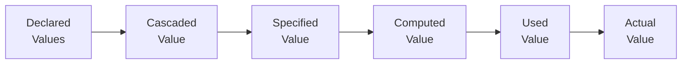

# Lesson 04 — Style Computation

## Concept

After the browser matches CSS rules to DOM elements, each property goes through a **value resolution pipeline** to determine its final computed value.



### The Six Value Stages

| Stage | What Happens | Example |
|---|---|---|
| **Declared** | All declarations that apply | `font-size: 2em`, `font-size: 20px` |
| **Cascaded** | Winner after cascade resolution | `font-size: 2em` (higher specificity wins) |
| **Specified** | Cascaded value, or inherited/initial | `font-size: 2em` |
| **Computed** | Resolve relative values | `font-size: 32px` (2em × 16px parent) |
| **Used** | Resolve layout-dependent values | `width: 500px` (50% of 1000px parent) |
| **Actual** | Round to device constraints | `width: 500px` (might be 500.5 → 501 on high-DPI) |

### Why This Matters

When you inspect an element in DevTools:
- **Styles panel** → Shows declared/cascaded values
- **Computed panel** → Shows computed values
- `getComputedStyle()` in JS → Returns **resolved values** (computed for most properties, used for some like `width`)

Understanding this pipeline explains why values look different in DevTools than in your source CSS.

## Experiment 01: Value Resolution in Action

```html
<!-- 01-value-resolution.html -->
<!DOCTYPE html>
<html lang="en">
<head>
  <meta charset="UTF-8">
  <title>Value Resolution</title>
  <style>
    html { font-size: 16px; }
    
    .parent {
      font-size: 20px;
      width: 500px;
      color: navy;
      padding: 20px;
      background: #f0f0f0;
      border: 1px solid #ccc;
    }
    
    .child {
      /* Relative to parent's font-size (20px) */
      font-size: 1.5em;        /* → 30px */
      
      /* Percentage of parent's width (500px) */
      width: 80%;              /* → 400px */
      
      /* Relative to own computed font-size (30px) */
      padding: 1em;            /* → 30px */
      
      /* Relative to root font-size (16px) */
      margin-bottom: 2rem;     /* → 32px */
      
      /* Inherited from parent */
      /* color: navy (inherited, not declared here) */
      
      /* Keyword resolved differently per property */
      border: thin solid currentColor; /* thin → ~1px, currentColor → navy */
      
      background: rgba(100, 149, 237, 0.3);
    }
    
    .grandchild {
      /* em is relative to parent's (child's) computed font-size (30px) */
      font-size: 0.8em;       /* → 24px */
      padding: 0.5em;         /* → 12px (relative to own font-size: 24px) */
      
      /* percentage width relative to containing block (child's content width) */
      width: 50%;
      
      background: rgba(100, 149, 237, 0.5);
    }
  </style>
</head>
<body>
  <div class="parent">
    Parent (font-size: 20px, width: 500px)
    <div class="child">
      Child (font-size: 1.5em, width: 80%)
      <div class="grandchild">
        Grandchild (font-size: 0.8em, width: 50%)
      </div>
    </div>
  </div>

  <script>
    function showComputed(selector) {
      const el = document.querySelector(selector);
      const cs = getComputedStyle(el);
      console.log(`\n=== ${selector} ===`);
      console.log('font-size:', cs.fontSize);
      console.log('width:', cs.width);
      console.log('padding:', cs.padding);
      console.log('color:', cs.color);
      console.log('margin-bottom:', cs.marginBottom);
      console.log('border:', cs.border);
    }
    
    showComputed('.parent');
    showComputed('.child');
    showComputed('.grandchild');
  </script>
</body>
</html>
```

### What to Observe

1. `1.5em` on `.child` resolves to `30px` (1.5 × parent's 20px)
2. `padding: 1em` on `.child` resolves to `30px` (1em × own font-size of 30px)
3. `0.8em` on `.grandchild` resolves to `24px` (0.8 × parent's 30px)
4. `width: 80%` resolves at used-value time based on parent's computed width
5. Colors are all normalized to `rgb()` format
6. `currentColor` resolves to the inherited color value
7. `thin` keyword resolves to a pixel value

## Experiment 02: Inheritance in Detail

```html
<!-- 02-inheritance.html -->
<!DOCTYPE html>
<html lang="en">
<head>
  <meta charset="UTF-8">
  <title>CSS Inheritance</title>
  <style>
    .ancestor {
      /* These properties INHERIT by default */
      color: darkblue;
      font-family: Georgia, serif;
      font-size: 18px;
      line-height: 1.6;
      letter-spacing: 0.5px;
      text-align: center;
      cursor: pointer;
      visibility: visible;
      
      /* These properties DO NOT inherit by default */
      border: 2px solid red;
      padding: 20px;
      margin: 20px;
      background: lightyellow;
      width: 600px;
    }
    
    .descendant {
      /* No declarations at all — let's see what inherits */
      /* We'll add a subtle background to see the element */
    }
    
    .forced-inherit {
      /* Force non-inherited properties to inherit */
      border: inherit;
      padding: inherit;
      background: inherit;
    }
    
    .forced-initial {
      /* Force inherited properties to NOT inherit */
      color: initial;       /* → browser default (usually black) */
      font-family: initial; /* → browser default */
      font-size: initial;   /* → medium (usually 16px) */
    }
    
    .forced-unset {
      /* unset = inherit if inheritable, initial if not */
      color: unset;         /* inherits (color is inheritable) */
      border: unset;        /* initial (border is not inheritable) */
    }
  </style>
</head>
<body>
  <div class="ancestor">
    Ancestor element
    <div class="descendant" id="d1">
      Default descendant — what inherits?
    </div>
    <div class="descendant forced-inherit" id="d2">
      Forced inherit — border, padding, background inherited
    </div>
    <div class="descendant forced-initial" id="d3">
      Forced initial — color, font-family, font-size reset
    </div>
    <div class="descendant forced-unset" id="d4">
      Forced unset — depends on property's inheritable status
    </div>
  </div>

  <script>
    function compare(id) {
      const el = document.getElementById(id);
      const cs = getComputedStyle(el);
      console.log(`\n=== #${id} ===`);
      console.log('color:', cs.color, '(inheritable)');
      console.log('font-family:', cs.fontFamily, '(inheritable)');
      console.log('font-size:', cs.fontSize, '(inheritable)');
      console.log('border:', cs.border, '(NOT inheritable)');
      console.log('padding:', cs.padding, '(NOT inheritable)');
      console.log('background:', cs.backgroundColor, '(NOT inheritable)');
    }
    compare('d1');
    compare('d2');
    compare('d3');
    compare('d4');
  </script>
</body>
</html>
```

### Inheritance Rules

**Properties that inherit by default** (partial list):
- `color`, `font-*`, `line-height`, `letter-spacing`, `word-spacing`
- `text-align`, `text-indent`, `text-transform`
- `white-space`, `direction`, `writing-mode`
- `visibility`, `cursor`, `list-style-*`

**Properties that do NOT inherit by default** (partial list):
- `width`, `height`, `margin`, `padding`, `border`
- `background`, `display`, `position`, `overflow`
- `flex-*`, `grid-*`, `z-index`, `opacity`, `transform`

**Keyword values**:
- `inherit` → Force inheritance (even for non-inheritable properties)
- `initial` → Use the property's initial value (from the spec)
- `unset` → `inherit` if the property is inheritable, `initial` if not
- `revert` → Revert to the cascaded value from a previous origin

## Experiment 03: The `all` Shorthand

```html
<!-- 03-all-shorthand.html -->
<!DOCTYPE html>
<html lang="en">
<head>
  <meta charset="UTF-8">
  <title>The all Shorthand</title>
  <style>
    .styled-ancestor {
      font-size: 24px;
      color: darkred;
      background: lightyellow;
      padding: 20px;
      border: 2px solid darkred;
      font-family: Georgia, serif;
      line-height: 1.8;
      margin: 20px;
    }
    
    .reset-all-initial {
      /* Resets ALL properties to their initial values
         (even inheritable ones like color and font-size) */
      all: initial;
      display: block; /* Need to restore this since all:initial sets display:inline */
    }
    
    .reset-all-unset {
      /* Inheritable properties → inherit from parent
         Non-inheritable properties → initial value */
      all: unset;
      display: block;
    }
    
    .reset-all-revert {
      /* Reverts to user-agent stylesheet values */
      all: revert;
    }
  </style>
</head>
<body>
  <div class="styled-ancestor">
    <p>Styled ancestor</p>
    <div class="reset-all-initial">all: initial — very plain</div>
    <div class="reset-all-unset">all: unset — inherits text properties</div>
    <div class="reset-all-revert">all: revert — back to browser defaults</div>
  </div>
</body>
</html>
```

## DevTools Exercise: Tracing Value Resolution

1. Open any experiment in DevTools
2. Select `.child` element
3. **Styles panel**: Shows the declared value (`1.5em`)
4. **Computed panel**: Shows the computed value (`30px`)
5. Click the arrow next to a computed property to jump to the rule that set it
6. Toggle the "Show all" checkbox to see inherited properties
7. Grayed-out properties in Computed are inherited from an ancestor

## Summary

| Stage | Resolves | Example |
|---|---|---|
| Declared → Cascaded | Which declaration wins | Specificity chooses one |
| Cascaded → Specified | Fill in defaults | Inherit or use initial value |
| Specified → Computed | Resolve relative values | `2em` → `32px` |
| Computed → Used | Layout-dependent values | `50%` → `250px` |
| Used → Actual | Device constraints | Sub-pixel rounding |

| Keyword | Behavior |
|---|---|
| `inherit` | Always inherit from parent |
| `initial` | Use spec-defined initial value |
| `unset` | Inherit if inheritable, initial if not |
| `revert` | Revert to previous cascade origin |

## Next

→ [Lesson 05: Layout Stage](05-layout.md) — How the browser computes geometry from the render tree
