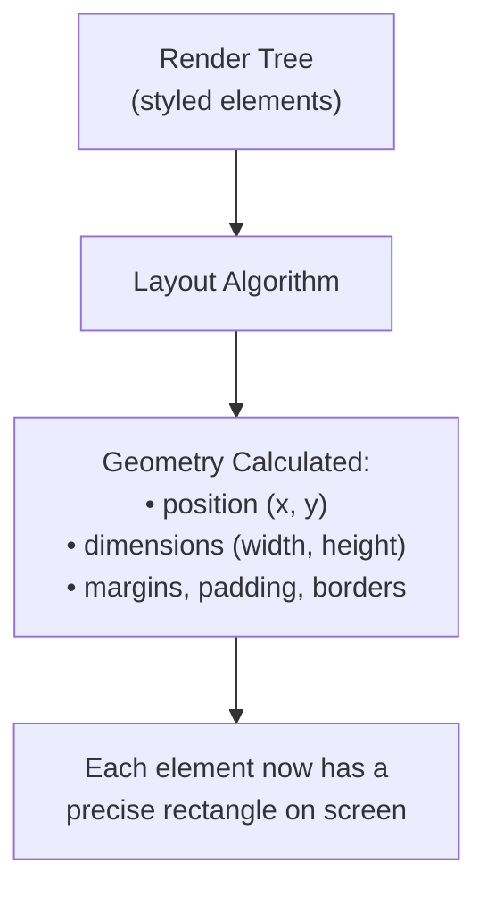
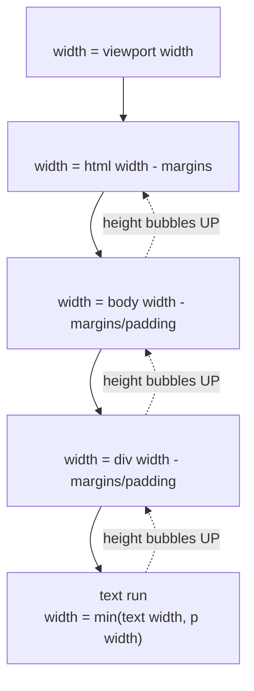

# Lesson 05 — Layout Stage

## Concept

After style computation, the browser knows **what** each element looks like. In the **layout** stage (also called **reflow**), it calculates **where** each element goes and **how big** it is.



### What Layout Computes

For every element in the render tree, layout determines:
- **Position**: x, y coordinates relative to the viewport
- **Size**: width and height of the content, padding, border, and margin boxes
- **Relationship**: how this element relates to siblings, parents, and children

### Layout Is Recursive

Layout starts at the root and works down the tree:



**Key insight**: Width flows **down** (parent constrains child), but height flows **up** (content determines parent height, unless height is explicitly set).

## Experiment 01: Width Flows Down, Height Flows Up

```html
<!-- 01-width-down-height-up.html -->
<!DOCTYPE html>
<html lang="en">
<head>
  <meta charset="UTF-8">
  <title>Width Down, Height Up</title>
  <style>
    * { box-sizing: border-box; margin: 0; padding: 0; }
    
    .outer {
      /* Width: no explicit width, so it stretches to viewport width */
      background: #e0e0ff;
      padding: 20px;
      border: 2px solid navy;
    }
    
    .middle {
      /* Width: auto = parent content width (outer - padding - border) */
      /* Height: auto = determined by children */
      background: #ffe0e0;
      padding: 20px;
      border: 2px solid darkred;
    }
    
    .inner {
      /* Width: auto = parent content width (middle - padding - border) */
      /* Height: auto = determined by text content */
      background: #e0ffe0;
      padding: 20px;
      border: 2px solid darkgreen;
    }
    
    .info { margin-top: 20px; font-family: monospace; font-size: 14px; }
  </style>
</head>
<body>
  <div class="outer" id="outer">
    Outer
    <div class="middle" id="middle">
      Middle
      <div class="inner" id="inner">
        Inner — my width comes from my parent, my height comes from my content.
        Adding more text increases my height, which increases Middle's height,
        which increases Outer's height.
      </div>
    </div>
  </div>

  <pre class="info" id="info"></pre>
  
  <script>
    function getBox(id) {
      const el = document.getElementById(id);
      const rect = el.getBoundingClientRect();
      return {
        width: Math.round(rect.width),
        height: Math.round(rect.height),
        contentWidth: el.clientWidth,
        contentHeight: el.clientHeight
      };
    }
    
    const info = document.getElementById('info');
    ['outer', 'middle', 'inner'].forEach(id => {
      const box = getBox(id);
      info.textContent += `${id}: ${box.width}×${box.height}px (content: ${box.contentWidth}×${box.contentHeight}px)\n`;
    });
    
    info.textContent += `\nviewport: ${window.innerWidth}×${window.innerHeight}px`;
    info.textContent += '\n\nNotice: width shrinks at each level (parent constrains child)';
    info.textContent += '\nNotice: height grows at each level (content expands parent)';
  </script>
</body>
</html>
```

## Experiment 02: Layout Is Global

A single change can trigger layout for many elements. This is why layout is expensive.

```html
<!-- 02-layout-is-global.html -->
<!DOCTYPE html>
<html lang="en">
<head>
  <meta charset="UTF-8">
  <title>Layout Is Global</title>
  <style>
    * { box-sizing: border-box; margin: 0; padding: 0; }
    body { font-family: system-ui; padding: 20px; }
    
    .row { display: flex; gap: 10px; margin-bottom: 10px; }
    
    .card {
      flex: 1;
      padding: 20px;
      background: #f0f0f0;
      border: 1px solid #ccc;
      border-radius: 4px;
      transition: none; /* No animation to clearly see layout */
    }
    
    .controls { margin-bottom: 20px; }
    button { padding: 8px 16px; margin-right: 8px; cursor: pointer; }
    
    .metric { font-family: monospace; font-size: 12px; margin-top: 10px; }
  </style>
</head>
<body>
  <div class="controls">
    <button onclick="addText()">Add Text to One Card</button>
    <button onclick="changeWidth()">Change One Card Width</button>
    <button onclick="addCard()">Add a Card</button>
  </div>
  
  <div class="row" id="row1">
    <div class="card" id="target">Card A: Change me</div>
    <div class="card">Card B: I'm affected too</div>
    <div class="card">Card C: Me too</div>
  </div>
  
  <div class="row" id="row2">
    <div class="card">Card D: Even other rows shift if height changes</div>
    <div class="card">Card E</div>
  </div>
  
  <div class="metric" id="metric"></div>

  <script>
    function addText() {
      const t = document.getElementById('target');
      t.textContent += ' More text added. ';
      measureLayout();
    }
    
    function changeWidth() {
      const t = document.getElementById('target');
      t.style.flex = t.style.flex === '2' ? '1' : '2';
      measureLayout();
    }
    
    function addCard() {
      const row = document.getElementById('row1');
      const card = document.createElement('div');
      card.className = 'card';
      card.textContent = 'New Card';
      row.appendChild(card);
      measureLayout();
    }
    
    function measureLayout() {
      const cards = document.querySelectorAll('.card');
      const m = document.getElementById('metric');
      m.textContent = 'Layout results:\n';
      cards.forEach((card, i) => {
        const r = card.getBoundingClientRect();
        m.textContent += `  Card ${i}: x=${Math.round(r.x)} y=${Math.round(r.y)} w=${Math.round(r.width)} h=${Math.round(r.height)}\n`;
      });
      m.textContent += '\nNotice: changing ONE card affects ALL cards in the same flex row.';
    }
    
    measureLayout();
  </script>
</body>
</html>
```

### What to Observe

1. Adding text to one card can increase its height, which changes the row height, which shifts the second row down
2. Changing one card's `flex` value recalculates ALL cards in the row
3. Adding a card recalculates all siblings
4. Layout changes **cascade through the tree** — this is why layout is expensive

## Experiment 03: Measuring Layout with Performance API

```html
<!-- 03-measuring-layout.html -->
<!DOCTYPE html>
<html lang="en">
<head>
  <meta charset="UTF-8">
  <title>Measuring Layout</title>
  <style>
    * { box-sizing: border-box; }
    body { font-family: system-ui; padding: 20px; }
    .grid { display: grid; grid-template-columns: repeat(10, 1fr); gap: 4px; }
    .cell {
      padding: 10px;
      background: cornflowerblue;
      color: white;
      text-align: center;
      font-size: 12px;
    }
    .controls { margin: 20px 0; }
    button { padding: 8px 16px; margin-right: 8px; }
    #results { font-family: monospace; font-size: 13px; white-space: pre-wrap; }
  </style>
</head>
<body>
  <div class="controls">
    <button onclick="triggerLayout()">Trigger Layout (read after write)</button>
    <button onclick="batchedOperation()">Batched (write then read)</button>
  </div>
  
  <div class="grid" id="grid"></div>
  <div id="results"></div>

  <script>
    // Create 100 cells
    const grid = document.getElementById('grid');
    for (let i = 0; i < 100; i++) {
      const cell = document.createElement('div');
      cell.className = 'cell';
      cell.textContent = i;
      grid.appendChild(cell);
    }
    
    function triggerLayout() {
      const cells = document.querySelectorAll('.cell');
      const start = performance.now();
      
      // BAD: read-write-read-write loop forces multiple layouts
      cells.forEach(cell => {
        cell.style.width = (cell.offsetWidth + 1) + 'px'; // read then write
      });
      
      const end = performance.now();
      document.getElementById('results').textContent = 
        `Layout-thrashing approach: ${(end - start).toFixed(2)}ms\n` +
        `Each read (offsetWidth) after a write forces synchronous layout.`;
    }
    
    function batchedOperation() {
      const cells = document.querySelectorAll('.cell');
      const start = performance.now();
      
      // GOOD: read all first, then write all
      const widths = Array.from(cells).map(cell => cell.offsetWidth); // batch read
      cells.forEach((cell, i) => {
        cell.style.width = (widths[i] + 1) + 'px'; // batch write
      });
      
      const end = performance.now();
      document.getElementById('results').textContent = 
        `Batched approach: ${(end - start).toFixed(2)}ms\n` +
        `One layout calculation for all reads, one for the write batch.`;
    }
  </script>
</body>
</html>
```

### Key Insight: Forced Synchronous Layout

When you read a layout property (like `offsetWidth`) **after** writing to style, the browser must perform synchronous layout to give you the correct value. This is called **layout thrashing** and is one of the most common performance problems in web applications.

## DevTools Exercise: Visualizing Layout

1. Open Chrome DevTools → **Performance** tab
2. Click Record, interact with the page, Stop
3. Look for purple bars labeled **Layout** in the timeline
4. Click a Layout event to see:
   - How long it took
   - How many nodes were affected
   - What triggered it (the call stack)
5. Open **Rendering** tab → Enable "Layout Shift Regions" to see layout changes highlighted in real time

## Summary

| Concept | Key Point |
|---|---|
| Layout Direction | Width flows down (parent → child), height flows up (content → parent) |
| Layout Is Recursive | Starts at root, computes each element based on parent constraints |
| Layout Is Global | Changing one element can affect many others |
| Synchronous Layout | Reading layout after writing style forces immediate recalculation |
| Layout Cost | Proportional to number of affected elements — minimize reflows |

## Next

→ [Lesson 06: Paint & Composite](06-paint-composite.md) — How layout geometry becomes actual pixels
