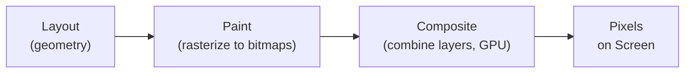
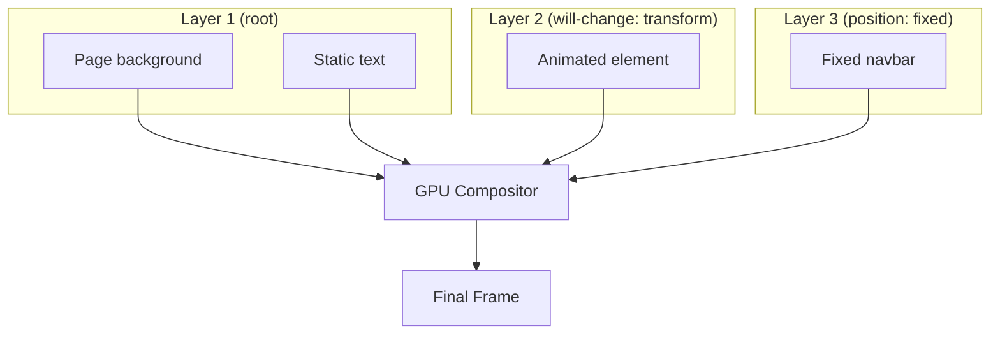
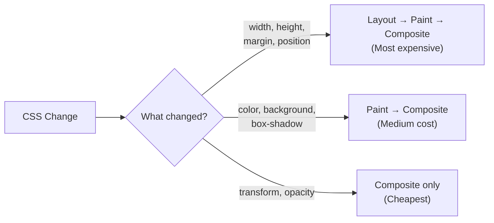

# Lesson 06 — Paint & Composite

## Concept

After layout, the browser knows the exact position and size of every element. Now it must convert this information into **pixels on screen**. This happens in two stages:



### Paint (Rasterization)

Painting converts layout rectangles into actual pixel data. The browser "draws" each element:
1. Backgrounds and borders
2. Content (text, images)
3. Outlines

Painting happens in a **specific order** defined by the CSS specification (the painting order, closely related to stacking contexts — covered in depth in Module 06).

### Compositing

Modern browsers split the page into **layers**. Each layer is painted independently, then the compositor combines them (using the GPU) to produce the final image.



**Why layers matter**: If an element is on its own compositing layer, changes to it (like a `transform` animation) only require **recomposite** — the cheapest rendering operation. No relayout, no repaint.

## The Three Rendering Costs



| Trigger | Cost | Examples |
|---|---|---|
| **Layout** | High | `width`, `height`, `margin`, `padding`, `top`, `left`, `display`, `position`, `font-size` |
| **Paint** | Medium | `color`, `background`, `border-color`, `box-shadow`, `border-radius`, `visibility`, `outline` |
| **Composite** | Low | `transform`, `opacity` |

## Experiment 01: Observing Paint Rectangles

```html
<!-- 01-paint-observation.html -->
<!DOCTYPE html>
<html lang="en">
<head>
  <meta charset="UTF-8">
  <title>Paint Observation</title>
  <style>
    * { box-sizing: border-box; margin: 0; }
    body { font-family: system-ui; padding: 40px; }
    
    .box {
      width: 200px;
      height: 200px;
      margin: 20px;
      padding: 20px;
      display: inline-block;
      vertical-align: top;
      border-radius: 8px;
      color: white;
      font-weight: bold;
    }
    
    .layout-change {
      background: #e74c3c;
      transition: width 0.3s;
    }
    .layout-change:hover { width: 300px; } /* Triggers LAYOUT */
    
    .paint-change {
      background: #3498db;
      transition: background 0.3s;
    }
    .paint-change:hover { background: #2ecc71; } /* Triggers PAINT only */
    
    .composite-change {
      background: #9b59b6;
      transition: transform 0.3s;
    }
    .composite-change:hover { transform: scale(1.2); } /* Triggers COMPOSITE only */
    
    .instructions {
      font-size: 14px;
      color: #666;
      margin-bottom: 20px;
    }
  </style>
</head>
<body>
  <div class="instructions">
    <p><strong>Instructions:</strong></p>
    <ol>
      <li>Open DevTools → Rendering tab (Cmd+Shift+P → "Show Rendering")</li>
      <li>Enable "Paint flashing" — painted regions flash green</li>
      <li>Hover over each box and observe the flashing</li>
    </ol>
  </div>
  
  <div class="box layout-change">
    LAYOUT<br>
    (hover: width changes)<br>
    Watch: siblings shift too
  </div>
  
  <div class="box paint-change">
    PAINT<br>
    (hover: color changes)<br>
    Watch: only this box flashes
  </div>
  
  <div class="box composite-change">
    COMPOSITE<br>
    (hover: transform changes)<br>
    Watch: no flash (GPU handles it)
  </div>
</body>
</html>
```

### What to Observe

With "Paint flashing" enabled:
1. **Layout box**: Green flash on THIS box AND the boxes after it (layout affects siblings)
2. **Paint box**: Green flash ONLY on this box (paint is local)
3. **Composite box**: **No green flash** — the transform is handled entirely by the GPU compositor without repainting

## Experiment 02: Compositing Layers

```html
<!-- 02-compositing-layers.html -->
<!DOCTYPE html>
<html lang="en">
<head>
  <meta charset="UTF-8">
  <title>Compositing Layers</title>
  <style>
    * { box-sizing: border-box; margin: 0; }
    body { font-family: system-ui; padding: 20px; }
    
    .container {
      position: relative;
      width: 600px;
      height: 400px;
      background: #f0f0f0;
      border: 1px solid #ccc;
    }
    
    .box {
      position: absolute;
      width: 200px;
      height: 150px;
      padding: 15px;
      color: white;
      font-weight: bold;
      font-size: 14px;
    }
    
    /* No compositing layer — part of parent layer */
    .no-layer {
      top: 20px;
      left: 20px;
      background: rgba(231, 76, 60, 0.9);
    }
    
    /* Creates its own compositing layer (will-change) */
    .has-will-change {
      top: 80px;
      left: 120px;
      background: rgba(52, 152, 219, 0.9);
      will-change: transform;
    }
    
    /* Creates its own compositing layer (transform) */
    .has-transform {
      top: 140px;
      left: 220px;
      background: rgba(46, 204, 113, 0.9);
      transform: translateZ(0); /* "promotion hack" */
    }
    
    /* Creates its own compositing layer (opacity animation) */
    .has-animation {
      top: 200px;
      left: 320px;
      background: rgba(155, 89, 182, 0.9);
      animation: pulse 2s ease-in-out infinite;
    }
    
    @keyframes pulse {
      0%, 100% { opacity: 1; }
      50% { opacity: 0.5; }
    }
    
    .instructions {
      margin: 20px 0;
      font-size: 14px;
      color: #666;
    }
  </style>
</head>
<body>
  <div class="instructions">
    <strong>DevTools → More Tools → Layers panel</strong> to see compositing layers.
    <br>Each promoted element gets its own GPU texture.
  </div>
  
  <div class="container">
    <div class="box no-layer">
      No own layer<br>
      (part of parent layer)
    </div>
    <div class="box has-will-change">
      will-change: transform<br>
      (own compositing layer)
    </div>
    <div class="box has-transform">
      transform: translateZ(0)<br>
      (own compositing layer)
    </div>
    <div class="box has-animation">
      opacity animation<br>
      (own compositing layer)
    </div>
  </div>
</body>
</html>
```

### DevTools Exercise: The Layers Panel

1. Open DevTools → Press `Esc` to open the drawer → Click "…" → "More tools" → **Layers**
2. You'll see a 3D view of compositing layers
3. Rotate the view to see layers stacked in depth
4. Each colored rectangle is a separate GPU texture
5. Notice: elements with `will-change`, `transform`, or animated `opacity` get their own layers
6. The `.no-layer` box is part of the root layer

### Warning: Layer Explosion

Creating too many layers wastes GPU memory. Each layer is a bitmap stored in VRAM. Avoid:
- Adding `will-change: transform` to everything
- Unnecessary `transform: translateZ(0)` hacks

## Experiment 03: Paint Order Visualization

The browser paints elements in a specific order. This order determines which elements appear on top of others (before z-index is considered):

```html
<!-- 03-paint-order.html -->
<!DOCTYPE html>
<html lang="en">
<head>
  <meta charset="UTF-8">
  <title>Paint Order</title>
  <style>
    * { box-sizing: border-box; margin: 0; }
    body { font-family: system-ui; padding: 30px; }
    
    .demo {
      position: relative;
      width: 500px;
      height: 350px;
      background: #f5f5f5;
      border: 2px solid #ccc;
      margin-bottom: 20px;
    }
    
    /* Step 1: Root stacking context background */
    .bg-layer {
      position: absolute;
      inset: 0;
      background: linear-gradient(135deg, #fff5f5, #f5f5ff);
      z-index: -1; /* Painted FIRST (negative z-index) */
    }
    
    /* Step 2: Block-level boxes in normal flow */
    .block-box {
      width: 300px;
      height: 80px;
      background: rgba(231, 76, 60, 0.7);
      margin: 10px;
      padding: 10px;
      color: white;
    }
    
    /* Step 3: Floats */
    .float-box {
      float: right;
      width: 120px;
      height: 120px;
      background: rgba(241, 196, 15, 0.8);
      margin: 10px;
      padding: 10px;
    }
    
    /* Step 4: Inline content */
    .inline-text {
      font-size: 18px;
      color: darkblue;
      font-weight: bold;
      position: relative; /* Makes it positioned for demo purposes */
    }
    
    /* Step 5: Positioned elements with z-index: 0 or auto */
    .positioned-auto {
      position: absolute;
      top: 100px;
      left: 50px;
      width: 200px;
      height: 100px;
      background: rgba(52, 152, 219, 0.7);
      padding: 10px;
      color: white;
    }
    
    /* Step 6: Positive z-index */
    .positive-z {
      position: absolute;
      top: 150px;
      left: 100px;
      width: 200px;
      height: 100px;
      background: rgba(46, 204, 113, 0.7);
      z-index: 1;
      padding: 10px;
      color: white;
    }
  </style>
</head>
<body>
  <h2>CSS Paint Order (back to front)</h2>
  
  <div class="demo">
    <div class="bg-layer">1. Negative z-index</div>
    <div class="block-box">2. Block boxes in normal flow</div>
    <div class="float-box">3. Floats</div>
    <p class="inline-text">4. Inline content (text paints ABOVE floats)</p>
    <div class="positioned-auto">5. Positioned (z-index: auto)</div>
    <div class="positive-z">6. Positive z-index</div>
  </div>
  
  <h3>Paint Order (per the CSS spec, Appendix E):</h3>
  <ol>
    <li>Stacking context background and borders</li>
    <li>Negative z-index descendants</li>
    <li>Block-level boxes in normal flow</li>
    <li>Floated boxes</li>
    <li>Inline-level boxes in normal flow</li>
    <li>z-index: 0 / positioned elements (DOM order)</li>
    <li>Positive z-index descendants (ascending order)</li>
  </ol>
</body>
</html>
```

## Summary

| Concept | Key Point |
|---|---|
| Paint | Converts layout to pixel bitmaps |
| Composite | GPU combines layers into final frame |
| Compositing Layers | Elements promoted to own GPU layer for cheap updates |
| Layout triggers | Most expensive — avoid changing geometry properties in animations |
| Paint triggers | Medium cost — only the affected area repaints |
| Composite triggers | Cheapest — GPU-only, no main thread work |
| Layer promotion | `will-change`, `transform`, animated `opacity` create layers |
| Paint order | Specific order defined by CSS spec (related to stacking contexts) |

## Next

→ [Lesson 07: Render-Blocking CSS](07-render-blocking.md) — Why CSS blocks rendering and optimization strategies
