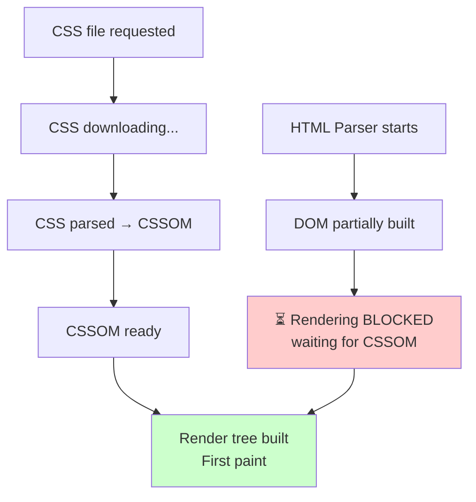
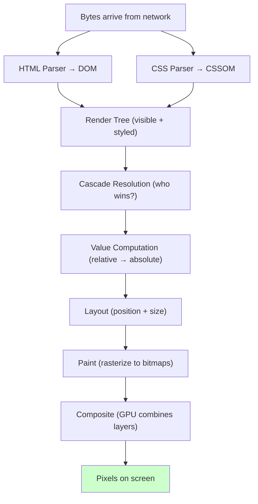

# Lesson 07 — Render-Blocking CSS

## Concept

CSS is **render-blocking** by default. The browser will not paint any content until the CSSOM is fully constructed. This is intentional — rendering without CSS would cause a **Flash of Unstyled Content (FOUC)**.



### Why CSS Blocks Rendering

Consider this scenario:
1. Browser parses HTML, finds `<h1>Hello</h1>`
2. Without CSS, it would render with default styles (large, bold, serif)
3. CSS loads, has `h1 { display: none; }` 
4. The h1 disappears — user sees a jarring flash

To prevent this, browsers wait for **all render-blocking CSS** before the first paint.

### What Makes CSS Render-Blocking?

- `<link rel="stylesheet">` in `<head>` — **always** render-blocking
- `<style>` in `<head>` — parsed immediately (no network delay)
- `@import` inside CSS — creates additional blocking requests
- CSS loaded via JavaScript — depends on loading method

## Experiment 01: Simulating Render Blocking

```html
<!-- 01-render-blocking.html -->
<!DOCTYPE html>
<html lang="en">
<head>
  <meta charset="UTF-8">
  <title>Render Blocking Demo</title>
  
  <script>
    // Log when DOM parsing happens
    console.log('HEAD script executing:', performance.now().toFixed(2) + 'ms');
  </script>
  
  <!-- This inline style is processed immediately (no blocking) -->
  <style>
    body { font-family: system-ui; padding: 20px; }
    .box { padding: 20px; margin: 10px; border: 1px solid #ccc; }
    .metric { font-family: monospace; font-size: 13px; }
  </style>
  
  <!-- 
    In production, an external stylesheet would go here:
    <link rel="stylesheet" href="slow-loading-styles.css">
    It would block rendering until downloaded and parsed.
  -->
</head>
<body>
  <h1>Render Blocking Demonstration</h1>
  
  <div class="box">
    <h2>Timeline:</h2>
    <div class="metric" id="metrics"></div>
  </div>

  <script>
    const m = document.getElementById('metrics');
    
    // These performance entries show what happened
    const nav = performance.getEntriesByType('navigation')[0];
    
    m.innerHTML = `
DOM Content Loaded:  ${Math.round(nav.domContentLoadedEventStart)}ms
DOM Complete:        ${Math.round(nav.domComplete)}ms
Load Event:          ${Math.round(nav.loadEventStart)}ms

Key insight: If you add a slow-loading &lt;link rel="stylesheet"&gt; 
to the &lt;head&gt;, ALL of these numbers increase because rendering 
is blocked until the CSS is downloaded and parsed.

In DevTools Network tab, the blue "DOMContentLoaded" line and 
red "Load" line show these timings visually.
    `;
    
    // Observer for paint timing
    if (window.PerformanceObserver) {
      const observer = new PerformanceObserver(list => {
        list.getEntries().forEach(entry => {
          m.innerHTML += `\n${entry.name}: ${Math.round(entry.startTime)}ms`;
        });
      });
      observer.observe({ type: 'paint', buffered: true });
    }
  </script>
</body>
</html>
```

## Experiment 02: Media Queries Reduce Blocking

Not all stylesheets need to block rendering. CSS only used for print or specific screen sizes can be loaded without blocking:

```html
<!-- 02-media-query-loading.html -->
<!DOCTYPE html>
<html lang="en">
<head>
  <meta charset="UTF-8">
  <title>Media Query Loading</title>
  
  <!-- BLOCKS rendering (applies to current screen) -->
  <style>
    body {
      font-family: system-ui;
      padding: 20px;
      background: white;
      color: #333;
    }
    .demo { padding: 20px; margin: 10px; border: 1px solid #ccc; }
  </style>
  
  <!-- 
    In production, you would use media attributes on link tags:
    
    BLOCKS: (matches current medium)
    <link rel="stylesheet" href="main.css">
    <link rel="stylesheet" href="screen.css" media="screen">
    
    DOES NOT BLOCK: (doesn't match current medium)  
    <link rel="stylesheet" href="print.css" media="print">
    <link rel="stylesheet" href="wide.css" media="(min-width: 2000px)">
    
    The browser still downloads non-matching stylesheets, 
    but at a lower priority and without blocking render.
  -->
  
  <style media="screen">
    /* This blocks — matches current medium */
    .screen-only { color: navy; font-weight: bold; }
  </style>
  
  <style media="print">
    /* This does NOT block rendering — only applies when printing */
    body { font-family: serif; color: black; }
    .no-print { display: none; }
  </style>
</head>
<body>
  <div class="demo">
    <h2>CSS Loading Strategy</h2>
    <p class="screen-only">This text is navy and bold (screen stylesheet).</p>
    <p>Stylesheets with non-matching media queries download but don't block rendering.</p>
    
    <h3>Best Practices:</h3>
    <pre>
&lt;!-- Always blocks --&gt;
&lt;link rel="stylesheet" href="critical.css"&gt;

&lt;!-- Only blocks when medium matches --&gt;
&lt;link rel="stylesheet" href="desktop.css" media="(min-width: 1024px)"&gt;

&lt;!-- Never blocks (doesn't match screen) --&gt;
&lt;link rel="stylesheet" href="print.css" media="print"&gt;

&lt;!-- Preload + apply later (advanced) --&gt;
&lt;link rel="preload" href="fonts.css" as="style" onload="this.rel='stylesheet'"&gt;
    </pre>
  </div>
</body>
</html>
```

## Experiment 03: The @import Problem

```html
<!-- 03-import-problem.html -->
<!DOCTYPE html>
<html lang="en">
<head>
  <meta charset="UTF-8">
  <title>@import Problem</title>
  <style>
    body { font-family: system-ui; padding: 20px; }
    .warning { background: #fff3cd; border: 1px solid #ffc107; padding: 15px; margin: 10px; border-radius: 4px; }
    .good { background: #d4edda; border: 1px solid #28a745; padding: 15px; margin: 10px; border-radius: 4px; }
    pre { background: #f5f5f5; padding: 10px; border-radius: 4px; overflow-x: auto; }
  </style>
</head>
<body>
  <h1>The @import Performance Problem</h1>
  
  <div class="warning">
    <h2>⚠️ Waterfall Loading with @import</h2>
    <p><code>@import</code> creates a <strong>waterfall</strong> — each imported file must be 
    downloaded and parsed before the next import is discovered.</p>
    <pre>
/* styles.css */
@import url("reset.css");      /* Request 1: must complete before... */
@import url("typography.css"); /* Request 2: ...this is discovered */
@import url("layout.css");    /* Request 3: ...and this */

/* Browser can't start downloading typography.css until 
   reset.css is fully downloaded and parsed! */
    </pre>
    
    <p>This creates a loading waterfall:</p>
    <pre>
Timeline:
reset.css:      |████████|
typography.css:          |████████|
layout.css:                       |████████|
                ←――――――― Total blocking time ――――――→
    </pre>
  </div>
  
  <div class="good">
    <h2>✅ Parallel Loading with &lt;link&gt;</h2>
    <p>Multiple <code>&lt;link&gt;</code> tags are discovered during HTML parsing 
    and downloaded <strong>in parallel</strong>.</p>
    <pre>
&lt;link rel="stylesheet" href="reset.css"&gt;
&lt;link rel="stylesheet" href="typography.css"&gt;
&lt;link rel="stylesheet" href="layout.css"&gt;
    </pre>
    
    <p>Parallel download:</p>
    <pre>
Timeline:
reset.css:      |████████|
typography.css: |████████|
layout.css:     |████████|
                ←― Much shorter! ―→
    </pre>
  </div>
  
  <h2>Critical CSS Strategy</h2>
  <p>The best approach for critical rendering path optimization:</p>
  <ol>
    <li><strong>Inline critical CSS</strong> in a <code>&lt;style&gt;</code> tag (above-the-fold styles)</li>
    <li><strong>Async-load</strong> remaining CSS using <code>rel="preload"</code></li>
    <li><strong>Never use <code>@import</code></strong> in production stylesheets</li>
  </ol>
</body>
</html>
```

## DevTools Exercise: Critical Rendering Path

1. Open DevTools → **Network** tab
2. Filter by CSS (click "CSS" filter)
3. Look for the **waterfall visualization** showing when each CSS file starts and finishes downloading
4. The blue vertical line (DOMContentLoaded) can't fire until all render-blocking CSS is parsed
5. Open **Performance** tab → Record a page load
6. Find the "Parse Stylesheet" entries — they show how long CSS parsing takes
7. Look for "First Paint" and "First Contentful Paint" milestones

## Summary

| Concept | Key Point |
|---|---|
| Render-blocking | Browser won't paint until CSSOM is complete |
| Why it blocks | Prevents Flash of Unstyled Content (FOUC) |
| `<link>` | Always render-blocking (unless non-matching media query) |
| `<style>` | Parsed immediately, no network delay |
| `@import` | Creates waterfall loading — avoid in production |
| Media queries | Non-matching media stylesheets don't block render |
| Critical CSS | Inline above-the-fold styles for fastest first paint |
| Optimization | Async-load non-critical CSS, avoid @import chains |

## Module Complete!

You now have a complete mental model of how browsers render CSS:



Every subsequent module explores one stage of this pipeline in depth.

## Next Module

→ [Module 02: The Cascade](../02-cascade/README.md) — The core algorithm that determines which CSS rules win
