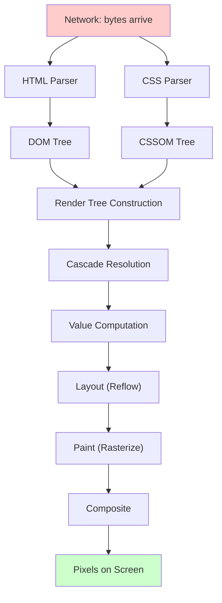

# Module 01 — How Browsers Render CSS

> Before you can master CSS, you must understand what the browser **does** with your CSS. This module builds the foundational mental model that every subsequent module depends on.

## Why This Module Matters

Every CSS bug maps to a misunderstanding of the rendering pipeline. When you know how browsers parse, resolve, layout, paint, and composite, you can predict CSS behavior instead of guessing.

## The Complete Rendering Pipeline

## Lessons

| # | Lesson | Topic |
|---|---|---|
| 01 | [HTML Parsing & DOM Construction](01-html-parsing.md) | How HTML becomes a DOM tree |
| 02 | [CSS Parsing & CSSOM](02-css-parsing.md) | How CSS is tokenized and parsed |
| 03 | [The Render Tree](03-render-tree.md) | DOM + CSSOM → Render Tree |
| 04 | [Style Computation](04-style-computation.md) | How declared values become computed values |
| 05 | [Layout Stage](05-layout.md) | How the browser computes geometry |
| 06 | [Paint & Composite](06-paint-composite.md) | How layout becomes pixels |
| 07 | [Render-Blocking CSS](07-render-blocking.md) | Why CSS blocks rendering and how to optimize |

## Key Concepts

After completing this module you will understand:
- The difference between DOM, CSSOM, and Render Tree
- Why CSS is render-blocking
- What triggers layout, paint, and composite
- How style recalculation works
- The lifecycle of a CSS declaration from file to pixel

## Prerequisites

- Basic HTML/CSS knowledge
- Chrome DevTools open and ready

→ Start with [Lesson 01: HTML Parsing & DOM Construction](01-html-parsing.md)
