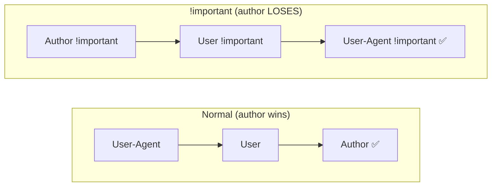
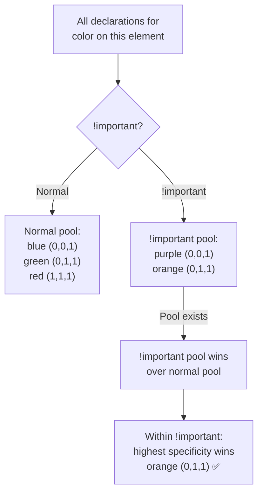

# Lesson 01 — Cascade Origins & Importance

## Concept

The first step of cascade resolution is checking the **origin** of each declaration and whether it's marked `!important`.

### The Three Origins

1. **User-Agent Origin** — Browser default styles (e.g., `h1 { font-size: 2em; }`)
2. **User Origin** — User-configured styles (accessibility settings, browser extensions)
3. **Author Origin** — Your CSS (stylesheets, `<style>` tags, inline styles)

### Origin Priority (Normal Declarations)

For normal (non-`!important`) declarations, the priority is:

```
Author > User > User-Agent
```

Your CSS beats user preferences, which beat browser defaults. This is intuitive — the page author has the most control.

### Origin Priority with !important (Inverted!)

When `!important` is used, the priority **inverts**:

```
User-Agent !important > User !important > Author !important
```



### Why Does !important Invert?

This is **by design** to protect users. Consider:
- A visually impaired user sets `* { font-size: 24px !important; }` in their browser settings
- If author `!important` beat user `!important`, the author could override accessibility needs
- By inverting the order, users always have the final say with `!important`

The practical implication: when you use `!important` in your author styles, you're **lowering** its priority relative to user and browser `!important` declarations.

## Experiment 01: Cascade Origins in Action

```html
<!-- 01-cascade-origins.html -->
<!DOCTYPE html>
<html lang="en">
<head>
  <meta charset="UTF-8">
  <title>Cascade Origins</title>
  <style>
    /* === AUTHOR ORIGIN (your styles) === */
    
    h1 {
      /* Overrides user-agent default (2em, bold, Times) */
      font-size: 28px;
      font-family: system-ui, sans-serif;
      color: navy;
    }
    
    a {
      /* Overrides user-agent default (blue, underlined) */
      color: coral;
    }
    
    ul {
      /* Overrides user-agent default (disc bullets, left padding) */
      list-style: none;
      padding-left: 0;
    }
    
    /* See what happens without author styles */
    .ua-only {
      all: revert; /* Reverts to user-agent origin */
    }
    
    .demo { margin: 20px; padding: 20px; border: 1px solid #ddd; }
    .info { font-family: monospace; font-size: 13px; background: #f5f5f5; padding: 10px; }
  </style>
</head>
<body>
  <div class="demo">
    <h2>With Author Styles (your CSS wins)</h2>
    <h1>Styled Heading</h1>
    <a href="#">Styled Link</a>
    <ul>
      <li>No bullets (author removed them)</li>
      <li>No padding (author removed it)</li>
    </ul>
  </div>
  
  <div class="demo">
    <h2>Reverted to User-Agent Styles</h2>
    <h1 class="ua-only">User-Agent Heading</h1>
    <a href="#" class="ua-only">User-Agent Link</a>
    <ul class="ua-only">
      <li>Default bullets (user-agent)</li>
      <li>Default padding (user-agent)</li>
    </ul>
  </div>
  
  <div class="info">
    <p>DevTools Exercise:</p>
    <ol>
      <li>Select the styled &lt;h1&gt; in DevTools</li>
      <li>In the Styles panel, scroll down to see "user agent stylesheet"</li>
      <li>Notice the crossed-out user-agent declarations — author origin wins</li>
      <li>Select the .ua-only &lt;h1&gt; — no author styles override the defaults</li>
    </ol>
  </div>
</body>
</html>
```

## Experiment 02: !important Behavior

```html
<!-- 02-important-behavior.html -->
<!DOCTYPE html>
<html lang="en">
<head>
  <meta charset="UTF-8">
  <title>!important Behavior</title>
  <style>
    /* All these target the same element */
    
    /* Rule 1: Low specificity, normal */
    p { color: blue; }
    
    /* Rule 2: Higher specificity, normal */
    .content p { color: green; }
    
    /* Rule 3: Even higher specificity, normal */
    #main .content p { color: red; }
    
    /* Rule 4: Low specificity, but !important */
    p { color: purple !important; }
    
    /* Rule 5: Higher specificity, !important */
    .content p { color: orange !important; }
    
    .demo { padding: 20px; margin: 20px; border: 1px solid #ccc; }
    .result { font-family: monospace; font-size: 14px; margin: 10px 0; }
  </style>
</head>
<body>
  <div class="demo" id="main">
    <div class="content">
      <p id="target">What color am I?</p>
    </div>
  </div>

  <div class="result">
    <h3>Resolution order:</h3>
    <ol>
      <li><code>p { color: blue; }</code> — specificity (0,0,1), normal</li>
      <li><code>.content p { color: green; }</code> — specificity (0,1,1), normal</li>
      <li><code>#main .content p { color: red; }</code> — specificity (1,1,1), normal</li>
      <li><code>p { color: purple !important; }</code> — specificity (0,0,1), !important</li>
      <li><code>.content p { color: orange !important; }</code> — specificity (0,1,1), !important</li>
    </ol>
    <p><strong>Winner: <span style="color: orange;">orange</span></strong> — 
    !important declarations beat ALL normal declarations regardless of specificity.
    Among !important declarations, higher specificity wins.</p>
  </div>

  <script>
    const target = document.getElementById('target');
    console.log('Computed color:', getComputedStyle(target).color);
  </script>
</body>
</html>
```

### Key Insight

The cascade resolves `!important` declarations separately from normal ones:



## Experiment 03: The Inline Style + !important Hierarchy

```html
<!-- 03-inline-vs-important.html -->
<!DOCTYPE html>
<html lang="en">
<head>
  <meta charset="UTF-8">
  <title>Inline Styles vs !important</title>
  <style>
    .box {
      width: 200px;
      height: 100px;
      margin: 10px;
      display: inline-block;
      vertical-align: top;
      text-align: center;
      line-height: 100px;
      color: white;
      font-weight: bold;
      border-radius: 4px;
    }
    
    /* Which wins? */
    
    /* Scenario A: author normal vs inline normal */
    .box-a { background: cornflowerblue; }
    
    /* Scenario B: author !important vs inline normal */
    .box-b { background: green !important; }
    
    /* Scenario C: author !important vs inline... no inline !important */
    /* (Inline styles can't use !important in HTML attributes) */
  </style>
</head>
<body>
  <h2>Inline Styles vs Stylesheet Declarations</h2>
  
  <!-- Scenario A: inline wins (higher specificity than any selector) -->
  <div class="box box-a" style="background: coral;">
    A: Inline wins
  </div>
  
  <!-- Scenario B: !important wins over inline normal -->
  <div class="box box-b" style="background: coral;">
    B: !important wins
  </div>
  
  <pre style="margin-top: 20px; font-size: 14px;">
Cascade order (highest to lowest):

1. Author !important (beats everything within author origin)
2. Inline styles (specificity = ∞ for selector-based comparison)
3. Author stylesheets (sorted by specificity, then source order)

Note: inline styles CANNOT use !important in the style attribute.
CSS-in-JS solutions that inject &lt;style&gt; tags follow normal cascade rules.
  </pre>
</body>
</html>
```

## The Complete Cascade Priority Order

From **highest** to **lowest** priority:

| Priority | Origin | Importance | Notes |
|---|---|---|---|
| 1 (highest) | Transition declarations | — | Active CSS transitions |
| 2 | User-Agent | `!important` | Browser protecting its rules |
| 3 | User | `!important` | User accessibility overrides |
| 4 | Author | `!important` | Your `!important` declarations |
| 5 | Animation declarations | — | `@keyframes` values |
| 6 | Author | normal | Your regular CSS |
| 7 | User | normal | User preferences |
| 8 (lowest) | User-Agent | normal | Browser defaults |

**Notice**: Transitions beat everything. Animations beat normal author styles but not `!important`. This is why transitions/animations can feel like they "override" your styles.

## Why You Should Almost Never Use !important

```html
<!-- 04-important-wars.html -->
<!DOCTYPE html>
<html lang="en">
<head>
  <meta charset="UTF-8">
  <title>!important Wars</title>
  <style>
    /* Scenario: CSS framework sets a base style */
    .btn {
      background: #007bff !important; /* Framework uses !important */
      color: white !important;
      padding: 10px 20px;
      border: none;
      border-radius: 4px;
      cursor: pointer;
      font-size: 16px;
    }
    
    /* Your override attempt — specificity won't help */
    body .content .form .actions .btn {
      background: #28a745; /* Ignored because framework used !important */
    }
    
    /* You're forced to also use !important */
    .btn-success {
      background: #28a745 !important; /* Now you're in an !important war */
    }
    
    /* And now someone else needs to override you... */
    #submit-form .btn-success {
      background: #dc3545 !important; /* The specificity+!important spiral */
    }
    
    .warning { 
      background: #fff3cd; border: 1px solid #ffc107; 
      padding: 15px; margin: 20px; border-radius: 4px; 
    }
    
    .demo { margin: 20px; }
  </style>
</head>
<body>
  <div class="demo content">
    <div class="form">
      <div class="actions">
        <button class="btn">Framework Button</button>
        <button class="btn btn-success">Success Button</button>
        <div id="submit-form">
          <button class="btn btn-success">Overridden Again</button>
        </div>
      </div>
    </div>
  </div>
  
  <div class="warning">
    <h3>The !important Escalation Problem</h3>
    <p>Once one rule uses <code>!important</code>, the only way to override it is with 
    another <code>!important</code> with higher specificity. This leads to an 
    <strong>arms race</strong> that makes CSS unmaintainable.</p>
    <p><strong>Legitimate uses of !important:</strong></p>
    <ul>
      <li>Utility classes (e.g., <code>.hidden { display: none !important; }</code>)</li>
      <li>Overriding third-party CSS you can't modify</li>
      <li>Accessibility overrides</li>
    </ul>
    <p><strong>Modern solution:</strong> Use <code>@layer</code> (covered in Lesson 04) to 
    control cascade ordering without specificity wars.</p>
  </div>
</body>
</html>
```

## Summary

| Concept | Key Point |
|---|---|
| Three Origins | User-Agent, User, Author |
| Normal Priority | Author > User > User-Agent |
| !important Priority | **Inverted**: User-Agent > User > Author |
| Why Inverted | Protects user accessibility settings |
| Inline Styles | Beat all selector-based styles (unless !important) |
| !important Problem | Creates specificity escalation — avoid when possible |
| Transitions | Beat everything including !important |
| Animations | Beat normal but not !important |

## Next

→ [Lesson 02: Specificity Deep Dive](02-specificity.md) — How specificity is calculated and compared
