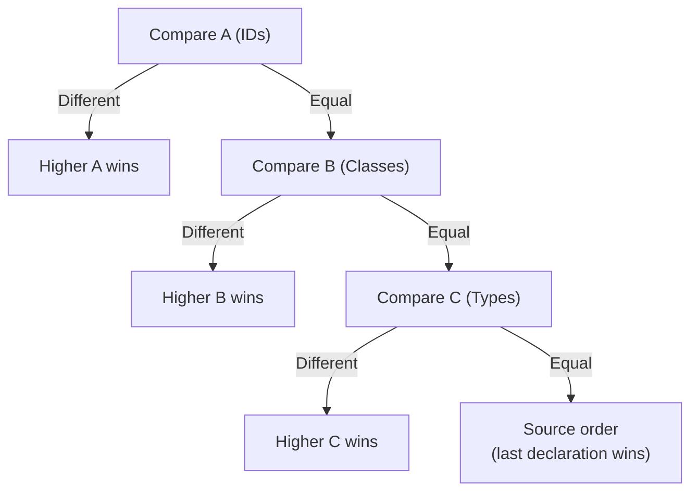

# Lesson 02 — Specificity Deep Dive

## Concept

When multiple declarations from the **same origin and importance** target the same property, the browser uses **specificity** to determine which wins.

Specificity is a **tuple** of three components: **(A, B, C)**

| Component | What It Counts | Weight |
|---|---|---|
| **A** | ID selectors (`#id`) | Highest |
| **B** | Class selectors (`.class`), attribute selectors (`[attr]`), pseudo-classes (`:hover`) | Middle |
| **C** | Type selectors (`div`), pseudo-elements (`::before`) | Lowest |

### Comparison Rules

Specificity tuples are compared **left to right**:
- (1, 0, 0) beats (0, 99, 99) — one ID beats any number of classes
- (0, 1, 0) beats (0, 0, 99) — one class beats any number of types
- When equal, **source order** breaks the tie (last one wins)



### Special Cases

| Selector | Specificity | Notes |
|---|---|---|
| `*` | (0, 0, 0) | Universal selector — zero specificity |
| `div` | (0, 0, 1) | Type selector |
| `.class` | (0, 1, 0) | Class selector |
| `#id` | (1, 0, 0) | ID selector |
| `[type="text"]` | (0, 1, 0) | Attribute selector (same as class) |
| `:hover` | (0, 1, 0) | Pseudo-class |
| `::before` | (0, 0, 1) | Pseudo-element (same as type) |
| `:is(.a, #b)` | Depends | Uses specificity of **most specific** argument |
| `:where(.a, #b)` | (0, 0, 0) | **Always zero** specificity |
| `:not(.a)` | (0, 1, 0) | Uses specificity of the argument |
| `:has(.a)` | (0, 1, 0) | Uses specificity of the argument |
| Inline `style=""` | Beats all selectors | Special — not part of the (A,B,C) tuple |

## Experiment 01: Calculating Specificity

```html
<!-- 01-specificity-calculation.html -->
<!DOCTYPE html>
<html lang="en">
<head>
  <meta charset="UTF-8">
  <title>Specificity Calculation</title>
  <style>
    body { font-family: system-ui; padding: 20px; }
    
    /* Specificity: (0, 0, 1) — one type selector */
    p { color: gray; }
    
    /* Specificity: (0, 1, 0) — one class selector */
    .text { color: blue; }
    
    /* Specificity: (0, 1, 1) — one class + one type */
    p.text { color: green; }
    
    /* Specificity: (0, 2, 1) — two classes + one type */
    .container .text.highlight { color: orange; }
    
    /* Specificity: (1, 0, 0) — one ID selector */
    #special { color: red; }
    
    /* Specificity: (1, 1, 1) — one ID + one class + one type */
    div#special.text { color: purple; }
    
    .demo { 
      padding: 20px; margin: 20px; 
      border: 1px solid #ccc; background: #fafafa; 
    }
    table { border-collapse: collapse; margin: 20px 0; width: 100%; }
    th, td { border: 1px solid #ddd; padding: 8px; text-align: left; }
    th { background: #f0f0f0; }
    .spec { font-family: monospace; font-weight: bold; }
  </style>
</head>
<body>
  <div class="container demo">
    <p class="text highlight" id="special">What color am I? (Check DevTools!)</p>
  </div>

  <h2>Specificity Calculation Table</h2>
  <table>
    <tr>
      <th>Selector</th>
      <th>IDs (A)</th>
      <th>Classes (B)</th>
      <th>Types (C)</th>
      <th>Specificity</th>
      <th>Wins?</th>
    </tr>
    <tr>
      <td><code>p</code></td>
      <td>0</td>
      <td>0</td>
      <td>1</td>
      <td class="spec">(0, 0, 1)</td>
      <td>No</td>
    </tr>
    <tr>
      <td><code>.text</code></td>
      <td>0</td>
      <td>1</td>
      <td>0</td>
      <td class="spec">(0, 1, 0)</td>
      <td>No</td>
    </tr>
    <tr>
      <td><code>p.text</code></td>
      <td>0</td>
      <td>1</td>
      <td>1</td>
      <td class="spec">(0, 1, 1)</td>
      <td>No</td>
    </tr>
    <tr>
      <td><code>.container .text.highlight</code></td>
      <td>0</td>
      <td>3</td>
      <td>0</td>
      <td class="spec">(0, 3, 0)</td>
      <td>No</td>
    </tr>
    <tr>
      <td><code>#special</code></td>
      <td>1</td>
      <td>0</td>
      <td>0</td>
      <td class="spec">(1, 0, 0)</td>
      <td>No</td>
    </tr>
    <tr style="background: #e8f5e9;">
      <td><code>div#special.text</code></td>
      <td>1</td>
      <td>1</td>
      <td>1</td>
      <td class="spec">(1, 1, 1)</td>
      <td><strong>YES ✅</strong></td>
    </tr>
  </table>

  <script>
    const el = document.getElementById('special');
    console.log('Winner color:', getComputedStyle(el).color);
  </script>
</body>
</html>
```

## Experiment 02: :is(), :where(), :not(), :has() Specificity

```html
<!-- 02-modern-pseudo-specificity.html -->
<!DOCTYPE html>
<html lang="en">
<head>
  <meta charset="UTF-8">
  <title>Modern Pseudo-Class Specificity</title>
  <style>
    body { font-family: system-ui; padding: 20px; }
    
    /*
      :is() — specificity = most specific argument
      :where() — specificity = ALWAYS zero
      :not() — specificity = argument's specificity
      :has() — specificity = argument's specificity
    */
    
    /* === :is() takes specificity of MOST specific argument === */
    
    /* :is(#id, .class, div) → specificity of #id → (1,0,0) */
    :is(#demo, .text, p) { 
      background: lightyellow;
    }
    
    /* === :where() has ZERO specificity === */
    
    /* :where(#id, .class, div) → (0,0,0) regardless! */
    :where(#demo, .text, p) {
      border-left: 4px solid coral;
    }
    
    /* This simple type selector (0,0,1) beats the :where above */
    p {
      border-left: 4px solid navy;
    }
    
    /* === :not() takes specificity of argument === */
    
    /* :not(.excluded) → (0,1,0) same as .excluded */
    p:not(.excluded) {
      font-weight: bold;
    }
    
    .demo { margin: 20px; padding: 20px; border: 1px solid #ccc; }
    
    .highlight {
      background: #e8f5e9;
      padding: 2px 6px;
      border-radius: 3px;
    }
    
    pre { background: #f5f5f5; padding: 15px; border-radius: 4px; font-size: 14px; }
  </style>
</head>
<body>
  <div class="demo" id="demo">
    <p class="text">
      This paragraph matches <code>:is(#demo, .text, p)</code> — the specificity is (1,0,0) because #demo is the most specific argument.
    </p>
    <p class="text excluded">
      This paragraph has .excluded class. The <code>:not(.excluded)</code> rule doesn't apply.
    </p>
  </div>
  
  <pre>
Specificity Examples:

:is(.a, .b, .c)          → (0, 1, 0)  — highest arg is a class
:is(#x, .a, div)          → (1, 0, 0)  — highest arg is an ID
:is(div, span, p)         → (0, 0, 1)  — highest arg is a type

:where(.a, .b, .c)        → (0, 0, 0)  — ALWAYS zero
:where(#x, .a, div)       → (0, 0, 0)  — ALWAYS zero

:not(.foo)                 → (0, 1, 0)  — same as .foo
:not(#id)                  → (1, 0, 0)  — same as #id

:has(.child)               → (0, 1, 0)  — same as .child
:has(> #id)                → (1, 0, 0)  — same as #id

/* Practical use of :where() — zero-specificity defaults */
:where(.btn) {
  padding: 8px 16px;   /* Easy to override — specificity (0,0,0) */
  border-radius: 4px;
}

/* Any selector beats :where, making overrides trivial */
.custom-btn {
  padding: 12px 24px;  /* Wins with just (0,1,0) */
}
  </pre>
</body>
</html>
```

## Experiment 03: Specificity Traps

```html
<!-- 03-specificity-traps.html -->
<!DOCTYPE html>
<html lang="en">
<head>
  <meta charset="UTF-8">
  <title>Specificity Traps</title>
  <style>
    body { font-family: system-ui; padding: 20px; }
    .trap { margin: 20px; padding: 20px; border: 2px solid #ccc; border-radius: 4px; }
    .trap h3 { margin-top: 0; }
    
    /* ===== TRAP 1: Chained classes don't beat one ID ===== */
    .a.b.c.d.e.f.g.h.i.j { 
      color: blue;           /* (0, 10, 0) */
    }
    #single-id { 
      color: red;            /* (1, 0, 0) — wins! */
    }
    
    /* ===== TRAP 2: Combinators don't add specificity ===== */
    div > p { color: navy; }      /* (0, 0, 2) */
    div p { color: navy; }        /* (0, 0, 2) — same specificity! */
    div + p { color: navy; }      /* (0, 0, 2) — same specificity! */
    div ~ p { color: navy; }      /* (0, 0, 2) — same specificity! */
    
    /* ===== TRAP 3: * and combinators have zero specificity ===== */
    * { margin: 0; }              /* (0, 0, 0) */
    body * { margin: 0; }         /* (0, 0, 1) — only body counts */
    
    /* ===== TRAP 4: :nth-child and other functional pseudos ===== */
    li:first-child { color: green; }      /* (0, 1, 1) */
    li:nth-child(1) { color: blue; }      /* (0, 1, 1) — same! */
    li.first { color: red; }              /* (0, 1, 1) — same! */
    /* All three have identical specificity — last one in source wins */
    
    /* ===== TRAP 5: :not() is not zero specificity ===== */
    p:not(.foo) { font-style: italic; }   /* (0, 1, 1) — NOT (0,0,1)! */
    p.bar { font-style: normal; }         /* (0, 1, 1) — same specificity */
  </style>
</head>
<body>
  <div class="trap">
    <h3>Trap 1: 10 classes vs 1 ID</h3>
    <p class="a b c d e f g h i j" id="single-id">
      I am RED — one ID (1,0,0) beats ten classes (0,10,0)
    </p>
    <p><small>Specificity is NOT a base-10 number. Each column is independent.</small></p>
  </div>
  
  <div class="trap">
    <h3>Trap 2: Combinators add zero specificity</h3>
    <pre>
div > p  → (0, 0, 2)  ← only div and p count
div   p  → (0, 0, 2)  ← > adds nothing
div + p  → (0, 0, 2)  ← + adds nothing
div ~ p  → (0, 0, 2)  ← ~ adds nothing
    </pre>
    <p>Combinators (<code>></code>, <code>+</code>, <code>~</code>, space) describe 
    relationships but don't add to specificity.</p>
  </div>
  
  <div class="trap">
    <h3>Trap 3: Universal selector (*) has zero specificity</h3>
    <pre>
*         → (0, 0, 0)   ← nothing
*.foo     → (0, 1, 0)   ← only .foo counts
body *    → (0, 0, 1)   ← only body counts
    </pre>
  </div>
  
  <div class="trap">
    <h3>Trap 4: Source order as tiebreaker</h3>
    <p>When specificity is identical, the <strong>last declaration</strong> in source order wins. 
    This applies across stylesheets too — a later stylesheet's rule beats an earlier one at the same specificity.</p>
  </div>
  
  <div class="trap">
    <h3>Trap 5: :not() has the specificity of its argument</h3>
    <pre>
p:not(.foo)  → (0, 1, 1)   ← p + .foo = (0,1,1)
p.bar        → (0, 1, 1)   ← same specificity
/* If both match, source order decides */
    </pre>
  </div>
</body>
</html>
```

## DevTools Exercise: Specificity Debugging

1. Open any experiment in DevTools → Elements → select an element
2. In the **Styles** panel, declarations are listed **in cascade order** (winners on top)
3. Crossed-out declarations were overridden by higher-specificity or later-source rules
4. Hover over a selector to see its specificity tooltip (Chrome 121+)
5. Click the selector to see which elements it matches
6. Use **Computed → filter** to search for a specific property and trace which rule set it

## Summary

| Concept | Key Point |
|---|---|
| Specificity Tuple | (A, B, C) = (IDs, Classes, Types) |
| Comparison | Left-to-right: A beats any B, B beats any C |
| Not Base-10 | (0, 11, 0) does NOT overflow into the ID column |
| Combinators | Space, >, +, ~ contribute zero specificity |
| `*` | Zero specificity (0, 0, 0) |
| `:is()` | Specificity of most specific argument |
| `:where()` | Always zero specificity — designed for overridable defaults |
| `:not()`, `:has()` | Specificity of the argument |
| Inline styles | Beat all selector-based specificity |
| Source order | Tiebreaker when specificity is equal (last wins) |

## Next

→ [Lesson 03: Inheritance](03-inheritance.md) — How properties propagate down the DOM tree
