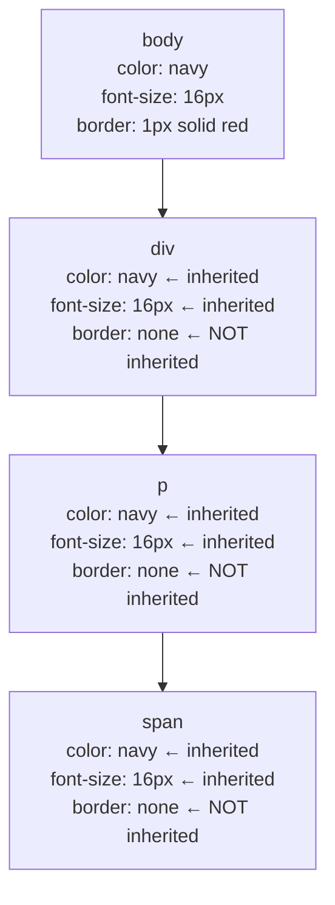
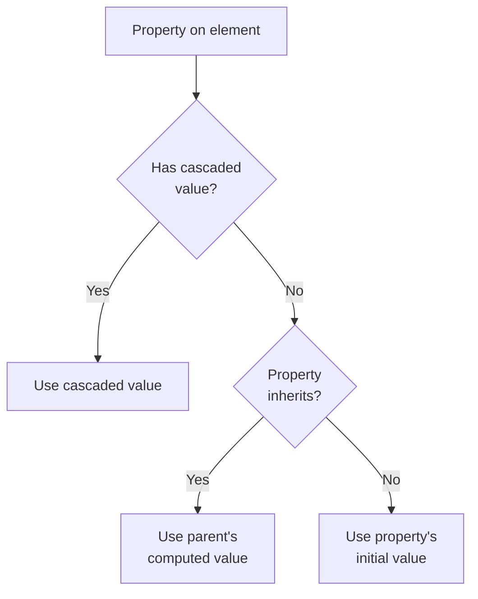

# Lesson 03 — Inheritance

## Concept

Inheritance is CSS's mechanism for propagating property values from parent to child elements **without explicit declarations**. It's separate from the cascade — inheritance only applies when no cascaded value exists for a property.



### Which Properties Inherit?

The CSS specification defines for each property whether it inherits by default. The general rule:

- **Text/typography properties inherit**: `color`, `font-*`, `line-height`, `text-align`, `letter-spacing`, `word-spacing`, `white-space`, `direction`, `writing-mode`
- **Visual properties inherit**: `visibility`, `cursor`, `list-style-*`
- **Box properties do NOT inherit**: `width`, `height`, `margin`, `padding`, `border`, `background`, `display`, `position`, `overflow`, `z-index`

**Why?** If `border` inherited, every child would have a border. If `margin` inherited, layout would be chaotic. The spec chose inheritance for properties where propagation is useful and safe.

## Experiment 01: Inheritance vs Non-Inheritance

```html
<!-- 01-inheritance-demo.html -->
<!DOCTYPE html>
<html lang="en">
<head>
  <meta charset="UTF-8">
  <title>Inheritance Demo</title>
  <style>
    .parent {
      /* INHERITABLE properties */
      color: darkblue;
      font-family: Georgia, serif;
      font-size: 20px;
      line-height: 1.8;
      text-align: center;
      letter-spacing: 1px;
      cursor: crosshair;
      word-spacing: 3px;
      
      /* NON-INHERITABLE properties */
      background: lightyellow;
      border: 3px solid coral;
      padding: 30px;
      margin: 20px;
      border-radius: 8px;
      box-shadow: 0 2px 10px rgba(0,0,0,0.1);
      width: 600px;
    }
    
    .child {
      /* No declarations — let's see what inherits */
      border: 1px dashed #ccc; /* Adding for visibility */
      margin: 10px;
      padding: 15px;
    }
    
    .grandchild {
      /* Also no declarations */
      border: 1px dotted #aaa;
      padding: 10px;
    }
    
    .info { font-family: monospace; font-size: 12px; text-align: left; }
  </style>
</head>
<body>
  <div class="parent">
    <strong>Parent</strong>
    <div class="child">
      <strong>Child</strong> — I inherit color, font, line-height, text-align, cursor
      <div class="grandchild" id="gc">
        <strong>Grandchild</strong> — I also inherit all of those
        <div class="info" id="info"></div>
      </div>
    </div>
  </div>

  <script>
    const gc = document.getElementById('gc');
    const cs = getComputedStyle(gc);
    const info = document.getElementById('info');
    
    const inherited = [
      'color', 'fontFamily', 'fontSize', 'lineHeight', 
      'textAlign', 'letterSpacing', 'cursor', 'wordSpacing'
    ];
    
    const notInherited = [
      'backgroundColor', 'border', 'padding', 
      'margin', 'borderRadius', 'boxShadow', 'width'
    ];
    
    info.innerHTML = '<br><strong>Inherited (from parent):</strong><br>';
    inherited.forEach(p => {
      info.innerHTML += `${p}: ${cs[p]}<br>`;
    });
    
    info.innerHTML += '<br><strong>NOT inherited (initial values):</strong><br>';
    notInherited.forEach(p => {
      info.innerHTML += `${p}: ${cs[p]}<br>`;
    });
  </script>
</body>
</html>
```

## Experiment 02: The inherit, initial, unset, revert Keywords

```html
<!-- 02-keywords.html -->
<!DOCTYPE html>
<html lang="en">
<head>
  <meta charset="UTF-8">
  <title>CSS Value Keywords</title>
  <style>
    body { font-family: system-ui; padding: 20px; }
    
    .parent {
      color: darkred;
      font-size: 22px;
      border: 3px solid darkred;
      padding: 20px;
      background: #fff0f0;
      margin: 20px;
    }
    
    .child {
      padding: 15px;
      margin: 8px;
      border: 1px solid #ccc;
      background: white;
    }
    
    /* inherit: force a non-inherited property to inherit */
    .inherit-demo {
      border: inherit;        /* Gets parent's 3px solid darkred */
      background: inherit;    /* Gets parent's #fff0f0 */
      padding: inherit;       /* Gets parent's 20px */
    }
    
    /* initial: use the spec's initial value (NOT browser default) */
    .initial-demo {
      color: initial;          /* initial = canvastext (usually black) */
      font-size: initial;      /* initial = medium (usually 16px) */
      display: initial;        /* initial = inline (NOT block!) */
    }
    
    /* unset: inherit if inheritable, initial if not */
    .unset-demo {
      color: unset;            /* color inherits → gets parent's darkred */
      border: unset;           /* border doesn't inherit → initial (none) */
      background: unset;       /* background doesn't inherit → initial (transparent) */
    }
    
    /* revert: use value from previous cascade origin */
    .revert-demo {
      display: revert;         /* Reverts to UA default (block for divs) */
      color: revert;           /* Reverts to UA default (black) */
      margin: revert;          /* Reverts to UA default (0) */
    }
    
    h3 { margin-top: 0; }
    code { background: #f0f0f0; padding: 2px 6px; border-radius: 3px; }
  </style>
</head>
<body>
  <div class="parent">
    <h3>Parent (color: darkred, border: 3px solid darkred)</h3>
    
    <div class="child">
      <strong>Default child</strong> — inherits color, doesn't inherit border
    </div>
    
    <div class="child inherit-demo">
      <strong><code>inherit</code></strong> — forces border, background, padding to inherit from parent
    </div>
    
    <div class="child initial-demo">
      <strong><code>initial</code></strong> — uses spec initial values 
      (note: display:initial = inline, NOT block!)
    </div>
    
    <div class="child unset-demo">
      <strong><code>unset</code></strong> — color inherits (darkred), 
      border/background go to initial (none/transparent)
    </div>
    
    <div class="child revert-demo">
      <strong><code>revert</code></strong> — reverts to previous cascade origin 
      (user-agent defaults for divs)
    </div>
  </div>

  <script>
    document.querySelectorAll('.child').forEach(el => {
      const cs = getComputedStyle(el);
      console.log(el.className, {
        color: cs.color,
        fontSize: cs.fontSize,
        display: cs.display,
        border: cs.border,
        background: cs.backgroundColor
      });
    });
  </script>
</body>
</html>
```

### Critical Distinction: initial vs revert

- `initial` → The **spec-defined** initial value (e.g., `display: initial` = `inline` for ALL elements)
- `revert` → The **browser default** for that element (e.g., `display: revert` on a `<div>` = `block`)

This is a common source of confusion. `initial` does NOT mean "browser default."

## Experiment 03: Inheritance and the Cascade Interact

```html
<!-- 03-cascade-inheritance-interaction.html -->
<!DOCTYPE html>
<html lang="en">
<head>
  <meta charset="UTF-8">
  <title>Cascade + Inheritance</title>
  <style>
    body { font-family: system-ui; padding: 20px; }
    
    .outer {
      color: navy;
      font-size: 20px;
    }
    
    .middle {
      /* No color set — inherits navy from .outer */
    }
    
    .inner {
      /* Does inner get navy from .outer via inheritance
         through .middle? YES.
         
         But what if we set a *different* property on .middle
         that affects color? */
    }
    
    /* What if .middle has a lower-specificity rule? */
    div { color: gray; }  /* (0,0,1) applies to .middle too */
    .outer { color: navy; } /* (0,1,0) applies to .outer, wins over div */
    
    /* .middle matches `div { color: gray }` with (0,0,1)
       This IS set on .middle — so .inner inherits gray, not navy! */
    
    .annotation {
      font-family: monospace;
      font-size: 13px;
      background: #f5f5f5;
      padding: 10px;
      margin: 10px 0;
      border-left: 3px solid coral;
    }
  </style>
</head>
<body>
  <div class="outer">
    <strong>.outer</strong> — color: navy (wins over `div { color: gray }` by specificity)
    <div class="middle">
      <strong>.middle</strong> — color: GRAY (matches `div { color: gray }`)
      <div class="inner" id="inner">
        <strong>.inner</strong> — what color am I?
      </div>
    </div>
  </div>
  
  <div class="annotation">
    <strong>Key insight:</strong> .inner inherits from .middle (its parent), 
    not from .outer (its grandparent). Since .middle has a cascaded value 
    of gray (from the <code>div</code> rule), .inner inherits gray.
    <br><br>
    Inheritance happens from the <strong>computed value of the parent</strong>, 
    not from any ancestor directly.
  </div>

  <script>
    console.log('Inner color:', getComputedStyle(document.getElementById('inner')).color);
  </script>
</body>
</html>
```

### Inheritance Order



Inheritance is the **fallback** when no cascaded value exists. It's step 3 in the value resolution pipeline (Specified Value).

## Summary

| Concept | Key Point |
|---|---|
| Inheritable properties | Typography, text, cursor, visibility, list-style |
| Non-inheritable properties | Box model, layout, background, positioning |
| `inherit` | Force any property to inherit from parent |
| `initial` | Spec's initial value (NOT browser default) |
| `unset` | inherit if inheritable, initial otherwise |
| `revert` | Browser default (user-agent origin value) |
| Inheritance source | Always parent's **computed** value, not grandparent |
| Cascade vs Inheritance | Cascade wins; inheritance is the fallback |

## Next

→ [Lesson 04: Cascade Layers](04-cascade-layers.md) — `@layer` and modern cascade control
