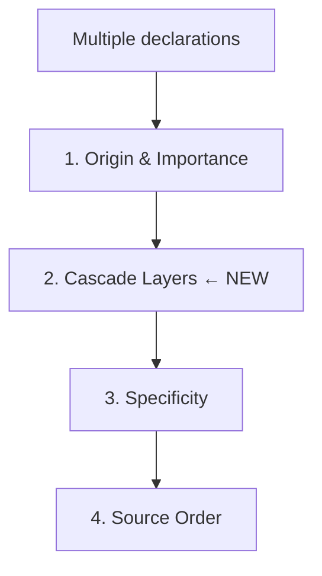
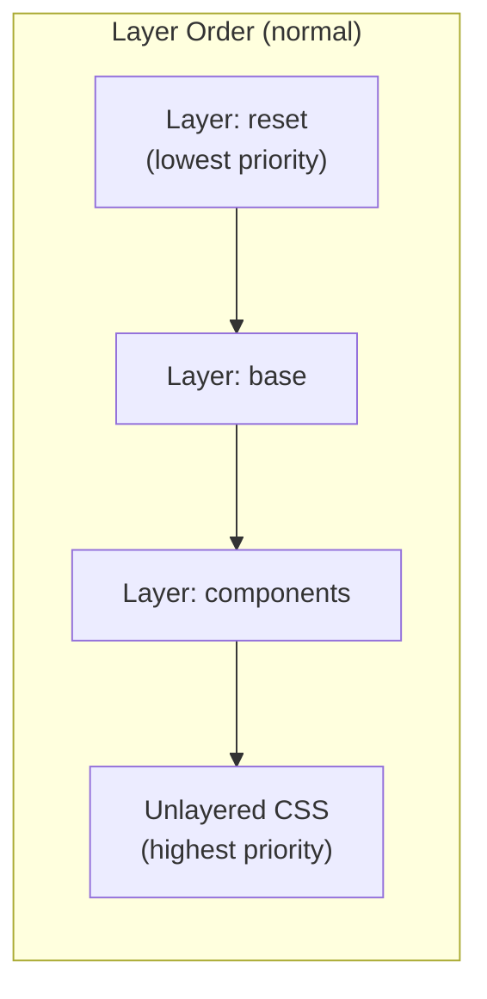
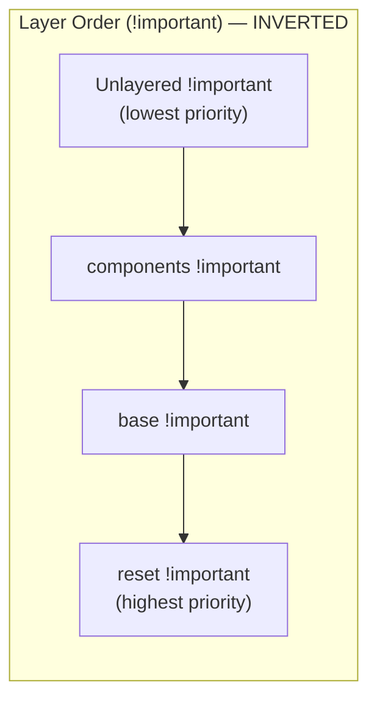

# Lesson 04 — Cascade Layers (@layer)

## Concept

Cascade layers (`@layer`) are a modern CSS feature that gives you explicit control over the cascade **between specificity and source order**. They solve the specificity escalation problem.



### The Problem Layers Solve

Without layers, the only ways to "win" the cascade are:
1. Higher specificity (leads to selector bloat)
2. Source order (fragile)
3. `!important` (leads to escalation wars)

With layers, you can define an **explicit priority order** that specificity cannot override.

### How Layers Work



**Critical rule**: **Unlayered CSS always beats layered CSS** (for normal declarations). Within layers, **later-declared layers win**.

For `!important` declarations, the order **inverts** (like origins):



## Experiment 01: Basic Layer Declaration

```html
<!-- 01-basic-layers.html -->
<!DOCTYPE html>
<html lang="en">
<head>
  <meta charset="UTF-8">
  <title>Basic Cascade Layers</title>
  <style>
    /* Declare layer order up front */
    @layer reset, base, components, utilities;
    
    /* Reset layer (lowest priority) */
    @layer reset {
      * { margin: 0; padding: 0; box-sizing: border-box; }
      body { font-family: system-ui; }
      a { text-decoration: none; }
    }
    
    /* Base layer */
    @layer base {
      body { padding: 20px; color: #333; line-height: 1.6; }
      h2 { color: navy; margin-bottom: 10px; }
      p { margin-bottom: 10px; }
      a { color: cornflowerblue; }
      a:hover { text-decoration: underline; }
    }
    
    /* Components layer */
    @layer components {
      .card {
        border: 1px solid #ddd;
        border-radius: 8px;
        padding: 20px;
        margin: 15px 0;
        background: white;
        box-shadow: 0 1px 3px rgba(0,0,0,0.1);
      }
      
      .card a {
        color: coral;                /* Higher specificity (0,1,1) */
        font-weight: bold;
      }
      
      .btn {
        display: inline-block;
        padding: 8px 16px;
        background: cornflowerblue;
        color: white;
        border-radius: 4px;
        border: none;
        cursor: pointer;
      }
    }
    
    /* Utilities layer (highest among layers) */
    @layer utilities {
      .text-red { color: red; }      /* (0,1,0) */
      .text-center { text-align: center; }
      .hidden { display: none; }
    }
    
    /* UNLAYERED CSS (beats ALL layers regardless of specificity) */
    .override-demo {
      color: darkgreen;              /* (0,1,0) — beats even high-specificity layered rules */
    }
  </style>
</head>
<body>
  <h2>Cascade Layers Demo</h2>
  
  <div class="card">
    <p>Link from base layer: <a href="#">base link (blue)</a></p>
    <p>Link from components layer: <a href="#" class="text-red">components says coral, utilities says red — who wins?</a></p>
  </div>
  
  <div class="card">
    <p class="override-demo">
      <a href="#">This link is in a card, but .override-demo is unlayered — 
      unlayered CSS beats all layers</a>
    </p>
  </div>
  
  <pre style="font-size: 13px; background: #f5f5f5; padding: 15px; border-radius: 4px;">
Layer priority (normal declarations):

@layer reset      — lowest priority (declared first)
@layer base       — next
@layer components — next  
@layer utilities  — highest among layers (declared last)
(unlayered CSS)   — ALWAYS highest priority

Even if a reset layer rule has specificity (1,0,0) and an unlayered rule
has specificity (0,0,1), the unlayered rule wins.
  </pre>
</body>
</html>
```

## Experiment 02: Layers vs Specificity

```html
<!-- 02-layers-vs-specificity.html -->
<!DOCTYPE html>
<html lang="en">
<head>
  <meta charset="UTF-8">
  <title>Layers vs Specificity</title>
  <style>
    @layer low, high;
    
    /* Low-priority layer with HIGH specificity */
    @layer low {
      body div#main .container p.text span.target {
        color: red;
        font-size: 24px;
        /* Specificity: (1, 3, 3) — very high! */
      }
    }
    
    /* High-priority layer with LOW specificity */
    @layer high {
      .target {
        color: green;
        font-size: 18px;
        /* Specificity: (0, 1, 0) — very low! */
      }
    }
    
    body { font-family: system-ui; padding: 20px; }
    .result { 
      margin: 20px 0; 
      padding: 20px; 
      border: 2px solid #ccc; 
      border-radius: 4px; 
    }
    .explanation { 
      font-family: monospace; 
      font-size: 14px; 
      background: #e8f5e9; 
      padding: 15px; 
      border-left: 4px solid green;
      margin: 15px 0;
    }
  </style>
</head>
<body>
  <div id="main">
    <div class="container">
      <div class="result">
        <p class="text">
          <span class="target">
            I am GREEN and 18px — the "high" layer wins even though the "low" layer 
            has MUCH higher specificity!
          </span>
        </p>
      </div>
    </div>
  </div>
  
  <div class="explanation">
    <strong>Cascade resolution order:</strong><br>
    1. Origin & Importance → Same (both author, both normal)<br>
    2. Cascade Layers → "high" layer beats "low" layer ← WINNER DECIDED HERE<br>
    3. Specificity → Never reached!<br>
    4. Source Order → Never reached!<br>
    <br>
    <strong>This is the power of @layer</strong> — it eliminates specificity wars entirely.
    You no longer need to escalate selectors or use !important to override framework styles.
  </div>
</body>
</html>
```

## Experiment 03: Real-World Layer Architecture

```html
<!-- 03-real-world-layers.html -->
<!DOCTYPE html>
<html lang="en">
<head>
  <meta charset="UTF-8">
  <title>Real-World Layer Architecture</title>
  <style>
    /* 
      Define the layer order FIRST.
      Later @layer blocks add to these layers.
      The ORDER of this declaration determines priority.
    */
    @layer reset, tokens, base, layout, components, utilities;
    
    /* === RESET: Normalize browser defaults === */
    @layer reset {
      *, *::before, *::after {
        margin: 0;
        padding: 0;
        box-sizing: border-box;
      }
      html { 
        -webkit-text-size-adjust: 100%;
        text-size-adjust: 100%;
      }
    }
    
    /* === TOKENS: Design tokens (CSS custom properties) === */
    @layer tokens {
      :root {
        --color-primary: #3b82f6;
        --color-primary-dark: #1d4ed8;
        --color-surface: #ffffff;
        --color-text: #1e293b;
        --color-text-muted: #64748b;
        --color-border: #e2e8f0;
        --radius: 6px;
        --shadow: 0 1px 3px rgba(0,0,0,0.1);
        --font-sans: system-ui, -apple-system, sans-serif;
        --font-mono: 'SF Mono', Consolas, monospace;
        --space-1: 4px;
        --space-2: 8px;
        --space-3: 12px;
        --space-4: 16px;
        --space-6: 24px;
        --space-8: 32px;
      }
    }
    
    /* === BASE: Element defaults === */
    @layer base {
      body {
        font-family: var(--font-sans);
        color: var(--color-text);
        line-height: 1.6;
        background: #f8fafc;
      }
      h1, h2, h3 { line-height: 1.3; }
      a { color: var(--color-primary); }
      code { 
        font-family: var(--font-mono); 
        background: #f1f5f9; 
        padding: 2px 6px; 
        border-radius: 3px; 
        font-size: 0.9em;
      }
    }
    
    /* === LAYOUT: Page layout === */
    @layer layout {
      .page { max-width: 800px; margin: 0 auto; padding: var(--space-6); }
      .stack > * + * { margin-top: var(--space-4); }
      .cluster { display: flex; flex-wrap: wrap; gap: var(--space-3); }
    }
    
    /* === COMPONENTS: UI components === */
    @layer components {
      .card {
        background: var(--color-surface);
        border: 1px solid var(--color-border);
        border-radius: var(--radius);
        padding: var(--space-6);
        box-shadow: var(--shadow);
      }
      
      .btn {
        display: inline-flex;
        align-items: center;
        padding: var(--space-2) var(--space-4);
        border-radius: var(--radius);
        font-size: 14px;
        font-weight: 500;
        cursor: pointer;
        border: 1px solid transparent;
        transition: all 0.15s ease;
      }
      
      .btn-primary {
        background: var(--color-primary);
        color: white;
      }
      .btn-primary:hover {
        background: var(--color-primary-dark);
      }
      
      .badge {
        display: inline-block;
        padding: 2px 8px;
        border-radius: 100px;
        font-size: 12px;
        font-weight: 600;
        background: #dbeafe;
        color: var(--color-primary-dark);
      }
    }
    
    /* === UTILITIES: Override anything (except unlayered) === */
    @layer utilities {
      .text-center { text-align: center; }
      .text-muted { color: var(--color-text-muted); }
      .mt-4 { margin-top: var(--space-4); }
      .mb-0 { margin-bottom: 0; }
      .font-bold { font-weight: 700; }
      .sr-only { 
        position: absolute; width: 1px; height: 1px;
        padding: 0; margin: -1px; overflow: hidden;
        clip: rect(0,0,0,0); border: 0;
      }
    }
    
    /* 
      UNLAYERED CSS — Page-specific overrides
      This beats ALL layers without needing high specificity.
    */
    .hero-title { font-size: 2rem; color: var(--color-primary-dark); }
  </style>
</head>
<body>
  <div class="page stack">
    <h1 class="hero-title text-center">Layer Architecture Demo</h1>
    
    <div class="card">
      <h2>Component Card</h2>
      <p class="text-muted">
        This card's styles come from the <code>components</code> layer.
        The <code>.text-muted</code> class comes from <code>utilities</code> layer,
        which has higher priority.
      </p>
      <div class="cluster mt-4">
        <button class="btn btn-primary">Primary Action</button>
        <span class="badge">New</span>
      </div>
    </div>
    
    <div class="card">
      <h2>Why This Architecture Works</h2>
      <ol class="stack">
        <li><strong>reset</strong> — Normalize browser quirks (lowest priority)</li>
        <li><strong>tokens</strong> — Design tokens via custom properties</li>
        <li><strong>base</strong> — Sensible element defaults</li>
        <li><strong>layout</strong> — Structural patterns</li>
        <li><strong>components</strong> — UI component styles</li>
        <li><strong>utilities</strong> — Single-purpose overrides</li>
        <li><strong>unlayered</strong> — Page-specific styles (highest priority)</li>
      </ol>
    </div>
  </div>
</body>
</html>
```

## Experiment 04: Importing External CSS into Layers

```html
<!-- 04-import-into-layers.html -->
<!DOCTYPE html>
<html lang="en">
<head>
  <meta charset="UTF-8">
  <title>Importing into Layers</title>
  <style>
    /* You can import external stylesheets into specific layers */
    /* @import url("framework.css") layer(framework); */
    /* @import url("custom.css") layer(custom); */
    
    /* Declare order */
    @layer framework, custom;
    
    /* Simulate a CSS framework */
    @layer framework {
      .btn {
        background: #6c757d !important; /* Framework unwisely uses !important */
        color: white;
        padding: 10px 20px;
        border: none;
        border-radius: 4px;
        cursor: pointer;
        font-size: 16px;
      }
      
      .card {
        border: 1px solid #dee2e6;
        border-radius: 8px;
        padding: 20px;
      }
    }
    
    /* Your customizations */
    @layer custom {
      .btn {
        background: #0d6efd; /* Without !important — but layer order wins */
        border-radius: 20px;
      }
    }
    
    body { font-family: system-ui; padding: 20px; }
    .demo { margin: 20px; }
    .note {
      background: #fff3cd;
      border: 1px solid #ffc107;
      padding: 15px;
      border-radius: 4px;
      margin: 15px 0;
    }
  </style>
</head>
<body>
  <div class="demo">
    <button class="btn">Button</button>
    
    <div class="note">
      <strong>Note about !important in layers:</strong>
      <p>The framework uses <code>background: #6c757d !important</code> in the 
      <code>framework</code> layer.</p>
      <p>For <code>!important</code> declarations, layer priority is <strong>inverted</strong>. 
      The <code>framework</code> layer (declared first) actually has <strong>higher</strong> 
      !important priority than the <code>custom</code> layer.</p>
      <p>This means the framework's !important wins. To fix this, 
      the custom layer would also need !important (which it then wins because 
      for !important, first-declared layer wins).</p>
      <p><em>Wait — that's wrong. Let me correct: for !important, earlier layers 
      have HIGHER priority. So framework !important beats custom !important.</em></p>
      <p><strong>The real solution:</strong> Don't put !important in layers. 
      Use @layer for clean cascade control without !important.</p>
    </div>
  </div>
</body>
</html>
```

## Summary

| Concept | Key Point |
|---|---|
| `@layer` | Cascade step between origin and specificity |
| Layer order | Later layers have higher priority (normal declarations) |
| `!important` in layers | Priority inverts — earlier layers win |
| Unlayered CSS | Always beats layered CSS (normal) |
| Layer declaration | `@layer name1, name2, name3;` sets order |
| Import into layer | `@import url(...) layer(name);` |
| Use case | Eliminating specificity wars, architecture control |
| Best practice | Don't use `!important` inside layers |

## Next

→ [Lesson 05: Cascade Experiments](05-cascade-experiments.md) — Hands-on exercises combining all cascade concepts
