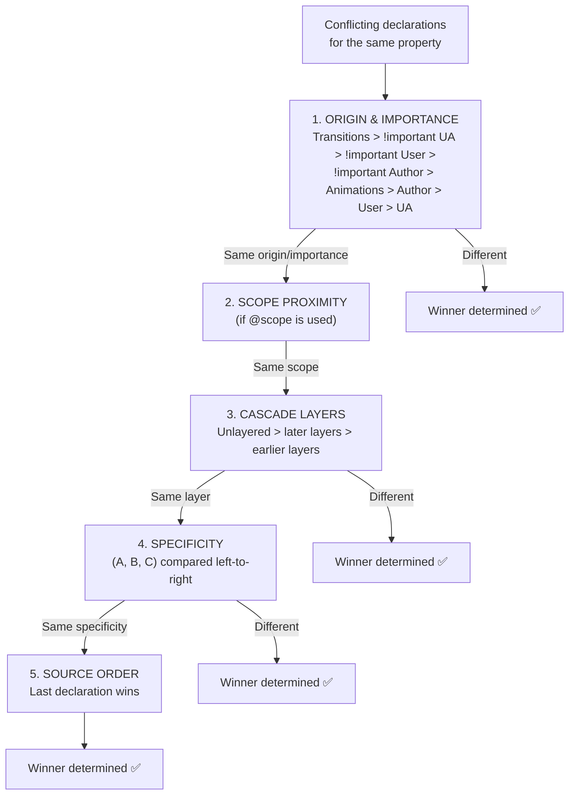

# Lesson 05 — Cascade Experiments

## Hands-On Exercises

These exercises combine cascade origins, specificity, inheritance, and layers. For each, **predict the outcome before running the code**.

## Exercise 01: The Cascade Gauntlet

```html
<!-- 01-cascade-gauntlet.html -->
<!DOCTYPE html>
<html lang="en">
<head>
  <meta charset="UTF-8">
  <title>Cascade Gauntlet</title>
  <style>
    body { font-family: system-ui; padding: 20px; }
    
    @layer base, components;
    
    /* Unlayered rule */
    p { color: gray; }                            /* (0,0,1) unlayered */
    
    @layer base {
      p { color: red; }                           /* (0,0,1) in base */
      .text { color: blue; }                      /* (0,1,0) in base */
      #target { color: purple; }                  /* (1,0,0) in base */
    }
    
    @layer components {
      p { color: green; }                         /* (0,0,1) in components */
      .card p { color: orange; }                  /* (0,1,1) in components */
    }
    
    .challenge { 
      border: 2px solid #ccc; padding: 20px; margin: 20px; 
      border-radius: 4px; background: #fafafa; 
    }
    .answer { 
      display: none; font-family: monospace; font-size: 13px; 
      background: #e8f5e9; padding: 10px; margin-top: 10px;
      border-left: 3px solid green;
    }
    .answer.show { display: block; }
    button { padding: 4px 12px; cursor: pointer; }
  </style>
</head>
<body>
  <h1>Cascade Gauntlet</h1>
  <p><em>Predict the color of each paragraph before revealing the answer.</em></p>
  
  <div class="challenge">
    <h3>Challenge 1</h3>
    <p id="c1">What color am I?</p>
    <p><em>Rules that match: <code>p { color: gray }</code> (unlayered), 
    <code>p { color: red }</code> (base layer), <code>p { color: green }</code> (components layer)</em></p>
    <button onclick="this.nextElementSibling.classList.toggle('show')">Reveal</button>
    <div class="answer">
      <strong>GRAY</strong><br>
      Unlayered CSS beats ALL layered CSS (same origin, normal importance).
      Layer order doesn't matter — unlayered always wins.
    </div>
  </div>
  
  <div class="challenge">
    <h3>Challenge 2</h3>
    <div class="card">
      <p class="text" id="c2">What color am I?</p>
    </div>
    <p><em>Rules: <code>p { gray }</code> (unlayered), <code>.text { blue }</code> (base), 
    <code>.card p { orange }</code> (components)</em></p>
    <button onclick="this.nextElementSibling.classList.toggle('show')">Reveal</button>
    <div class="answer">
      <strong>GRAY</strong><br>
      The unlayered <code>p { color: gray }</code> with specificity (0,0,1) beats 
      BOTH layered rules regardless of their higher specificity.
      Layers are checked BEFORE specificity in the cascade algorithm.
    </div>
  </div>
  
  <div class="challenge">
    <h3>Challenge 3</h3>
    <p class="text" id="target">What color am I?</p>
    <p><em>Rules: <code>p { gray }</code> (unlayered), <code>#target { purple }</code> (base layer), 
    <code>.text { blue }</code> (base layer)</em></p>
    <button onclick="this.nextElementSibling.classList.toggle('show')">Reveal</button>
    <div class="answer">
      <strong>GRAY</strong><br>
      Even <code>#target</code> with ID specificity (1,0,0) loses because it's in a layer.
      Unlayered <code>p</code> (0,0,1) wins.
    </div>
  </div>

  <script>
    // Verify
    ['c1', 'c2', 'target'].forEach(id => {
      const el = document.getElementById(id);
      if (el) console.log(`${id}:`, getComputedStyle(el).color);
    });
  </script>
</body>
</html>
```

## Exercise 02: Specificity Calculator

Build a tool that calculates specificity:

```html
<!-- 02-specificity-calculator.html -->
<!DOCTYPE html>
<html lang="en">
<head>
  <meta charset="UTF-8">
  <title>Specificity Calculator</title>
  <style>
    * { box-sizing: border-box; margin: 0; padding: 0; }
    body { font-family: system-ui; padding: 30px; background: #f5f5f5; }
    
    .calculator {
      max-width: 700px;
      margin: 0 auto;
      background: white;
      border-radius: 8px;
      padding: 30px;
      box-shadow: 0 2px 10px rgba(0,0,0,0.1);
    }
    
    h1 { margin-bottom: 20px; color: #333; }
    
    .input-group { margin-bottom: 20px; }
    label { display: block; margin-bottom: 5px; font-weight: 600; color: #555; }
    input[type="text"] {
      width: 100%;
      padding: 12px;
      border: 2px solid #ddd;
      border-radius: 6px;
      font-family: 'SF Mono', Consolas, monospace;
      font-size: 16px;
    }
    input:focus { outline: none; border-color: cornflowerblue; }
    
    .result {
      padding: 20px;
      background: #f0f4ff;
      border-radius: 6px;
      margin-top: 15px;
    }
    
    .specificity-display {
      display: flex;
      gap: 5px;
      justify-content: center;
      margin: 15px 0;
    }
    
    .spec-part {
      display: flex;
      flex-direction: column;
      align-items: center;
      padding: 10px 20px;
      border-radius: 6px;
      min-width: 80px;
    }
    
    .spec-value { font-size: 36px; font-weight: 800; }
    .spec-label { font-size: 11px; text-transform: uppercase; letter-spacing: 1px; color: #666; }
    
    .spec-a { background: #fee2e2; color: #dc2626; }
    .spec-b { background: #dbeafe; color: #2563eb; }
    .spec-c { background: #dcfce7; color: #16a34a; }
    
    .breakdown { 
      font-family: monospace; font-size: 13px; 
      margin-top: 10px; color: #555; 
    }
    
    .examples { margin-top: 20px; }
    .example-btn {
      padding: 6px 12px;
      margin: 3px;
      border: 1px solid #ddd;
      background: white;
      border-radius: 4px;
      cursor: pointer;
      font-family: monospace;
      font-size: 13px;
    }
    .example-btn:hover { background: #f0f0f0; }
  </style>
</head>
<body>
  <div class="calculator">
    <h1>CSS Specificity Calculator</h1>
    
    <div class="input-group">
      <label for="selector">Enter a CSS selector:</label>
      <input type="text" id="selector" placeholder="e.g., #main .content > p:first-child::before" 
             oninput="calculate()" value="#main .content > p:first-child::before">
    </div>
    
    <div class="result" id="result"></div>
    
    <div class="examples">
      <strong>Try these:</strong><br>
      <button class="example-btn" onclick="tryExample(this)">*</button>
      <button class="example-btn" onclick="tryExample(this)">div</button>
      <button class="example-btn" onclick="tryExample(this)">.class</button>
      <button class="example-btn" onclick="tryExample(this)">#id</button>
      <button class="example-btn" onclick="tryExample(this)">div.class#id</button>
      <button class="example-btn" onclick="tryExample(this)">.a.b.c.d.e.f.g.h.i.j.k</button>
      <button class="example-btn" onclick="tryExample(this)">#a #b #c</button>
      <button class="example-btn" onclick="tryExample(this)">ul li a span</button>
      <button class="example-btn" onclick="tryExample(this)">nav > ul > li > a:hover</button>
      <button class="example-btn" onclick="tryExample(this)">input[type="text"]:focus</button>
      <button class="example-btn" onclick="tryExample(this)">p::first-line</button>
      <button class="example-btn" onclick="tryExample(this)">::before</button>
    </div>
  </div>

  <script>
    function calculateSpecificity(selector) {
      let a = 0, b = 0, c = 0;
      const parts = { ids: [], classes: [], types: [] };
      
      // Remove pseudo-elements (count as type)
      let s = selector.replace(/::(before|after|first-line|first-letter|placeholder|marker|selection|backdrop)/gi, 
        (m) => { c++; parts.types.push(m); return ''; });
      
      // Count IDs
      s = s.replace(/#[\w-]+/g, (m) => { a++; parts.ids.push(m); return ''; });
      
      // Count classes, attributes, pseudo-classes
      s = s.replace(/\.[\w-]+/g, (m) => { b++; parts.classes.push(m); return ''; });
      s = s.replace(/\[.*?\]/g, (m) => { b++; parts.classes.push(m); return ''; });
      s = s.replace(/:[\w-]+(\(.*?\))?/g, (m) => { 
        if (m === ':where' || m.startsWith(':where(')) return '';
        b++; parts.classes.push(m); return ''; 
      });
      
      // Count type selectors (remaining words that aren't combinators)
      s = s.replace(/[>+~*\s,]/g, ' ').trim();
      const types = s.split(/\s+/).filter(t => t && /^[a-zA-Z]/.test(t));
      types.forEach(t => { c++; parts.types.push(t); });
      
      // * has zero specificity
      return { a, b, c, parts };
    }
    
    function calculate() {
      const input = document.getElementById('selector').value.trim();
      const result = document.getElementById('result');
      
      if (!input) { result.innerHTML = ''; return; }
      
      const spec = calculateSpecificity(input);
      
      result.innerHTML = `
        <div class="specificity-display">
          <div class="spec-part spec-a">
            <span class="spec-value">${spec.a}</span>
            <span class="spec-label">IDs</span>
          </div>
          <div class="spec-part spec-b">
            <span class="spec-value">${spec.b}</span>
            <span class="spec-label">Classes</span>
          </div>
          <div class="spec-part spec-c">
            <span class="spec-value">${spec.c}</span>
            <span class="spec-label">Types</span>
          </div>
        </div>
        <div class="breakdown">
          ${spec.parts.ids.length ? '🔴 IDs: ' + spec.parts.ids.join(', ') + '<br>' : ''}
          ${spec.parts.classes.length ? '🔵 Classes/Attrs/Pseudos: ' + spec.parts.classes.join(', ') + '<br>' : ''}
          ${spec.parts.types.length ? '🟢 Types/Pseudo-elements: ' + spec.parts.types.join(', ') : ''}
          ${!spec.a && !spec.b && !spec.c ? '⚪ Zero specificity (universal selector or :where())' : ''}
        </div>
      `;
    }
    
    function tryExample(btn) {
      document.getElementById('selector').value = btn.textContent;
      calculate();
    }
    
    // Initial calculation
    calculate();
  </script>
</body>
</html>
```

## Exercise 03: Debugging Cascade Conflicts

```html
<!-- 03-debug-cascade.html -->
<!DOCTYPE html>
<html lang="en">
<head>
  <meta charset="UTF-8">
  <title>Debug Cascade Conflicts</title>
  <style>
    body { font-family: system-ui; padding: 20px; }
    
    /* === THE BUG SCENARIO === */
    /* A developer is trying to make the nav links white on hover,
       but they stay blue. Find out why. */
    
    /* Framework styles (loaded first) */
    .site-header .nav-list a.nav-link {
      color: #333;
      text-decoration: none;
      padding: 8px 16px;
      display: inline-block;
    }
    
    .site-header .nav-list a.nav-link:hover {
      color: #0066cc;  /* Specificity: (0, 3, 2) including :hover */
      background: #f0f0f0;
    }
    
    /* Developer's attempted override (doesn't work!) */
    .nav-link:hover {
      color: white;     /* Specificity: (0, 2, 0) — LOSES to (0, 3, 2)! */
      background: #333;
    }
    
    /* === THE FIX (uncomment one option) === */
    
    /* Fix 1: Match specificity */
    /* .site-header .nav-list a.nav-link:hover { color: white; background: #333; } */
    
    /* Fix 2: Use @layer to put framework in lower layer */
    /* @layer framework, overrides; */
    /* But we'd need to restructure the CSS... */
    
    /* Fix 3: Use :where() to lower framework specificity */
    /* But we'd need to modify the framework... */
    
    .debug-panel {
      background: #fff3cd;
      border: 1px solid #ffc107;
      padding: 20px;
      margin: 20px 0;
      border-radius: 4px;
      font-size: 14px;
    }
    
    .site-header {
      background: #f8f9fa;
      padding: 10px 20px;
      border: 1px solid #dee2e6;
      border-radius: 4px;
    }
    
    .nav-list { list-style: none; display: flex; gap: 4px; }
  </style>
</head>
<body>
  <h1>Cascade Debugging Exercise</h1>
  
  <header class="site-header">
    <nav>
      <ul class="nav-list">
        <li><a href="#" class="nav-link">Home</a></li>
        <li><a href="#" class="nav-link">About</a></li>
        <li><a href="#" class="nav-link">Contact</a></li>
      </ul>
    </nav>
  </header>
  
  <div class="debug-panel">
    <h3>🐛 Bug Report</h3>
    <p>"The nav links should turn white with a dark background on hover, 
    but they stay blue!"</p>
    
    <h3>🔍 Debug Steps</h3>
    <ol>
      <li>Open DevTools → select a nav link → trigger :hover state 
          (click the :hov toggle in the Styles panel)</li>
      <li>Look at the Styles panel — you'll see your <code>.nav-link:hover</code> rule 
          is crossed out</li>
      <li>The framework's <code>.site-header .nav-list a.nav-link:hover</code> has 
          specificity (0,3,2)</li>
      <li>Your <code>.nav-link:hover</code> only has specificity (0,2,0)</li>
      <li>The framework wins!</li>
    </ol>
    
    <h3>✅ Solutions</h3>
    <ol>
      <li><strong>Match or exceed specificity</strong> — reliable but leads to escalation</li>
      <li><strong>Use @layer</strong> — put the framework in a lower-priority layer</li>
      <li><strong>Use :where() in the framework</strong> — if you control the framework, 
          wrap selectors in :where() for zero specificity defaults</li>
    </ol>
  </div>
</body>
</html>
```

## Summary

The complete cascade algorithm:



## Next Module

→ [Module 03: The Box Model Revisited](../03-box-model/README.md) — Deep dive into the CSS box model
