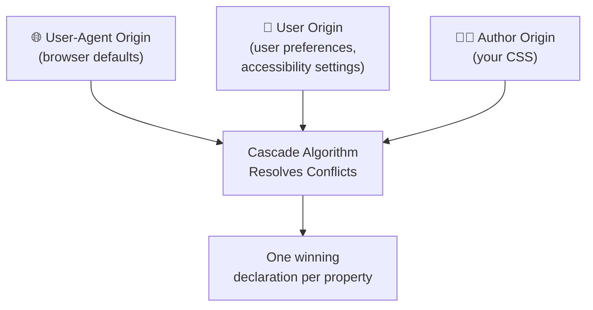
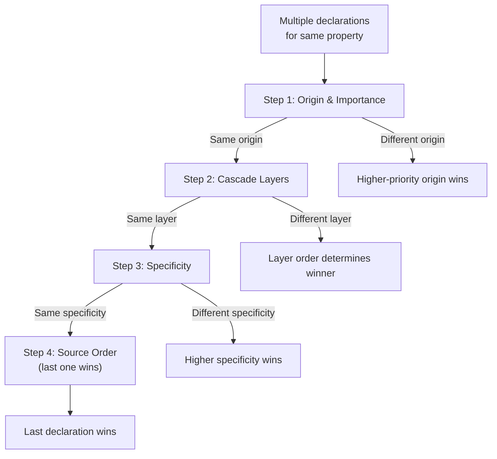

# Module 02 — The Cascade (The Core of CSS)

> The cascade is the **central algorithm** of CSS. It determines which CSS declaration wins when multiple rules target the same element and property. Every CSS developer uses the cascade constantly — few understand it deeply.

## Why the Cascade Exists

CSS was designed for a world where **multiple parties** contribute styles to a single document:

Without the cascade, there would be no way to predictably resolve conflicts between browser defaults, user preferences, and author styles. The cascade is the **conflict resolution algorithm**.

## Cascade Resolution: The Full Algorithm

## Lessons

| # | Lesson | Topic |
|---|---|---|
| 01 | [Cascade Origins & Importance](01-cascade-origins.md) | The three origins and `!important` |
| 02 | [Specificity Deep Dive](02-specificity.md) | How specificity is calculated and compared |
| 03 | [Inheritance](03-inheritance.md) | How properties propagate down the tree |
| 04 | [Cascade Layers](04-cascade-layers.md) | `@layer` and modern cascade control |
| 05 | [Cascade Experiments](05-cascade-experiments.md) | Hands-on exercises combining all concepts |

## Key Concepts

After this module you will:
- Know the exact algorithm browsers use to resolve CSS conflicts
- Understand the three cascade origins and their priority order
- Calculate specificity for any selector
- Use `@layer` to control cascade ordering
- Understand why `!important` inverts the origin order
- Debug specificity wars in production codebases

→ Start with [Lesson 01: Cascade Origins & Importance](01-cascade-origins.md)
