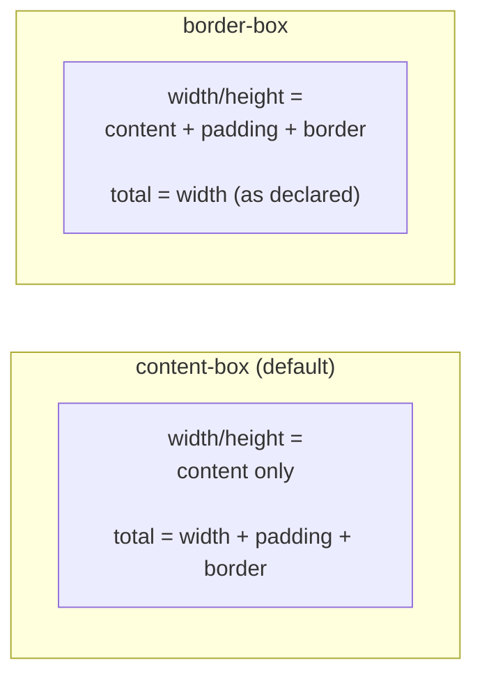

# Lesson 02 — box-sizing

## Concept

The `box-sizing` property determines what `width` and `height` refer to.



### content-box (CSS default)

`width: 300px` means the **content area** is 300px. Padding and border are **added on top**.

Total rendered width = 300 + paddingLeft + paddingRight + borderLeft + borderRight

### border-box

`width: 300px` means the **total box** (content + padding + border) is 300px. Adding padding **shrinks** the content area.

Total rendered width = 300 (padding and border are subtracted from content)

## Experiment 01: Side-by-Side Comparison

```html
<!-- 01-box-sizing-comparison.html -->
<!DOCTYPE html>
<html lang="en">
<head>
  <meta charset="UTF-8">
  <title>box-sizing Comparison</title>
  <style>
    body { font-family: system-ui; padding: 30px; margin: 0; }
    
    .container {
      width: 400px;
      background: #f0f0f0;
      border: 1px solid #ccc;
      padding: 20px;
      margin-bottom: 30px;
    }
    
    .content-box-demo {
      box-sizing: content-box;
      width: 300px;
      padding: 20px;
      border: 5px solid navy;
      background: lightyellow;
      margin-bottom: 10px;
    }
    
    .border-box-demo {
      box-sizing: border-box;
      width: 300px;
      padding: 20px;
      border: 5px solid darkred;
      background: #fff0f0;
    }
    
    .label { font-family: monospace; font-size: 12px; }
  </style>
</head>
<body>
  <h2>box-sizing Comparison (both set to width: 300px)</h2>
  
  <div class="container">
    <div class="content-box-demo" id="cb">
      <div class="label">box-sizing: content-box</div>
      content width = 300px<br>
      total rendered = 300 + 40 + 10 = 350px
    </div>
    
    <div class="border-box-demo" id="bb">
      <div class="label">box-sizing: border-box</div>
      total width = 300px<br>
      content width = 300 - 40 - 10 = 250px
    </div>
  </div>

  <script>
    function measure(id) {
      const el = document.getElementById(id);
      const cs = getComputedStyle(el);
      console.log(`${id}:`, {
        boxSizing: cs.boxSizing,
        declaredWidth: '300px',
        computedWidth: cs.width,
        offsetWidth: el.offsetWidth,
        clientWidth: el.clientWidth,
      });
    }
    measure('cb');
    measure('bb');
  </script>
</body>
</html>
```

### What to Observe

- `content-box`: `offsetWidth` = 350px (300 + 20×2 + 5×2). The box is wider than 300px!
- `border-box`: `offsetWidth` = 300px. The content area shrinks to accommodate padding and border.

## Experiment 02: Why border-box Is Almost Always What You Want

```html
<!-- 02-why-border-box.html -->
<!DOCTYPE html>
<html lang="en">
<head>
  <meta charset="UTF-8">
  <title>Why border-box</title>
  <style>
    body { font-family: system-ui; padding: 30px; margin: 0; }
    
    h3 { margin: 20px 0 10px; }
    
    /* === Problem: content-box breaks percentage layouts === */
    .grid-content-box {
      display: flex;
      width: 600px;
      background: #f0f0f0;
      border: 1px solid #ccc;
      margin-bottom: 20px;
    }
    
    .grid-content-box .col {
      box-sizing: content-box;
      width: 50%;
      padding: 20px;
      border: 2px solid navy;
      background: lightyellow;
    }
    
    /* === Solution: border-box makes percentages work === */
    .grid-border-box {
      display: flex;
      width: 600px;
      background: #f0f0f0;
      border: 1px solid #ccc;
    }
    
    .grid-border-box .col {
      box-sizing: border-box;
      width: 50%;
      padding: 20px;
      border: 2px solid darkgreen;
      background: #f0fff0;
    }
    
    /* === The Universal Reset === */
    /*
    *, *::before, *::after {
      box-sizing: border-box;
    }
    */
    
    .warning {
      background: #fff3cd;
      border: 1px solid #ffc107;
      padding: 15px;
      border-radius: 4px;
      margin: 20px 0;
    }
  </style>
</head>
<body>
  <h2>Why border-box Wins</h2>
  
  <h3>content-box: Two 50% columns with padding (BROKEN)</h3>
  <div class="grid-content-box">
    <div class="col">50% + padding + border = MORE than 50% → overflow!</div>
    <div class="col">50% + padding + border = MORE than 50% → overflow!</div>
  </div>
  
  <h3>border-box: Two 50% columns with padding (WORKS)</h3>
  <div class="grid-border-box">
    <div class="col">50% includes padding + border → fits perfectly</div>
    <div class="col">50% includes padding + border → fits perfectly</div>
  </div>
  
  <div class="warning">
    <h3>The Universal box-sizing Reset</h3>
    <pre>
/* Recommended reset — used by virtually every modern project */
*, *::before, *::after {
  box-sizing: border-box;
}

/* Alternative: inheritable version (allows component opt-out) */
html {
  box-sizing: border-box;
}
*, *::before, *::after {
  box-sizing: inherit;
}
    </pre>
    <p>This is so universal that you may have forgotten CSS defaults to <code>content-box</code>.</p>
  </div>
</body>
</html>
```

## Next

→ [Lesson 03: Margin Collapsing](03-margin-collapsing.md)
