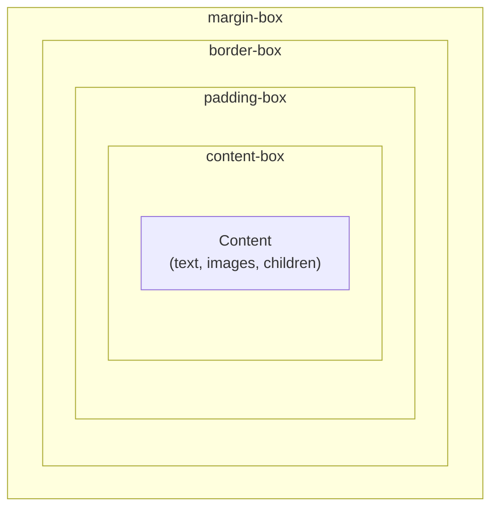

# Module 03 — The Box Model Revisited

> Every element in CSS generates a **box**. Understanding the box model deeply — including its edge cases — is essential for predictable layouts.

## The Four Boxes

Every CSS box has four areas, from inside out:

## Lessons

| # | Lesson | Topic |
|---|---|---|
| 01 | [The Four Boxes](01-four-boxes.md) | content, padding, border, margin in depth |
| 02 | [box-sizing](02-box-sizing.md) | content-box vs border-box and why it matters |
| 03 | [Margin Collapsing](03-margin-collapsing.md) | The most surprising CSS behavior |
| 04 | [Edge Cases](04-edge-cases.md) | Percentage margins, replaced elements, inline boxes |

→ Start with [Lesson 01: The Four Boxes](01-four-boxes.md)
