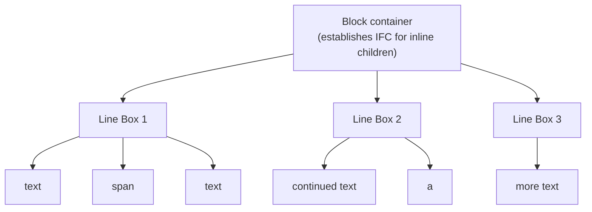

# Lesson 02 — Inline Formatting Context (IFC)

## Concept

An **Inline Formatting Context** governs how inline-level boxes (text, `<span>`, `<a>`, ``, etc.) are laid out. Instead of stacking vertically like blocks, inline content flows **horizontally** within **line boxes**.



### Key IFC Rules

1. Inline boxes are laid out **horizontally** (in the inline direction)
2. When they overflow the line, a **new line box** is created
3. Each line box's height is determined by the **tallest inline box** and/or `line-height`
4. Vertical alignment within the line box is controlled by `vertical-align`
5. Inline boxes **cannot** have `width`, `height`, or vertical `margin` (unless replaced or inline-block)

## Line Boxes

A **line box** is the invisible rectangle that contains one line of inline content. You never create them directly — the browser generates them automatically.

```
Line Box 1: |  Hello  <span>world</span>  how are  |
Line Box 2: |  you doing today?                     |
Line Box 3: |  I am fine.                           |

Each line box stretches the full width of the containing block.
Its height = max(tallest inline box in the line, line-height)
```

## Experiment 01: Line Boxes Visualized

```html
<!-- 01-line-boxes.html -->
<!DOCTYPE html>
<html lang="en">
<head>
  <meta charset="UTF-8">
  <title>Line Boxes</title>
  <style>
    body { font-family: system-ui; padding: 30px; margin: 0; }
    
    .container {
      width: 400px;
      background: #f0f0f0;
      border: 2px solid #999;
      padding: 20px;
      font-size: 18px;
      line-height: 1.5;
    }
    
    /* Every inline element gets a visible box */
    .container span { background: rgba(65, 105, 225, 0.2); outline: 1px solid royalblue; }
    .container a { background: rgba(220, 20, 60, 0.2); outline: 1px solid crimson; text-decoration: none; }
    .container em { background: rgba(34, 139, 34, 0.2); outline: 1px solid green; }
    .container strong { background: rgba(255, 165, 0, 0.2); outline: 1px solid orange; }
    
    .big { font-size: 32px; }
    .small { font-size: 10px; }
    
    .notes {
      margin-top: 20px;
      font-size: 14px;
      font-family: monospace;
      color: #666;
    }
  </style>
</head>
<body>
  <h2>Line Box Structure</h2>
  
  <div class="container">
    <span>This is a span</span> followed by <a href="#">a link</a> and 
    <em>emphasis</em> and then <strong>bold text</strong> that wraps across 
    multiple line boxes automatically when it reaches the container edge.
  </div>
  
  <div class="notes">
    <p>Each colored box is one inline box. They flow left-to-right, wrapping to new line boxes when they reach the container edge.</p>
  </div>
  
  <h2 style="margin-top: 40px;">Line Box Height: Tallest Element Wins</h2>
  
  <div class="container">
    Normal text <span class="big">BIG TEXT</span> normal again 
    <span class="small">tiny</span> back to normal.
  </div>
  
  <div class="notes">
    <p>The line containing "BIG TEXT" is taller — the line box height expands to fit the tallest inline box.</p>
  </div>
</body>
</html>
```

## Experiment 02: vertical-align

`vertical-align` controls where an inline box sits **within its line box**. It does NOT work on block elements (that's a common mistake).

```html
<!-- 02-vertical-align.html -->
<!DOCTYPE html>
<html lang="en">
<head>
  <meta charset="UTF-8">
  <title>vertical-align</title>
  <style>
    body { font-family: system-ui; padding: 30px; margin: 0; }
    
    .line-demo {
      background: #f0f0f0;
      border: 1px solid #ccc;
      padding: 20px;
      font-size: 20px;
      line-height: 3;
      margin-bottom: 20px;
    }
    
    .line-demo span {
      background: lightyellow;
      border: 2px solid goldenrod;
      padding: 2px 6px;
      font-size: 14px;
    }
    
    .baseline { vertical-align: baseline; }
    .top { vertical-align: top; }
    .middle { vertical-align: middle; }
    .bottom { vertical-align: bottom; }
    .text-top { vertical-align: text-top; }
    .text-bottom { vertical-align: text-bottom; }
    .super { vertical-align: super; }
    .sub { vertical-align: sub; }
    .custom { vertical-align: 10px; }
    
    .label {
      font-family: monospace;
      font-size: 12px;
      color: #666;
    }
    
    /* The classic image gap problem */
    .img-container {
      background: #e0e0e0;
      border: 2px solid #999;
      display: inline-block;
    }
    
    .img-container img {
      width: 100px;
      height: 80px;
      background: lightblue;
    }
  </style>
</head>
<body>
  <h2>vertical-align Values</h2>
  
  <div class="line-demo">
    Text <span class="baseline">baseline (default)</span> Text
  </div>
  <div class="line-demo">
    Text <span class="top">top</span> Text
  </div>
  <div class="line-demo">
    Text <span class="middle">middle</span> Text
  </div>
  <div class="line-demo">
    Text <span class="bottom">bottom</span> Text
  </div>
  <div class="line-demo">
    Text <span class="text-top">text-top</span> Text
  </div>
  <div class="line-demo">
    Text <span class="text-bottom">text-bottom</span> Text
  </div>
  <div class="line-demo">
    Text <span class="super">super</span> Text
  </div>
  <div class="line-demo">
    Text <span class="sub">sub</span> Text
  </div>
  <div class="line-demo">
    Text <span class="custom">+10px</span> Text
  </div>
  
  <h2 style="margin-top: 40px;">Classic Bug: Image Gap</h2>
  <p class="label">Images are inline by default → aligned to baseline → gap below for descenders</p>
  
  <h3>Before fix (notice the gap below the image):</h3>
  <div class="img-container">
    
  </div>
  
  <h3>Fix 1: vertical-align: block (removes descender gap)</h3>
  <div class="img-container">
    
  </div>
  
  <h3>Fix 2: display: block on image</h3>
  <div class="img-container">
    
  </div>
</body>
</html>
```

## Experiment 03: Anonymous Inline Boxes

Text nodes that aren't wrapped in any element still participate in the IFC. The browser creates **anonymous inline boxes** for them.

```html
<!-- 03-anonymous-boxes.html -->
<!DOCTYPE html>
<html lang="en">
<head>
  <meta charset="UTF-8">
  <title>Anonymous Boxes</title>
  <style>
    body { font-family: system-ui; padding: 30px; margin: 0; }
    
    .container {
      width: 400px;
      background: #f0f0f0;
      border: 2px solid #999;
      padding: 20px;
      font-size: 18px;
    }
    
    /* Only the spans are visible — the raw text is in anonymous boxes */
    .container span {
      background: lightblue;
      outline: 1px solid steelblue;
      padding: 2px 4px;
    }
    
    .block-inline-mix {
      width: 400px;
      background: #fff3cd;
      border: 2px solid #ffc107;
      padding: 20px;
      font-size: 18px;
    }
    
    .block-inline-mix p { background: #d4edda; padding: 5px; margin: 5px 0; }
  </style>
</head>
<body>
  <h2>Anonymous Inline Boxes</h2>
  
  <div class="container">
    Bare text <span>wrapped text</span> more bare text <span>more wrapped</span> and bare text
  </div>
  
  <p style="font-family: monospace; font-size: 13px; color: #666;">
    "Bare text" and "more bare text" are in anonymous inline boxes.<br>
    They follow the same IFC rules but have no element to select with CSS.
  </p>
  
  <h2 style="margin-top: 30px;">Anonymous Block Boxes</h2>
  
  <div class="block-inline-mix">
    Some inline text
    <p>A block-level paragraph</p>
    More inline text
  </div>
  
  <p style="font-family: monospace; font-size: 13px; color: #666;">
    When inline content and block content are siblings, the browser wraps<br>
    the inline content in anonymous block boxes to maintain the block flow.
  </p>
</body>
</html>
```

## Key Concepts Summary

| Concept | Description |
|---------|-------------|
| Line box | Invisible container for one line of inline content |
| Line box height | Determined by tallest inline box + line-height |
| `vertical-align` | Positions inline box within its line box |
| Baseline | Default alignment point for text (bottom of characters, excluding descenders) |
| Anonymous inline box | Browser-generated box for bare text nodes |
| Image gap | Images are inline → baseline-aligned → descender space → fix with `vertical-align: bottom` or `display: block` |

## Next

→ [Lesson 03: Width & Height Algorithms](03-width-height.md)
