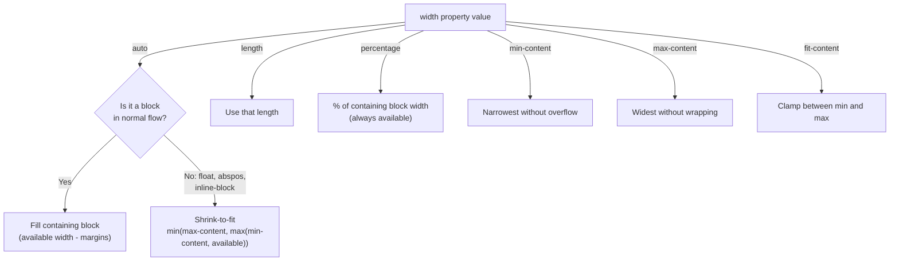

# Lesson 03 — Width & Height Algorithms

## Concept

The browser doesn't just "set" width and height. It runs specific algorithms to resolve them, and these algorithms are **asymmetric**: width and height follow fundamentally different rules.

```
┌───────────────────────────────────────────┐
│                                           │
│   WIDTH flows DOWN from parent to child   │
│   (parent constrains child)               │
│                                           │
│   HEIGHT flows UP from child to parent    │
│   (children determine parent height)      │
│                                           │
└───────────────────────────────────────────┘
```

## Width Resolution

### Block-level elements (`display: block`)

| `width` value | Resolution |
|---------------|-----------|
| `auto` (default) | Fill available width of containing block (minus margins) |
| `<length>` | Use that length exactly |
| `<percentage>` | % of containing block's width |
| `fit-content` | `min(max-content, max(min-content, available))` |
| `min-content` | Narrowest possible without overflow (longest word / largest inline) |
| `max-content` | Widest without any wrapping |

### Shrink-to-fit contexts

Some elements don't fill their parent — they shrink to fit their content:

| Context | Shrinks to fit? |
|---------|----------------|
| `float` | ✅ Yes |
| `position: absolute` | ✅ Yes (unless both left+right are set) |
| `display: inline-block` | ✅ Yes |
| `display: block` | ❌ No (fills parent) |
| Flex items | Depends on flex properties |
| Grid items | Depends on track sizing |

## Height Resolution

### The crucial asymmetry

| `height` value | Resolution |
|----------------|-----------|
| `auto` (default) | Sum of children's heights (content-determined) |
| `<length>` | Use that length exactly |
| `<percentage>` | % of containing block's **height** — BUT only if the containing block has an explicit height! |

**This is the #1 source of confusion**: `height: 50%` does **nothing** if the parent's height is `auto`. The browser can't compute 50% of "I don't know yet."

## Experiment 01: Width vs Height Asymmetry

```html
<!-- 01-width-vs-height.html -->
<!DOCTYPE html>
<html lang="en">
<head>
  <meta charset="UTF-8">
  <title>Width vs Height</title>
  <style>
    body { font-family: system-ui; padding: 30px; margin: 0; }
    
    .demos { display: flex; gap: 30px; flex-wrap: wrap; }
    
    .demo-block {
      width: 250px;
    }
    
    .container {
      background: #e0e0e0;
      border: 2px solid #999;
      padding: 10px;
      margin-bottom: 10px;
    }
    
    .child {
      background: lightblue;
      border: 2px solid steelblue;
      padding: 10px;
    }
    
    .label {
      font-family: monospace;
      font-size: 11px;
      color: #666;
      margin-bottom: 5px;
    }
    
    .measure {
      font-family: monospace;
      font-size: 12px;
      background: #fff3cd;
      padding: 5px;
    }
  </style>
</head>
<body>
  <h2>Width vs Height: The Asymmetry</h2>
  
  <div class="demos">
    <div class="demo-block">
      <div class="label">width: 50% → works (parent has definite width)</div>
      <div class="container" style="width: 200px;">
        <div class="child" style="width: 50%;" id="w50">width: 50%</div>
      </div>
      <div class="measure" id="mw50"></div>
    </div>
    
    <div class="demo-block">
      <div class="label">height: 50% → FAILS (parent height: auto)</div>
      <div class="container" style="width: 200px;">
        <div class="child" style="height: 50%;" id="h50fail">height: 50%</div>
      </div>
      <div class="measure" id="mh50fail"></div>
    </div>
    
    <div class="demo-block">
      <div class="label">height: 50% → WORKS (parent has explicit height)</div>
      <div class="container" style="width: 200px; height: 150px;">
        <div class="child" style="height: 50%;" id="h50work">height: 50%</div>
      </div>
      <div class="measure" id="mh50work"></div>
    </div>
  </div>

  <script>
    function m(childId, measureId) {
      const el = document.getElementById(childId);
      document.getElementById(measureId).textContent =
        `offsetWidth: ${el.offsetWidth}px, offsetHeight: ${el.offsetHeight}px`;
    }
    m('w50', 'mw50');
    m('h50fail', 'mh50fail');
    m('h50work', 'mh50work');
  </script>
</body>
</html>
```

## Experiment 02: min-content vs max-content

```html
<!-- 02-intrinsic-sizing.html -->
<!DOCTYPE html>
<html lang="en">
<head>
  <meta charset="UTF-8">
  <title>Intrinsic Sizing</title>
  <style>
    body { font-family: system-ui; padding: 30px; margin: 0; }
    
    .wrapper {
      margin-bottom: 30px;
    }
    
    .box {
      background: lightyellow;
      border: 2px solid goldenrod;
      padding: 15px;
      margin-bottom: 10px;
    }
    
    .auto-w     { width: auto; }
    .min-w      { width: min-content; }
    .max-w      { width: max-content; }
    .fit-w      { width: fit-content; }
    .fit-200    { width: fit-content(200px); }
    
    .label {
      font-family: monospace;
      font-size: 12px;
      background: #333;
      color: white;
      padding: 3px 8px;
      display: inline-block;
      margin-bottom: 5px;
    }
    
    .measure {
      font-family: monospace;
      font-size: 12px;
      color: #666;
    }
  </style>
</head>
<body>
  <h2>Intrinsic Sizing Keywords</h2>
  <p>Same content, different width values:</p>
  
  <div class="wrapper">
    <div class="label">width: auto (fills container)</div>
    <div class="box auto-w" id="bAuto">CSS is a powerful layout system for the web</div>
    <div class="measure" id="mAuto"></div>
  </div>
  
  <div class="wrapper">
    <div class="label">width: min-content (narrowest without overflow)</div>
    <div class="box min-w" id="bMin">CSS is a powerful layout system for the web</div>
    <div class="measure" id="mMin"></div>
  </div>
  
  <div class="wrapper">
    <div class="label">width: max-content (widest, no wrapping)</div>
    <div class="box max-w" id="bMax">CSS is a powerful layout system for the web</div>
    <div class="measure" id="mMax"></div>
  </div>
  
  <div class="wrapper">
    <div class="label">width: fit-content (clamps between min and max)</div>
    <div class="box fit-w" id="bFit">CSS is a powerful layout system for the web</div>
    <div class="measure" id="mFit"></div>
  </div>

  <script>
    ['Auto', 'Min', 'Max', 'Fit'].forEach(name => {
      const el = document.getElementById('b' + name);
      document.getElementById('m' + name).textContent =
        `offsetWidth: ${el.offsetWidth}px`;
    });
  </script>
</body>
</html>
```

## Experiment 03: The `height: 100%` Chain

For `height: 100%` to work, **every ancestor** up to the root must have an explicit height. Just one `auto` in the chain breaks it.

```html
<!-- 03-height-chain.html -->
<!DOCTYPE html>
<html lang="en">
<head>
  <meta charset="UTF-8">
  <title>Height 100% Chain</title>
  <style>
    /* BROKEN: missing height chain */
    .broken-html { /* height: auto (implicit) */ }
    .broken-body { /* height: auto (implicit) */ }
    .broken-container { /* height: auto */ }
    .broken-child {
      height: 100%; /* 100% of auto = does nothing */
      background: lightcoral;
    }
    
    /* FIXED: complete chain from html to child */
    .fixed-demo {
      height: 200px; /* Explicit height starts the chain */
    }
    .fixed-child {
      height: 100%;
      background: lightgreen;
    }
    
    /* MODERN ALTERNATIVE: use viewport units */
    .viewport-child {
      height: 100vh; /* Doesn't need parent heights at all */
      /* but beware: 100vh != visual viewport on mobile */
      /* use 100dvh for dynamic viewport height on mobile */
    }
    
    body { font-family: system-ui; padding: 30px; margin: 0; }
    
    .demo-container {
      border: 2px solid #999;
      background: #e0e0e0;
      margin-bottom: 20px;
    }
    
    .label {
      font-family: monospace;
      font-size: 12px;
      padding: 5px;
    }
  </style>
</head>
<body>
  <h2>height: 100% — The Chain Problem</h2>
  
  <h3>BROKEN: Parent has auto height</h3>
  <div class="demo-container" style="height: auto;">
    <div class="broken-child">
      <div class="label">height: 100% → renders as height: 0 (nothing to resolve against)</div>
    </div>
  </div>
  
  <h3>FIXED: Parent has explicit height (200px)</h3>
  <div class="demo-container fixed-demo">
    <div class="fixed-child">
      <div class="label">height: 100% → 200px ✅</div>
    </div>
  </div>
  
  <h3>FLEX TRICK: Flex children stretch by default</h3>
  <div class="demo-container" style="display: flex; height: 150px;">
    <div style="background: lightblue; flex: 1;">
      <div class="label">Flex child — no height: 100% needed! align-items: stretch is the default.</div>
    </div>
  </div>
  
  <div style="background: #d4edda; border: 1px solid #28a745; padding: 15px; border-radius: 4px;">
    <h3 style="margin-top: 0;">Summary of height: 100% solutions</h3>
    <ol>
      <li>Set explicit height on all ancestors (tedious)</li>
      <li>Use <code>height: 100vh</code> / <code>100dvh</code> (viewport-relative, no chain needed)</li>
      <li>Use flexbox + <code>align-items: stretch</code> (default behaviour)</li>
      <li>Use <code>position: absolute; inset: 0;</code> (relative to positioned ancestor)</li>
    </ol>
  </div>
</body>
</html>
```

## Resolution Algorithm Reference



## Next

→ [Lesson 04: Containing Blocks](04-containing-blocks.md)
