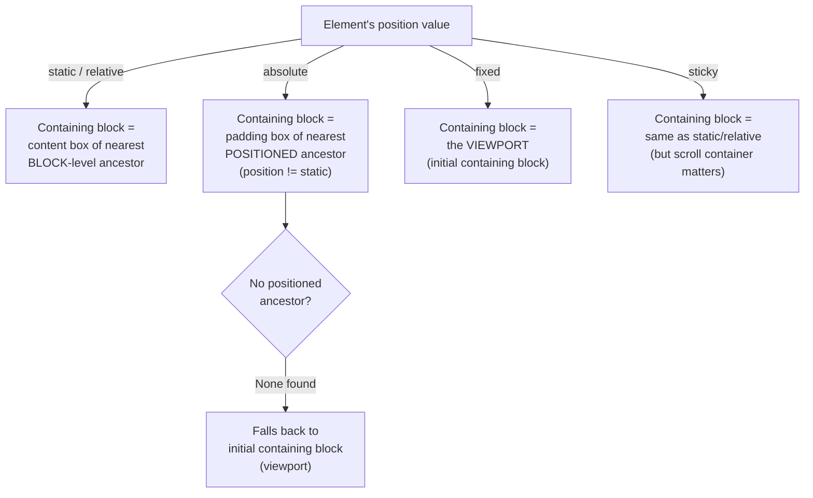

# Lesson 04 — Containing Blocks

## Concept

Every element's percentage-based sizes (`width: 50%`, `height: 100%`, `padding: 10%`) and positioned offsets (`top`, `left`, etc.) are resolved against its **containing block** — the reference rectangle that constrains the element.

The containing block is **NOT always the parent element**. It depends on the element's `position` value.

## Containing Block Rules



### Detailed Rules

| Element's `position` | Containing Block Is | Which Box? |
|----------------------|--------------------|-|
| `static` / `relative` | Nearest **block-level** ancestor | **Content** edge |
| `absolute` | Nearest ancestor with `position != static` | **Padding** edge |
| `fixed` | Viewport (initial containing block) | — |
| `sticky` | Nearest **block-level** ancestor (like static) | **Content** edge |

### Critical Detail: Content Box vs Padding Box

- **Static/relative**: percentages resolve against the **content box** — padding is excluded
- **Absolute**: percentages resolve against the **padding box** — padding is included

This means `width: 100%` on an absolutely positioned child is wider than `width: 100%` on a static child inside the same parent (if the parent has padding).

## Experiment 01: Containing Block Differences

```html
<!-- 01-containing-block-types.html -->
<!DOCTYPE html>
<html lang="en">
<head>
  <meta charset="UTF-8">
  <title>Containing Blocks</title>
  <style>
    body { font-family: system-ui; padding: 30px; margin: 0; }
    
    .outer {
      position: relative;
      width: 400px;
      padding: 30px;
      background: #e0e0e0;
      border: 2px solid #999;
      margin-bottom: 30px;
    }
    
    /* Static child: percentage resolves against CONTENT box (400px) */
    .static-child {
      position: static;
      width: 100%;
      background: lightblue;
      border: 2px solid steelblue;
      padding: 10px;
    }
    
    /* Absolute child: percentage resolves against PADDING box (400 + 30 + 30 = 460px) */
    .absolute-child {
      position: absolute;
      width: 100%;
      top: auto;
      left: 0;
      background: lightcoral;
      border: 2px solid darkred;
      padding: 10px;
    }
    
    .label {
      font-family: monospace;
      font-size: 12px;
    }
    
    .measure {
      font-family: monospace;
      font-size: 12px;
      background: #fff3cd;
      padding: 5px;
      margin-top: 5px;
    }
  </style>
</head>
<body>
  <h2>Containing Block: Content Box vs Padding Box</h2>
  
  <p style="font-family: monospace; font-size: 13px;">
    Parent: width: 400px, padding: 30px<br>
    Content box = 400px<br>
    Padding box = 400 + 30 + 30 = 460px
  </p>
  
  <div class="outer">
    <div style="position: relative; z-index: 1;">
      <div class="static-child" id="staticChild">
        <div class="label">position: static, width: 100%<br>→ 100% of CONTENT box (400px)</div>
      </div>
    </div>
    
    <div class="absolute-child" id="absChild">
      <div class="label">position: absolute, width: 100%<br>→ 100% of PADDING box (460px)</div>
    </div>
  </div>
  
  <div class="measure" id="measures"></div>

  <script>
    const s = document.getElementById('staticChild');
    const a = document.getElementById('absChild');
    document.getElementById('measures').innerHTML =
      `Static child offsetWidth: ${s.offsetWidth}px<br>` +
      `Absolute child offsetWidth: ${a.offsetWidth}px<br>` +
      `Difference: ${a.offsetWidth - s.offsetWidth}px (= left padding + right padding of parent)`;
  </script>
</body>
</html>
```

## Experiment 02: Finding the Containing Block

```html
<!-- 02-finding-containing-block.html -->
<!DOCTYPE html>
<html lang="en">
<head>
  <meta charset="UTF-8">
  <title>Finding Containing Block</title>
  <style>
    body { font-family: system-ui; padding: 30px; margin: 0; }
    
    .grandparent {
      width: 600px;
      height: 400px;
      background: #f8d7da;
      border: 3px solid #dc3545;
      padding: 20px;
    }
    
    .parent {
      /* NO position set — static by default */
      width: 400px;
      height: 300px;
      background: #d4edda;
      border: 3px solid #28a745;
      padding: 20px;
      margin: 20px;
    }
    
    .child-abs {
      position: absolute;
      top: 10px;
      right: 10px;
      width: 120px;
      background: lightyellow;
      border: 2px solid goldenrod;
      padding: 10px;
      font-family: monospace;
      font-size: 12px;
    }
    
    .label {
      font-family: monospace;
      font-size: 12px;
      padding: 5px;
      background: white;
    }
  </style>
</head>
<body>
  <h2>Finding the Containing Block for Absolute Positioning</h2>
  
  <p style="font-family: monospace; font-size: 13px;">
    The absolute child skips the parent (position: static) and uses<br>
    the grandparent... but wait, grandparent is also static!<br>
    So it goes all the way to the viewport (initial containing block).
  </p>
  
  <div class="grandparent">
    <div class="label">Grandparent (position: static)</div>
    
    <div class="parent">
      <div class="label">Parent (position: static)</div>
      
      <div class="child-abs">
        position: absolute<br>
        top: 10px, right: 10px<br>
        Positioned relative to... viewport!
      </div>
    </div>
  </div>
  
  <hr style="margin: 40px 0;">
  
  <h2>Fixed: Add position: relative to parent</h2>
  
  <div class="grandparent">
    <div class="label">Grandparent (position: static)</div>
    
    <div class="parent" style="position: relative;">
      <div class="label">Parent (position: relative) ← NOW a containing block</div>
      
      <div class="child-abs" style="background: #d4edda;">
        position: absolute<br>
        top: 10px, right: 10px<br>
        Now inside parent ✅
      </div>
    </div>
  </div>
</body>
</html>
```

## Special Cases

### `transform` Creates a Containing Block

Any element with a `transform` (even `transform: none` doesn't, but any actual transform does) becomes a containing block for its `position: fixed` descendants. This is a notorious gotcha:

```css
.parent {
  transform: translateZ(0); /* GPU layer hack — but it also changes containing blocks! */
}

.child {
  position: fixed; /* Expected: relative to viewport */
  /* Actual: relative to .parent because of the transform */
}
```

Other properties that create containing blocks for `fixed` elements:
- `transform` (any value other than `none`)
- `perspective` (any value other than `none`)
- `filter` (any value other than `none`)
- `will-change: transform / perspective / filter`
- `contain: paint / layout / content / strict`
- `backdrop-filter` (any value other than `none`)

### Inline Containing Blocks

If the containing block is established by an inline element, the containing block is the bounding box of the first and last inline box fragments (not a single rectangle if the inline wraps across lines).

## DevTools Exercise

1. Open Experiment 02
2. Select the absolute-positioned child
3. In DevTools → Elements panel, hover ancestors to find which one acts as the containing block
4. The containing block is highlighted with a dashed border
5. Add `position: relative` to different ancestors and watch the child move
6. Add `transform: rotate(0deg)` to parent — watch how `position: fixed` children are now contained

## Summary

| Position | Containing Block | Box Used | Gotcha |
|----------|-----------------|----------|--------|
| `static` / `relative` | Nearest block ancestor | Content box | — |
| `absolute` | Nearest positioned ancestor | Padding box | Skips non-positioned ancestors |
| `fixed` | Viewport | — | Broken by `transform` on ancestors |
| `sticky` | Nearest block ancestor | Content box | Scroll container matters too |

## Next Module

→ [Module 05: Positioning](../05-positioning/README.md)
