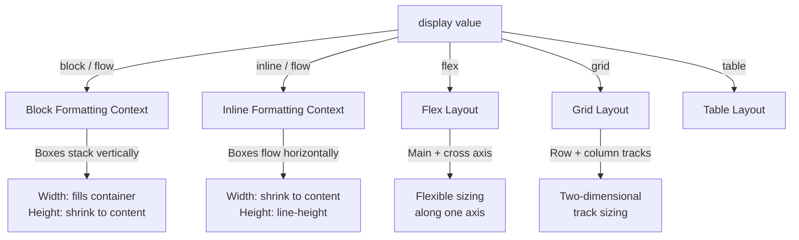

# Module 04 — Layout Algorithms

## Overview

CSS has multiple **layout algorithms** (formally called **formatting contexts**). When the browser lays out your content, it doesn't apply one universal algorithm — it selects the appropriate formatting context for each element based on `display`, `float`, `position`, and other properties.

Understanding which algorithm is active, and how each one determines widths and heights, is the bridge between "CSS is random" and "CSS is predictable."

## Lessons

| # | Lesson | Focus |
|---|--------|-------|
| 01 | [Block Formatting Context](01-bfc.md) | BFC creation, behaviour, and use cases |
| 02 | [Inline Formatting Context](02-ifc.md) | Line boxes, baseline alignment, vertical-align |
| 03 | [Width & Height Algorithms](03-width-height.md) | How the browser resolves auto, percentage, min/max |
| 04 | [Containing Blocks](04-containing-blocks.md) | The reference box that constrains layout |

## Prerequisites

- [Module 03: Box Model](../03-box-model/README.md) — understand the four-box model and margin collapsing.

## Next Module

→ [Module 05: Positioning](../05-positioning/README.md)
