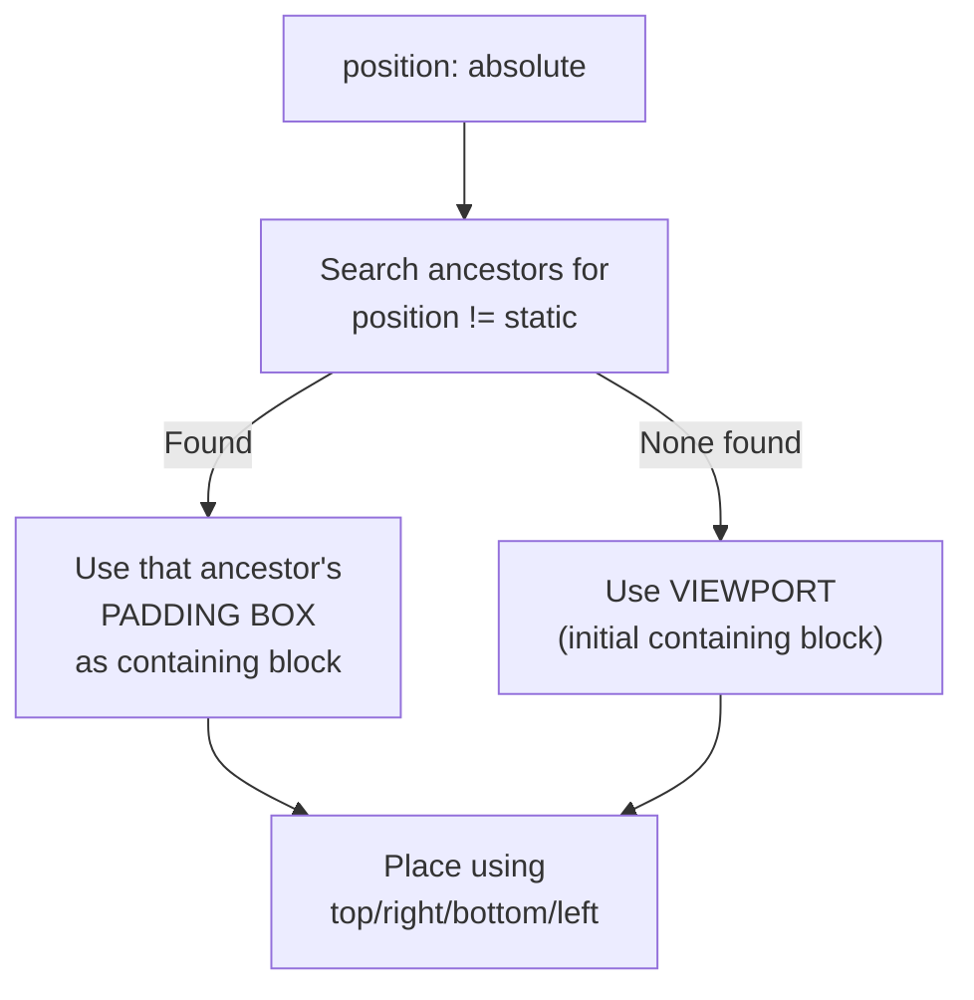

# Lesson 02 — Absolute & Fixed Positioning

## Absolute Positioning

`position: absolute` removes the element from normal flow entirely:

- **No space** is reserved in the document flow
- The element is positioned relative to its **containing block** (nearest positioned ancestor's padding box)
- If no positioned ancestor exists, it uses the **initial containing block** (viewport)
- Default width: **shrink-to-fit** (not fill-parent like block elements)



## Fixed Positioning

`position: fixed` is like absolute but **always** positioned relative to the viewport:

- Stays fixed during scrolling
- Removed from normal flow
- **Gotcha**: `transform`, `perspective`, or `filter` on any ancestor will change the containing block from viewport to that ancestor

## Experiment 01: Absolute Positioning in Action

```html
<!-- 01-absolute-positioning.html -->
<!DOCTYPE html>
<html lang="en">
<head>
  <meta charset="UTF-8">
  <title>Absolute Positioning</title>
  <style>
    body { font-family: system-ui; padding: 30px; margin: 0; }
    
    .relative-parent {
      position: relative;
      width: 400px;
      height: 300px;
      background: #e0e0e0;
      border: 2px solid #999;
      padding: 20px;
    }
    
    .normal-child {
      background: lightblue;
      padding: 15px;
      border: 2px solid steelblue;
      margin-bottom: 10px;
    }
    
    .abs-child {
      position: absolute;
      background: lightyellow;
      padding: 15px;
      border: 2px solid goldenrod;
      font-family: monospace;
      font-size: 12px;
    }
    
    /* Corner positioning */
    .top-left     { top: 0;  left: 0; }
    .top-right    { top: 0;  right: 0; }
    .bottom-left  { bottom: 0; left: 0; }
    .bottom-right { bottom: 0; right: 0; }
    .centered     { top: 50%; left: 50%; transform: translate(-50%, -50%); }
    
    .label { font-family: monospace; font-size: 12px; padding: 5px; }
  </style>
</head>
<body>
  <h2>Absolute Positioning: Corner Placement</h2>
  
  <div class="relative-parent">
    <div class="label">Parent (position: relative, padding: 20px)</div>
    
    <div class="normal-child">Normal flow child — absolute siblings are invisible to me</div>
    
    <div class="abs-child top-left">top: 0<br>left: 0</div>
    <div class="abs-child top-right">top: 0<br>right: 0</div>
    <div class="abs-child bottom-left">bottom: 0<br>left: 0</div>
    <div class="abs-child bottom-right">bottom: 0<br>right: 0</div>
    <div class="abs-child centered" style="background: #d4edda; border-color: green;">
      centered<br>(translate trick)
    </div>
  </div>
  
  <div style="background: #fff3cd; padding: 15px; margin-top: 20px; border: 1px solid #ffc107; border-radius: 4px;">
    <strong>Notice:</strong> The absolute children overlap each other and the normal child.
    They are positioned relative to the parent's <strong>padding box</strong> (the edges are at the padding boundary, not the border).
  </div>
</body>
</html>
```

## Experiment 02: Absolute Sizing with `inset`

When you set opposing offsets (`top` + `bottom`, or `left` + `right`) on an absolutely positioned element **without** explicit `width`/`height`, the element **stretches** between those offsets:

```html
<!-- 02-inset-stretch.html -->
<!DOCTYPE html>
<html lang="en">
<head>
  <meta charset="UTF-8">
  <title>Inset Stretch</title>
  <style>
    body { font-family: system-ui; padding: 30px; margin: 0; }
    
    .container {
      position: relative;
      width: 400px;
      height: 300px;
      background: #e0e0e0;
      border: 2px solid #999;
      margin-bottom: 30px;
    }
    
    .stretch-demo {
      position: absolute;
      background: rgba(65, 105, 225, 0.3);
      border: 2px solid royalblue;
      display: flex;
      align-items: center;
      justify-content: center;
      font-family: monospace;
      font-size: 12px;
    }
    
    .label { font-family: monospace; font-size: 12px; padding: 5px; }
  </style>
</head>
<body>
  <h2>Absolute: Stretching with Opposing Offsets</h2>
  
  <h3>inset: 0 (fills entire containing block)</h3>
  <div class="container">
    <div class="label">Parent</div>
    <div class="stretch-demo" style="inset: 0;">
      inset: 0<br>(= top:0 right:0 bottom:0 left:0)
    </div>
  </div>
  
  <h3>inset: 20px (20px from each edge)</h3>
  <div class="container">
    <div class="label">Parent</div>
    <div class="stretch-demo" style="inset: 20px;">
      inset: 20px
    </div>
  </div>
  
  <h3>top: 0; left: 0; right: 0; (stretches horizontally, height: auto)</h3>
  <div class="container">
    <div class="label">Parent</div>
    <div class="stretch-demo" style="top: 0; left: 0; right: 0;">
      top: 0; left: 0; right: 0<br>Height is auto (shrink to content)
    </div>
  </div>
  
  <h3>Centering with inset: 0 + margin: auto + explicit size</h3>
  <div class="container">
    <div class="label">Parent</div>
    <div class="stretch-demo" style="inset: 0; width: 200px; height: 100px; margin: auto;">
      inset: 0<br>width: 200px; height: 100px<br>margin: auto<br>→ CENTERED!
    </div>
  </div>
  
  <div style="background: #d4edda; padding: 15px; border: 1px solid #28a745; border-radius: 4px;">
    <strong>The <code>inset: 0; margin: auto;</code> centering technique</strong> is the cleanest
    way to center an absolutely positioned element. Better than the <code>translate(-50%, -50%)</code>
    hack because it doesn't create a sub-pixel rendering issue.
  </div>
</body>
</html>
```

## Experiment 03: Fixed Positioning and the Transform Gotcha

```html
<!-- 03-fixed-and-transform.html -->
<!DOCTYPE html>
<html lang="en">
<head>
  <meta charset="UTF-8">
  <title>Fixed + Transform Gotcha</title>
  <style>
    body { font-family: system-ui; padding: 30px; margin: 0; min-height: 200vh; }
    
    .fixed-element {
      position: fixed;
      top: 20px;
      right: 20px;
      width: 200px;
      padding: 15px;
      background: lightcoral;
      border: 2px solid darkred;
      font-family: monospace;
      font-size: 12px;
      z-index: 100;
    }
    
    .danger-parent {
      /* THIS BREAKS position: fixed children */
      transform: rotate(0deg);
      width: 500px;
      height: 300px;
      background: #fff3cd;
      border: 2px solid #ffc107;
      padding: 20px;
      margin-top: 100px;
    }
    
    .fixed-inside-transform {
      position: fixed;
      top: 20px;
      right: 20px;
      width: 200px;
      padding: 15px;
      background: lightyellow;
      border: 2px solid goldenrod;
      font-family: monospace;
      font-size: 12px;
    }
    
    .label { font-family: monospace; font-size: 12px; padding: 5px; }
  </style>
</head>
<body>
  <h2>position: fixed — Scroll to test</h2>
  
  <div class="fixed-element">
    position: fixed<br>
    (top: 20px, right: 20px)<br>
    ✅ Stays in viewport corner
  </div>
  
  <p>Scroll down to see the fixed element stay in place.</p>
  <p>But look at the yellow box below...</p>
  
  <div class="danger-parent">
    <div class="label">Parent with transform: rotate(0deg)</div>
    <div class="fixed-inside-transform">
      position: fixed<br>
      INSIDE a transformed parent<br>
      ❌ Now relative to parent, NOT viewport!<br>
      Scroll down — it moves with the page!
    </div>
  </div>
  
  <div style="margin-top: 50px; background: #f8d7da; padding: 15px; border: 1px solid #dc3545; border-radius: 4px;">
    <strong>The Transform Trap:</strong><br>
    <code>transform</code>, <code>perspective</code>, <code>filter</code>, <code>will-change</code>,
    and <code>contain</code> on ANY ancestor will change the containing block of fixed-positioned
    children from the viewport to that ancestor. This is one of the most
    surprising behaviours in CSS.
  </div>
  
  <div style="height: 1000px;"></div>
</body>
</html>
```

## Absolute vs Fixed Summary

| Feature | `absolute` | `fixed` |
|---------|-----------|---------|
| Removed from flow | ✅ | ✅ |
| Containing block | Nearest positioned ancestor | Viewport* |
| Scrolls with page | ✅ | ❌ (stays fixed) |
| Default width | Shrink-to-fit | Shrink-to-fit |
| Creates stacking context | Only with z-index ≠ auto | Always |
| *Gotcha | — | transform on ancestor breaks it |

## Next

→ [Lesson 03: Sticky Positioning](03-sticky.md)
