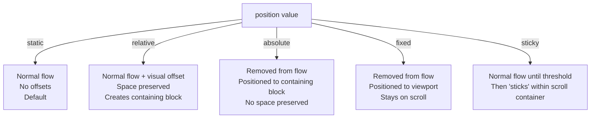

# Module 05 — Positioning

## Overview

CSS positioning removes elements from (or adjusts them within) normal flow. Each `position` value activates a fundamentally different set of rules for how the element is placed and how it interacts with surrounding content.

## Lessons

| # | Lesson | Focus |
|---|--------|-------|
| 01 | [Static & Relative](01-static-relative.md) | Normal flow positioning and visual offsets |
| 02 | [Absolute & Fixed](02-absolute-fixed.md) | Out-of-flow positioning and containing blocks |
| 03 | [Sticky Positioning](03-sticky.md) | Scroll-aware positioning and its constraints |
| 04 | [Offset Properties & Sizing](04-offsets.md) | How top/right/bottom/left interact with width/height |

## Prerequisites

- [Module 04: Layout Algorithms](../04-layout-algorithms/README.md) — especially lesson on containing blocks.

## Next Module

→ [Module 06: Stacking Contexts](../06-stacking-contexts/README.md)
