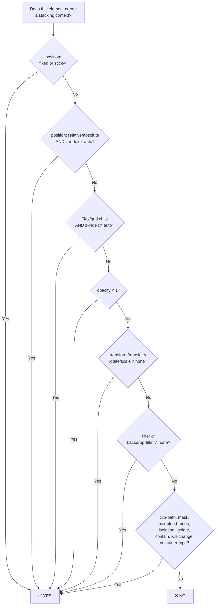

# Lesson 01 — What Creates a Stacking Context

## The Root Stacking Context

The `<html>` element always creates the **root stacking context**. Every other stacking context is nested inside it.

## Complete List of Stacking Context Triggers

This is the exhaustive list. If an element matches **any** of these conditions, it creates a new stacking context:

### Positioning + z-index

| Condition | Creates Stacking Context |
|-----------|------------------------|
| `position: relative` or `absolute` **and** `z-index` ≠ `auto` | ✅ |
| `position: relative` or `absolute` **and** `z-index: auto` | ❌ |
| `position: fixed` | ✅ Always (even without z-index) |
| `position: sticky` | ✅ Always (even without z-index) |

### Flexbox & Grid Children

| Condition | Creates Stacking Context |
|-----------|------------------------|
| Flex item (`display: flex` parent) **and** `z-index` ≠ `auto` | ✅ |
| Grid item (`display: grid` parent) **and** `z-index` ≠ `auto` | ✅ |
| Flex/grid item with `z-index: auto` | ❌ |

### Opacity

| Condition | Creates Stacking Context |
|-----------|------------------------|
| `opacity` < 1 | ✅ (even 0.999) |
| `opacity: 1` | ❌ |

### Transform & Related

| Condition | Creates Stacking Context |
|-----------|------------------------|
| `transform` ≠ `none` | ✅ |
| `translate` (individual property) ≠ `none` | ✅ |
| `rotate` (individual property) ≠ `none` | ✅ |
| `scale` (individual property) ≠ `none` | ✅ |
| `perspective` ≠ `none` | ✅ |

### Filters & Effects

| Condition | Creates Stacking Context |
|-----------|------------------------|
| `filter` ≠ `none` | ✅ |
| `backdrop-filter` ≠ `none` | ✅ |

### Clipping & Masking

| Condition | Creates Stacking Context |
|-----------|------------------------|
| `clip-path` ≠ `none` | ✅ |
| `mask` / `mask-image` ≠ `none` | ✅ |

### Compositing

| Condition | Creates Stacking Context |
|-----------|------------------------|
| `mix-blend-mode` ≠ `normal` | ✅ |
| `isolation: isolate` | ✅ |

### Containment

| Condition | Creates Stacking Context |
|-----------|------------------------|
| `contain: layout` | ✅ |
| `contain: paint` | ✅ |
| `contain: content` | ✅ (includes layout + paint) |
| `contain: strict` | ✅ (includes all) |
| `container-type` ≠ `normal` | ✅ |

### Will-Change

| Condition | Creates Stacking Context |
|-----------|------------------------|
| `will-change` specifies any property that would create a stacking context at non-initial value | ✅ |
| e.g., `will-change: transform`, `will-change: opacity`, `will-change: filter` | ✅ |

### Other

| Condition | Creates Stacking Context |
|-----------|------------------------|
| Element is the top layer (e.g., `<dialog>` via `.showModal()`, fullscreen) | ✅ |
| `-webkit-overflow-scrolling: touch` (iOS Safari) | ✅ |

## The Surprising Ones

These create stacking contexts and most developers don't know it:

```css
/* 1. opacity: 0.99 creates a stacking context. opacity: 1 does not. */
.subtle { opacity: 0.99; }

/* 2. transform: translateZ(0) — the "GPU hack" — quietly creates a stacking context */
.gpu-layer { transform: translateZ(0); }

/* 3. will-change: transform — even without applying a transform */
.prepped { will-change: transform; }

/* 4. filter: blur(0px) — even a zero blur! */
.no-visible-effect { filter: blur(0px); }

/* 5. position: sticky — always creates one, unlike relative */
.sticky-header { position: sticky; top: 0; }

/* 6. isolation: isolate — its ONLY purpose is creating a stacking context */
.isolated { isolation: isolate; }

/* 7. mix-blend-mode — even multiply, screen, etc. */
.blended { mix-blend-mode: multiply; }

/* 8. container-type for container queries */
.query-container { container-type: inline-size; }
```

## Quick Decision Flowchart



## DevTools: Checking Stacking Contexts

In Chrome DevTools:
1. **Elements** panel → select element
2. **Computed** tab → search for `z-index`, `position`, `opacity`, `transform`
3. **Layers** panel (More tools → Layers) → shows composite layers (which are stacking contexts)

In Firefox DevTools:
1. Elements panel → look for the **stacking context badge** shown on elements that create one

## Next

→ [Lesson 02: Painting Order](02-painting-order.md)
