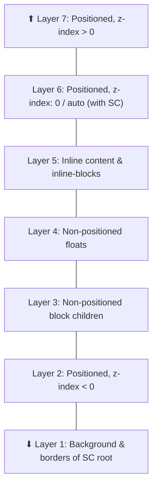

# Lesson 02 — Painting Order

## The 7-Layer Painting Algorithm

Within each stacking context, elements are painted in a strict **7-layer order** (bottom to top):

```
Layer 7 (top):  Positioned children with z-index > 0 (in z-index order)
Layer 6:        Positioned children with z-index: 0 (and auto that creates SC)
Layer 5:        Inline content (text, inline-block, inline-flex, etc.)
Layer 4:        Non-positioned floats
Layer 3:        Non-positioned block children (in DOM order)
Layer 2:        Positioned children with z-index < 0
Layer 1 (back): Background and borders of the stacking context element itself
```



## Key Implications

### 1. Inline content paints above blocks

```
Even without z-index, text (inline) always paints ABOVE block backgrounds.
This is by design — you should always be able to read text regardless of
overlapping backgrounds.
```

### 2. Floats paint above blocks but below inline content

```
Block bg → Float → Inline text
This is why text wraps around floats — the float sits between
the block layer and the inline layer.
```

### 3. Negative z-index paints below block children

```
position: relative; z-index: -1
Paints BELOW normal block children.
But ABOVE the stacking context root's own background.
```

## Experiment 01: The 7 Layers Visualized

```html
<!-- 01-seven-layers.html -->
<!DOCTYPE html>
<html lang="en">
<head>
  <meta charset="UTF-8">
  <title>7 Painting Layers</title>
  <style>
    body { font-family: system-ui; padding: 30px; margin: 0; }
    
    /* This element creates the stacking context */
    .stacking-context {
      position: relative;
      width: 500px;
      height: 400px;
      background: #333;  /* Layer 1: SC root background */
      color: white;
      padding: 20px;
    }
    
    /* Layer 2: Positioned, z-index < 0 */
    .neg-z {
      position: absolute;
      z-index: -1;
      top: 40px;
      left: 30px;
      width: 200px;
      height: 100px;
      background: rgba(255, 0, 0, 0.7);
      display: flex;
      align-items: center;
      justify-content: center;
      font-size: 13px;
    }
    
    /* Layer 3: Non-positioned block */
    .block-child {
      background: rgba(0, 100, 255, 0.7);
      padding: 15px;
      margin: 10px 0;
      font-size: 13px;
    }
    
    /* Layer 4: Float */
    .float-child {
      float: left;
      width: 120px;
      height: 80px;
      background: rgba(0, 200, 0, 0.7);
      margin: 10px;
      display: flex;
      align-items: center;
      justify-content: center;
      font-size: 13px;
    }
    
    /* Layer 5: Inline content */
    .inline-text {
      font-size: 18px;
      font-weight: bold;
      color: yellow;
      /* No background — just text, which paints on layer 5 */
    }
    
    /* Layer 6: Positioned, z-index: 0 */
    .pos-zero {
      position: relative;
      z-index: 0;
      background: rgba(255, 165, 0, 0.7);
      padding: 10px;
      margin: 10px 0;
      font-size: 13px;
    }
    
    /* Layer 7: Positioned, z-index > 0 */
    .pos-positive {
      position: absolute;
      z-index: 1;
      bottom: 20px;
      right: 20px;
      width: 180px;
      height: 60px;
      background: rgba(200, 0, 200, 0.7);
      display: flex;
      align-items: center;
      justify-content: center;
      font-size: 13px;
    }
    
    .legend {
      margin-top: 20px;
      font-size: 13px;
      font-family: monospace;
    }
    .legend div {
      padding: 4px 8px;
      margin: 2px 0;
      display: flex;
      align-items: center;
      gap: 10px;
    }
    .swatch {
      width: 20px;
      height: 20px;
      display: inline-block;
      border: 1px solid #999;
    }
  </style>
</head>
<body>
  <h2>The 7 Painting Layers (from back to front)</h2>
  
  <div class="stacking-context">
    <!-- Layer 2 -->
    <div class="neg-z">L2: z-index: -1<br>(below blocks!)</div>
    
    <!-- Layer 3 -->
    <div class="block-child">L3: Normal block child</div>
    
    <!-- Layer 4 -->
    <div class="float-child">L4: Float</div>
    
    <!-- Layer 5 -->
    <span class="inline-text">L5: Inline text (on top of blocks & floats)</span>
    
    <!-- Layer 6 -->
    <div class="pos-zero">L6: Positioned, z-index: 0</div>
    
    <!-- Layer 7 -->
    <div class="pos-positive">L7: z-index: 1<br>(frontmost)</div>
  </div>
  
  <div class="legend">
    <div><span class="swatch" style="background:#333"></span> L1: SC root background (dark gray)</div>
    <div><span class="swatch" style="background:rgba(255,0,0,0.7)"></span> L2: Positioned, z-index &lt; 0 (red)</div>
    <div><span class="swatch" style="background:rgba(0,100,255,0.7)"></span> L3: Non-positioned blocks (blue)</div>
    <div><span class="swatch" style="background:rgba(0,200,0,0.7)"></span> L4: Non-positioned floats (green)</div>
    <div><span class="swatch" style="background:yellow;color:black"></span> L5: Inline content (yellow text)</div>
    <div><span class="swatch" style="background:rgba(255,165,0,0.7)"></span> L6: Positioned, z-index: 0 (orange)</div>
    <div><span class="swatch" style="background:rgba(200,0,200,0.7)"></span> L7: Positioned, z-index &gt; 0 (purple)</div>
  </div>
</body>
</html>
```

## Experiment 02: Why Negative z-index Sometimes Disappears

```html
<!-- 02-negative-z-index.html -->
<!DOCTYPE html>
<html lang="en">
<head>
  <meta charset="UTF-8">
  <title>Negative z-index Gotcha</title>
  <style>
    body { font-family: system-ui; padding: 30px; margin: 0; }
    
    .demo { margin-bottom: 30px; }
    
    /* Case 1: Parent is NOT a stacking context */
    .no-sc-parent {
      position: relative;
      /* z-index: auto — NOT a stacking context */
      background: #e0e0e0;
      padding: 30px;
      border: 2px solid #999;
    }
    
    .neg-child-visible {
      position: relative;
      z-index: -1;
      background: lightcoral;
      padding: 15px;
      border: 2px solid darkred;
      font-family: monospace;
      font-size: 12px;
    }
    
    /* Case 2: Parent IS a stacking context */
    .sc-parent {
      position: relative;
      z-index: 0; /* Creates a stacking context! */
      background: #e0e0e0;
      padding: 30px;
      border: 2px solid #999;
    }
    
    .neg-child-hidden {
      position: relative;
      z-index: -1;
      background: lightcoral;
      padding: 15px;
      border: 2px solid darkred;
      font-family: monospace;
      font-size: 12px;
    }
    
    .label {
      font-family: monospace;
      font-size: 13px;
      margin-bottom: 5px;
    }
  </style>
</head>
<body>
  <h2>Negative z-index Behaviour</h2>
  
  <div class="demo">
    <div class="label">Parent: position: relative; z-index: auto (NOT a stacking context)</div>
    <div class="no-sc-parent">
      <div class="neg-child-visible">
        z-index: -1 → paints BEHIND parent's background<br>
        But parent background = layer of THE PARENT'S closest stacking context ancestor (html)<br>
        So this child is BEHIND the gray background!
      </div>
      Parent background
    </div>
  </div>
  
  <div class="demo">
    <div class="label">Parent: position: relative; z-index: 0 (IS a stacking context)</div>
    <div class="sc-parent">
      <div class="neg-child-hidden">
        z-index: -1 → paints behind blocks but ABOVE parent's own background<br>
        Parent IS the stacking context → child stays above parent's L1
      </div>
      Parent background
    </div>
  </div>
  
  <div style="background: #fff3cd; padding: 15px; border: 1px solid #ffc107; border-radius: 4px;">
    <strong>The rule:</strong>
    <ul>
      <li>z-index: -1 paints on Layer 2 of its <strong>nearest ancestor stacking context</strong></li>
      <li>If the parent is NOT a stacking context, the child goes to a HIGHER ancestor → may go behind the parent's background</li>
      <li>If the parent IS a stacking context, the child stays above the parent's own background (Layer 1)</li>
    </ul>
  </div>
</body>
</html>
```

## Same z-index? DOM Order Wins

When two elements in the same stacking context have the same `z-index`, the one that appears **later in the DOM** (source order) paints on top.

```css
.a { z-index: 1; } /* paints first */
.b { z-index: 1; } /* paints second — on top of .a */
```

## Next

→ [Lesson 03: Stacking Context Hierarchy](03-hierarchy.md)
