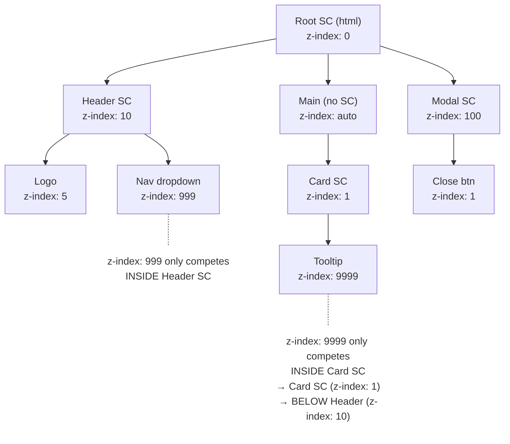

# Lesson 03 — Stacking Context Hierarchy

## The Tree Structure

Stacking contexts form a **tree** that mirrors (but is not identical to) the DOM tree. Each stacking context is a self-contained layer system.



## The Isolation Problem

**This is the single most important concept in this module.**

A child element's `z-index` only competes with siblings **inside the same stacking context**. No value of z-index can escape the parent context.

```
Modal (z-index: 100)
└── Close button (z-index: 1)  ← This is at effective z: 100 + 1 (conceptually)

Card (z-index: 1)
└── Tooltip (z-index: 9999)    ← This is at effective z: 1 + 9999 (conceptually)
                                  Still BELOW Modal because Card < Modal
```

## Experiment 01: z-index Isolation

```html
<!-- 01-z-index-isolation.html -->
<!DOCTYPE html>
<html lang="en">
<head>
  <meta charset="UTF-8">
  <title>z-index Isolation</title>
  <style>
    body { font-family: system-ui; padding: 30px; margin: 0; }
    
    .scene {
      position: relative;
      width: 600px;
      height: 350px;
      background: #f0f0f0;
      border: 2px solid #999;
    }
    
    /* Parent A: z-index: 1 */
    .parent-a {
      position: absolute;
      z-index: 1;
      top: 30px;
      left: 30px;
      width: 250px;
      height: 200px;
      background: rgba(255, 200, 200, 0.9);
      border: 2px solid darkred;
      padding: 10px;
    }
    
    /* Parent B: z-index: 2 */
    .parent-b {
      position: absolute;
      z-index: 2;
      top: 60px;
      left: 200px;
      width: 250px;
      height: 200px;
      background: rgba(200, 200, 255, 0.9);
      border: 2px solid navy;
      padding: 10px;
    }
    
    /* Child of A with enormous z-index */
    .child-a {
      position: absolute;
      z-index: 999999;
      bottom: 10px;
      right: 10px;
      width: 120px;
      padding: 15px;
      background: red;
      color: white;
      border: 2px solid darkred;
      font-family: monospace;
      font-size: 11px;
    }
    
    /* Child of B with modest z-index */
    .child-b {
      position: absolute;
      z-index: 1;
      bottom: 10px;
      left: 10px;
      width: 120px;
      padding: 15px;
      background: royalblue;
      color: white;
      border: 2px solid navy;
      font-family: monospace;
      font-size: 11px;
    }
    
    .label {
      font-family: monospace;
      font-size: 11px;
    }
  </style>
</head>
<body>
  <h2>z-index Isolation: 999999 Loses to 1</h2>
  
  <div class="scene">
    <div class="parent-a">
      <div class="label">Parent A (z-index: 1)</div>
      <div class="child-a">
        Child A<br>
        z-index: 999999<br>
        STILL behind B!
      </div>
    </div>
    
    <div class="parent-b">
      <div class="label">Parent B (z-index: 2)</div>
      <div class="child-b">
        Child B<br>
        z-index: 1<br>
        WINS!
      </div>
    </div>
  </div>
  
  <div style="margin-top: 20px; background: #f8d7da; padding: 15px; border: 1px solid #dc3545; border-radius: 4px;">
    <strong>Why?</strong> Parent A (z-index: 1) and Parent B (z-index: 2) compete in the root stacking context.
    Parent B wins. ALL of B's children, regardless of their z-index, appear above ALL of A's children.
    <br><br>
    999999 inside A < 1 inside B, because A < B.
  </div>
</body>
</html>
```

## Experiment 02: Accidental Stacking Context

The most common stacking context bug: you accidentally create one with `transform`, `opacity`, or `will-change`, and your `z-index` stops working as expected.

```html
<!-- 02-accidental-stacking-context.html -->
<!DOCTYPE html>
<html lang="en">
<head>
  <meta charset="UTF-8">
  <title>Accidental Stacking Context</title>
  <style>
    body { font-family: system-ui; padding: 30px; margin: 0; }
    
    .card {
      position: relative;
      width: 300px;
      height: 150px;
      background: white;
      border: 2px solid #ccc;
      border-radius: 8px;
      padding: 15px;
      margin-bottom: 20px;
    }
    
    /* This card has a hover transform — creates a stacking context! */
    .card-with-transform {
      transform: scale(1); /* Even scale(1) creates a stacking context */
      /* or: transition: transform 0.3s; transform on hover */
    }
    
    .dropdown {
      position: absolute;
      z-index: 1000;
      top: 100%;
      left: 0;
      width: 200px;
      background: white;
      border: 2px solid #333;
      box-shadow: 0 4px 12px rgba(0,0,0,0.2);
      padding: 10px;
      font-family: monospace;
      font-size: 12px;
    }
    
    .sibling-card {
      position: relative;
      z-index: 1;
    }
    
    .label { font-family: monospace; font-size: 12px; }
  </style>
</head>
<body>
  <h2>Accidental Stacking Context from transform</h2>
  
  <h3>Card WITHOUT transform (dropdown escapes correctly)</h3>
  <div class="card">
    <div class="label">Card (no transform, no stacking context)</div>
    <div class="dropdown">
      Dropdown z-index: 1000<br>
      ✅ Above sibling card
    </div>
  </div>
  <div class="card sibling-card">
    <div class="label">Sibling card (z-index: 1)</div>
  </div>
  
  <h3 style="margin-top: 60px;">Card WITH transform: scale(1) (dropdown TRAPPED)</h3>
  <div class="card card-with-transform">
    <div class="label">Card (transform: scale(1) → stacking context!)</div>
    <div class="dropdown" style="z-index: 1000;">
      Dropdown z-index: 1000<br>
      ❌ TRAPPED inside card's stacking context
    </div>
  </div>
  <div class="card sibling-card">
    <div class="label">Sibling card (z-index: 1) — covers the dropdown!</div>
  </div>
  
  <div style="margin-top: 60px; background: #fff3cd; padding: 15px; border: 1px solid #ffc107; border-radius: 4px;">
    <strong>Common scenarios where this bites you:</strong>
    <ul>
      <li><code>transform: scale(1.02)</code> on card hover → trapped dropdowns/tooltips</li>
      <li><code>will-change: transform</code> for performance → unexpected stacking</li>
      <li><code>opacity: 0.99</code> for animation → new stacking context</li>
      <li><code>filter: drop-shadow(...)</code> on parent → children can't escape</li>
    </ul>
    <strong>Solution:</strong> Move the dropdown/tooltip OUTSIDE the transformed element in the DOM,
    or use a portal (common in React/Vue).
  </div>
</body>
</html>
```

## The `isolation: isolate` Pattern

`isolation: isolate` exists specifically to create a stacking context without any visual side effects:

```css
/* Creates a stacking context. Nothing else. */
.component {
  isolation: isolate;
}
```

Use case: Prevent component internals from leaking z-index to siblings.

```css
/* Without isolation: */
.card { position: relative; }
.card-overlay { position: absolute; z-index: 10; }
/* This z-index: 10 competes with all siblings of .card */

/* With isolation: */
.card { isolation: isolate; }
.card-overlay { position: absolute; z-index: 10; }
/* This z-index: 10 only competes inside .card */
```

## Flattening the Z-Index Scale

A common architecture pattern: use `isolation: isolate` on component boundaries to keep z-index values local.

```css
/* Global stacking context layers */
:root {
  --z-dropdown: 100;
  --z-sticky: 200;
  --z-modal-backdrop: 300;
  --z-modal: 400;
  --z-toast: 500;
}

/* Component-level: use isolation */
.card { isolation: isolate; }
.sidebar { isolation: isolate; }
.header { position: relative; z-index: var(--z-sticky); }
.modal { position: fixed; z-index: var(--z-modal); }
```

## Next

→ [Lesson 04: Debugging & Experiments](04-debugging.md)
