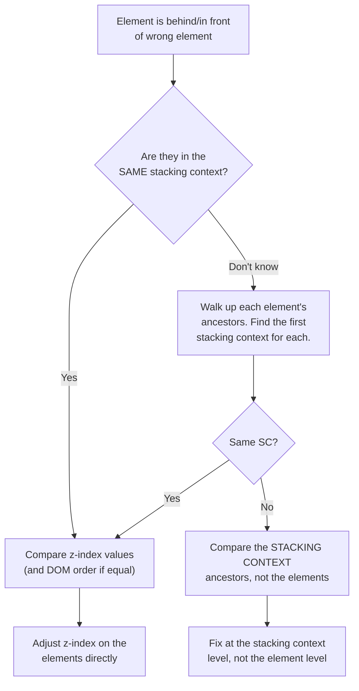

# Lesson 04 — Debugging & Experiments

## Debugging Strategy

When an element doesn't appear at the expected z-layer:



## Exercise 01: Find the Stacking Context Tree

```html
<!-- 01-find-the-tree.html -->
<!DOCTYPE html>
<html lang="en">
<head>
  <meta charset="UTF-8">
  <title>Find the Stacking Context Tree</title>
  <style>
    body { font-family: system-ui; padding: 30px; margin: 0; }
    
    .app {
      position: relative;
      z-index: 0;
      width: 700px;
      min-height: 500px;
      background: #f5f5f5;
      border: 2px solid #999;
    }
    
    .header {
      position: sticky;
      top: 0;
      /* sticky → creates stacking context */
      background: navy;
      color: white;
      padding: 15px;
      z-index: 10;
    }
    
    .sidebar {
      position: fixed;
      /* fixed → creates stacking context */
      top: 60px;
      left: 30px;
      width: 150px;
      background: white;
      border: 2px solid #333;
      padding: 10px;
      z-index: 5;
      font-size: 13px;
    }
    
    .content {
      margin-left: 180px;
      padding: 20px;
    }
    
    .card {
      position: relative;
      background: white;
      border: 2px solid #ccc;
      border-radius: 8px;
      padding: 15px;
      margin-bottom: 15px;
      /* NO z-index → NOT a stacking context (just positioned) */
    }
    
    .card-animated {
      transform: translateZ(0);
      /* transform → CREATES stacking context! */
    }
    
    .tooltip {
      position: absolute;
      z-index: 100;
      top: -40px;
      left: 50px;
      background: #333;
      color: white;
      padding: 8px 12px;
      border-radius: 4px;
      font-size: 12px;
      white-space: nowrap;
    }
    
    .modal-backdrop {
      position: fixed;
      inset: 0;
      background: rgba(0, 0, 0, 0.5);
      z-index: 50;
    }
    
    .modal {
      position: fixed;
      top: 50%;
      left: 50%;
      transform: translate(-50%, -50%);
      /* transform → creates stacking context */
      width: 300px;
      background: white;
      border-radius: 12px;
      padding: 20px;
      z-index: 51;
    }
    
    .challenge {
      background: #fff3cd;
      padding: 15px;
      border: 1px solid #ffc107;
      border-radius: 4px;
      margin: 20px 0;
      font-size: 14px;
    }
    
    .label { font-family: monospace; font-size: 12px; color: #666; }
  </style>
</head>
<body>
  <h2>Challenge: Map the Stacking Context Tree</h2>
  
  <div class="challenge">
    <strong>Exercise:</strong> Before looking at the answer below, try to draw the stacking context tree for this page.
    <br>Which elements create stacking contexts? What is their hierarchy?
    <br>Why does the tooltip on the animated card get trapped?
  </div>
  
  <div class="app">
    <div class="header">
      <span class="label">Header (sticky, z-index: 10)</span>
    </div>
    
    <div class="sidebar">
      <span class="label">Sidebar (fixed, z-index: 5)</span>
      <p>Nav links</p>
    </div>
    
    <div class="content">
      <div class="card">
        <div class="label">Card 1 (position: relative, no z-index → no SC)</div>
        <div class="tooltip">Tooltip z:100 ✅ escapes</div>
        <p>This card's tooltip competes in the .app stacking context</p>
      </div>
      
      <div class="card card-animated">
        <div class="label">Card 2 (transform → creates SC!)</div>
        <div class="tooltip">Tooltip z:100 ❌ trapped</div>
        <p>This tooltip is trapped in Card 2's stacking context</p>
      </div>
      
      <div class="card">
        <div class="label">Card 3 (regular)</div>
      </div>
    </div>
    
    <div class="modal-backdrop"></div>
    <div class="modal">
      <div class="label">Modal (fixed + transform → SC)</div>
      <p>Modal content</p>
    </div>
  </div>
  
  <div style="margin-top: 20px;">
    <button onclick="document.getElementById('answer').style.display='block'">
      Reveal Stacking Context Tree
    </button>
    <div id="answer" style="display: none; margin-top: 10px; background: #d4edda; padding: 15px; border: 1px solid #28a745; border-radius: 4px;">
      <pre style="font-size: 12px;">
Root SC (html)
├── .app (position: relative, z-index: 0) → SC
│   ├── .header (position: sticky) → SC (z-index: 10)
│   ├── .card (no SC — just positioned, z-index: auto)
│   │   └── .tooltip lives in .app's SC (z-index: 100 in .app's context)
│   ├── .card-animated (transform) → SC
│   │   └── .tooltip TRAPPED (z-index: 100 inside .card-animated)
│   ├── .card (no SC)
│   ├── .modal-backdrop (fixed) → SC (z-index: 50)
│   └── .modal (fixed + transform) → SC (z-index: 51)
└── .sidebar (fixed) → SC (z-index: 5 in ROOT context, not .app!)

Wait — the sidebar has position: fixed. Its containing block is the
viewport, not .app. BUT... does it compete in .app's stacking context?

Actually, .sidebar is a DOM child of body, not .app in this example.
Since .app has z-index: 0, the sidebar competes in the ROOT SC
alongside .app.
      </pre>
    </div>
  </div>
</body>
</html>
```

## Exercise 02: Stacking Context Detector

A JavaScript utility to find all stacking contexts on a page:

```html
<!-- 02-sc-detector.html -->
<!DOCTYPE html>
<html lang="en">
<head>
  <meta charset="UTF-8">
  <title>Stacking Context Detector</title>
  <style>
    body { font-family: system-ui; padding: 30px; margin: 0; }
    
    .controls { margin-bottom: 20px; }
    .controls button {
      padding: 10px 20px;
      font-size: 14px;
      cursor: pointer;
      background: navy;
      color: white;
      border: none;
      border-radius: 4px;
      margin-right: 10px;
    }
    
    #results {
      font-family: monospace;
      font-size: 12px;
      white-space: pre;
      background: #1e1e1e;
      color: #d4d4d4;
      padding: 20px;
      border-radius: 4px;
      max-height: 500px;
      overflow-y: auto;
    }
    
    .sc-highlight {
      outline: 3px solid red !important;
      outline-offset: 2px;
    }
    
    /* Test elements */
    .test-area {
      position: relative;
      background: #f0f0f0;
      padding: 20px;
      margin: 20px 0;
      border: 1px solid #ccc;
    }
    .test-a { position: relative; z-index: 1; background: lightblue; padding: 10px; margin: 5px; }
    .test-b { opacity: 0.99; background: lightyellow; padding: 10px; margin: 5px; }
    .test-c { transform: rotate(0deg); background: #f0fff0; padding: 10px; margin: 5px; }
    .test-d { filter: blur(0px); background: #fff0f0; padding: 10px; margin: 5px; }
    .test-e { isolation: isolate; background: #f5f0ff; padding: 10px; margin: 5px; }
    .test-f { will-change: transform; background: #fff5e0; padding: 10px; margin: 5px; }
    .test-g { position: relative; /* z-index: auto → NOT a SC */ background: #e0e0e0; padding: 10px; margin: 5px; }
  </style>
</head>
<body>
  <h2>Stacking Context Detector</h2>
  
  <div class="controls">
    <button onclick="detectStackingContexts()">Detect Stacking Contexts</button>
    <button onclick="clearHighlights()">Clear Highlights</button>
  </div>
  
  <div class="test-area">
    <div class="test-a">position: relative + z-index: 1 → SC ✅</div>
    <div class="test-b">opacity: 0.99 → SC ✅</div>
    <div class="test-c">transform: rotate(0deg) → SC ✅</div>
    <div class="test-d">filter: blur(0px) → SC ✅</div>
    <div class="test-e">isolation: isolate → SC ✅</div>
    <div class="test-f">will-change: transform → SC ✅</div>
    <div class="test-g">position: relative, NO z-index → NOT a SC ❌</div>
  </div>
  
  <div id="results">Click "Detect Stacking Contexts" to scan the page.</div>

  <script>
    function createsStackingContext(el) {
      const cs = getComputedStyle(el);
      
      // Root element
      if (el === document.documentElement) return 'root element';
      
      // Position + z-index
      const pos = cs.position;
      const zIndex = cs.zIndex;
      if ((pos === 'relative' || pos === 'absolute') && zIndex !== 'auto')
        return `position: ${pos} + z-index: ${zIndex}`;
      if (pos === 'fixed') return 'position: fixed';
      if (pos === 'sticky') return 'position: sticky';
      
      // Flex/grid child with z-index
      const parentDisplay = el.parentElement ? getComputedStyle(el.parentElement).display : '';
      if ((parentDisplay.includes('flex') || parentDisplay.includes('grid')) && zIndex !== 'auto')
        return `flex/grid child + z-index: ${zIndex}`;
      
      // Opacity
      if (parseFloat(cs.opacity) < 1) return `opacity: ${cs.opacity}`;
      
      // Transform
      if (cs.transform !== 'none') return `transform: ${cs.transform}`;
      
      // Filter
      if (cs.filter !== 'none') return `filter: ${cs.filter}`;
      if (cs.backdropFilter && cs.backdropFilter !== 'none') return `backdrop-filter`;
      
      // Mix-blend-mode
      if (cs.mixBlendMode !== 'normal') return `mix-blend-mode: ${cs.mixBlendMode}`;
      
      // Isolation
      if (cs.isolation === 'isolate') return 'isolation: isolate';
      
      // Will-change
      if (cs.willChange && cs.willChange !== 'auto') {
        const triggers = ['transform', 'opacity', 'filter', 'perspective'];
        if (triggers.some(t => cs.willChange.includes(t)))
          return `will-change: ${cs.willChange}`;
      }
      
      // Clip-path
      if (cs.clipPath && cs.clipPath !== 'none') return 'clip-path';
      
      // Contain
      if (cs.contain && cs.contain !== 'none')
        return `contain: ${cs.contain}`;
      
      // Container-type
      if (cs.containerType && cs.containerType !== 'normal')
        return `container-type: ${cs.containerType}`;
      
      // Perspective
      if (cs.perspective && cs.perspective !== 'none') return 'perspective';
      
      return false;
    }
    
    function detectStackingContexts() {
      clearHighlights();
      const all = document.querySelectorAll('*');
      const results = [];
      
      all.forEach(el => {
        const reason = createsStackingContext(el);
        if (reason) {
          el.classList.add('sc-highlight');
          const tag = el.tagName.toLowerCase();
          const cls = el.className.replace('sc-highlight', '').trim();
          const id = el.id ? `#${el.id}` : '';
          results.push(`<${tag}${id}${cls ? '.' + cls.split(' ').join('.') : ''}> → ${reason}`);
        }
      });
      
      document.getElementById('results').textContent =
        `Found ${results.length} stacking contexts:\n\n` + results.join('\n');
    }
    
    function clearHighlights() {
      document.querySelectorAll('.sc-highlight').forEach(el => {
        el.classList.remove('sc-highlight');
      });
    }
  </script>
</body>
</html>
```

## Exercise 03: Fix the z-index Bug

```html
<!-- 03-fix-the-bug.html -->
<!DOCTYPE html>
<html lang="en">
<head>
  <meta charset="UTF-8">
  <title>Fix the z-index Bug</title>
  <style>
    body { font-family: system-ui; padding: 30px; margin: 0; }
    
    .product-grid {
      display: grid;
      grid-template-columns: repeat(3, 200px);
      gap: 20px;
    }
    
    .product-card {
      position: relative;
      background: white;
      border: 2px solid #ccc;
      border-radius: 8px;
      padding: 15px;
      transition: transform 0.2s, box-shadow 0.2s;
    }
    
    .product-card:hover {
      transform: scale(1.05);
      /* BUG: This creates a stacking context! */
      box-shadow: 0 8px 24px rgba(0,0,0,0.2);
    }
    
    .product-tooltip {
      display: none;
      position: absolute;
      z-index: 100;
      bottom: calc(100% + 10px);
      left: 50%;
      transform: translateX(-50%);
      background: #333;
      color: white;
      padding: 10px 15px;
      border-radius: 6px;
      font-size: 12px;
      white-space: nowrap;
    }
    
    .product-card:hover .product-tooltip {
      display: block;
    }
    
    h3 { margin: 5px 0; }
    
    .challenge {
      background: #f8d7da;
      padding: 15px;
      border: 1px solid #dc3545;
      border-radius: 4px;
      margin: 20px 0;
    }
    
    .hint {
      background: #fff3cd;
      padding: 15px;
      border: 1px solid #ffc107;
      border-radius: 4px;
      margin: 10px 0;
    }
  </style>
</head>
<body>
  <h2>Challenge: Fix the Tooltip Bug</h2>
  
  <div class="challenge">
    <strong>Bug:</strong> Hover over the first card. The tooltip appears but gets clipped 
    by the second card. Why? How would you fix it?
  </div>
  
  <div class="product-grid">
    <div class="product-card">
      <div class="product-tooltip">Widget Pro — Premium quality, free shipping</div>
      <h3>Widget Pro</h3>
      <p>$29.99</p>
    </div>
    <div class="product-card">
      <div class="product-tooltip">Gadget Max — Best seller, 4.8★</div>
      <h3>Gadget Max</h3>
      <p>$19.99</p>
    </div>
    <div class="product-card">
      <div class="product-tooltip">Doohickey — New arrival</div>
      <h3>Doohickey</h3>
      <p>$14.99</p>
    </div>
  </div>
  
  <button onclick="document.getElementById('solution').style.display='block'" 
          style="margin-top: 20px; padding: 10px 20px; cursor: pointer;">
    Reveal Solution
  </button>
  
  <div id="solution" style="display: none;">
    <div class="hint">
      <strong>Diagnosis:</strong> On hover, <code>transform: scale(1.05)</code> creates a new stacking context 
      for the card. The tooltip (z-index: 100) is now trapped inside that card's stacking context.
      Since the adjacent card comes after in DOM order, it paints on top.
      
      <h4>Fix options:</h4>
      <ol>
        <li><strong>Add z-index to hovered card:</strong>
          <pre>.product-card:hover { z-index: 1; }</pre>
          This elevates the entire hovered card (and its stacking context) above siblings.
        </li>
        <li><strong>Portal pattern:</strong> Move the tooltip outside the card in the DOM, 
          position it with JavaScript.</li>
        <li><strong>Avoid transform:</strong> Use <code>box-shadow</code> and <code>margin</code> 
          for the hover effect instead of <code>transform</code>.</li>
      </ol>
    </div>
  </div>
</body>
</html>
```

## DevTools Techniques

### Chrome

1. **Layers panel** (DevTools → More tools → Layers): Shows composite layers, which align with stacking contexts
2. **3D View** (DevTools → More tools → Layers → rotate): Visualize the z-axis layer stack
3. **Elements panel**: Check computed `z-index`, `position`, `opacity`, `transform` on each ancestor

### Firefox

1. **Stacking context badge**: Firefox DevTools shows a "stacking context" badge on elements in the Elements panel
2. **Accessibility tree**: Shows the actual rendering order

### Console Snippet

Paste this in the console to find all stacking contexts on any page:

```javascript
document.querySelectorAll('*').forEach(el => {
  const cs = getComputedStyle(el);
  if (
    cs.position === 'fixed' || cs.position === 'sticky' ||
    ((cs.position === 'relative' || cs.position === 'absolute') && cs.zIndex !== 'auto') ||
    parseFloat(cs.opacity) < 1 ||
    cs.transform !== 'none' ||
    cs.filter !== 'none' ||
    cs.isolation === 'isolate' ||
    (cs.willChange && ['transform','opacity','filter'].some(p => cs.willChange.includes(p)))
  ) {
    el.style.outline = '2px solid red';
    console.log(el, cs.position, 'z:', cs.zIndex);
  }
});
```

## Summary

- Stacking contexts form a tree; each is an isolated z-axis universe
- Children can never escape their parent's stacking context
- `transform`, `opacity < 1`, `filter`, `will-change` accidentally create stacking contexts
- Use `isolation: isolate` to intentionally create stacking context boundaries
- Debug by mapping the stacking context tree, not by increasing z-index

## Next Module

→ [Module 07: Flexbox Algorithm](../07-flexbox/README.md)
