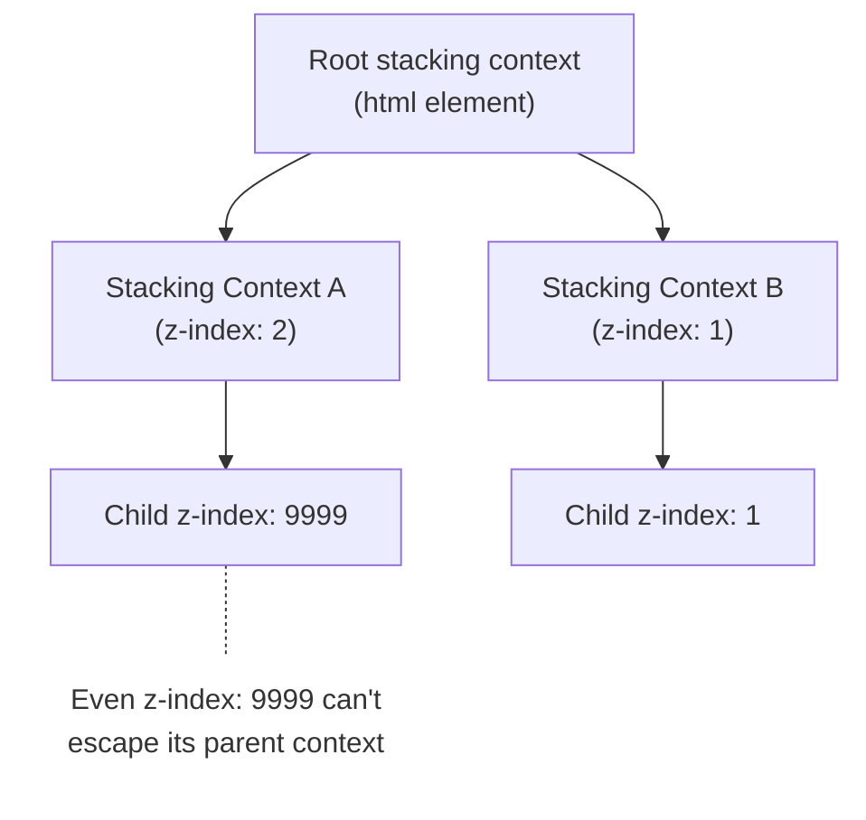

# Module 06 — Stacking Contexts

## Overview

Stacking contexts determine the **painting order** (which elements appear in front of which). This is CSS's z-axis system. It is one of the most misunderstood mechanisms because `z-index` alone doesn't control it — the entire stacking context tree does.

> **This module is intentionally extremely detailed.** Stacking context bugs are among the hardest to diagnose because the problem is structural, not stylistic.

**Key insight**: A child can never appear above or below elements in a **different** stacking context than its parent. `z-index` only competes within the same stacking context.

## Lessons

| # | Lesson | Focus |
|---|--------|-------|
| 01 | [What Creates a Stacking Context](01-creation.md) | Complete list of all triggers |
| 02 | [Painting Order](02-painting-order.md) | The 7-layer painting algorithm |
| 03 | [Stacking Context Hierarchy](03-hierarchy.md) | Tree structure and z-index isolation |
| 04 | [Debugging & Experiments](04-debugging.md) | Interactive experiments and DevTools techniques |

## Prerequisites

- [Module 05: Positioning](../05-positioning/README.md) — understand position values and containing blocks.

## Next Module

→ [Module 07: Flexbox Algorithm](../07-flexbox/README.md)
