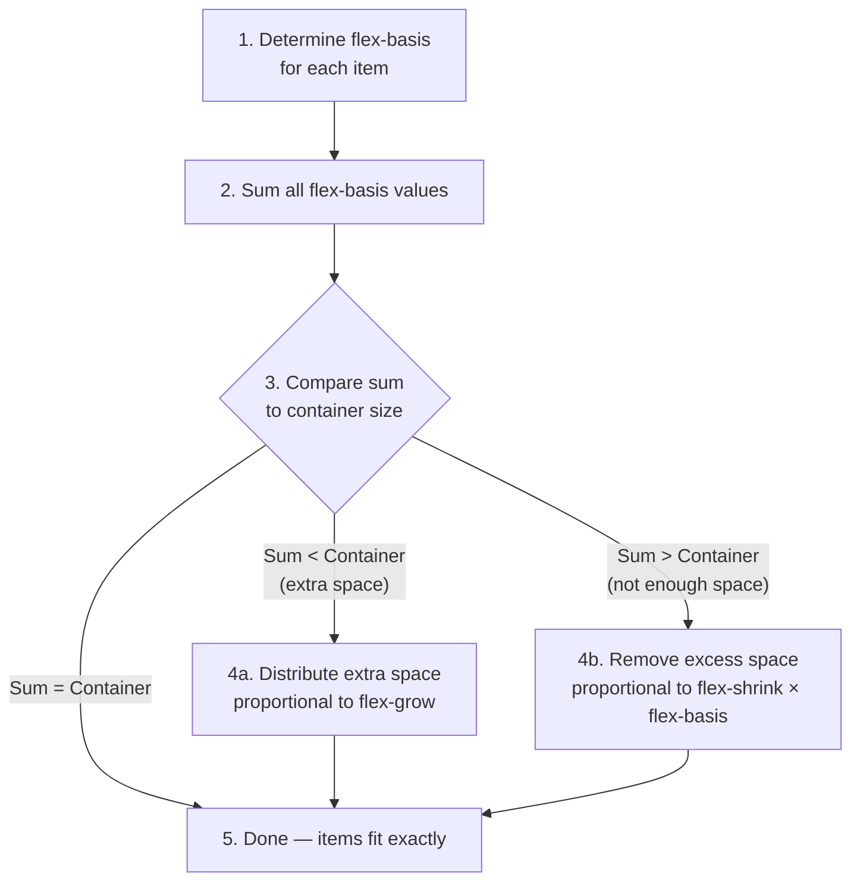

# Lesson 02 — The Flex Sizing Algorithm

## The Three Properties

Every flex item has three sizing properties:

| Property | What It Sets | Default |
|----------|-------------|---------|
| `flex-basis` | **Initial** main-axis size before grow/shrink | `auto` |
| `flex-grow` | How much the item **grows** if there's extra space | `0` |
| `flex-shrink` | How much the item **shrinks** if there's not enough space | `1` |

The shorthand:
```css
flex: <grow> <shrink> <basis>;

flex: 1;          /* = flex: 1 1 0% */
flex: auto;       /* = flex: 1 1 auto */
flex: none;       /* = flex: 0 0 auto */
flex: 0 1 auto;   /* = default (what items get if you don't set flex) */
```

## The Algorithm (Simplified)



### Step 1: Determine flex-basis

| `flex-basis` value | Resolves to |
|-------------------|-------------|
| `auto` | Uses `width`/`height` (depending on main axis). If that's also auto → content size (min-content) |
| `0` / `0%` | Item starts at zero size (grow from nothing) |
| `<length>` | That exact length (e.g., `200px`) |
| `<percentage>` | % of the flex container's main-axis size |
| `content` | Always use content size (like `width: max-content`) |

### Step 2: Growing

If total flex-basis < container, remaining space is distributed:

```
Extra space = Container size - Sum(flex-basis) - Sum(gaps)

Each item gets: extra_space × (item's flex-grow / Sum(all flex-grow))
```

### Step 3: Shrinking

If total flex-basis > container, items must shrink:

```
Overflow = Sum(flex-basis) - Container size + Sum(gaps)

Shrink ratio = (item's flex-shrink × item's flex-basis)
             / Sum(all items' flex-shrink × flex-basis)

Each item loses: overflow × shrink_ratio
```

**Key**: Shrink is proportional to `flex-shrink × flex-basis`, not just `flex-shrink`. This prevents small items from shrinking to nothing.

## Experiment 01: Growing

```html
<!-- 01-flex-grow.html -->
<!DOCTYPE html>
<html lang="en">
<head>
  <meta charset="UTF-8">
  <title>Flex Grow</title>
  <style>
    body { font-family: system-ui; padding: 30px; margin: 0; }
    
    .flex-container {
      display: flex;
      width: 600px;
      background: #e0e0e0;
      border: 2px solid #999;
      padding: 10px;
      gap: 10px;
      margin-bottom: 20px;
    }
    
    .item {
      background: lightblue;
      border: 2px solid steelblue;
      padding: 15px;
      font-family: monospace;
      font-size: 11px;
      text-align: center;
    }
    
    .label { font-family: monospace; font-size: 13px; margin-bottom: 5px; }
    .measure {
      font-family: monospace;
      font-size: 12px;
      background: #fff3cd;
      padding: 8px;
      margin-bottom: 20px;
    }
  </style>
</head>
<body>
  <h2>flex-grow: Distributing Extra Space</h2>
  
  <div class="label">All flex-grow: 0 (default) — no growing</div>
  <div class="flex-container" id="g0">
    <div class="item" style="flex: 0 0 100px;">100px</div>
    <div class="item" style="flex: 0 0 100px;">100px</div>
    <div class="item" style="flex: 0 0 100px;">100px</div>
  </div>
  <div class="measure" id="mg0"></div>
  
  <div class="label">All flex-grow: 1 — equal share of extra space</div>
  <div class="flex-container" id="g1">
    <div class="item" style="flex: 1 0 100px;">grow:1 basis:100</div>
    <div class="item" style="flex: 1 0 100px;">grow:1 basis:100</div>
    <div class="item" style="flex: 1 0 100px;">grow:1 basis:100</div>
  </div>
  <div class="measure" id="mg1"></div>
  
  <div class="label">flex-grow: 1, 2, 1 — proportional shares</div>
  <div class="flex-container" id="g2">
    <div class="item" style="flex: 1 0 100px;">grow:1</div>
    <div class="item" style="flex: 2 0 100px;">grow:2</div>
    <div class="item" style="flex: 1 0 100px;">grow:1</div>
  </div>
  <div class="measure" id="mg2"></div>
  
  <div class="label">flex-grow: 1, basis: 0 vs basis: auto</div>
  <div class="flex-container" id="g3">
    <div class="item" style="flex: 1 0 0%;">grow:1 basis:0</div>
    <div class="item" style="flex: 1 0 0%;">grow:1 basis:0 (longer text content here)</div>
    <div class="item" style="flex: 1 0 0%;">grow:1 basis:0</div>
  </div>
  <div class="measure" id="mg3"></div>

  <script>
    function measureChildren(containerId, measureId) {
      const container = document.getElementById(containerId);
      const items = [...container.querySelectorAll('.item')];
      const widths = items.map(el => Math.round(el.getBoundingClientRect().width));
      document.getElementById(measureId).textContent =
        `Widths: ${widths.join(', ')} (total: ${widths.reduce((a,b)=>a+b)} + gaps)`;
    }
    ['g0','g1','g2','g3'].forEach((id, i) => measureChildren(id, `mg${i}`));
  </script>
</body>
</html>
```

## Experiment 02: Shrinking

```html
<!-- 02-flex-shrink.html -->
<!DOCTYPE html>
<html lang="en">
<head>
  <meta charset="UTF-8">
  <title>Flex Shrink</title>
  <style>
    body { font-family: system-ui; padding: 30px; margin: 0; }
    
    .flex-container {
      display: flex;
      width: 400px;
      background: #e0e0e0;
      border: 2px solid #999;
      padding: 10px;
      gap: 10px;
      margin-bottom: 20px;
    }
    
    .item {
      background: lightyellow;
      border: 2px solid goldenrod;
      padding: 15px;
      font-family: monospace;
      font-size: 11px;
      text-align: center;
    }
    
    .label { font-family: monospace; font-size: 13px; margin-bottom: 5px; }
    .measure {
      font-family: monospace;
      font-size: 12px;
      background: #fff3cd;
      padding: 8px;
      margin-bottom: 20px;
    }
  </style>
</head>
<body>
  <h2>flex-shrink: Removing Overflow</h2>
  <p style="font-size: 14px; color: #666;">Container: 400px. Items want 600px total → must shrink 200px.</p>
  
  <div class="label">All shrink: 1, basis: 200px — equal shrink ratio</div>
  <div class="flex-container" id="s1">
    <div class="item" style="flex: 0 1 200px;">shrink:1 basis:200</div>
    <div class="item" style="flex: 0 1 200px;">shrink:1 basis:200</div>
    <div class="item" style="flex: 0 1 200px;">shrink:1 basis:200</div>
  </div>
  <div class="measure" id="ms1"></div>
  
  <div class="label">shrink: 1, 3, 1 — middle item shrinks 3× more</div>
  <div class="flex-container" id="s2">
    <div class="item" style="flex: 0 1 200px;">shrink:1</div>
    <div class="item" style="flex: 0 3 200px;">shrink:3</div>
    <div class="item" style="flex: 0 1 200px;">shrink:1</div>
  </div>
  <div class="measure" id="ms2"></div>
  
  <div class="label">shrink: 0 — refuses to shrink (OVERFLOW!)</div>
  <div class="flex-container" id="s3" style="overflow-x: auto;">
    <div class="item" style="flex: 0 0 200px;">shrink:0</div>
    <div class="item" style="flex: 0 0 200px;">shrink:0</div>
    <div class="item" style="flex: 0 0 200px;">shrink:0</div>
  </div>
  <div class="measure" id="ms3"></div>
  
  <div class="label">Different basis sizes: shrink proportional to basis</div>
  <div class="flex-container" id="s4">
    <div class="item" style="flex: 0 1 300px;">shrink:1 basis:300</div>
    <div class="item" style="flex: 0 1 100px;">shrink:1 basis:100</div>
    <div class="item" style="flex: 0 1 200px;">shrink:1 basis:200</div>
  </div>
  <div class="measure" id="ms4"></div>

  <script>
    function measureChildren(containerId, measureId) {
      const container = document.getElementById(containerId);
      const items = [...container.querySelectorAll('.item')];
      const widths = items.map(el => Math.round(el.getBoundingClientRect().width));
      document.getElementById(measureId).textContent =
        `Widths: ${widths.join(', ')} px`;
    }
    ['s1','s2','s3','s4'].forEach((id, i) => measureChildren(id, `ms${i+1}`));
  </script>
</body>
</html>
```

## `flex: 1` vs `flex: auto` vs `flex: none`

| Shorthand | Expansion | Behaviour |
|-----------|-----------|-----------|
| `flex: 1` | `flex: 1 1 0%` | Start from nothing, grow equally. Items become equal-width (ignoring content). |
| `flex: auto` | `flex: 1 1 auto` | Start from content size, then grow/shrink. Larger content = larger item. |
| `flex: none` | `flex: 0 0 auto` | No growing, no shrinking. Fixed at content/width size. |
| `flex: 0 1 auto` | (default) | No growing, shrinks if needed. |

## Key Insight: `flex: 1` Makes Equal Columns

```css
/* Equal-width columns regardless of content */
.col { flex: 1; }   /* = flex: 1 1 0% → basis: 0, then all get equal share of space */

/* Content-proportional columns */
.col { flex: auto; } /* = flex: 1 1 auto → basis: content, then grow from there */
```

## Next

→ [Lesson 03: Alignment](03-alignment.md)
