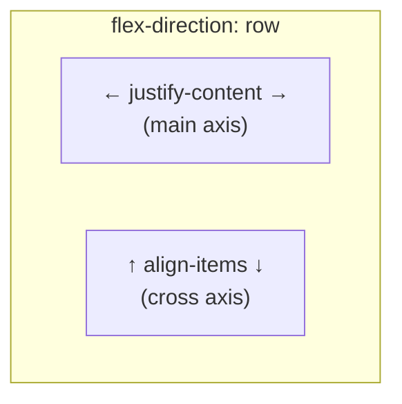

# Lesson 03 — Alignment

## Two Independent Axes

Flexbox alignment works on **two axes independently**:

| Axis | Distributes space along… | Properties |
|------|-------------------------|------------|
| **Main axis** | The direction items flow | `justify-content`, `justify-self` (limited) |
| **Cross axis** | Perpendicular to flow | `align-items`, `align-self`, `align-content` |



## justify-content — Main Axis Distribution

Controls how **free space** is distributed along the main axis.

| Value | Behavior |
|-------|----------|
| `flex-start` | Items packed toward start (default) |
| `flex-end` | Items packed toward end |
| `center` | Items centered |
| `space-between` | First & last items at edges, equal gaps between |
| `space-around` | Equal space around each item (half-size at edges) |
| `space-evenly` | Equal space between items AND at edges |

## align-items — Cross Axis Alignment

Controls how items are aligned along the **cross axis** within their line.

| Value | Behavior |
|-------|----------|
| `stretch` | Items stretch to fill cross axis (default) |
| `flex-start` | Items at cross-start |
| `flex-end` | Items at cross-end |
| `center` | Items centered on cross axis |
| `baseline` | Items aligned by their text baselines |

## align-self — Per-Item Override

Overrides `align-items` for **one item**:

```css
.container { align-items: center; }
.item-special { align-self: flex-end; }  /* This item goes to the bottom */
```

## align-content — Multi-Line Cross Axis

Only applies when `flex-wrap: wrap` creates **multiple lines**. Distributes space between lines:

| Value | Behavior |
|-------|----------|
| `stretch` | Lines stretch to fill container (default) |
| `flex-start` | Lines packed to top |
| `flex-end` | Lines packed to bottom |
| `center` | Lines centered |
| `space-between` | First & last lines at edges |
| `space-around` | Equal space around lines |
| `space-evenly` | Equal space between lines and edges |

Key: `align-items` aligns items **within** each line. `align-content` aligns the **lines themselves**.

## gap

```css
.container {
  display: flex;
  gap: 20px;           /* row-gap and column-gap */
  row-gap: 10px;       /* between wrapped lines */
  column-gap: 20px;    /* between items in a line */
}
```

`gap` replaces margins for spacing. It only creates space **between** items, never at edges.

## margin: auto in Flex — The Secret Weapon

In a flex container, `margin: auto` absorbs **all remaining space** on that axis.

```css
/* Push last item to the right */
.nav-item:last-child {
  margin-left: auto;  /* eats all leftover space → pushes item right */
}

/* Center an item both axes */
.container { display: flex; }
.centered { margin: auto; }  /* absorbs space on all four sides */
```

This is more powerful than `justify-content` because it works **per-item**.

## Experiment: Alignment Playground

```html
<!-- 03-alignment.html -->
<!DOCTYPE html>
<html lang="en">
<head>
  <meta charset="UTF-8">
  <title>Flex Alignment</title>
  <style>
    body { font-family: system-ui; padding: 20px; margin: 0; }
    
    .controls {
      display: flex;
      flex-wrap: wrap;
      gap: 15px;
      margin-bottom: 20px;
      padding: 15px;
      background: #f0f0f0;
      border-radius: 8px;
    }
    
    .control-group {
      display: flex;
      flex-direction: column;
      gap: 4px;
    }
    
    .control-group label {
      font-size: 11px;
      font-weight: bold;
      text-transform: uppercase;
      color: #666;
    }
    
    .control-group select {
      padding: 5px 10px;
      font-family: monospace;
      font-size: 13px;
    }
    
    .demo-container {
      display: flex;
      width: 600px;
      height: 300px;
      background: #e0e0e0;
      border: 2px solid #999;
      transition: all 0.3s ease;
    }
    
    .demo-item {
      background: lightblue;
      border: 2px solid steelblue;
      padding: 10px 15px;
      font-family: monospace;
      font-size: 12px;
      transition: all 0.3s ease;
    }
    
    .demo-item:nth-child(2) {
      padding: 20px 15px;
      font-size: 16px;
      background: lightyellow;
      border-color: goldenrod;
    }
    
    .demo-item:nth-child(3) {
      padding: 8px 15px;
      font-size: 10px;
      background: lightpink;
      border-color: tomato;
    }
    
    .computed {
      font-family: monospace;
      font-size: 12px;
      margin-top: 10px;
      padding: 10px;
      background: #1e1e1e;
      color: #d4d4d4;
      border-radius: 4px;
    }
  </style>
</head>
<body>
  <h2>Flex Alignment Playground</h2>
  
  <div class="controls">
    <div class="control-group">
      <label>flex-direction</label>
      <select id="direction">
        <option value="row" selected>row</option>
        <option value="column">column</option>
      </select>
    </div>
    <div class="control-group">
      <label>flex-wrap</label>
      <select id="wrap">
        <option value="nowrap" selected>nowrap</option>
        <option value="wrap">wrap</option>
      </select>
    </div>
    <div class="control-group">
      <label>justify-content</label>
      <select id="justify">
        <option value="flex-start" selected>flex-start</option>
        <option value="flex-end">flex-end</option>
        <option value="center">center</option>
        <option value="space-between">space-between</option>
        <option value="space-around">space-around</option>
        <option value="space-evenly">space-evenly</option>
      </select>
    </div>
    <div class="control-group">
      <label>align-items</label>
      <select id="align">
        <option value="stretch" selected>stretch</option>
        <option value="flex-start">flex-start</option>
        <option value="flex-end">flex-end</option>
        <option value="center">center</option>
        <option value="baseline">baseline</option>
      </select>
    </div>
    <div class="control-group">
      <label>align-content</label>
      <select id="alignContent">
        <option value="stretch" selected>stretch</option>
        <option value="flex-start">flex-start</option>
        <option value="flex-end">flex-end</option>
        <option value="center">center</option>
        <option value="space-between">space-between</option>
        <option value="space-around">space-around</option>
      </select>
    </div>
    <div class="control-group">
      <label>gap</label>
      <select id="gap">
        <option value="0" selected>0</option>
        <option value="10px">10px</option>
        <option value="20px">20px</option>
      </select>
    </div>
  </div>

  <div class="demo-container" id="container">
    <div class="demo-item">Item 1</div>
    <div class="demo-item">Item 2 (taller)</div>
    <div class="demo-item">Item 3</div>
    <div class="demo-item">Item 4</div>
    <div class="demo-item">Item 5</div>
  </div>
  
  <div class="computed" id="computed"></div>

  <script>
    const container = document.getElementById('container');
    const computed = document.getElementById('computed');
    const controls = {
      direction: document.getElementById('direction'),
      wrap: document.getElementById('wrap'),
      justify: document.getElementById('justify'),
      align: document.getElementById('align'),
      alignContent: document.getElementById('alignContent'),
      gap: document.getElementById('gap'),
    };
    
    function update() {
      container.style.flexDirection = controls.direction.value;
      container.style.flexWrap = controls.wrap.value;
      container.style.justifyContent = controls.justify.value;
      container.style.alignItems = controls.align.value;
      container.style.alignContent = controls.alignContent.value;
      container.style.gap = controls.gap.value;
      
      computed.textContent =
`.demo-container {
  display: flex;
  flex-direction: ${controls.direction.value};
  flex-wrap: ${controls.wrap.value};
  justify-content: ${controls.justify.value};
  align-items: ${controls.align.value};
  align-content: ${controls.alignContent.value};
  gap: ${controls.gap.value};
}`;
    }
    
    Object.values(controls).forEach(el => el.addEventListener('change', update));
    update();
  </script>
</body>
</html>
```

## Experiment: margin: auto

```html
<!-- 03b-margin-auto.html -->
<!DOCTYPE html>
<html lang="en">
<head>
  <meta charset="UTF-8">
  <title>margin: auto in Flex</title>
  <style>
    body { font-family: system-ui; padding: 30px; margin: 0; }
    .flex { display: flex; background: #e0e0e0; border: 2px solid #999; padding: 10px; height: 100px; margin-bottom: 25px; }
    .item { background: lightblue; border: 2px solid steelblue; padding: 10px 20px; font-family: monospace; font-size: 12px; }
    .label { font-family: monospace; font-size: 13px; margin-bottom: 5px; }
  </style>
</head>
<body>
  <h2>margin: auto — Absorbs Free Space</h2>

  <div class="label">Nav: push last item right with margin-left: auto</div>
  <div class="flex">
    <div class="item">Logo</div>
    <div class="item">Home</div>
    <div class="item">About</div>
    <div class="item" style="margin-left: auto;">Login</div>
  </div>
  
  <div class="label">Center: margin: auto on all sides</div>
  <div class="flex" style="height: 150px;">
    <div class="item" style="margin: auto;">Centered!</div>
  </div>
  
  <div class="label">Push apart: margin-right: auto on first item</div>
  <div class="flex">
    <div class="item" style="margin-right: auto;">Left</div>
    <div class="item">Right 1</div>
    <div class="item">Right 2</div>
  </div>

  <div class="label">Multiple auto margins split space equally</div>
  <div class="flex">
    <div class="item" style="margin-right: auto;">A</div>
    <div class="item" style="margin-right: auto;">B</div>
    <div class="item">C</div>
  </div>
</body>
</html>
```

## DevTools Exercise

1. Open the alignment playground in Chrome
2. **Enable Flex overlay**: Elements panel → click the `flex` badge on the container → shows alignment lines
3. Observe how `space-between` vs `space-evenly` distribute space differently
4. Enable `wrap` and add more items — notice `align-content` only works with multiple lines
5. Try `baseline` alignment — items with different font sizes align their text baselines

## Key Gotcha: justify-content vs margin: auto

When a flex item has `margin: auto`, it absorbs free space **before** `justify-content` runs. So `justify-content` has no effect when auto margins are present:

```css
.container {
  display: flex;
  justify-content: center;  /* ← IGNORED when auto margins exist */
}

.item { margin-left: auto; }  /* ← This wins: eats all left space */
```

## Next

→ [Lesson 04: Patterns & Gotchas](04-patterns.md)
