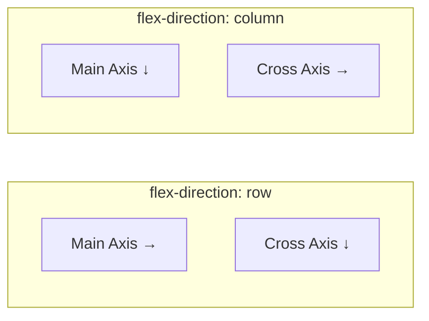

# Module 07 — Flexbox Algorithm

## Overview

Flexbox is a **one-dimensional** layout algorithm. It distributes space along a **main axis** and aligns items along a **cross axis**. Understanding the algorithm from the spec's perspective eliminates the guesswork.

## Lessons

| # | Lesson | Focus |
|---|--------|-------|
| 01 | [Flex Container & Axes](01-container-axes.md) | Container properties, axis direction, wrapping |
| 02 | [The Flex Sizing Algorithm](02-sizing-algorithm.md) | Step-by-step: flex-basis → grow → shrink |
| 03 | [Alignment](03-alignment.md) | justify-content, align-items, align-self, align-content, gap |
| 04 | [Common Patterns & Gotchas](04-patterns.md) | Real-world layouts, min-width: 0, overflow |

## Prerequisites

- [Module 04: Layout Algorithms](../04-layout-algorithms/README.md) — understand formatting contexts.

## Next Module

→ [Module 08: CSS Grid](../08-grid/README.md)
