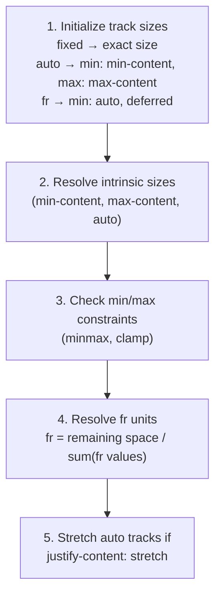

# Lesson 02 — The Track Sizing Algorithm

## How the Browser Sizes Grid Tracks

The grid track sizing algorithm is the most complex part of CSS Grid. Here's the simplified version:



## The Priority Order

Tracks are resolved in this order:

1. **Fixed sizes** (`px`, `em`, `rem`): Resolved immediately
2. **Percentages**: Resolved against container size
3. **min-content / max-content**: Resolved from item content
4. **auto**: Resolved to fit content (between min-content and max-content)
5. **`fr`**: Gets whatever space is left after everything else

## Understanding `fr` vs `auto`

```css
grid-template-columns: auto 1fr 1fr;
```

| Step | Column 1 (auto) | Column 2 (1fr) | Column 3 (1fr) |
|------|-----------------|----------------|----------------|
| Initial | Sized to content | Deferred | Deferred |
| After fixed + auto | Takes content size | Remaining ÷ 2 | Remaining ÷ 2 |

```css
grid-template-columns: 1fr 1fr 1fr;
```

| Step | Column 1 (1fr) | Column 2 (1fr) | Column 3 (1fr) |
|------|---------------|----------------|----------------|
| Initial | All deferred | All deferred | All deferred |
| After fixed | All space ÷ 3 | All space ÷ 3 | All space ÷ 3 |

**Important**: `fr` tracks have a **minimum** of `auto` (which is `min-content`) by default. A `1fr` column won't shrink below its content. Use `minmax(0, 1fr)` to allow shrinking to zero.

## `minmax()` in Detail

```css
grid-template-columns: minmax(200px, 1fr) minmax(100px, 300px) 1fr;
```

Resolution:
1. Track 1: between 200px and 1fr
2. Track 2: between 100px and 300px
3. Track 3: 1fr

The algorithm first satisfies minimums, then distributes remaining space up to maximums:
- Track 2 gets at least 100px, up to 300px
- Track 1 gets at least 200px, then grows with `fr`
- Track 3 grows with `fr`

## `auto-fill` vs `auto-fit`

```css
/* auto-fill: creates empty tracks to fill the container */
grid-template-columns: repeat(auto-fill, minmax(200px, 1fr));

/* auto-fit: creates tracks only for items, collapses empty tracks */
grid-template-columns: repeat(auto-fit, minmax(200px, 1fr));
```

| | Fewer items than tracks fit | Exactly enough items |
|-|---------------------------|---------------------|
| `auto-fill` | Empty tracks remain (items don't stretch to fill) | Same as auto-fit |
| `auto-fit` | Empty tracks collapse (items stretch to fill remaining space) | Same as auto-fill |

## Experiment: Track Sizing

```html
<!-- 02-track-sizing.html -->
<!DOCTYPE html>
<html lang="en">
<head>
  <meta charset="UTF-8">
  <title>Track Sizing Algorithm</title>
  <style>
    body { font-family: system-ui; padding: 30px; margin: 0; }
    
    .grid {
      display: grid;
      gap: 5px;
      background: #e0e0e0;
      padding: 5px;
      margin-bottom: 10px;
    }
    
    .cell {
      background: lightblue;
      border: 2px solid steelblue;
      padding: 10px;
      font-family: monospace;
      font-size: 11px;
      text-align: center;
    }
    
    .cell:nth-child(even) { background: lightyellow; border-color: goldenrod; }
    .label { font-family: monospace; font-size: 13px; margin-bottom: 5px; margin-top: 20px; }
    .measure { font-family: monospace; font-size: 12px; background: #fff3cd; padding: 8px; margin-bottom: 10px; }
  </style>
</head>
<body>
  <h2>Track Sizing: fr vs auto</h2>
  
  <div class="label">auto | 1fr | 1fr (auto takes content, fr splits remainder)</div>
  <div class="grid" id="g1" style="grid-template-columns: auto 1fr 1fr;">
    <div class="cell">Short</div>
    <div class="cell">1fr</div>
    <div class="cell">1fr</div>
  </div>
  <div class="measure" id="m1"></div>
  
  <div class="label">1fr | 1fr | 1fr (all equal)</div>
  <div class="grid" id="g2" style="grid-template-columns: 1fr 1fr 1fr;">
    <div class="cell">Short</div>
    <div class="cell">1fr — with longer content</div>
    <div class="cell">1fr</div>
  </div>
  <div class="measure" id="m2"></div>
  
  <div class="label">minmax(0, 1fr) × 3 (equal even with overflow — content clips)</div>
  <div class="grid" id="g3" style="grid-template-columns: repeat(3, minmax(0, 1fr));">
    <div class="cell" style="overflow: hidden;">Short</div>
    <div class="cell" style="overflow: hidden;">minmax(0,1fr) — long content is clipped with overflow hidden</div>
    <div class="cell" style="overflow: hidden;">Short</div>
  </div>
  <div class="measure" id="m3"></div>
  
  <h2>auto-fill vs auto-fit</h2>
  <p style="font-size: 14px; color: #666;">3 items in a container that can fit 5. Resize the window.</p>
  
  <div class="label">auto-fill: empty tracks exist → items stay small</div>
  <div class="grid" id="g4" style="grid-template-columns: repeat(auto-fill, minmax(100px, 1fr));">
    <div class="cell">Item 1</div>
    <div class="cell">Item 2</div>
    <div class="cell">Item 3</div>
  </div>
  <div class="measure" id="m4"></div>
  
  <div class="label">auto-fit: empty tracks collapse → items stretch</div>
  <div class="grid" id="g5" style="grid-template-columns: repeat(auto-fit, minmax(100px, 1fr));">
    <div class="cell">Item 1</div>
    <div class="cell">Item 2</div>
    <div class="cell">Item 3</div>
  </div>
  <div class="measure" id="m5"></div>

  <script>
    function measureGrid(gridId, measureId) {
      const grid = document.getElementById(gridId);
      const cells = [...grid.querySelectorAll('.cell')];
      const widths = cells.map(c => Math.round(c.getBoundingClientRect().width));
      document.getElementById(measureId).textContent = `Widths: ${widths.join(', ')} px`;
    }
    ['g1','g2','g3','g4','g5'].forEach((id, i) => measureGrid(id, `m${i+1}`));
    window.addEventListener('resize', () => {
      ['g1','g2','g3','g4','g5'].forEach((id, i) => measureGrid(id, `m${i+1}`));
    });
  </script>
</body>
</html>
```

## Key Takeaways

| Track Definition | Minimum Size | Maximum Size |
|-----------------|-------------|-------------|
| `1fr` | `auto` (min-content) | 1fr of remaining |
| `minmax(0, 1fr)` | 0 | 1fr of remaining |
| `auto` | min-content | max-content (stretches if extra space) |
| `min-content` | min-content | min-content |
| `max-content` | max-content | max-content |
| `minmax(200px, 1fr)` | 200px | 1fr of remaining |
| `fit-content(300px)` | min-content | min(max-content, 300px) |

## Next

→ [Lesson 03: Auto Placement & Implicit Grid](03-auto-placement.md)
