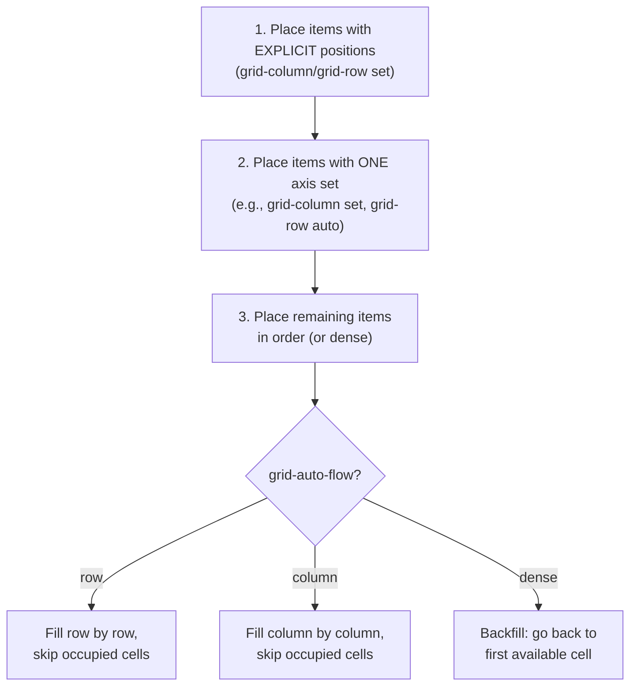

# Lesson 03 — Auto Placement & Implicit Grid

## Explicit vs Implicit Grid

The **explicit grid** is what you define with `grid-template-columns` and `grid-template-rows`. The **implicit grid** is what the browser creates automatically when items overflow the explicit grid.

```css
.container {
  display: grid;
  grid-template-columns: repeat(3, 1fr);  /* 3 explicit columns */
  grid-template-rows: 100px 100px;         /* 2 explicit rows */
}
/* If you have 9 items → 3 rows needed, but only 2 defined.
   Row 3 is IMPLICIT — browser creates it automatically. */
```

## Controlling Implicit Tracks

```css
.container {
  grid-auto-rows: 150px;           /* implicit rows are 150px */
  grid-auto-rows: minmax(100px, auto);  /* at least 100px, grows with content */
  grid-auto-columns: 200px;        /* implicit columns (when items placed beyond explicit) */
}
```

**Default**: Implicit tracks are `auto` (sized to content).

## `grid-auto-flow`

Controls how the auto-placement algorithm places items:

| Value | Behavior |
|-------|----------|
| `row` (default) | Fill each row left-to-right, then move to next row |
| `column` | Fill each column top-to-bottom, then move to next column |
| `dense` | Backfill empty cells (may reorder items visually) |
| `row dense` | Row flow with backfilling |
| `column dense` | Column flow with backfilling |

## The Auto-Placement Algorithm



## `dense` Packing

Without `dense`, if a large item skips a cell, that cell stays empty. With `dense`, smaller items backfill gaps:

```css
.grid {
  display: grid;
  grid-template-columns: repeat(3, 1fr);
  grid-auto-flow: dense;  /* backfill empty cells */
}

.wide { grid-column: span 2; }  /* takes 2 columns */
```

**Warning**: `dense` can reorder items visually, breaking tab order and accessibility. Only use it for non-sequential content (image galleries, not article lists).

## Experiment: Auto Placement

```html
<!-- 03-auto-placement.html -->
<!DOCTYPE html>
<html lang="en">
<head>
  <meta charset="UTF-8">
  <title>Auto Placement</title>
  <style>
    body { font-family: system-ui; padding: 30px; margin: 0; }
    
    .grid {
      display: grid;
      grid-template-columns: repeat(4, 1fr);
      grid-auto-rows: 80px;
      gap: 5px;
      background: #e0e0e0;
      padding: 5px;
      margin-bottom: 10px;
    }
    
    .cell {
      background: lightblue;
      border: 2px solid steelblue;
      padding: 10px;
      font-family: monospace;
      font-size: 11px;
      display: flex;
      align-items: center;
      justify-content: center;
    }
    
    .wide { grid-column: span 2; background: lightyellow; border-color: goldenrod; }
    .tall { grid-row: span 2; background: lightgreen; border-color: darkgreen; }
    .big { grid-column: span 2; grid-row: span 2; background: lightcoral; border-color: darkred; }
    
    .label { font-family: monospace; font-size: 13px; margin-bottom: 5px; margin-top: 20px; }
    
    .controls {
      display: flex; gap: 15px; margin-bottom: 20px;
      padding: 15px; background: #f0f0f0; border-radius: 8px;
    }
    .controls label { font-family: monospace; font-size: 13px; }
  </style>
</head>
<body>
  <h2>Auto Placement: row vs dense</h2>
  
  <div class="controls">
    <label>
      <input type="radio" name="flow" value="row" checked> grid-auto-flow: row
    </label>
    <label>
      <input type="radio" name="flow" value="row dense"> grid-auto-flow: row dense
    </label>
    <label>
      <input type="radio" name="flow" value="column"> grid-auto-flow: column
    </label>
  </div>
  
  <div class="grid" id="grid">
    <div class="cell">1</div>
    <div class="cell wide">2 (span 2)</div>
    <div class="cell">3</div>
    <div class="cell tall">4 (tall)</div>
    <div class="cell">5</div>
    <div class="cell wide">6 (span 2)</div>
    <div class="cell">7</div>
    <div class="cell">8</div>
    <div class="cell big">9 (2×2)</div>
    <div class="cell">10</div>
    <div class="cell">11</div>
    <div class="cell">12</div>
  </div>
  
  <p style="font-family: monospace; font-size: 12px; color: #666;">
    Watch how items 3, 5, 7 fill gaps when switching to "dense" mode.
    <br>Notice item order may change visually with dense — DOM order stays the same.
  </p>

  <script>
    const grid = document.getElementById('grid');
    document.querySelectorAll('input[name="flow"]').forEach(radio => {
      radio.addEventListener('change', (e) => {
        grid.style.gridAutoFlow = e.target.value;
      });
    });
  </script>
</body>
</html>
```

## Experiment: Implicit Grid

```html
<!-- 03b-implicit-grid.html -->
<!DOCTYPE html>
<html lang="en">
<head>
  <meta charset="UTF-8">
  <title>Implicit Grid</title>
  <style>
    body { font-family: system-ui; padding: 30px; margin: 0; }
    
    .grid {
      display: grid;
      grid-template-columns: repeat(3, 1fr);
      grid-template-rows: 80px 80px;      /* only 2 explicit rows */
      grid-auto-rows: 60px;                /* implicit rows = 60px */
      gap: 5px;
      background: #e0e0e0;
      padding: 5px;
      margin-bottom: 20px;
    }
    
    .cell {
      background: lightblue;
      border: 2px solid steelblue;
      padding: 10px;
      font-family: monospace;
      font-size: 11px;
      display: flex;
      align-items: center;
      justify-content: center;
    }
    
    /* Implicit row items get different color */
    .cell:nth-child(n+7) {
      background: #ffe0e0;
      border-color: #cc6666;
    }
    
    .label { font-family: monospace; font-size: 13px; margin-bottom: 5px; }
  </style>
</head>
<body>
  <h2>Explicit vs Implicit Grid</h2>
  
  <div class="label">3 cols × 2 explicit rows (80px) / implicit rows (60px, pink)</div>
  <div class="grid">
    <div class="cell">1</div>
    <div class="cell">2</div>
    <div class="cell">3</div>
    <div class="cell">4</div>
    <div class="cell">5</div>
    <div class="cell">6</div>
    <div class="cell">7 (implicit)</div>
    <div class="cell">8 (implicit)</div>
    <div class="cell">9 (implicit)</div>
  </div>
  
  <p style="font-family: monospace; font-size: 12px; color: #666;">
    Items 7-9 are in implicit rows. Notice they're 60px (grid-auto-rows) instead of 80px.
    <br>Use DevTools grid overlay to see the explicit grid boundary.
  </p>
</body>
</html>
```

## DevTools Exercise

1. Open the implicit grid experiment
2. Enable Grid overlay in Chrome DevTools
3. Look for the **dashed line** boundary — this separates the explicit grid from implicit tracks
4. Items beyond the dashed line are in the implicit grid
5. Inspect the computed `grid-row` values — implicit items have auto-assigned line numbers

## Next

→ [Lesson 04: Areas, Alignment & Subgrid](04-areas-alignment.md)
