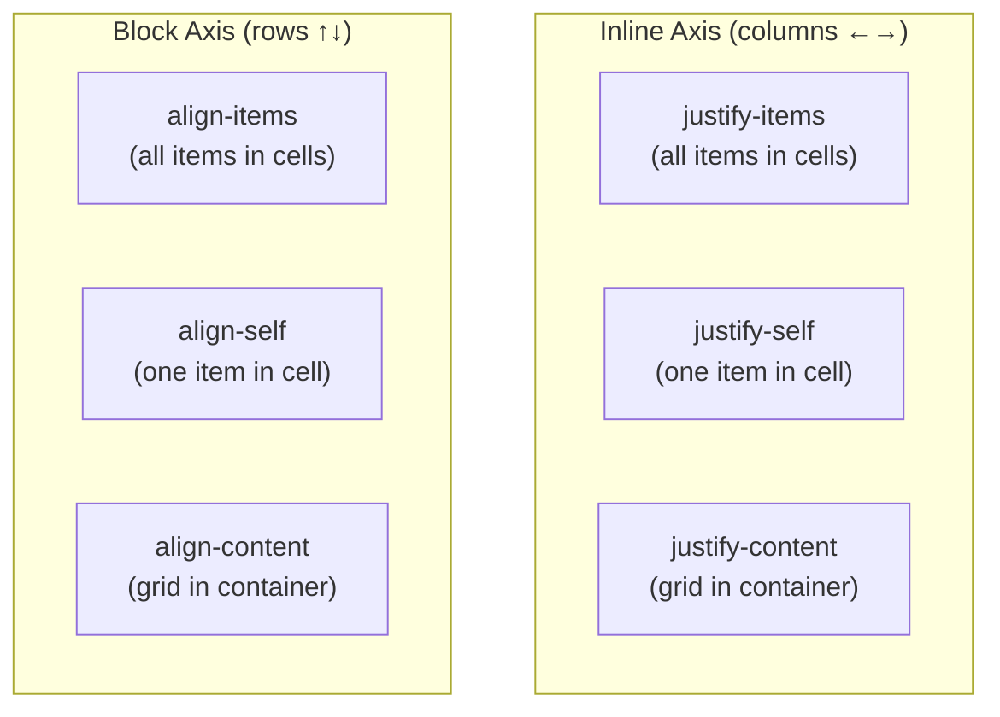

# Lesson 04 — Areas, Alignment & Subgrid

## Grid Template Areas

Named areas provide a **visual ASCII layout** directly in CSS:

```css
.layout {
  display: grid;
  grid-template-columns: 250px 1fr;
  grid-template-rows: 80px 1fr 60px;
  grid-template-areas:
    "header  header"
    "sidebar content"
    "footer  footer";
  gap: 10px;
}

.header  { grid-area: header; }
.sidebar { grid-area: sidebar; }
.content { grid-area: content; }
.footer  { grid-area: footer; }
```

Rules:
- Each string is one row
- Each word is one column
- Use `.` for empty cells: `"header . header"`
- Areas must be **rectangular** (no L-shapes)
- Area names are case-sensitive

## Grid Alignment

Grid has SIX alignment properties across two dimensions:



| Property | What It Aligns | Default |
|----------|---------------|---------|
| `justify-items` | All items **within their cells** (inline axis) | `stretch` |
| `align-items` | All items **within their cells** (block axis) | `stretch` |
| `justify-self` | One item **within its cell** (inline axis) | `stretch` |
| `align-self` | One item **within its cell** (block axis) | `stretch` |
| `justify-content` | The **entire grid** within the container (inline) | `start` |
| `align-content` | The **entire grid** within the container (block) | `start` |

**Key distinction**: `-items` and `-self` align items inside their cells. `-content` aligns the grid tracks within the container (only visible when grid is smaller than container).

### Shorthand: `place-*`

```css
place-items: center;           /* align-items + justify-items */
place-self: end start;         /* align-self: end; justify-self: start */
place-content: center center;  /* align-content + justify-content */
```

## Subgrid

`subgrid` lets a nested grid **inherit track definitions** from its parent grid:

```css
.parent {
  display: grid;
  grid-template-columns: 1fr 2fr 1fr;
  grid-template-rows: auto auto auto;
}

.child {
  grid-column: 1 / -1;    /* spans all parent columns */
  display: grid;
  grid-template-columns: subgrid;  /* inherits parent's column tracks */
  grid-template-rows: subgrid;     /* inherits parent's row tracks */
}
```

Use cases:
- Card grids where titles, images, and footers must align **across cards**
- Form layouts where labels and inputs align across rows
- Any nested content that must share the parent's track lines

## Experiment: Grid Areas Layout

```html
<!-- 04-areas.html -->
<!DOCTYPE html>
<html lang="en">
<head>
  <meta charset="UTF-8">
  <title>Grid Areas</title>
  <style>
    body { font-family: system-ui; padding: 20px; margin: 0; }
    
    .layout {
      display: grid;
      grid-template-columns: 220px 1fr 220px;
      grid-template-rows: 70px 1fr 50px;
      grid-template-areas:
        "header header  header"
        "nav    content aside"
        "footer footer  footer";
      gap: 8px;
      height: 500px;
      background: #e0e0e0;
      padding: 8px;
    }
    
    .layout > * {
      padding: 15px;
      font-family: monospace;
      font-size: 13px;
      display: flex;
      align-items: center;
      justify-content: center;
    }
    
    .header  { grid-area: header;  background: #4a90d9; color: white; }
    .nav     { grid-area: nav;     background: #7bc67e; }
    .content { grid-area: content; background: #f5f5f5; border: 2px solid #ccc; }
    .aside   { grid-area: aside;   background: #f0d97e; }
    .footer  { grid-area: footer;  background: #888; color: white; }
    
    .label { font-family: monospace; font-size: 13px; margin-bottom: 8px; }
  </style>
</head>
<body>
  <h2>Grid Template Areas</h2>
  <div class="label">
    grid-template-areas:<br>
    &nbsp;&nbsp;"header header header"<br>
    &nbsp;&nbsp;"nav content aside"<br>
    &nbsp;&nbsp;"footer footer footer"
  </div>
  
  <div class="layout">
    <div class="header">header</div>
    <div class="nav">nav</div>
    <div class="content">content (1fr)</div>
    <div class="aside">aside</div>
    <div class="footer">footer</div>
  </div>
</body>
</html>
```

## Experiment: Alignment

```html
<!-- 04b-alignment.html -->
<!DOCTYPE html>
<html lang="en">
<head>
  <meta charset="UTF-8">
  <title>Grid Alignment</title>
  <style>
    body { font-family: system-ui; padding: 20px; margin: 0; }
    
    .controls {
      display: flex; flex-wrap: wrap; gap: 12px;
      margin-bottom: 15px; padding: 12px;
      background: #f0f0f0; border-radius: 8px;
    }
    .control-group { display: flex; flex-direction: column; gap: 3px; }
    .control-group label { font-size: 10px; font-weight: bold; text-transform: uppercase; color: #666; }
    .control-group select { padding: 4px 8px; font-family: monospace; font-size: 12px; }
    
    .grid {
      display: grid;
      grid-template-columns: repeat(3, 120px);
      grid-template-rows: repeat(2, 120px);
      gap: 5px;
      background: #e0e0e0;
      border: 2px solid #999;
      padding: 5px;
      width: 600px;
      height: 400px;
    }
    
    .cell {
      background: lightblue;
      border: 2px solid steelblue;
      padding: 10px;
      font-family: monospace;
      font-size: 11px;
    }
    
    .computed {
      font-family: monospace; font-size: 12px; margin-top: 10px;
      padding: 10px; background: #1e1e1e; color: #d4d4d4; border-radius: 4px;
    }
  </style>
</head>
<body>
  <h2>Grid Alignment (items in cells vs grid in container)</h2>
  
  <div class="controls">
    <div class="control-group">
      <label>justify-items (items in cells ←→)</label>
      <select id="ji">
        <option value="stretch" selected>stretch</option>
        <option value="start">start</option>
        <option value="end">end</option>
        <option value="center">center</option>
      </select>
    </div>
    <div class="control-group">
      <label>align-items (items in cells ↑↓)</label>
      <select id="ai">
        <option value="stretch" selected>stretch</option>
        <option value="start">start</option>
        <option value="end">end</option>
        <option value="center">center</option>
      </select>
    </div>
    <div class="control-group">
      <label>justify-content (grid in container ←→)</label>
      <select id="jc">
        <option value="start" selected>start</option>
        <option value="end">end</option>
        <option value="center">center</option>
        <option value="space-between">space-between</option>
        <option value="space-around">space-around</option>
        <option value="space-evenly">space-evenly</option>
      </select>
    </div>
    <div class="control-group">
      <label>align-content (grid in container ↑↓)</label>
      <select id="ac">
        <option value="start" selected>start</option>
        <option value="end">end</option>
        <option value="center">center</option>
        <option value="space-between">space-between</option>
        <option value="space-around">space-around</option>
        <option value="space-evenly">space-evenly</option>
      </select>
    </div>
  </div>
  
  <div class="grid" id="grid">
    <div class="cell">1</div>
    <div class="cell">2</div>
    <div class="cell">3</div>
    <div class="cell">4</div>
    <div class="cell">5</div>
    <div class="cell">6</div>
  </div>
  
  <div class="computed" id="computed"></div>

  <script>
    const grid = document.getElementById('grid');
    const computed = document.getElementById('computed');
    const selects = { ji: 'justifyItems', ai: 'alignItems', jc: 'justifyContent', ac: 'alignContent' };
    
    function update() {
      Object.entries(selects).forEach(([id, prop]) => {
        grid.style[prop] = document.getElementById(id).value;
      });
      computed.textContent = Object.entries(selects)
        .map(([id, prop]) => `${prop}: ${document.getElementById(id).value}`)
        .join('\n');
    }
    
    Object.keys(selects).forEach(id => document.getElementById(id).addEventListener('change', update));
    update();
  </script>
</body>
</html>
```

## Production Patterns with Grid

### Responsive Grid Without Media Queries

```css
.grid {
  display: grid;
  grid-template-columns: repeat(auto-fit, minmax(min(300px, 100%), 1fr));
  gap: 20px;
}
```

`min(300px, 100%)` prevents overflow on narrow screens where 300px > container width.

### Full-Bleed Layout

```css
.wrapper {
  display: grid;
  grid-template-columns:
    1fr
    min(65ch, 100% - 4rem)
    1fr;
}

.wrapper > * {
  grid-column: 2;  /* content in middle column */
}

.wrapper > .full-bleed {
  grid-column: 1 / -1;  /* edge to edge */
}
```

### Card Grid with Aligned Content

```css
.cards {
  display: grid;
  grid-template-columns: repeat(auto-fill, minmax(280px, 1fr));
  gap: 24px;
}

.card {
  display: grid;
  grid-template-rows: auto 1fr auto;  /* image | content (grows) | footer */
}
```

## When to Use Grid vs Flexbox

| Scenario | Use |
|----------|-----|
| Items should determine their own size | Flexbox |
| Layout determines item size | Grid |
| One-dimensional (row OR column) | Flexbox |
| Two-dimensional (rows AND columns) | Grid |
| Content-first layout | Flexbox |
| Layout-first layout | Grid |
| Unknown number of items in one direction | Flexbox |
| Known layout structure | Grid |

Both can be used together. Grid for page layout, Flexbox for component internals.

## Summary

- **Implicit grid**: Tracks created automatically beyond the explicit grid
- **`grid-auto-flow: dense`**: Backfills gaps but may break visual order
- **Grid areas**: Visual ASCII layout in CSS
- **Alignment**: `-items`/`-self` = items in cells, `-content` = grid in container
- **Subgrid**: Nested grids inherit parent tracks for cross-card alignment
- Use **Grid for 2D**, **Flexbox for 1D**

## Next Module

→ [Module 09: Modern Layout](../09-modern-layout/README.md)
