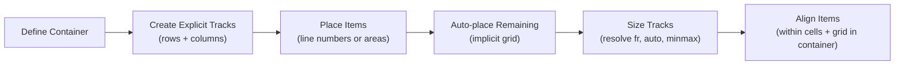

# Module 08 — CSS Grid

## Overview

CSS Grid is the **two-dimensional** layout system. Where Flexbox controls items along one axis, Grid controls rows AND columns simultaneously. This module covers the grid track sizing algorithm, placement, and advanced features like subgrid.

## Prerequisites

- Module 04: Layout Algorithms (BFC, containing blocks)
- Module 07: Flexbox (comparison context)

## Lessons

| # | Lesson | Topics |
|---|--------|--------|
| 01 | [Grid Fundamentals](01-fundamentals.md) | Grid container, explicit tracks, fr unit, repeat(), minmax(), line-based placement |
| 02 | [The Track Sizing Algorithm](02-track-sizing.md) | How the browser resolves fr, auto, min-content, max-content, minmax() |
| 03 | [Auto Placement & Implicit Grid](03-auto-placement.md) | grid-auto-flow, implicit tracks, dense packing, grid-auto-rows/columns |
| 04 | [Areas, Alignment & Subgrid](04-areas-alignment.md) | Named areas, alignment properties, subgrid, production patterns |

## Mental Model

## Estimated Time

~6 hours
