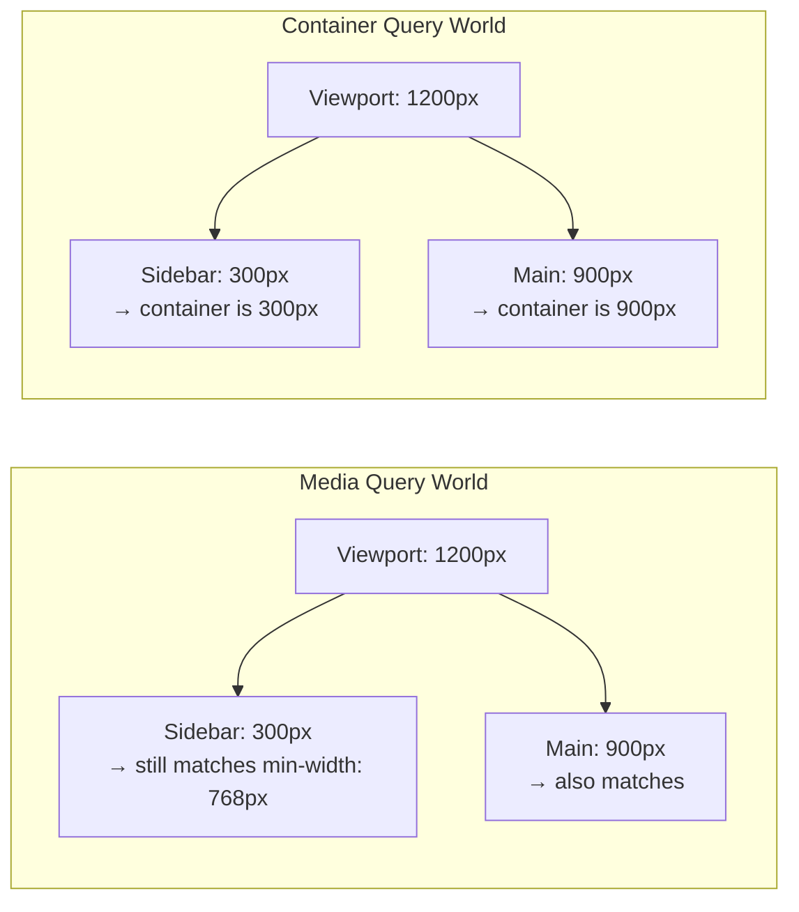

# Lesson 01 — Container Queries

## The Problem with Media Queries

Media queries respond to the **viewport** size, not the **component's container**. A sidebar card and a main-content card see the same `@media (min-width: 768px)` — but they have completely different available widths.



## Setting Up Container Queries

### Step 1: Define a containment context

```css
.card-wrapper {
  container-type: inline-size;  /* enable width-based container queries */
}
```

| `container-type` | What It Enables |
|------------------|----------------|
| `normal` (default) | No containment — can't use @container |
| `inline-size` | Query the **inline-axis** (width in horizontal writing) |
| `size` | Query **both** inline and block axes |

### Step 2: Query the container

```css
@container (min-width: 400px) {
  .card {
    display: grid;
    grid-template-columns: 200px 1fr;
  }
}

@container (max-width: 399px) {
  .card {
    display: block;
  }
}
```

### Named Containers

```css
.sidebar { container-type: inline-size; container-name: sidebar; }
.main    { container-type: inline-size; container-name: main; }

/* Shorthand: */
.sidebar { container: sidebar / inline-size; }

/* Query a specific container: */
@container sidebar (min-width: 300px) {
  .widget { flex-direction: row; }
}
```

If no name is specified, `@container` queries the **nearest ancestor** with containment.

## Why `container-type` Creates Containment

Setting `container-type: inline-size` establishes **size containment** on the element. This means:

- The element's size can NOT depend on its descendants (otherwise querying size while rendering descendants creates a circular dependency)
- This creates a new **stacking context**
- This creates a new **containing block** for absolute/fixed positioning

## Container Query Units

| Unit | Meaning |
|------|---------|
| `cqw` | 1% of container's width |
| `cqh` | 1% of container's height |
| `cqi` | 1% of container's inline size |
| `cqb` | 1% of container's block size |
| `cqmin` | Smaller of `cqi` and `cqb` |
| `cqmax` | Larger of `cqi` and `cqb` |

```css
.card-title {
  font-size: clamp(1rem, 3cqi, 2rem);  /* scales with container, not viewport */
}
```

## Style Queries (Experimental)

Query computed CSS property values on the container:

```css
.card-wrapper {
  --theme: dark;
}

@container style(--theme: dark) {
  .card {
    background: #1a1a1a;
    color: white;
  }
}
```

Style queries currently only work with **custom properties** in most browsers.

## Experiment: Container Queries in Action

```html
<!-- 01-container-queries.html -->
<!DOCTYPE html>
<html lang="en">
<head>
  <meta charset="UTF-8">
  <title>Container Queries</title>
  <style>
    body { font-family: system-ui; padding: 20px; margin: 0; }
    
    .page {
      display: grid;
      grid-template-columns: 300px 1fr;
      gap: 20px;
      margin-bottom: 30px;
    }
    
    .sidebar, .main-area {
      container-type: inline-size;
      background: #f5f5f5;
      padding: 15px;
      border: 2px solid #ccc;
      border-radius: 8px;
    }
    
    .sidebar { container-name: sidebar; }
    .main-area { container-name: main; }
    
    .card {
      background: white;
      border: 1px solid #ddd;
      border-radius: 6px;
      overflow: hidden;
      margin-bottom: 15px;
    }
    
    .card img {
      width: 100%;
      height: 120px;
      object-fit: cover;
      background: linear-gradient(135deg, steelblue, lightblue);
    }
    
    .card-body { padding: 12px; }
    .card-title { font-size: 14px; font-weight: bold; margin: 0 0 6px; }
    .card-text { font-size: 12px; color: #666; margin: 0; }
    
    /* Container query: when container is wide enough, go horizontal */
    @container (min-width: 400px) {
      .card {
        display: grid;
        grid-template-columns: 200px 1fr;
      }
      .card img { height: 100%; min-height: 120px; }
      .card-title { font-size: 18px; }
    }
    
    @container (min-width: 600px) {
      .card-body { display: flex; gap: 20px; align-items: center; }
      .card-title { font-size: 22px; margin-bottom: 0; }
    }
    
    .resize-demo {
      container-type: inline-size;
      resize: horizontal;
      overflow: auto;
      border: 3px dashed steelblue;
      padding: 15px;
      min-width: 200px;
      max-width: 800px;
      width: 500px;
    }
    
    .width-display {
      font-family: monospace;
      font-size: 12px;
      background: #1e1e1e;
      color: #d4d4d4;
      padding: 8px;
      margin-top: 10px;
      border-radius: 4px;
    }
  </style>
</head>
<body>
  <h2>Container Queries: Same Component, Different Contexts</h2>
  
  <div class="page">
    <div class="sidebar">
      <h3 style="margin: 0 0 10px; font-size: 14px; color: #666;">Sidebar (300px)</h3>
      <div class="card">
        
        <div class="card-body">
          <div>
            <p class="card-title">Card Title</p>
            <p class="card-text">Same card component, adapts to its container width.</p>
          </div>
        </div>
      </div>
    </div>
    
    <div class="main-area">
      <h3 style="margin: 0 0 10px; font-size: 14px; color: #666;">Main Area (1fr)</h3>
      <div class="card">
        
        <div class="card-body">
          <div>
            <p class="card-title">Card Title</p>
            <p class="card-text">Same card component here too. But this container is wider, so it uses a horizontal layout.</p>
          </div>
        </div>
      </div>
    </div>
  </div>
  
  <h3>Resize Me ↓</h3>
  <div class="resize-demo" id="resizable">
    <div class="card">
      
      <div class="card-body">
        <div>
          <p class="card-title">Responsive Card</p>
          <p class="card-text">Drag the bottom-right corner to resize. Watch the card adapt.</p>
        </div>
      </div>
    </div>
  </div>
  <div class="width-display" id="widthDisplay"></div>

  <script>
    const resizable = document.getElementById('resizable');
    const widthDisplay = document.getElementById('widthDisplay');
    const observer = new ResizeObserver(entries => {
      for (const entry of entries) {
        widthDisplay.textContent = `Container width: ${Math.round(entry.contentRect.width)}px`;
      }
    });
    observer.observe(resizable);
  </script>
</body>
</html>
```

## Gotchas

1. **Containment breaks height: auto → 0**: `container-type: size` collapses height if the element has no explicit height (children can't influence parent size). Use `container-type: inline-size` for width-only queries.
2. **container-type creates a stacking context** — affects z-index isolation
3. **No parent queries**: You can't query the element itself, only its descendants' styles
4. **Style queries** are limited to custom properties in most browsers (as of 2025)

## Next

→ [Lesson 02: Logical Properties & Writing Modes](02-logical-properties.md)
