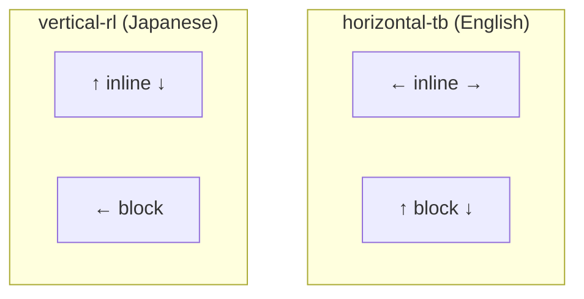

# Lesson 02 — Logical Properties & Writing Modes

## The Problem with Physical Properties

CSS was designed for left-to-right, top-to-bottom (LTR) text. Properties like `margin-left`, `padding-right`, `top`, `width` are **physical** — tied to screen edges, not content flow.

```css
/* This breaks in RTL languages (Arabic, Hebrew): */
.icon { margin-right: 8px; }  /* Should be margin-left in RTL */
```

## Writing Modes

```css
writing-mode: horizontal-tb;  /* Default: text flows left→right, lines top→bottom */
writing-mode: vertical-rl;    /* East Asian: text flows top→bottom, lines right→left */
writing-mode: vertical-lr;    /* Mongolian: text flows top→bottom, lines left→right */

direction: ltr;   /* text direction: left→right (default) */
direction: rtl;   /* text direction: right→left (Arabic, Hebrew) */
```

## The Two Logical Axes

| Logical Axis | In `horizontal-tb` | In `vertical-rl` |
|-------------|--------------------|--------------------|
| **Inline** (text flows) | Horizontal (left ↔ right) | Vertical (top ↔ bottom) |
| **Block** (lines stack) | Vertical (top ↔ bottom) | Horizontal (right ↔ left) |



## Physical → Logical Property Map

### Margin, Padding, Border

| Physical | Logical | Axis |
|----------|---------|------|
| `margin-top` | `margin-block-start` | Block start |
| `margin-bottom` | `margin-block-end` | Block end |
| `margin-left` | `margin-inline-start` | Inline start |
| `margin-right` | `margin-inline-end` | Inline end |
| `margin-top` + `margin-bottom` | `margin-block` | Block shorthand |
| `margin-left` + `margin-right` | `margin-inline` | Inline shorthand |

Same pattern for `padding-*` and `border-*-width/style/color`.

### Sizing

| Physical | Logical |
|----------|---------|
| `width` | `inline-size` |
| `height` | `block-size` |
| `min-width` | `min-inline-size` |
| `max-height` | `max-block-size` |

### Positioning

| Physical | Logical |
|----------|---------|
| `top` | `inset-block-start` |
| `bottom` | `inset-block-end` |
| `left` | `inset-inline-start` |
| `right` | `inset-inline-end` |
| `top` + `bottom` | `inset-block` |
| `left` + `right` | `inset-inline` |

### Other

| Physical | Logical |
|----------|---------|
| `text-align: left` | `text-align: start` |
| `text-align: right` | `text-align: end` |
| `float: left` | `float: inline-start` |
| `border-radius: top-left` | `border-start-start-radius` |

## Experiment: Logical Properties

```html
<!-- 02-logical-properties.html -->
<!DOCTYPE html>
<html lang="en">
<head>
  <meta charset="UTF-8">
  <title>Logical Properties</title>
  <style>
    body { font-family: system-ui; padding: 30px; margin: 0; }
    
    .demo-container {
      border: 2px solid #999;
      padding: 20px;
      margin-bottom: 30px;
      max-width: 500px;
    }
    
    .physical-card {
      background: #ffcccc;
      border: 2px solid red;
      padding: 15px;
      margin-left: 30px;       /* physical — breaks in RTL */
      margin-bottom: 10px;
      border-left: 5px solid red;
      text-align: left;
      font-family: monospace;
      font-size: 13px;
    }
    
    .logical-card {
      background: #ccffcc;
      border: 2px solid green;
      padding: 15px;
      margin-inline-start: 30px;     /* logical — works in any direction */
      margin-block-end: 10px;
      border-inline-start: 5px solid green;
      text-align: start;
      font-family: monospace;
      font-size: 13px;
    }
    
    .label { font-family: monospace; font-size: 13px; margin-bottom: 5px; }
    
    .controls {
      display: flex; gap: 15px; margin-bottom: 20px;
      padding: 12px; background: #f0f0f0; border-radius: 8px;
    }
    .controls label { font-family: monospace; font-size: 13px; cursor: pointer; }
  </style>
</head>
<body>
  <h2>Logical vs Physical Properties</h2>
  
  <div class="controls">
    <label>
      <input type="radio" name="dir" value="ltr" checked> direction: ltr (English)
    </label>
    <label>
      <input type="radio" name="dir" value="rtl"> direction: rtl (Arabic)
    </label>
  </div>
  
  <div class="label" style="color: red;">❌ Physical: margin-left, border-left, text-align: left</div>
  <div class="demo-container" id="physical-demo">
    <div class="physical-card">margin-left: 30px (stays on left in RTL!)</div>
    <div class="physical-card">border-left: 5px solid red</div>
  </div>
  
  <div class="label" style="color: green;">✅ Logical: margin-inline-start, border-inline-start, text-align: start</div>
  <div class="demo-container" id="logical-demo">
    <div class="logical-card">margin-inline-start: 30px (flips in RTL!)</div>
    <div class="logical-card">border-inline-start: 5px solid green</div>
  </div>

  <script>
    document.querySelectorAll('input[name="dir"]').forEach(radio => {
      radio.addEventListener('change', e => {
        document.getElementById('physical-demo').dir = e.target.value;
        document.getElementById('logical-demo').dir = e.target.value;
      });
    });
  </script>
</body>
</html>
```

## Migration Strategy

```css
/* Before (physical): */
.component {
  margin-left: 16px;
  margin-right: 16px;
  padding-top: 8px;
  padding-bottom: 8px;
  width: 300px;
  max-height: 500px;
}

/* After (logical): */
.component {
  margin-inline: 16px;
  padding-block: 8px;
  inline-size: 300px;
  max-block-size: 500px;
}
```

**Rule**: In new code, always prefer logical properties. They work correctly in any writing mode and direction, and the shorthands (`margin-block`, `padding-inline`) are more concise.

## Next

→ [Lesson 03: Aspect Ratio & Intrinsic Sizing](03-aspect-ratio.md)
