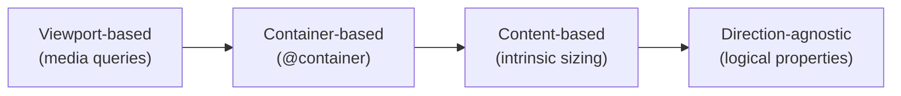

# Module 09 — Modern Layout

## Overview

Beyond Flexbox and Grid, CSS has a growing set of layout primitives that solve long-standing problems. This module covers container queries, aspect-ratio, logical properties, writing modes, and multi-column layout — features that complete the modern CSS layout toolkit.

## Prerequisites

- Module 07: Flexbox Algorithm
- Module 08: CSS Grid

## Lessons

| # | Lesson | Topics |
|---|--------|--------|
| 01 | [Container Queries](01-container-queries.md) | @container, container-type, container-name, size queries, style queries |
| 02 | [Logical Properties & Writing Modes](02-logical-properties.md) | Block/inline axes, writing-mode, logical properties (margin-block, inset-inline), direction |
| 03 | [Aspect Ratio & Intrinsic Sizing](03-aspect-ratio.md) | aspect-ratio, object-fit, object-position, intrinsic keywords |
| 04 | [Multi-Column & Other Layout](04-multi-column.md) | columns, column-gap, break-inside, float shapes, exclusions |

## Mental Model

Modern CSS moves from viewport-centric to component-centric responsive design.

## Estimated Time

~5 hours
