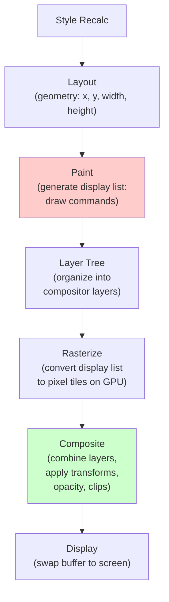
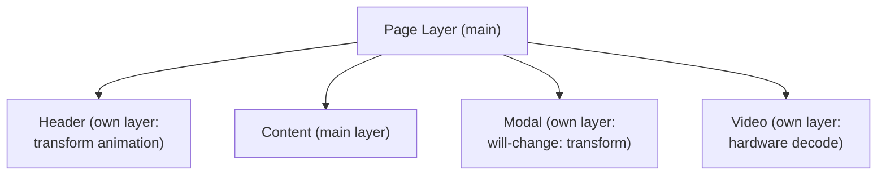
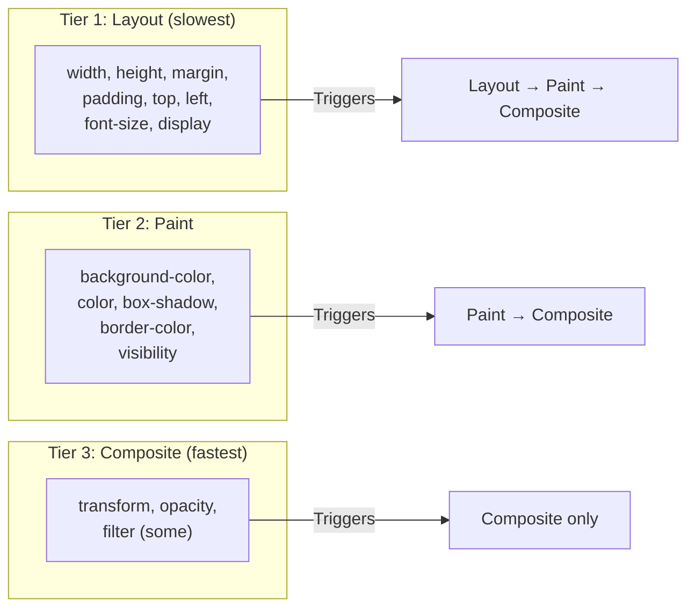

# Lesson 01 — Paint & Composite Pipeline

## What Happens After Layout



### Paint Phase

The browser converts the render tree into a **display list** — a sequence of draw commands:

```
DrawRect(x: 0, y: 0, w: 100, h: 50, color: blue)
DrawText(x: 10, y: 30, text: "Hello", font: 16px Arial, color: white)
DrawBorder(x: 0, y: 0, w: 100, h: 50, style: 2px solid black)
```

Paint happens in **stacking order** (Module 06):
1. Background & borders
2. Negative z-index children
3. Block-level boxes (in-flow)
4. Float boxes
5. Inline-level boxes (text)
6. z-index: 0 and positioned
7. Positive z-index children

### Compositor Layers

Not everything is painted into one flat image. The browser promotes certain elements to their own **compositor layers**:



Each compositor layer can be:
- Rasterized independently (only re-raster what changed)
- Composited on the **GPU** (hardware-accelerated)
- Transformed/faded without repainting

### What Triggers Layer Promotion

| Trigger | Example |
|---------|---------|
| `transform` (3D or animated) | `transform: translateZ(0)` |
| `will-change: transform` or `will-change: opacity` | Explicit hint |
| `opacity` < 1 (sometimes) | Browser-dependent |
| `position: fixed` | On some browsers |
| `<video>`, `<canvas>`, `<iframe>` | Hardware-decoded content |
| CSS `filter` or `backdrop-filter` | GPU-composited effects |
| Overlapping a composited layer | "Layer squashing" avoidance |

## The Three Update Tiers

Not all CSS property changes cost the same:



| Tier | What's Triggered | Cost | Example Properties |
|------|-----------------|------|--------------------|
| **Layout** | Layout + Paint + Composite | High | `width`, `height`, `margin`, `padding`, `top`, `left`, `font-size` |
| **Paint** | Paint + Composite | Medium | `background-color`, `color`, `box-shadow`, `border-style` |
| **Composite** | Composite only | Low | `transform`, `opacity` |

**Rule**: Animate only `transform` and `opacity` for 60fps performance.

## Experiment: Visualizing Paint

```html
<!-- 01-paint-visualizer.html -->
<!DOCTYPE html>
<html lang="en">
<head>
  <meta charset="UTF-8">
  <title>Paint vs Composite</title>
  <style>
    body { font-family: system-ui; padding: 30px; margin: 0; }
    
    .row {
      display: flex;
      gap: 30px;
      margin-bottom: 40px;
    }
    
    .demo-box {
      width: 150px;
      height: 150px;
      border-radius: 12px;
      display: flex;
      align-items: center;
      justify-content: center;
      font-family: monospace;
      font-size: 12px;
      text-align: center;
      color: white;
      cursor: pointer;
      transition: none;
    }
    
    /* Layout trigger — EXPENSIVE */
    .layout-anim {
      background: #e74c3c;
      transition: width 0.3s, height 0.3s;
    }
    .layout-anim:hover {
      width: 200px;
      height: 200px;
    }
    
    /* Paint trigger — MEDIUM */
    .paint-anim {
      background: #f39c12;
      transition: background-color 0.3s, box-shadow 0.3s;
    }
    .paint-anim:hover {
      background-color: #8e44ad;
      box-shadow: 0 0 30px rgba(0,0,0,0.5);
    }
    
    /* Composite trigger — FAST */
    .composite-anim {
      background: #27ae60;
      transition: transform 0.3s, opacity 0.3s;
    }
    .composite-anim:hover {
      transform: scale(1.3) rotate(5deg);
      opacity: 0.8;
    }
    
    .label {
      font-family: monospace;
      font-size: 12px;
      margin-top: 8px;
      text-align: center;
    }
    
    .tier-label {
      font-family: monospace;
      font-size: 11px;
      padding: 4px 8px;
      border-radius: 4px;
      display: inline-block;
      margin-bottom: 5px;
    }
  </style>
</head>
<body>
  <h2>Paint Tiers — Hover Each Box</h2>
  <p style="font-size: 14px; color: #666;">
    Open DevTools → Rendering tab → Enable "Paint flashing".<br>
    Green flashes = paint happening. Composite-only changes show NO green flash.
  </p>
  
  <div class="row">
    <div>
      <span class="tier-label" style="background: #ffcccc;">Tier 1: LAYOUT</span>
      <div class="demo-box layout-anim">width + height<br>(Layout→Paint→Composite)</div>
      <div class="label">Slowest ❌</div>
    </div>
    <div>
      <span class="tier-label" style="background: #fff3cd;">Tier 2: PAINT</span>
      <div class="demo-box paint-anim">background + shadow<br>(Paint→Composite)</div>
      <div class="label">Medium ⚠️</div>
    </div>
    <div>
      <span class="tier-label" style="background: #ccffcc;">Tier 3: COMPOSITE</span>
      <div class="demo-box composite-anim">transform + opacity<br>(Composite only)</div>
      <div class="label">Fastest ✅</div>
    </div>
  </div>
  
  <h3>Continuous Animation Comparison</h3>
  <div class="row">
    <div>
      <div class="demo-box" style="background: #e74c3c; animation: layout-loop 1s infinite alternate;">
        margin-left<br>animation
      </div>
    </div>
    <div>
      <div class="demo-box" style="background: #27ae60; animation: composite-loop 1s infinite alternate;">
        transform<br>animation
      </div>
    </div>
  </div>
  
  <style>
    @keyframes layout-loop {
      from { margin-left: 0; }
      to { margin-left: 50px; }
    }
    @keyframes composite-loop {
      from { transform: translateX(0); }
      to { transform: translateX(50px); }
    }
  </style>
</body>
</html>
```

## DevTools Exercise

1. **Paint Flashing**: DevTools → Rendering tab (⋮ → More tools → Rendering) → Check "Paint flashing"
2. Hover the three boxes → notice which ones flash green (paint) and which don't
3. **Layers Panel**: DevTools → More tools → Layers → see which elements are on their own compositor layers
4. **Performance Recording**: DevTools → Performance → Record → hover boxes → see "Paint" and "Composite Layers" events

## Key Takeaways

- Paint converts the render tree to pixel draw commands
- Compositor layers are independently rasterized and GPU-composited
- Animate `transform` and `opacity` — they skip layout and paint
- Use DevTools Paint Flashing and Layers panel to verify

## Next

→ [Lesson 02: Transforms & Animations](02-transforms.md)
