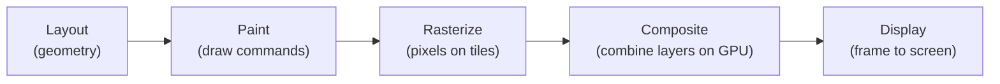

# Module 10 — Painting & Compositing

## Overview

After layout, the browser must **paint** pixels and **composite** layers to produce the final frame. Understanding this pipeline is critical for performance — the difference between smooth 60fps animations and janky, laggy UIs.

## Prerequisites

- Module 01: Browser Rendering (rendering pipeline)
- Module 06: Stacking Contexts (painting order)

## Lessons

| # | Lesson | Topics |
|---|--------|--------|
| 01 | [Paint & Composite Pipeline](01-paint-pipeline.md) | Paint records, paint layers, rasterization, compositing, GPU acceleration |
| 02 | [Transforms & Animations](02-transforms.md) | transform, transition, animation, keyframes, compositor-only properties |
| 03 | [Filters & Effects](03-filters.md) | filter, backdrop-filter, blend modes, masks, clipping |
| 04 | [Layer Promotion & will-change](04-layers.md) | Compositor layers, will-change, layer explosion, debugging with Layers panel |

## Mental Model

The key optimisation: **compositor-only properties** (transform, opacity) skip paint entirely and only composite — making them cheap to animate.

## Estimated Time

~6 hours
