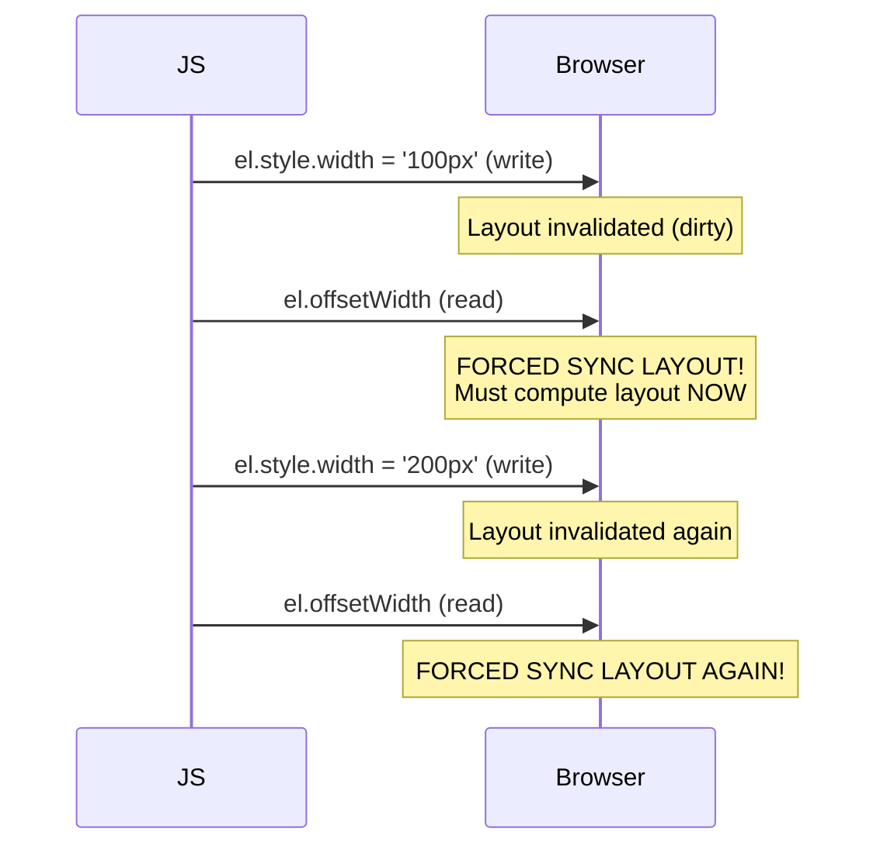

# Lesson 01 — Layout Thrashing & Reflow

## What Is Layout Thrashing?

**Layout thrashing** happens when JavaScript reads layout properties, then writes styles, then reads again — forcing the browser to recalculate layout synchronously on each read.



### Properties That Trigger Forced Layout

Reading any of these after a style change forces synchronous layout:

| Category | Properties |
|----------|-----------|
| **Box metrics** | `offsetTop`, `offsetLeft`, `offsetWidth`, `offsetHeight` |
| **Scroll** | `scrollTop`, `scrollLeft`, `scrollWidth`, `scrollHeight` |
| **Client** | `clientTop`, `clientLeft`, `clientWidth`, `clientHeight` |
| **Window** | `window.getComputedStyle()`, `window.scrollX/Y` |
| **Bounding box** | `getBoundingClientRect()` |
| **Focus** | `element.focus()` (may trigger scroll + layout) |

### The Fix: Batch Reads, Then Writes

```javascript
// ❌ BAD — layout thrashing (N layouts for N elements):
elements.forEach(el => {
  const height = el.offsetHeight;     // READ → forced layout
  el.style.height = height * 2 + 'px'; // WRITE → invalidate
});

// ✅ GOOD — batch reads, then batch writes:
const heights = elements.map(el => el.offsetHeight);  // ALL reads first
elements.forEach((el, i) => {
  el.style.height = heights[i] * 2 + 'px';  // ALL writes second
});
```

### Use `requestAnimationFrame` for Write Batching

```javascript
// ✅ Read now, write in next frame:
const height = element.offsetHeight;  // READ (safe)

requestAnimationFrame(() => {
  element.style.height = height * 2 + 'px';  // WRITE (in next frame)
});
```

## `ResizeObserver` — The Layout-Safe Alternative

Instead of polling dimensions, use `ResizeObserver`:

```javascript
const observer = new ResizeObserver(entries => {
  for (const entry of entries) {
    const { width, height } = entry.contentRect;
    // React to size changes without forcing layout
  }
});
observer.observe(element);
```

## What Triggers Layout (Reflow)?

| Change | Triggers Layout? |
|--------|-----------------|
| `width`, `height`, `margin`, `padding` | ✅ Yes |
| `font-size`, `line-height` | ✅ Yes |
| `top`, `left` (positioned elements) | ✅ Yes |
| Adding/removing DOM elements | ✅ Yes |
| `display` change | ✅ Yes |
| `transform` | ❌ No (composite only) |
| `opacity` | ❌ No (composite only) |
| `color`, `background-color` | ❌ No (paint only) |
| `box-shadow` | ❌ No (paint only) |

## Scope of Layout

When layout is triggered, the browser tries to limit recalculation scope:

```css
/* contain: layout limits reflow to this subtree */
.widget {
  contain: layout;
}
```

Without containment, a change to one element can trigger layout on the entire document (e.g., changing a height that pushes siblings down).

## Experiment: Layout Thrashing Demo

```html
<!-- 01-layout-thrashing.html -->
<!DOCTYPE html>
<html lang="en">
<head>
  <meta charset="UTF-8">
  <title>Layout Thrashing</title>
  <style>
    body { font-family: system-ui; padding: 30px; margin: 0; }
    
    .boxes {
      display: flex;
      flex-wrap: wrap;
      gap: 5px;
      margin-bottom: 20px;
    }
    
    .box {
      width: 30px;
      height: 30px;
      background: steelblue;
      border-radius: 4px;
      transition: none;
    }
    
    button {
      padding: 10px 20px;
      font-family: monospace;
      font-size: 14px;
      margin-right: 10px;
      margin-bottom: 10px;
      cursor: pointer;
      border: 2px solid;
      border-radius: 6px;
    }
    
    .bad { background: #ffcccc; border-color: red; }
    .good { background: #ccffcc; border-color: green; }
    
    .result {
      font-family: monospace;
      font-size: 14px;
      padding: 10px;
      margin-top: 10px;
      background: #f5f5f5;
      border-radius: 4px;
    }
  </style>
</head>
<body>
  <h2>Layout Thrashing: Measure the Difference</h2>
  
  <div class="boxes" id="boxes"></div>
  
  <button class="bad" onclick="thrash()">❌ Thrash (read-write-read-write)</button>
  <button class="good" onclick="batched()">✅ Batched (read-read, write-write)</button>
  <button onclick="reset()">Reset</button>
  
  <div class="result" id="result">Click a button to measure...</div>

  <script>
    const container = document.getElementById('boxes');
    const COUNT = 200;
    
    // Create boxes
    function createBoxes() {
      container.innerHTML = '';
      for (let i = 0; i < COUNT; i++) {
        const box = document.createElement('div');
        box.className = 'box';
        container.appendChild(box);
      }
    }
    createBoxes();
    
    function thrash() {
      const boxes = container.querySelectorAll('.box');
      const start = performance.now();
      
      // ❌ BAD: read-write-read-write interleaving
      boxes.forEach(box => {
        const width = box.offsetWidth;   // READ
        box.style.width = (width + 5) + 'px'; // WRITE
        // Next iteration: READ forces layout again!
      });
      
      const time = (performance.now() - start).toFixed(2);
      document.getElementById('result').textContent = 
        `❌ Thrash: ${time}ms (${COUNT} forced layouts)`;
    }
    
    function batched() {
      const boxes = container.querySelectorAll('.box');
      const start = performance.now();
      
      // ✅ GOOD: batch all reads, then all writes
      const widths = [];
      boxes.forEach(box => {
        widths.push(box.offsetWidth);  // ALL reads
      });
      
      boxes.forEach((box, i) => {
        box.style.width = (widths[i] + 5) + 'px';  // ALL writes
      });
      
      const time = (performance.now() - start).toFixed(2);
      document.getElementById('result').textContent = 
        `✅ Batched: ${time}ms (1 forced layout)`;
    }
    
    function reset() {
      createBoxes();
      document.getElementById('result').textContent = 'Reset. Click a button.';
    }
  </script>
</body>
</html>
```

## DevTools Exercise

1. Open Performance panel → Record while clicking the "Thrash" button
2. Look for purple **Layout** bars in the flame chart
3. Notice repeated "Forced reflow" warnings
4. Compare with "Batched" — should show only one Layout event
5. Look for "Recalculate Style" events — these precede layout

## Next

→ [Lesson 02: Selector & Style Performance](02-selector-performance.md)
